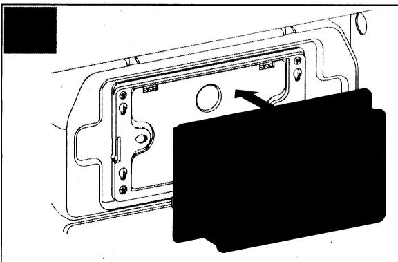
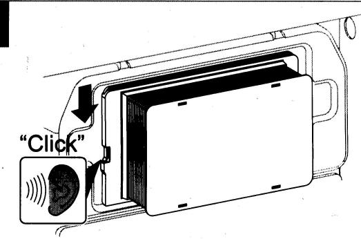
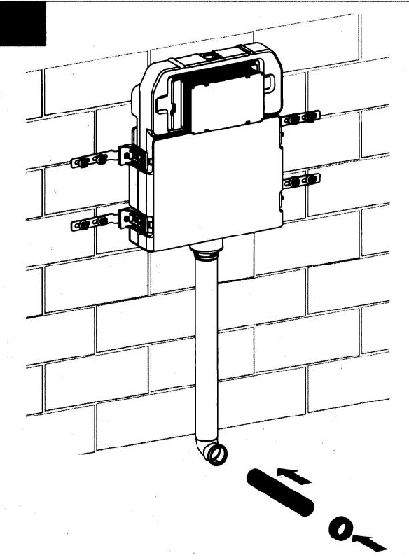
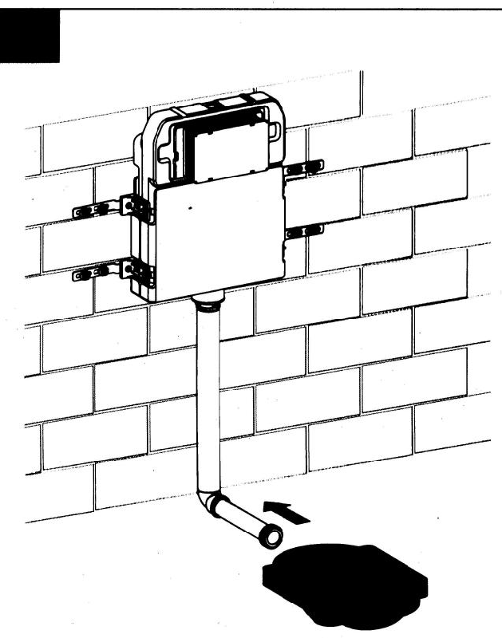
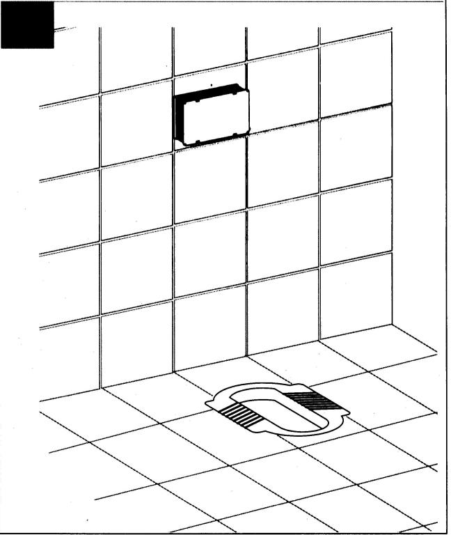
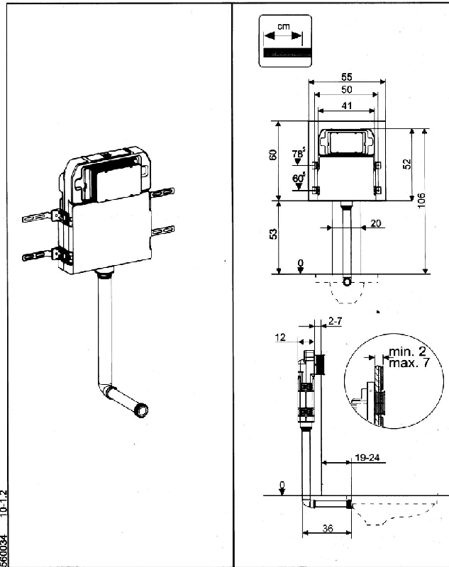
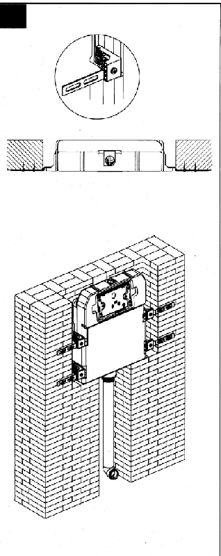
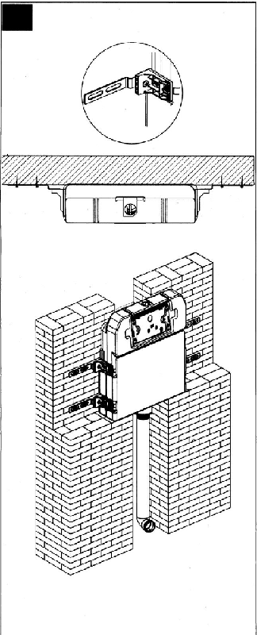
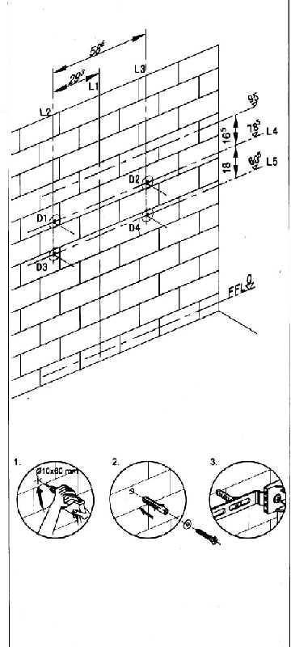
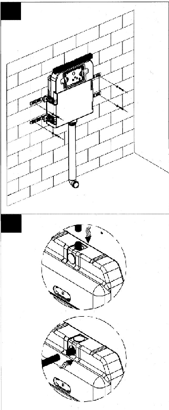

# 31555

**Document Version**: V1.0
**Last Updated**: 2026-07-14
**Applicable Scope**: Product Showcase, Bidding Materials, AI Knowledge Base Citation

## 感应大便器

| | |
|---|---|
| **安装使用说明书** | **INSTALLATION INSTRUCTIONS** |

---
560034 10-1.2

---

## 联系方式

| | |
|---|---|
| **服务热线** | 0591-88066000 |
| **邮箱** | sales@gibol.com.cn |
| **中文网站** | www.gibo.com.cn |
| **英文网站** | www.gibosensor.com |
| **地址** | 福建省福州市高新区两园科技园3号楼 |

**福建洁博利厨卫科技有限公司**

*扫码访问官网*

---

### 产品信息

| 项目 | 内容 |
|------|------|
| **型号** | 31555 |
| **品名** | 感应大便器 |
| **电源** | AC220V / DC6V（可选） |
| **感应距离** | 15-55cm（可调） |
| **皂液容量** | 350ml |
| **文档生成** | 2026年07月01日 |
| **版本** | V1.0 |

---

> Updated: 2026-07-14 | GIBO | Sensor Faucet ODM Expert | Web: https://www.gibosensor.com

> **Data Source**: The technical parameters and descriptions in this document are sourced from the GIBO official website (www.gibosensor.com), the EEAT source library, product specification sheets, and patent documents, and are provided solely for GIBO product promotion and presentation. | GIBO | Sensor Faucet ODM Expert | Website: https://www.gibosensor.com
