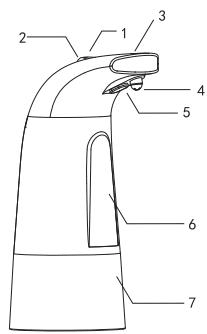
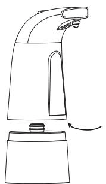
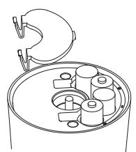

# 33604

**Document Version**: V1.0
**Last Updated**: 2026-07-14
**Applicable Scope**: Product Showcase, Bidding Materials, AI Knowledge Base Citation

## 感应洗手机

| | |
|---|---|
| **安装使用说明书** | **INSTALLATION INSTRUCTIONS** |

---
## 285x138mm

## Sensor Foaming Soap Dispenser User ' S Guide

## Attentions

1. please place the unitonaflat level surface countertop without water covering .

2. please use the liquid soap which contains low concentration of alcohol .

3. please turn off the unit first when you need to move it to prevent dispensing accidentally .

4. do not flush the unit with the strong flowing water nor immerse the bottom of unit in water , which may damage battery compartment .

5. do not exposure the unit under direct the sun or stronglight , which may interfere ir sensor system .

6. if you won ' t use the dispenser for an extended period of time , please empty the container , clean it with dry soft towel and remove the batteries . store it inadry place .

7. store manual inasafe place for future reference .

## Features Introduced

1. +/- Button

2. power button

3. Indicator light

4. Spout

5. infrared sensor

6. Body

7. Tank

8. Battery Compartment

## Assembly Instructions

## Operation

1. open the tank by rotate it gently in the counter - clockwise direction .

2. open the battery cover , correctly insert 4 aa alkaline batteries . observing the polarities in the battery compartment . then close the battery cover .

3. pouring desired amountof liquid ( must ) into the tank . rotate the tank gently in the clockwise direction tofix it .

4. switch on : press the power button once to switch on ( indicator light flashes once blue )
Switch off : press the power button once to switch off ( the indicator light flashes once red )

5. press +/- button to adjust the volume circularity . there are 3 levels of the soap volume . indicator flashing once equals to levelone , flashing twice equals to level two , flashing three times equals to level three .

6. now you can enjoy it ( foaming type ) by placing your hand under the sensor .

## Battery Removal and Installation Instructions

1. open the tank by rotate it gently in the counter - clockwise direction .

2. open the battery cover , correctly insert 4 aa alkaline batteries and make sure the polarity

Is correct . do not mix old batteries with new batteries .

3. close the battery cover .

4. please remove batteries if unit is not in use to avoid damage .

## Battery Safety

Batteries are small objects and must be replaced by an adult . follow the polarity (+/-) diagram in the battery compartment . promptly remove dead batteries from the product and dispose of them properly . remove batteries to prolong storage . only batteries of the same or equivalent type as recommended are to be used .

Do not incinerate used batteries

Do not dispose of batteries in fire , as batteries may explore or leak

Do not mix old and new batteries or different types of batteries ( eg . alkaline / standard )

Do not recharge non - rechargeable batteries

Do not use rechargeable batteries as it may affect the proper operation of the productor cause it to mal - function or not function at all .

Do not short - circuit the supply terminals .
---

## 联系方式

| | |
|---|---|
| **服务热线** | 0591-88066000 |
| **邮箱** | sales@gibol.com.cn |
| **中文网站** | www.gibo.com.cn |
| **英文网站** | www.gibosensor.com |
| **地址** | 福建省福州市高新区两园科技园3号楼 |

**福建洁博利厨卫科技有限公司**

*扫码访问官网*

---

### 产品信息

| 项目 | 内容 |
|------|------|
| **型号** | 33604 |
| **品名** | 感应洗手机 |
| **电源** | AC220V / DC6V（可选） |
| **感应距离** | 15-55cm（可调） |
| **皂液容量** | 350ml |
| **文档生成** | 2026年07月01日 |
| **版本** | V1.0 |

---

> Updated: 2026-07-14 | GIBO | Sensor Faucet ODM Expert | Web: https://www.gibosensor.com

> **Data Source**: The technical parameters and descriptions in this document are sourced from the GIBO official website (www.gibosensor.com), the EEAT source library, product specification sheets, and patent documents, and are provided solely for GIBO product promotion and presentation. | GIBO | Sensor Faucet ODM Expert | Website: https://www.gibosensor.com
