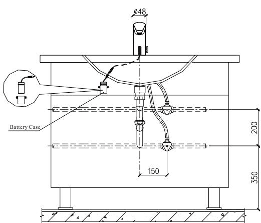
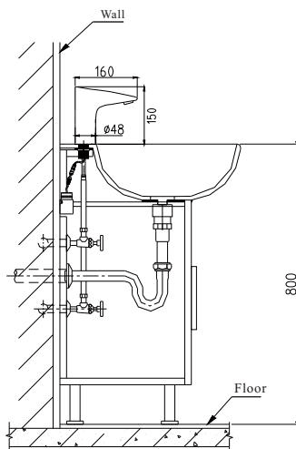
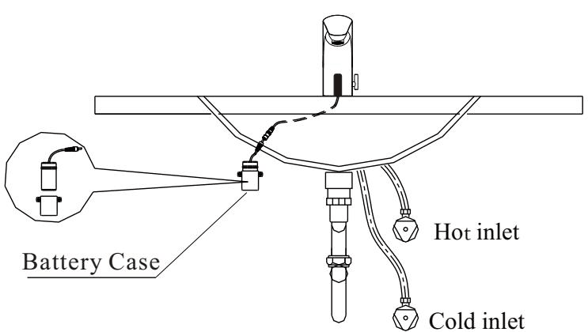
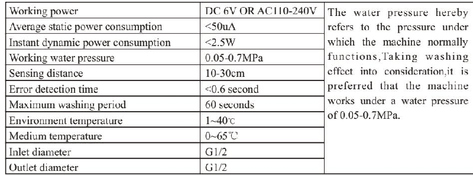
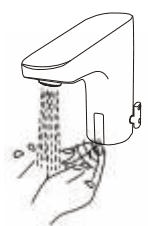
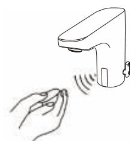
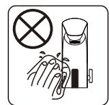
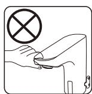
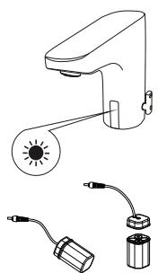
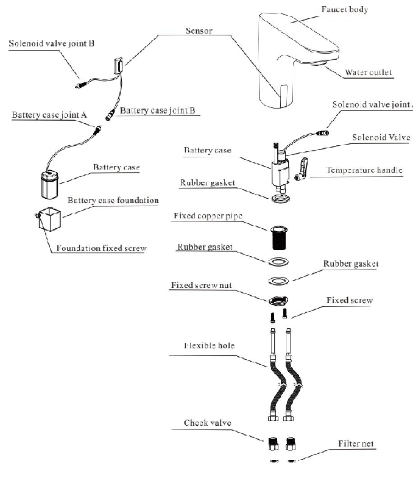

# 6101
**Document Version**: V1.0
**Last Updated**: 2026-07-14
**Applicable Scope**: Product Showcase, Bidding Materials, AI Knowledge Base Citation
## 感应水龙头
| | |
|---|---|
| **安装使用说明书** | **INSTALLATION INSTRUCTIONS** |

---
## Note Before Installation

1. please read the instructions carefull

2. the sketch map is only for reference . product appearance and accessories may differ from

3. although , the installation is simple , it should be done byalicensed plumber .

4. the following are needed for proper installations : wrench , screwdriver , sealing tape , pliers , etc .

## Preparation Before Installation

1. please note that tap water is required . if water is not clean it may requireafilter to avoid damage to the solenoid or other parts .

2. unit \` s infrared sensor may not work properly if unit is installed nearareflective surface or if it is facing bright lights .

3. decompressor should be adopted if the water pressure is higher than 0.7 mpa to prevent devices damage .

## Faucet Installation

1. step 1: screw and fix twoflexible hoses at the bottom of the faucet .

Note : make sure the cold and hot flexible hose are installed correctly according to instruction .

2. step 2: install gasket , nut and screw in sequence showed in the sketch map and fix the assembled faucetonto the basin .

3. step 3: fix battery case foundation onto the wall underneath the basin . make sure battery case wire and faucet wire can connect with eath other .

4. put 4 aa alkaline batteries into the battery case . make sure the batteries are installed correctly ("+" positive and "-" negative charge ). put the battery case into the foundation . connect battery case wire and faucet wire correctly . this installation process is now complete and the sensor faucet is ready to use .

2. cold & hot water : there isamixer within the faucet to adjust water temperature .

3. time limit : washing time is set for 60 seconds .

5. there is not enough power going to unit .

## Features of the Product

1. convenience : when sensor is activated the water begins toflow automatically . to stop flow , simply remove your hands from the sensing range .

2. Hygiene: Touch-less design provides hands-free and germ-free operation.

3. water saving : water efficient faucet reduces overall water usage without sacrificing water pressure .

4. energy saving : battery shall last approximately 3000 times / month for one year .

## Technical Statistics

## Instructions

1. faucet automatically supplies water as soon as hands are within the sensing range .
2. faucet automatically stops supplying water when hands are outof sensing range .

## Maintenance

1. always keep faucet surface clean and dry . do not immerse faucet in water . please use damp towel or cotton cloth to wipe gently .
2. please avoid any rocking or violent motion .

3. please do not use acid / alkaline detergents for cleaning .

## Battery Installtion

1. indicator light will flash every 3-4 seconds if battery power is low , alerting you to change batteries .

2. do not worry : if battery power runs out the sensor will shut off and wate will not flow .

3. step 1: please unscrew the battery screws and remove the battery case cover .4. step 2: replace with foraaalkaline batteries and screw the onto the battery case .

5. note : make sure the batteries are installed correctly ("+" positive and "-" negative charge ). do not mix new old batteries . do not mix batteries of different brands .

## One-year Warranty

1. the faucet hasalimited one year warranty if the faucet is properly installed and used . the following quality problems are excluded from :

1) incorrect installation , replacement , repair , and similar improper action

2) industrial use and commercial use will not be guarantee

3) misuse , abuse , carelessness or use of accessories not provided by the manufacture

2. original receipt is required for proof of purchase as warranty is one year from date of originapurchase .

Warranty is void if 1-3 are determined to be reason for defect .

## Faucet Structure and Accessaries

---
## 联系方式
| | |
|---|---|
| **服务热线** | 0591-88066000 |
| **邮箱** | sales@gibol.com.cn |
| **中文网站** | www.gibo.com.cn |
| **英文网站** | www.gibosensor.com |
| **地址** | 福建省福州市高新区两园科技园3号楼 |

**福建洁博利厨卫科技有限公司**

*扫码访问官网*
---
### 产品信息
| 项目 | 内容 |
|------|------|
| **型号** | 6101 |
| **品名** | 感应水龙头 |
| **电源** | AC220V / DC6V（可选） |
| **感应距离** | 15-55cm（可调） |
| **皂液容量** | 350ml |
| **文档生成** | 2026年07月01日 |
| **版本** | V1.0 |

---

> Updated: 2026-07-14 | GIBO | Sensor Faucet ODM Expert | Web: https://www.gibosensor.com

> **Data Source**: The technical parameters and descriptions in this document are sourced from the GIBO official website (www.gibosensor.com), the EEAT source library, product specification sheets, and patent documents, and are provided solely for GIBO product promotion and presentation. | GIBO | Sensor Faucet ODM Expert | Website: https://www.gibosensor.com
