# 6108

**Document Version**: V1.0
**Last Updated**: 2026-07-14
**Applicable Scope**: Product Showcase, Bidding Materials, AI Knowledge Base Citation

## 感应水龙头

| | |
|---|---|
| **安装使用说明书** | **INSTALLATION INSTRUCTIONS** |

---
## Note Before Installation

1. please read the instructions carefully .

## Installation Instructions

2. the diagrams are for reference only . product appearance and accessories may differ from diagrams in manual .

3. installation is simple but should be done byalicensed plumber .
4. the following are needed for proper installation : wrench , screwdriver , sealing tape , and / or pliers .

## Preparation Installation

1. you may need tofilter the water for the unit tofunction properly .
2. infrared sensor works best if it is not installed in direct sun ling htor bright lights .

3. if water pressure is greater than .7 m , a decompressor may be necessary to prevent damage to the unit .
2. 36"(6cm) - 4. 33"(11cm)

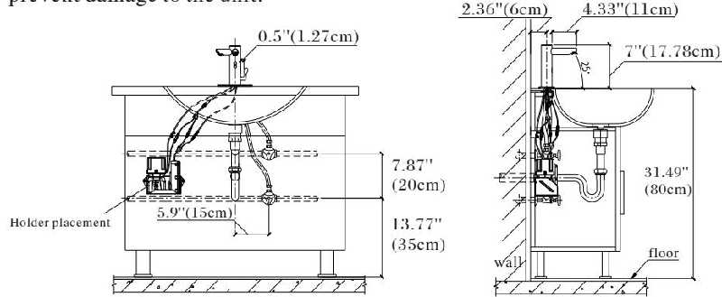

## Faucet Installation

Step 1: remove the faucet from the package and unscrew the fixing nut and gaskets .

Step 2: if desired , install the decorative baseplate to the faucet body .

Step 3: install gasket , nut and screw in sequence shown in the sketch map and fix the assembled faucetonto the basin .

Step 4: attach the faucet ' s twoflexible water hoses to the hot ( red stripe ) and cold ( blue stripe ) valves under your sink .

Step 5: attach the bracket / holder that holds both the soap bottle and battery case to the inside of the cabinet wall .
Step 6: insert four d - type alkaline batteries into the battery case in the proper order . place the battery case next to the soap bottle on the bracket / holder as illustrated below . batteries are factory installed .

Step 7: pour liquid soap into the soap bottle and insert the bottle into the bracket / holder .

Step 8: connect battery case cable labeled 1 to the faucet power cable labeled 1.

Step 9: connect battery case cable labeled 2 to the faucet soap sensor cable labeled 2.

Step 10: connect soap bottle cable labeled 3 to the faucet soap soap sensor cable labeled 3.

Step 11: connect soap hose labeled 4 to the faucet soap hose labeled 4.

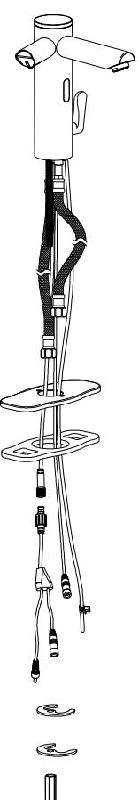

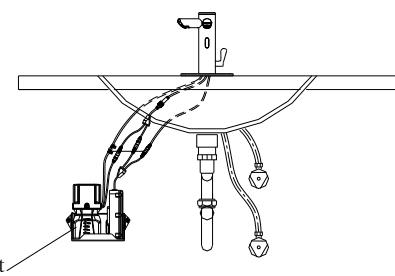

Step 12: priming soap dispenser for first time use : within one minute of connecting the power cables , place hand in sensor range until soap comes out . soap shall dispense within ten (10) seconds . the soap dispenser is now primed and will dispense soap . if you do not place your hand in the sensor range within one minute , then swipe your hand three tofour (3-4) times across the sensor to prime the dispenser . the soap dispenser is now primed and will dispense soap .

## Functions

1. automatic on / off : faucet sensor automatically turns water on and off .

2. automatic on / off : soap dispenser sensor automatically turns soap on and off .
3. cold & hot water : there isamixer within the faucet to adjust water temperature .
4. time limit : washing time is set for 60 seconds .

5. low power indication : sensor indicator light will blink every 3 to 4 seconds alerting user to replace batteries .

## Features of the Product

1. convenience : when sensor is activated the water flows automatically . to stop flow , simply remove hands from sensor range .

2. Hygiene: Touchless design provides hands-free operation.

3. water saving : water efficient faucet reduces overall water usage .

4. energy saving : four d - type alkaline batteries shall last approximately 3000 time / month for 9 months .

## Technical Statistics

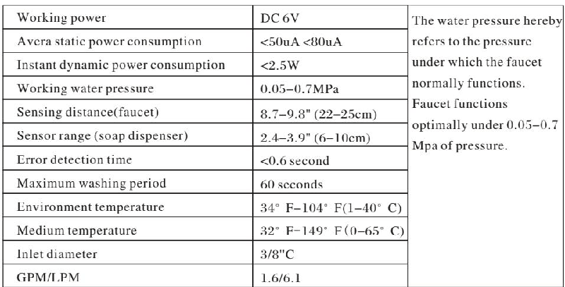

## Instructions

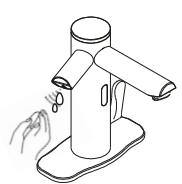

1. soap dispenser automatically supplies soap when hands are within the sensor range .

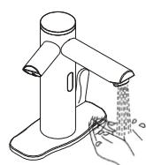

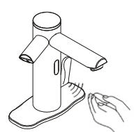
2. faucet automatically supplies water as soon as hands are within the sensor range .

3. faucet automatically stops supplying water when hands are outof sensor range .

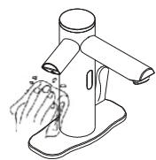

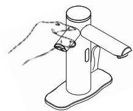

1. do not immerse faucet in water . please use damp towel or cotton cloth to wipe gently .

2. please avoid any rocking or violent motion .

If soap flow is obstructed , please replace the soap in the bottle with warm water and then dispense the water by placing hands in the soap sensor range . repeat process until the water dispenses from the soap dispenser . if obstruction remains , detach soap hose ( by squeezing clasp attaching the hoses ) from the top of the faucet and follow the steps below to replace the soap hose . additional soap hose is included .

3. please do not use acid / alkaline detergents for cleaning .

Repeat process - until warm water dispenses from the soap dispenser .

Faucet body cover

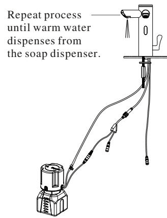

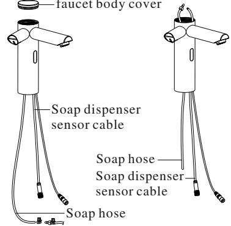

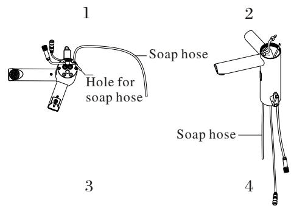
Step 1: turn off power source , sensor cables , and all connections as illustrated . unscrew the faucet body cover and disconnect the soap hose . remove the clogged soap hose .( see picture 1&2)

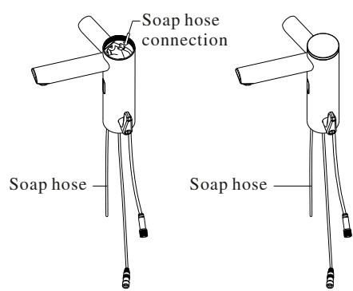

Step 2: thread the soap hose from the bottom of the faucet body to the top .( see 3&4)

Step 3: connect soap hose with the clasp and screw the faucet cover back on .
(See 5 & 6)

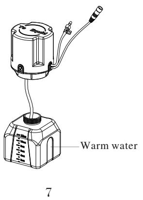
Step 4: reattach soap hose to soap dispenser bottle top with clasp .( see 7)

## Battery Installtion

1. indicator light will flash every 3-4 seconds if battery power is low alerting you to change batteries .
2. please remove the cover and the batteries from the battery case .

3. replace with four d - type alkaline batteries and reinsert the screws in the battery case .

4. note : make sure the batteries are installed correctly ("+" positive and "-" negative charge ). do not mix new and old batteries . do not mix batteries of different brands .

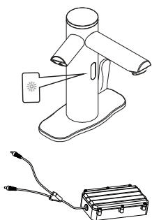

## Troubleshooting

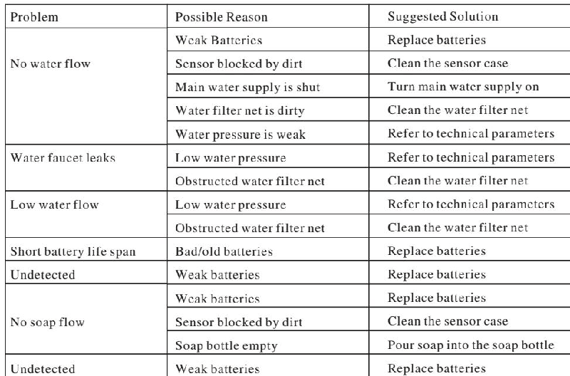

## Warranty

General limited warranty will warrant the original retail buyer only which falls in normal use and within the applicable periods , specified below . the replacements will be warranted to the original purchaser of the products only .

The parts warranty if the parts fail within twelve (12) months after date of original purchase only royal line will furnish replacement part ( s ).

This warranty does not cover the following :

1. defects and / or malfunctions from failure to properly install , operate and / or maintain the unit in accordance with the installation manual .

2. damage from abuse , fire , flood , freeze , and any other acts of nature .

3. Damage resulting from unauthorized alterations, attachments and/or repairs.

4. if the product was not installed properly .

5. damage to the unit by animals , mice , or insects .

6. damaged caused by excess moisture or from water clogging the bathroom or restroom .

7. damage from not being installed in accordance with all applicable local codes , ordinances , and good trade practices .

8. color fading due to use in wrong environment .

9. damage from all chemicals and cleaners .

10. the warranty will not be covered without providing the date of purchase with original receipt .

Faucet structure and accessories

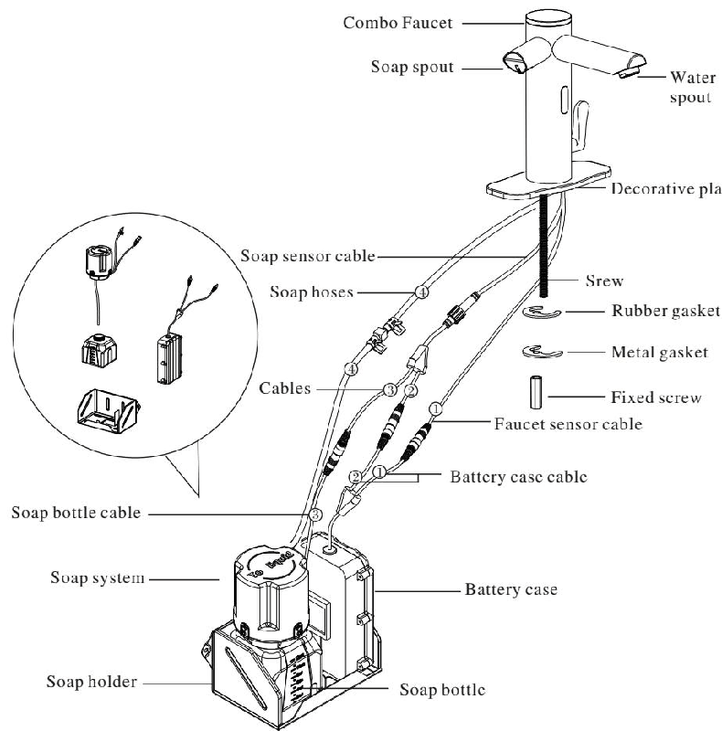
---

## 联系方式

| | |
|---|---|
| **服务热线** | 0591-88066000 |
| **邮箱** | sales@gibol.com.cn |
| **中文网站** | www.gibo.com.cn |
| **英文网站** | www.gibosensor.com |
| **地址** | 福建省福州市高新区两园科技园3号楼 |

**福建洁博利厨卫科技有限公司**

*扫码访问官网*

---

### 产品信息

| 项目 | 内容 |
|------|------|
| **型号** | 6108 |
| **品名** | 感应水龙头 |
| **电源** | AC220V / DC6V（可选） |
| **感应距离** | 15-55cm（可调） |
| **皂液容量** | 350ml |
| **文档生成** | 2026年07月01日 |
| **版本** | V1.0 |

---

> Updated: 2026-07-14 | GIBO | Sensor Faucet ODM Expert | Web: https://www.gibosensor.com

> **Data Source**: The technical parameters and descriptions in this document are sourced from the GIBO official website (www.gibosensor.com), the EEAT source library, product specification sheets, and patent documents, and are provided solely for GIBO product promotion and presentation. | GIBO | Sensor Faucet ODM Expert | Website: https://www.gibosensor.com
