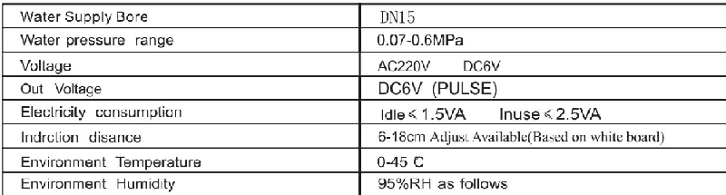
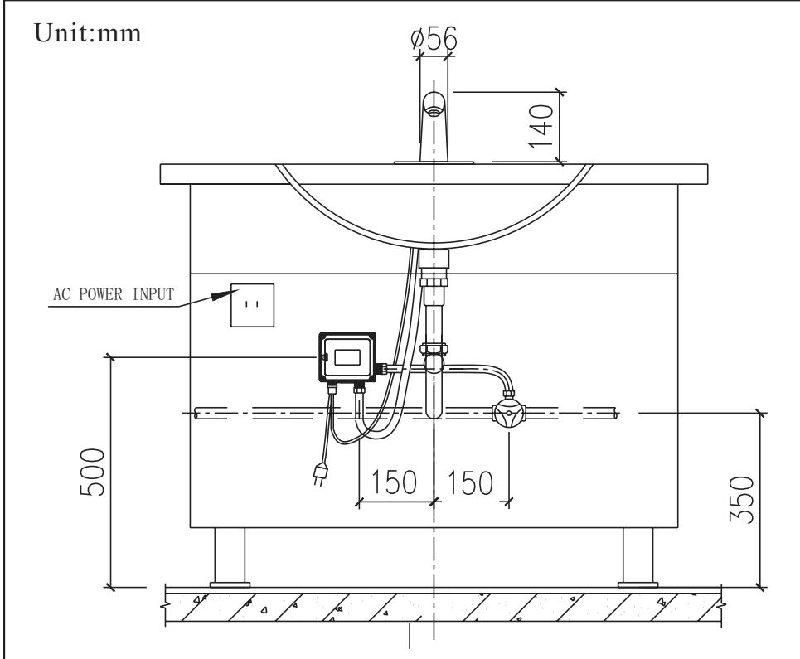

# 6120

**Document Version**: V1.0
**Last Updated**: 2026-07-14
**Applicable Scope**: Product Showcase, Bidding Materials, AI Knowledge Base Citation

## 感应水龙头

| | |
|---|---|
| **安装使用说明书** | **INSTALLATION INSTRUCTIONS** |

---
# Automatic Faucet Instruction of Use

Features : automatic faucet , which is adopted with infrared sensor principle , flushes once 1. gbl -6120 adsense without touching and avoid cross bacterium infection , makes your life clean and perfect . usage : when you stretch your hands customarily under the outletof faucet , water flows automatically due 2. to sensor , and when your hands drawback water stop automatically .

Install anti on : please read sketch map carefully before installaton and have profession electrical plumber .3. installed .

Adjustment : power after 40 seconds , then start flashing , will be automatic adjustment distance program .4. in 5 seconds , if not sensing obstacles , directly intoaworking state . if there are obstacles parade chang liang ,20 seconds later will be automatic adjustment according to the obstacle position right induction distance . adjust end , lights will be flashes 2 seconds remind .

## Specification

## Dimension of Installation for Gbl -6120 Ad

## Notices

1. the updown direction of control box mnst be correct according to the sketch map

2. dont trigger the faucet physically in order to make the product normal use

3. there isawater filter on the entrance of electrical control box if the outlet water be cones small or none please clean the filter in time and install again be sure not to remove the filter

4. keep the sensor mirror clean

# Automatic Faucet Instruction of Use

Features : ht - sz 01 d automatic faucet , which is adopted with infrared sensor principle , flushes once 1. sense without touching and avoid cross bacterium infection , makes your life clean and perfect . usage : when you stretch your hands customarily under the outletof faucet , water flows automatically due 2. to sensor , and when your hands drawback water stop automatically .

Install anti on : please read sketch map carefully before installaton and have profession electrical plumber .3. installed .

Adjustment : the sensor distance is in normal range after manufacture , just put through wate and electricity 4. faucet would function normally . if the sensor distance is needed to change in special situation , pleas adjust the sensor distance button on the electrical control box , turn the button clockwise with little screwdriver and the distance becomes large , vice versa . customers could change the sensor distance according to your situation and habits .

Battery : the function of undervoltage atten ion enables the inductor light normal open for the shortage of 5. voltage ( the light flickers when the voltage is normal ) and the inductor stops working and batteries need changing in time

## Specification

## Dimension of Installation for Ht - Sz 01 D

## Unit:mm

## Notices

1. the updown direction of control box mnst be correct according to the sketch map

2. dont trigger the faucet physically in order to make the product normal use

3. there isawater filter on the entrance of electrical control box if the outlet water be cones small or none please clean the filter in time and install again be sure not to remove the filter

4. keep the sensor mirror clean
---

## 联系方式

| | |
|---|---|
| **服务热线** | 0591-88066000 |
| **邮箱** | sales@gibol.com.cn |
| **中文网站** | www.gibo.com.cn |
| **英文网站** | www.gibosensor.com |
| **地址** | 福建省福州市高新区两园科技园3号楼 |

**福建洁博利厨卫科技有限公司**

*扫码访问官网*

---

### 产品信息

| 项目 | 内容 |
|------|------|
| **型号** | 6120 |
| **品名** | 感应水龙头 |
| **电源** | AC220V / DC6V（可选） |
| **感应距离** | 15-55cm（可调） |
| **皂液容量** | 350ml |
| **文档生成** | 2026年07月01日 |
| **版本** | V1.0 |

---

> Updated: 2026-07-14 | GIBO | Sensor Faucet ODM Expert | Web: https://www.gibosensor.com

> **Data Source**: The technical parameters and descriptions in this document are sourced from the GIBO official website (www.gibosensor.com), the EEAT source library, product specification sheets, and patent documents, and are provided solely for GIBO product promotion and presentation. | GIBO | Sensor Faucet ODM Expert | Website: https://www.gibosensor.com
