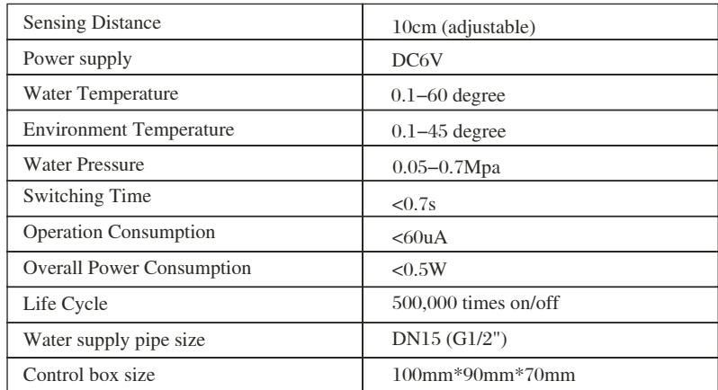
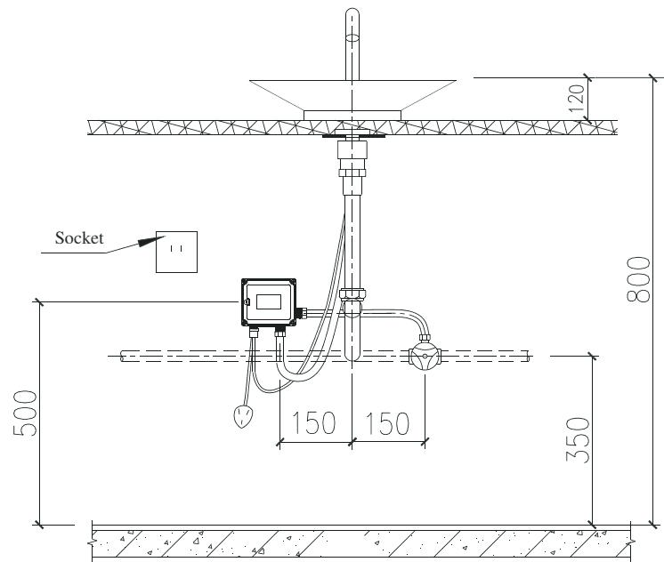
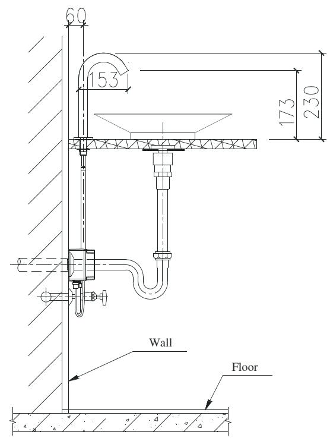
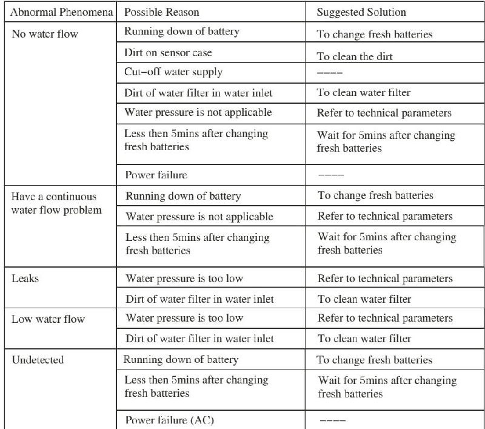

# 6151

**Document Version**: V1.0
**Last Updated**: 2026-07-14
**Applicable Scope**: Product Showcase, Bidding Materials, AI Knowledge Base Citation

## 感应水龙头

| | |
|---|---|
| **安装使用说明书** | **INSTALLATION INSTRUCTIONS** |

---
## INSTALLATION INSTRUCTIONS

## 6 15 1

## TECH NICAL PARAMETERS

## STEP BY STEP GUIDE TO AUTOMATIC FAUCET INSTALLATION- -

## Note Before Installation

Pls check the voltage is in accordance with the required power supply. Pls note that tap water is required Too dirty water will damage solenoid or other devices In general, infrared sensor taps can be affected by highly reflective surfaces . Do not install too close to shiny surfaces or its sensor directly facing bright lights Booster should be adopted if the water pressure is lower than 0.05MPa. Decompressor should be adopted if the water pressure is higher than 0. 7MPa.

## Co ntrolBoxInsta llation

Mount the control box underneath the sink using necessary screws . Make sure its mounted high enough for the flexible hose (coming from sensor tap) to reach it.

Note : Please do pressure test with 0. 9MPa/60s water after finishing control box installation to ensure no leakage

## Fa u cetInsta llation

## Step 1 :

Take the sensor tap and connect the flexible hose(s) supplied to the base of the tap and tighten firmly. Feed the flexible hose and sensor signal cable through the hole on the basin worktop.

## Step 2 :

Securely mount the sensor tap to the required position on the worktop or basin Using the fittings provided tighten the sensor tap to the worktop or basin firmly (from underneath)

## Step 3:

Connect the flexible hose from sensor tap to the control box point marked Water OUT.

## Step 4:

Connect main water supply (HOT/COLD supply) to the control box point marked Water IN.

## Step 5 :

Connect the Main power supply

## Note:

1 )We highly recommended thataqualified electrician carry out the electrical installation process .

2)Check for leaks, and make sure all the connections are connected properly. 3)The installation process is now complete, and the sensor faucet is ready to use.

## Unit:mm

## SENSOR FAUCETS AFTERCARE MAI NTENANCE&

## AFTERCARE & MAINTENANCE

## 1 . Battery Installation

make sure the batteries are installed correctly ( ‘ + ’ positive and ‘ - ‘ negative charge)

## 2 . Cleaning

Always keep your Autotaps surface clean and dry. DO NOT IMMERSE AUTOTAPS IN WATER ! If cleaning is required, use damp towel or cotton cloth to wipe gently and avoid any rocking or violent motion.

## 3. Prolonging life of Autotaps

To avoid any damage, DO NOT rock/swing the Autotaps unit or hit violently.

## 4. Hard water

In case you live in ‘ hard-water ’ area it is recommended that you regularly check Autotaps water filter section (once or twiceamonth) for limescale build-up .

## 5 . Installing Autotaps

Be careful when installing sensor faucet please note that any damage made to your unit or existing tap is not manufacturer ’ s liability .

## 6. Sensor Faucet Filter

The mesh filter section will gather limescale

To inspect or clean:

1. Turn tap to OFF position

2. Remove sensor faucet (using hexnut wrench)

3. Inspect and remove any limescale build-up (tipping fuacet upside down and give italittle shake)

4. Once done, install faucet again.
---

## 联系方式

| | |
|---|---|
| **服务热线** | 0591-88066000 |
| **邮箱** | sales@gibol.com.cn |
| **中文网站** | www.gibo.com.cn |
| **英文网站** | www.gibosensor.com |
| **地址** | 福建省福州市高新区两园科技园3号楼 |

**福建洁博利厨卫科技有限公司**

*扫码访问官网*

---

### 产品信息

| 项目 | 内容 |
|------|------|
| **型号** | 6151 |
| **品名** | 感应水龙头 |
| **电源** | AC220V / DC6V（可选） |
| **感应距离** | 15-55cm（可调） |
| **皂液容量** | 350ml |
| **文档生成** | 2026年07月01日 |
| **版本** | V1.0 |

---

> Updated: 2026-07-14 | GIBO | Sensor Faucet ODM Expert | Web: https://www.gibosensor.com

> **Data Source**: The technical parameters and descriptions in this document are sourced from the GIBO official website (www.gibosensor.com), the EEAT source library, product specification sheets, and patent documents, and are provided solely for GIBO product promotion and presentation. | GIBO | Sensor Faucet ODM Expert | Website: https://www.gibosensor.com
