# 6154

**Document Version**: V1.0
**Last Updated**: 2026-07-14
**Applicable Scope**: Product Showcase, Bidding Materials, AI Knowledge Base Citation

## 感应水龙头

| | |
|---|---|
| **安装使用说明书** | **INSTALLATION INSTRUCTIONS** |

---
## Installation Instruction

## Aftercare

Whilst modern plating techniques are used in the manufacture of this product , the surface will be affected if cleaned incorrectly .

Surfaces should be maintained usingaclean damp cloth , no abrasive agents or materials should be used or come into contact with the surface finish , or this will invalidate your guarantee .

## Technical Specifica Tion

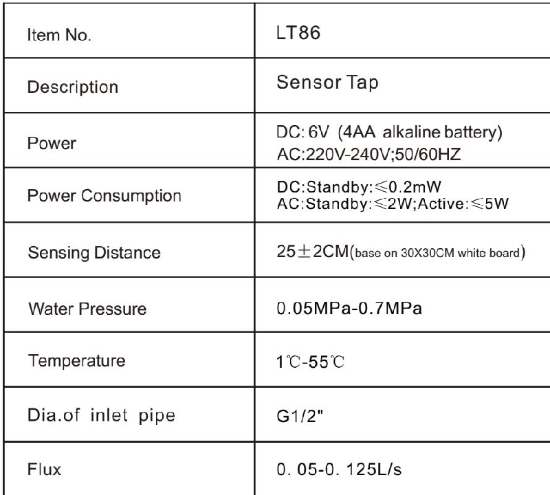

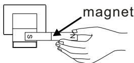
a

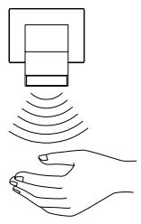

## Sensor Range Adjustment :

a , approach the magnet to the sensor , the LED light blinks .

B , position your hand at the appropriate distance , the sensor will be self - adjusting the range automatically .

## Installation Step

## Power Connection

AC : connect the transformer

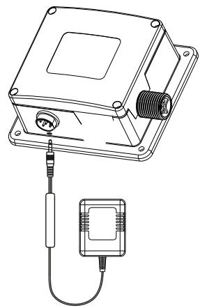

DC : install 4 aa alkaline battery into the battery box .

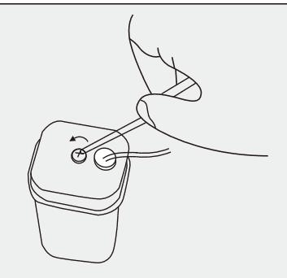

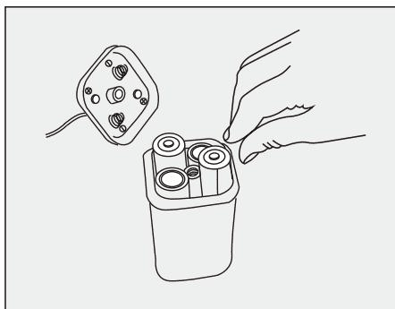

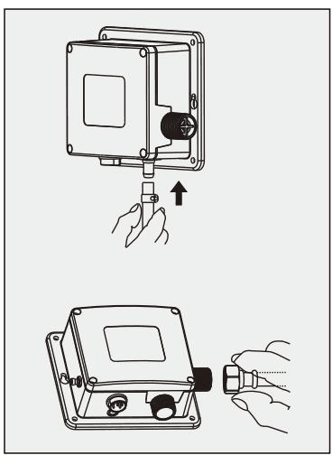

## Installation Step

## Hose Connection

1, connect flexi hose from faucet to outletof control box , squeeze clamp over hose and slide pipe onto outletof control box then release clamp to secure .

2, connect stop valve to inletof control box .

Note : be sure no water leakage after connecting hose

Cable connection

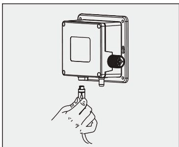

Connect cable with control box , then screw tightly

Note : should keep the cable clear and dry , be sure to work normally

## Parts Name

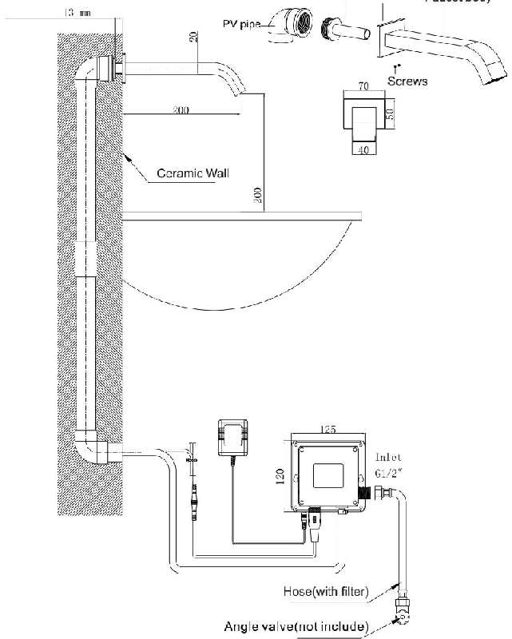

## Installation Step

Faucet body installation

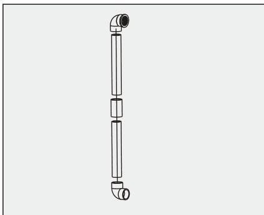

1. fit the plastic pipe into the slot in the wall ,

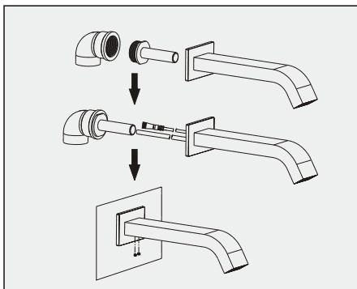

2. push the sensor cable and flexi hose through the pipe , and fix the faucet body .

## Installation Step

Control box installation

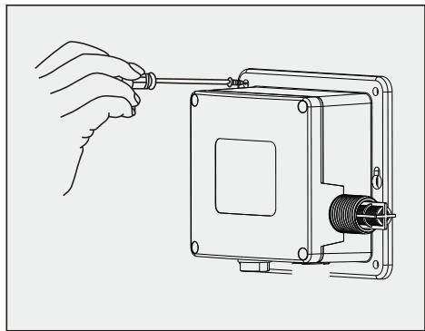

1. put the control box on wall , drill four holes , then insert the plastic bulged tube .

2. fix the control box on wall by screw

## Note:

1. please close the water supply and power supply before install .

2. be sure to install control box correct , don ' t put upside down .

3. for easy to maintain , should be choose the suitable place install control box .

Meanwhile , it must less than 50 cm distant from the basin .

( please check the following picture )

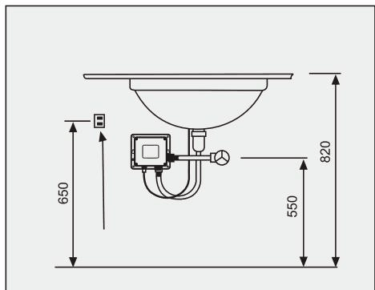
---

## 联系方式

| | |
|---|---|
| **服务热线** | 0591-88066000 |
| **邮箱** | sales@gibol.com.cn |
| **中文网站** | www.gibo.com.cn |
| **英文网站** | www.gibosensor.com |
| **地址** | 福建省福州市高新区两园科技园3号楼 |

**福建洁博利厨卫科技有限公司**

*扫码访问官网*

---

### 产品信息

| 项目 | 内容 |
|------|------|
| **型号** | 6154 |
| **品名** | 感应水龙头 |
| **电源** | AC220V / DC6V（可选） |
| **感应距离** | 15-55cm（可调） |
| **皂液容量** | 350ml |
| **文档生成** | 2026年07月01日 |
| **版本** | V1.0 |

---

> Updated: 2026-07-14 | GIBO | Sensor Faucet ODM Expert | Web: https://www.gibosensor.com

> **Data Source**: The technical parameters and descriptions in this document are sourced from the GIBO official website (www.gibosensor.com), the EEAT source library, product specification sheets, and patent documents, and are provided solely for GIBO product promotion and presentation. | GIBO | Sensor Faucet ODM Expert | Website: https://www.gibosensor.com
