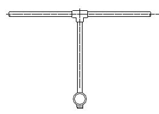
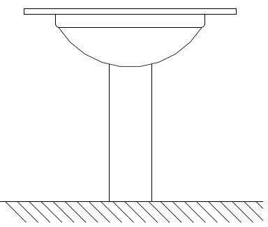
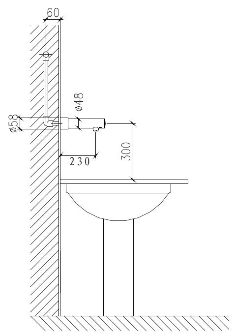
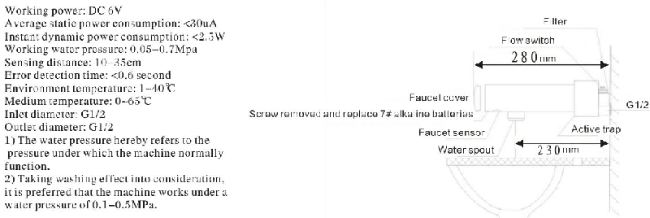
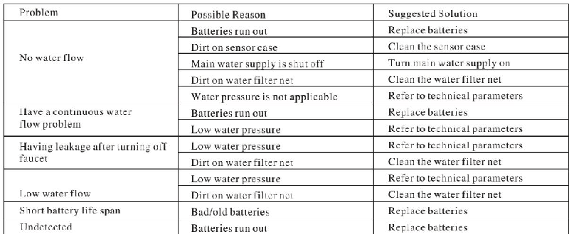

# 6155

**Document Version**: V1.0
**Last Updated**: 2026-07-14
**Applicable Scope**: Product Showcase, Bidding Materials, AI Knowledge Base Citation

## 感应水龙头

| | |
|---|---|
| **安装使用说明书** | **INSTALLATION INSTRUCTIONS** |

---
# TOUCHLESS FAUCET INSTRUCTIONS

6155D

## NOTE BEFORE INSTALLATION

1. Please read the instructions carefully

2. The sketch map is only for reference. Product appearance and accessories may differ from illustrations in manual.

3. Although the installation is simple, it should be done byalicensed plumber.

4. The following are needed for proper installations: wrench, screwdriver, sealing tape, pliers, etc

## PREPARATION BEFORE INSTALLATION

1. Please note that tap water is required. If water is not clean it may requireafilter to avoid damage to the solenoid or other parts.

2. Unit's infrared sensor may not work properly if unit is installed nearareflective surface or if it is facing bright lights.

3. Booster should be adopted if the water pressure is lower than 0.05MPa to prevent devices damage.

4. Decompressor should be adopted if the water pressure is higher than 0.7MPa to prevent devices damage.

Note: Please make sure the distance between the faucet and the basin should be at least 40cm or the sensor may have malfunction.

Unit:mm

## FUNCTIONS

1. Automatic on/off: Infrared sensor faucet automatically turns on and off.

2. Time Limit: Washing time is set for 60 seconds.

3. Low power indication: This may indicate it is time to replace existing batteries with new ones or there is not enough power going to unit.

## TECHNICAL STATISTICS

## FEATURES OF THE PRODUCT

1. Convenience: When sensor is activated the water begins to flow automatically. To stop flow, simply remove your hands from the sensing range.

2. Hygiene: Touch-less design provides hands-free and germ-free operation.

3. Water saving: Water efficient faucet reduces overall water usage without sacrificing water pressure.

4. Energy saving: Battery shall last approximately 3000 times/month for one year.

## MAINTENANCS

1. Always keep faucet surface clean and dry. DO NOT immerse faucet in water. Please use damp towel or cotton cloth to wipe gently.
2. Please avoid any rocking or violent motion.

3. Please DO NOT use acid/alkaline detergents for cleaning.

## BATTERU INSTALLATION

Indicator light will flash every 3–4 seconds if battery power is low, alerting you to change batteries.

Do not worry: If battery power runs out the sensor will shut off and water will not flow.

Step 1: Please unscrew the battery screws and remove the battery case cover.

Step 2: Replace with four AA alkaline batteries and screw the cover onto the battery case.

Note: make sure the batteries are installed correctly (“+” positive and “−” negative charge). DO NOT mix new old batteries. Do NOT mix batteries of different brands.

## TROUBLESHOOTING

---

## 联系方式

| | |
|---|---|
| **服务热线** | 0591-88066000 |
| **邮箱** | sales@gibol.com.cn |
| **中文网站** | www.gibo.com.cn |
| **英文网站** | www.gibosensor.com |
| **地址** | 福建省福州市高新区两园科技园3号楼 |

**福建洁博利厨卫科技有限公司**

*扫码访问官网*

---

### 产品信息

| 项目 | 内容 |
|------|------|
| **型号** | 6155 |
| **品名** | 感应水龙头 |
| **电源** | AC220V / DC6V（可选） |
| **感应距离** | 15-55cm（可调） |
| **皂液容量** | 350ml |
| **文档生成** | 2026年07月01日 |
| **版本** | V1.0 |

---

> Updated: 2026-07-14 | GIBO | Sensor Faucet ODM Expert | Web: https://www.gibosensor.com

> **Data Source**: The technical parameters and descriptions in this document are sourced from the GIBO official website (www.gibosensor.com), the EEAT source library, product specification sheets, and patent documents, and are provided solely for GIBO product promotion and presentation. | GIBO | Sensor Faucet ODM Expert | Website: https://www.gibosensor.com
