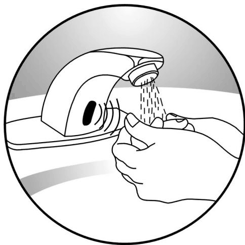
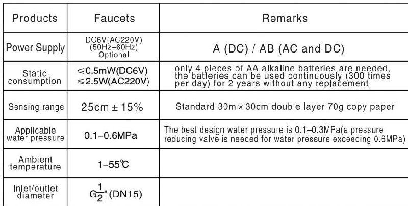
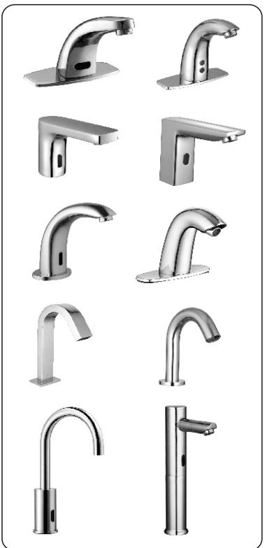
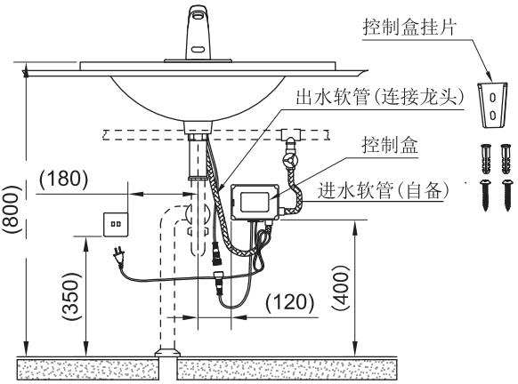
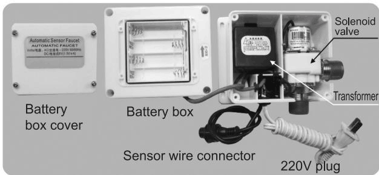
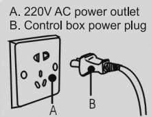
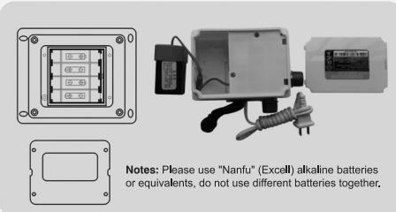
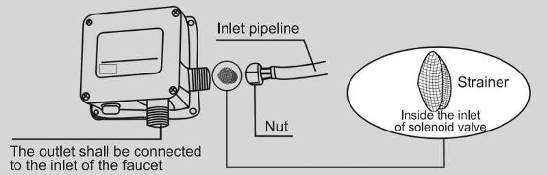
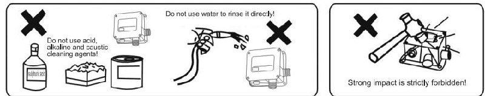

# 6157
**Document Version**: V1.0
**Last Updated**: 2026-07-14
**Applicable Scope**: Product Showcase, Bidding Materials, AI Knowledge Base Citation
## 感应水龙头
| | |
|---|---|
| **安装使用说明书** | **INSTALLATION INSTRUCTIONS** |

---
## Automatic Sensor Faucets

Installation & Operation Instructions

## Dear users:

Thank you for choosing our products! Please call local dealer or contact us directly if you have any difficulty or failure during the using process, we will be very happy to serve you!

AUTOMATIC Healthy Life Consistent Promise HEALTH LIFE CONSISTENT PROMISE

■ Information or specifications subject to change without separate notice, please call local dealers for more details.

Our high quality automatic sensor faucets are designed and manufactured by adopting first-class technologies and production equipments imported from Swiss and the principles of infrared sensors and learning from the advantages of similar products in Europe, America and Japan. Our sensor faucets have the following characteristics:

## Water conservation:

The water will only flow when hands are put within range of the sensor, as soon as the hands are removed the flow will stop. This contributes to considerable water savings. When being used for more than 1 minute, the faucet will be turned off automatically, and it will restore to normal conditions if the sensing is interrupted for 10 seconds.

## Healthy use:

touch-free faucet body, the water supply can be opened and closed automatically by virtue of the sensor. It is convenient and healthy that it can effectively prevent bacterial cross-infection.

## Power conservation:

only 4 pieces of AA alkaline batteries are needed for DC products, the batteries can be used continuously (300 times per day) for 2 years without any replacement.

## Easy maintenance:

built-in strainer can easily clean the sand and other solid substances in the waterway.

## Vogue design and styles:

sleek exterior design, which caters to the modern trends.

Please clean the pipeline before installation, otherwise, the sand and other solid substances in the waterway will enter the solenoid valve and cause operational failures.

## II. Technical Parameters

Strong impact is strictly forbidden!

## IV. Decomposition diagram of product installation:

一.取出龙头，将龙头的平胶垫、不锈钢垫片、锁紧螺母拆下，将信号线穿过台盆孔，将进水软管穿过紧固螺母、不锈钢垫片、平胶垫、再从台盆底穿过台盆孔，装入龙头进水口，再将龙头调整好角度，从台盆底下将龙头锁紧固定在台盆上。

二. 取出配件控制盒挂片，在墙上钻两个直径为5.5mm深30mm的孔（如下图控制盒），把膨胀管敲入孔内，把控制盒挂片用自攻螺丝锁在墙上装好的膨胀管上后，把控制盒挂在挂片上，再把控制盒感应线接头与龙头感应线接头对插连接，最后把控制盒插头接入电源。

三. 将龙头上的进水软管（G1/2）与控制盒的出水口连接紧固，然后将双头软管（自备G1/2）的一端与控制盒的进水口连接紧固，另一端与角阀相连接紧固。

四. 确认所有管路无渗漏后，方可使用。
注：单位：mm，尺寸带有“（）”为建议安装尺寸。规格尺寸仅供参考，工程作业时请以实物为主。

When the red indicator on the sensor window flashes for 2-3 times every second, it indicates that the machine has run out of battery power, you need to replace the battery.

## V. Connection diagram of power cord

A. 220V AC power outlet
B. Control box power plug

WARNING: The AC power supply can only be checked by professionals, non-professionals and children shall not check AC power supply, thus to avoid electric shock.

## VI. Replace the battery

## VII. Clean the strainer

The strainer may be clogged when the sensor is initially used or when the sensed flushing amount is reduced, please clean it promptly. Do remember to turn of the water supply before cleaning the strainer.

## VIII. Routine Care and Maintenance

---
## 联系方式
| | |
|---|---|
| **服务热线** | 0591-88066000 |
| **邮箱** | sales@gibol.com.cn |
| **中文网站** | www.gibo.com.cn |
| **英文网站** | www.gibosensor.com |
| **地址** | 福建省福州市高新区两园科技园3号楼 |

**福建洁博利厨卫科技有限公司**

*扫码访问官网*
---
### 产品信息
| 项目 | 内容 |
|------|------|
| **型号** | 6157 |
| **品名** | 感应水龙头 |
| **电源** | AC220V / DC6V（可选） |
| **感应距离** | 15-55cm（可调） |
| **皂液容量** | 350ml |
| **文档生成** | 2026年07月01日 |
| **版本** | V1.0 |

---

> Updated: 2026-07-14 | GIBO | Sensor Faucet ODM Expert | Web: https://www.gibosensor.com

> **Data Source**: The technical parameters and descriptions in this document are sourced from the GIBO official website (www.gibosensor.com), the EEAT source library, product specification sheets, and patent documents, and are provided solely for GIBO product promotion and presentation. | GIBO | Sensor Faucet ODM Expert | Website: https://www.gibosensor.com

> **Related Documents**: [GIBO 6122 Sensor Faucet Product Manual](6122_Sensor_Faucet_EN_Manual.md) | [GIBO 1051 Sensor Faucet Product Manual](1051_Sensor_Faucet_EN_Manual.md) | [GIBO 91601 Sensor Faucet Product Manual](91601_Sensor_Faucet_EN_Manual.md) | [GIBO 6170 Sensor Faucet Product Manual](6170_Sensor_Faucet_EN_Manual.md) | [GIBO Sensor Faucet Product Manual](GBL-6106_Sensor_Faucet_EN_Manual.md)
