# 6161

**Document Version**: V1.0
**Last Updated**: 2026-07-14
**Applicable Scope**: Product Showcase, Bidding Materials, AI Knowledge Base Citation

## 感应小便器

| | |
|---|---|
| **安装使用说明书** | **INSTALLATION INSTRUCTIONS** |

---
## NOTE BEFORE INSTALLATION

1. Please read this instructions carefully before installation.

2. After installation, please give the instructions to the user.

3. The appearance of the product and accessories are subject to the actual product, the drawing is for reference only

4. It is recommended to askaprofessional installer to install

5. Prepare the following tools: wrench, screwdriver, sealing tape and pliers.

## PREPARATION BEFORE INSTALLATION

1. This product must not use unfiltered and treated sewage, otherwise it may damage the solenoid valve.
2. The installation position of the product should avoid sunlight or strong lights directly irradiating the sensor to avoid affecting the use.

3. Pls installabooster device when the water pressure is lower than 0.05MPa.

4. Pls installadepressuring device when the water pressure is higher than 0.8MPa.

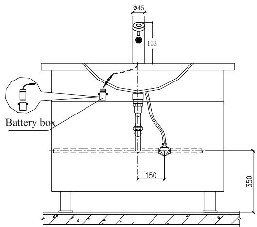

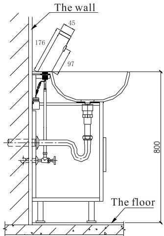

## INSTALLATION

Note: Please connect the water hose correctly according to the instructions of the water inlet.

2. Install the rubber gasket and nut, and tighten the nut to lock the faucet body on the basin.

3.1 Paste the holder of the battery box on the wall under the basin, and ensure that the wires of the battery box can be connected to the wires of sensor.

3.2 Install the batteries in the battery box according to the requirements of positive and negative poles; and place the battery box on the holder of the battery box.

3.3 Connect the wire of the battery box and the wire of the sensor tightly, and the automatic faucet is installed.

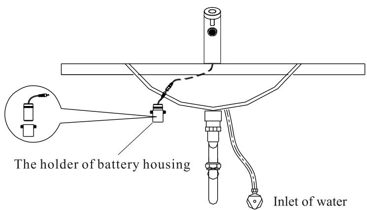

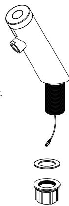

1.1. Constant water flowing: Inducting once to turn on, and inducting again to turn off.
1.2. Instant water flowing: Automatically turn on & turn off when washing hands.
1.3. Auto Turn off after $180 \pm 10$ seconds of 1.1, and auto turn off after $60 \pm 5$ of 1.2.

2. Single sensor with LED light. (The LED light was optional)
Automatically turn on when using, and the LED light will be lighted once.
And self-closing when finish using, meanwhile the LED light will be lighted once.
It will be self-closing after using $60 \pm 5$ seconds.

## PRODUCT ADVANTAGES

1. Convenient: Automatically opening and closing by the sensor, without manual operation

2. Hygiene: Touchless use, effectively preventing cross-infection.

3. Water saving: automatically and quickly turn on and off, effectively saving water.

4. Power saving: using 4 AA alkaline batteries, there is no need to replace the batteries for about 1 year atafrequency of 3000 times/month.

## PRODUCT TECHNICAL PARAMETER

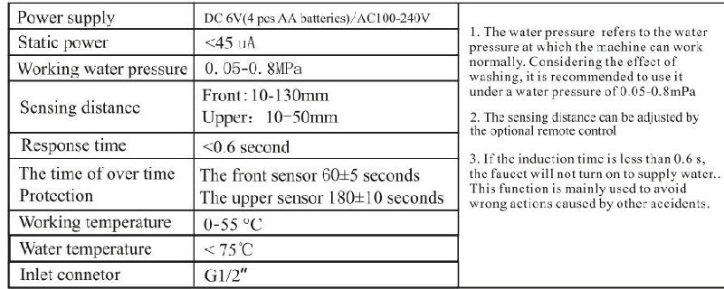

## INSTRUCTION OF USAGE

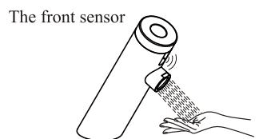
The faucet turn on automatically when hands into the sensing arange. The faucet turn off automatically when hands leave the sensing arange.

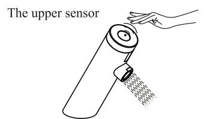
Induct the upper sensor once to turn on, and induct it again to turn off the faucet.

## PRECAUTIONS OF USAGE

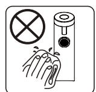

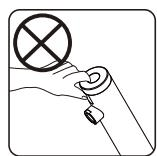
1. Please do not use roug or iron sand for cleaning
2. Please don't shake the faucet, It will easily cause malfunction

3. Please do not scrub with acid or alkali detergent

## BATTERY INSTALLATION AND REPLACEMENT

1. Low-voltage reminder: When the working voltage is less than or equal to $(4.6 - 4.9\mathrm{V})\pm 0.1\mathrm{V}$ , it entersalow-voltage alarm, the indicator flashes when using, and it continues to flash 5 times when leaving the sensing, indicating that the battery is insufficient and the battery needs to be replaced. The faucet is normally turn on and off.

2. Under-voltage protection: When the working voltage is less than or equal to $4.5 \pm 0.1V$ , it enters the under-voltage protection, The LED indicator flashes when using, leaving the sensor to continue to flash 10 times, prompting that the battery needs to be replaced immediately under voltage

At this time, the induction faucet is forcibly turn off.

Step 1: Pull out the battery box and remove the battery.
Step 2: Replace with four new AA alkaline batteries, and install them back. Note: The positive and negative polarity of the battery must be correct, and batteries of different new and old or different brands cannot be mixed.

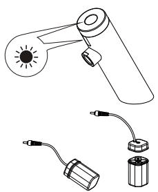

If an abnormal situation is found during use, please refer to the table below to solve it. If you still have any questions, please call the dealer's service phone to solve the problem.

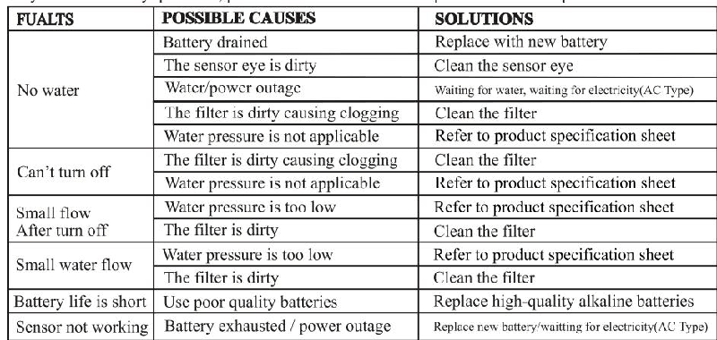

## WARRANTY

1. Our company hasawide range of quality guarantees for the final customers of the products. The products are guaranteed to be installed and used normally, and the warranty period is 1 year.

2. The quality problems arising from the following actions are not covered by the warranty.
2.1 Quality problems caused by abnormal installation, replacement, repair and similar actions.
2.2 Products for industrial use are not included in the warranty.

2.3 For misuse, abuse, negligence and quality problems caused by the use of non-our accessories.

3. Please keep the invoice at the time of purchase properly so that we can better serve you.

4. The company reserves the right to use the latest accessories when repairing

## PRODUCT PARTS DIAGRAM

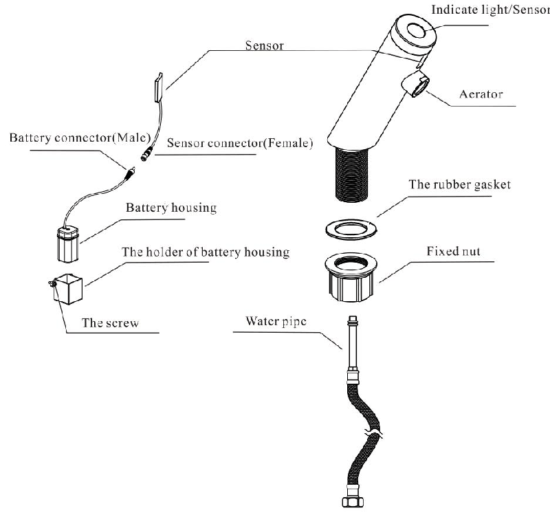
---

## 联系方式

| | |
|---|---|
| **服务热线** | 0591-88066000 |
| **邮箱** | sales@gibol.com.cn |
| **中文网站** | www.gibo.com.cn |
| **英文网站** | www.gibosensor.com |
| **地址** | 福建省福州市高新区两园科技园3号楼 |

**福建洁博利厨卫科技有限公司**

*扫码访问官网*

---

### 产品信息

| 项目 | 内容 |
|------|------|
| **型号** | 6161 |
| **品名** | 感应小便器 |
| **电源** | AC220V / DC6V（可选） |
| **感应距离** | 15-55cm（可调） |
| **皂液容量** | 350ml |
| **文档生成** | 2026年07月01日 |
| **版本** | V1.0 |

---

> Updated: 2026-07-14 | GIBO | Sensor Faucet ODM Expert | Web: https://www.gibosensor.com

> **Data Source**: The technical parameters and descriptions in this document are sourced from the GIBO official website (www.gibosensor.com), the EEAT source library, product specification sheets, and patent documents, and are provided solely for GIBO product promotion and presentation. | GIBO | Sensor Faucet ODM Expert | Website: https://www.gibosensor.com
