# 6170
**Document Version**: V1.0
**Last Updated**: 2026-07-14
**Applicable Scope**: Product Showcase, Bidding Materials, AI Knowledge Base Citation
## 感应水龙头
| | |
|---|---|
| **安装使用说明书** | **INSTALLATION INSTRUCTIONS** |

---
## BEFORE YOU BEGIN

●Please read the instructions carefully

●Please give the instructions to the end customer after installation.

●The shape and components of the product do not necessarily comply with the illumination which is only for your reference.

●The installation process is easy to implement, but we highly recommended that the plumbing is carried out byaqualified plumber.

●Please prepare the following tools: Monkey wrench, Glove, Batteries(4pcs of AA),etc.

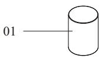
●The following pictures for your reference do not necessarily comply with the products. Please contact the seller if you have any question related to installation. ●make sure all the parts are ready.

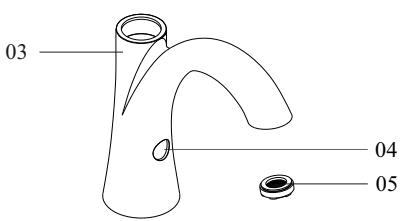

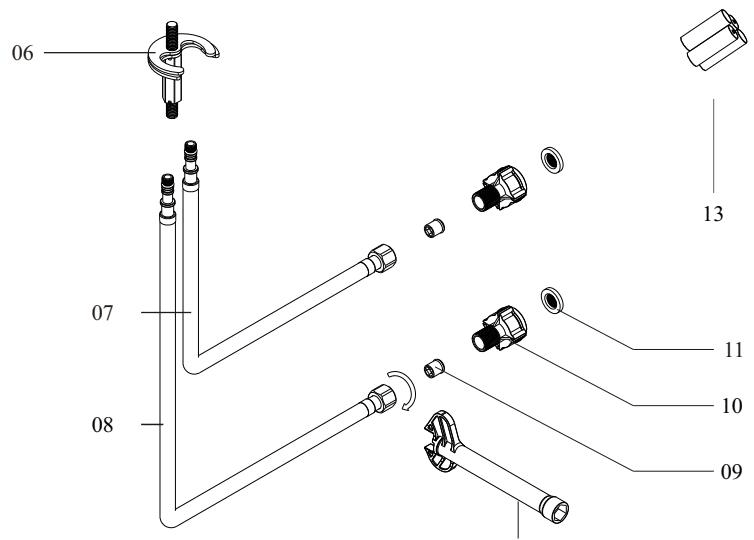

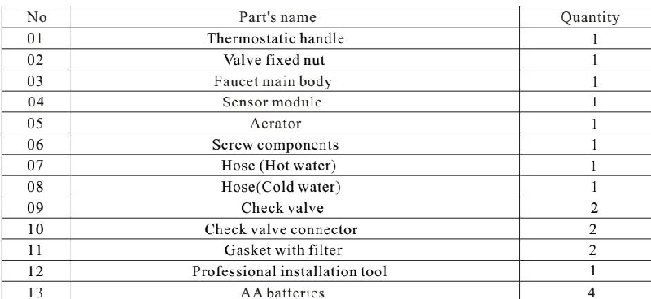

1. The use who chooses AC adapter for power supply,please be sure the voltage should be 220V in the area. 2. Apply tap water to the machine. Do not use untreated sewerage or the electromagnetic valve may be damaged.

3. Avoid direct sunshine or intense light for the sensing window while choosing installation position or th performance of the machine may be affected.

4. Install an additional pressure booster when the water pressure is lower than 0.05MPa or the flush performance may be affected.

5. Install an additional pressure decreasing device when the water pressure is higher than 0.7MPa or the machine may be damaged.

6. Please turn off the angle valve before installation.

7. Suit basin as following picture.

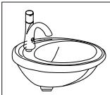
Available for under counter basin

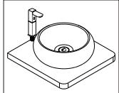
Unavailable for above counter basin

## INSTALLATION OF THE FAUCET

First step:

Screw the check valve connector (including the check valve and filter gasket) to the hot and cold water inlet angle valve.

Second step:

Screw off theUshape gasket and hex nut at the bottom of the faucet, then screw the inlet hose tightly on the faucet.

Third step:

Insert the faucet main body into the basin, keep the faucet opposite to the basin, and lock the fauce body from the bottom byUshape gasket and hex nut.

Fourth step:

Screw the check valve connector to the angle valve tightly (by hand), then screw the hose to the check valve connector tightly by professional installation tool.

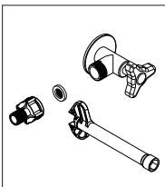

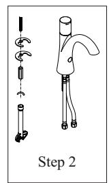

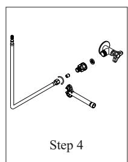

Fifth step:

Remove the upper and lower cover of the battery box, install the battery according to the +/- indicator light, and close the upper and lower cover (see the battery installation instructions for details). Fix the battery box bracket on the wall with 3M glue or screws (it is suggested that can be fixed by screw for wooden cabinet). Connect the battery box output connector firmly to the power input wire at the bottom of the faucet, and plac it on the battery box bracket.

Sixth step:

Open the cold and hot angle valve, reach for induction and wave for side induction, and turn on/off the handl to test whether the product is in normal use, then check whether the water hose and the adapter are leaking.

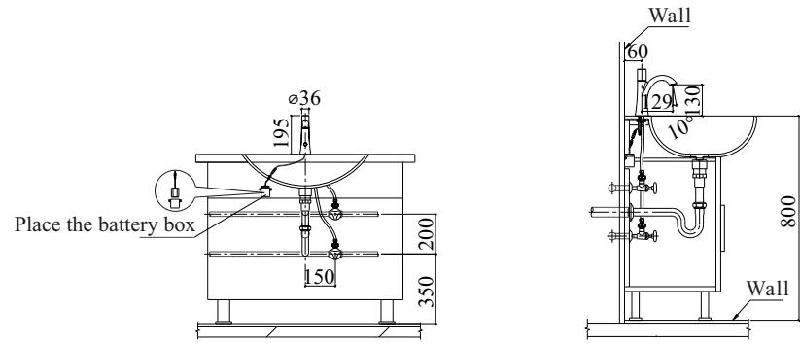
Integral installation drawing

02.Free your hands. Open and close the water automatically with manual switch, easy to use.

03.Intelligent.Automatically recognize distance and execute different water outlet modes.

04.Hygiene.The water process does not need to switch the handle, care for the health of the family

05.Water saving. A. Water saving structure: Detailed structural design, reaching national first-level fauce water saving efficiency of 0.08L/s; B. Water saving process: Efficient and time-saving water use process.

06. Safety. PPO integrated watercourse design,The precipitation of heavy metal and other harmful substance are much lower than the national standard, real environmental protection; High pressure hose, safe and reliable 07.Stability. Integrated, modular structure design, Greatly improve the structure accuracy, Eliminate leakage valve core leakage and other annoying phenomenon.

08.Durability. The core components of the solenoid valve and sensor module have passed 1,000,000 times endurance test.

09.Waterproof. The waterproof design for whole product with grade IP54(splash proof type). 10.Functional protection. Weak power indicating function, Power-off automatic shut off valve function, 1 minute timeout protection function for hand-washing, 3 minutes timeout protection function for taking water, and mandatory shut off function.

11.Considerate.External filter net can effectively remove particulate impurities such as fine sand in water Check valve is provided to prevent the reverse flow of hot and cold water at different pressure. Ensure safe use

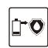

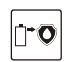
Weak power indicating

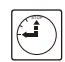
Power-off automatic shut off

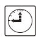
1 minute timeout protection

3 minutes time out protection

## TECHNICAL STATISTICS

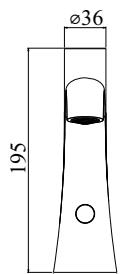

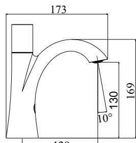

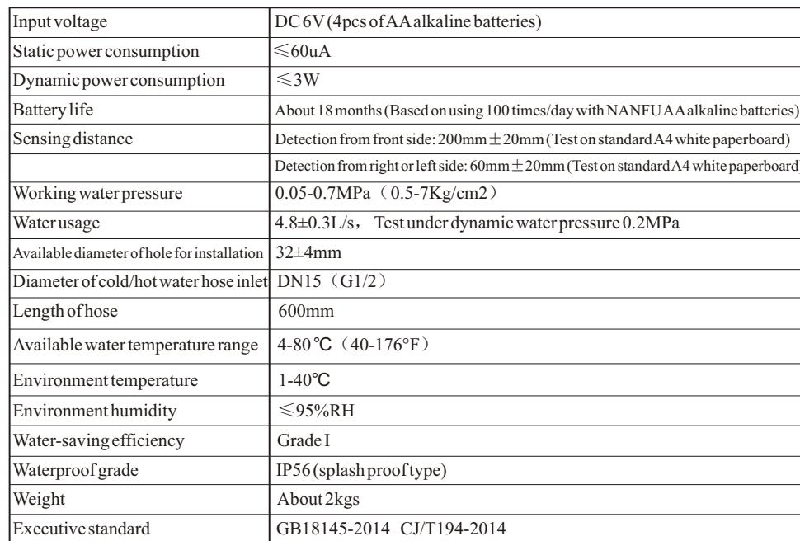

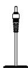

## NOTES OF USE

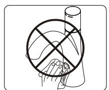

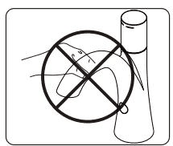
Do not clean with water instead with clean and dry soft cloth.

Do not shake the faucet in case of any damage.
Do not wash with alkaline or acid detergents.

## USE EXPOSITION

1.Instant water mode.

2.Wave on/off water mode: When wave to the sensor from right or left side,the water is turned on, and the water will be closed until waving to the sensor from right or left side again.

3.Rotate the handle to the end of anticlockwise to close the water.

4.Rotate the handle clockwise or anticlockwise to adjust the water temperature according to the indication of cold (blue) and hot (red).

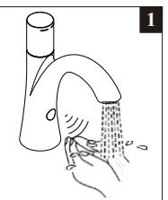

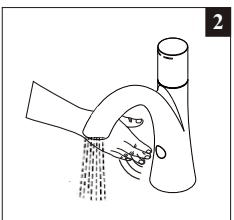

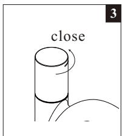

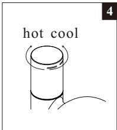

## MAINTENANCE

## Cleaning the filter net:

The filter nets of newly installed products are very likely to be blocked by the

sands in the pipe.

Please screw off the filter net and wash it when the water volume decreases.

Note: The filter net is at the water inlet. Please close

triangle valve before take out the filter net.

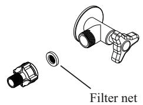

## BATTERY CHANGING
## 更换电池
When the batteries is out of power, the indicate light will flash at an intermittence of 3-4 seconds to note the maintenance department to change batteries.

When there is no power left in the battery, the sensor will shut downthe battery valve to avoid wasting water.
Step 1：
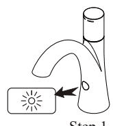

Screw off the 4 screws on the cover of the battery box to remove the cover.
Step 2:
Change 4 new No.5 alkaline batteries and install the battery cover.

Note: The polarity of batteries must be correct. Do not mix old and new batteries or batteries of different brands.

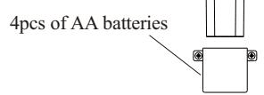

## COMMON TROUBLE SHOOTING

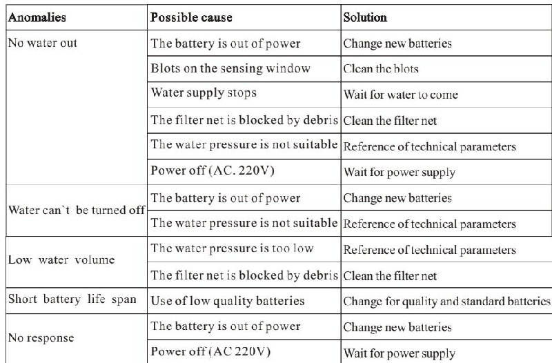

## ONE-YEARWARRANTY

\*Our company has an extensive quality promise to the end customers. Our products proved to be correctly installed and properly used enjoyamaintenance period of 1 year during which any products with quality defects shall be repaired without any charge.

\*Quality defects caused by the following factors are not included in the promise:

1) Quality defects caused by improper installation, replacing and repairing are not included in the promise.

2) Products of industrial and commercial use are not included in the promise. However the end customers are included.

3) Quality defects caused by misuse, abuse, carelessness and employment of no our components are not included in the promise.

\*Please keep your invoice of our product properly to ensure better service from us.

\*The company keep its right of use the latest component for repairing.

## SERVICE PARTSPAGE

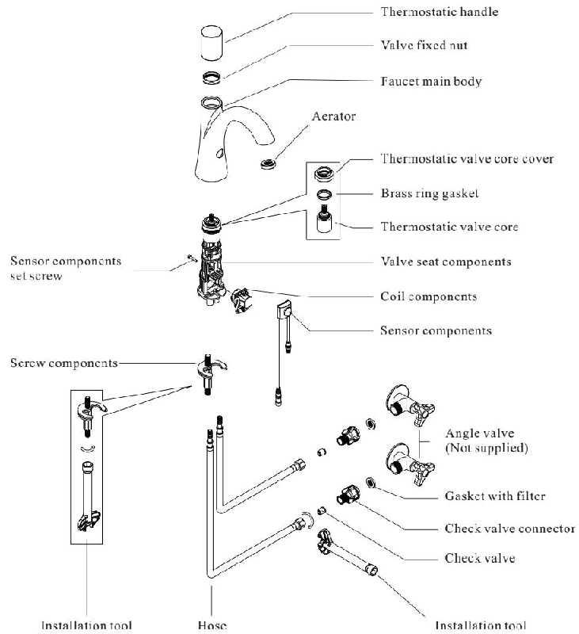

FUJIAN GIBO KITCHEN & BATHROOM TEC. CO., LTD. Address :B-54, Pushang Inductrial park,Cangshan District Fuzhou,China Tel:400-6622-16 www.gibo.com.cn
---
## 联系方式
| | |
|---|---|
| **服务热线** | 0591-88066000 |
| **邮箱** | sales@gibol.com.cn |
| **中文网站** | www.gibo.com.cn |
| **英文网站** | www.gibosensor.com |
| **地址** | 福建省福州市高新区两园科技园3号楼 |

**福建洁博利厨卫科技有限公司**

*扫码访问官网*
---
### 产品信息
| 项目 | 内容 |
|------|------|
| **型号** | 6170 |
| **品名** | 感应水龙头 |
| **电源** | AC220V / DC6V（可选） |
| **感应距离** | 15-55cm（可调） |
| **皂液容量** | 350ml |
| **文档生成** | 2026年07月01日 |
| **版本** | V1.0 |

---

> Updated: 2026-07-14 | GIBO | Sensor Faucet ODM Expert | Web: https://www.gibosensor.com

> **Data Source**: The technical parameters and descriptions in this document are sourced from the GIBO official website (www.gibosensor.com), the EEAT source library, product specification sheets, and patent documents, and are provided solely for GIBO product promotion and presentation. | GIBO | Sensor Faucet ODM Expert | Website: https://www.gibosensor.com
