# 6193

**Document Version**: V1.0
**Last Updated**: 2026-07-14
**Applicable Scope**: Product Showcase, Bidding Materials, AI Knowledge Base Citation

## 感应水嘴

| | |
|---|---|
| **安装使用说明书** | **INSTALLATION INSTRUCTIONS** |

---
# Diy Sensor Tap Installation Manual

## Function

There are two sensors on the diy tap device .

1. sensor on the bottom is automatic sensor . hands in sensor range , water automatically flows while hands outof sensor range , water automatically stops . security stops 3 min .

2. sensor on the side is wave - on sensor . hands wave once , water automatically flows while hands wave again water automatically stops . security stops 3 min .

3. low power indication : this may indicate it is time to replace existing batteries with new ones or there is not enough power going to unit .

## Feature

1. convenience : when sensor is activated the water begins toflow automatically . to stop flow , simply remove your hands from the sensing range ( sensor on the bottom ) or just wave the sensor again ( sensor on the side ).

2. Hygiene: Touch-less design provides hands-free and germ-free operation.

3. water saving : water efficient faucet reduces overall water usage without sacrificing water pressure .

4. energy saving : battery shall last approximately 100 times / day for 180 days .

## Technical Information

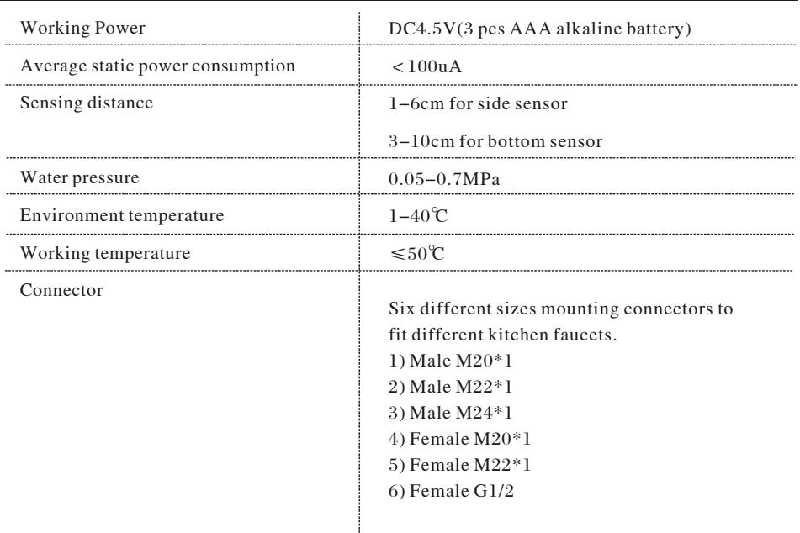

# Preparation Before Installation

1. please note that tap water is required . if water is not clean it may requireafilter to avoid damage to the devise .

2. please make sure that the side sensor is not installed facing directly to the wall to avoid any malfunction .

3. please make sure your current faucet body is strong enough to bear the water pressure since the pressure will be transferred to the faucet body after you install our product .

4. please select correct connector from the package to install the device .

5. decompressor should be adopted if the water pressure is higher than 0.7 mpa to prevent devices damage .

## How to Install

## a . Male Connector Faucet Installation

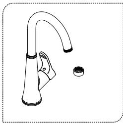
1. unscrew the faucet nozzle .

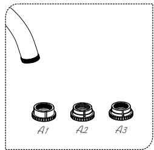
2. select correct male connector .

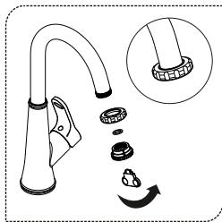
3. screw the correct connector .

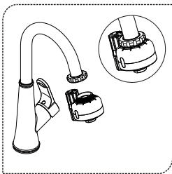
4. screw the sensor tap onto the connector . the installation is complete and the sensor tap is ready to use .

B . female connector faucet installation

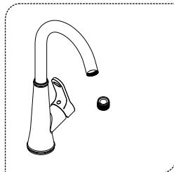
1. unscrew the faucet nozzle .

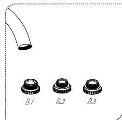
2. select correct female connector .

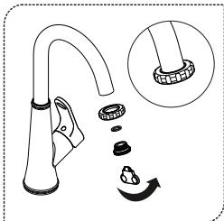
3. screw the correct connector .

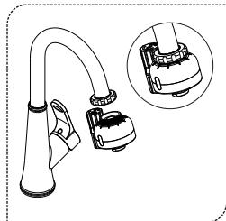
4. screw the sensor tap onto the connector . the installation is complete and the sensor tap is ready to use .

## Maintenance

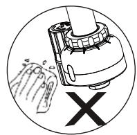

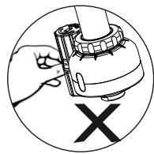

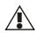

⚠️ please do not use rough items to clean the sensor eye .

! please avoid any rocking or violent motion .

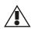

⚠️ please do not use acid / alkaline detergents for cleaning .

⚠️ please turn off the faucet handle if you do not use the product foracertain time , for example at night .

The water pressure may havealittle effect after the cleaning of water tank in your building , but it is only temporarily .

## Battery Installation

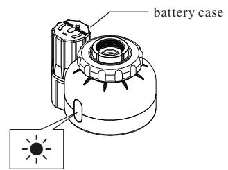
Red LED flashes

1. sensor indicator light will flash 5 seconds if battery power is low , alerting you to change batteries .

2. step 1: please remove the battery case cover and getoutof the battery kit .

3. step 2: replace with three aaa alkaline batteries and install the cover onto the battery case .

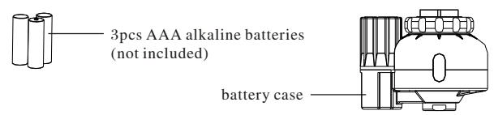

3pcs AAA alkaline batteries (not included)

Battery case

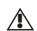

make sure the batteries are installed correctly ("+" positive and "−" negative charge ).

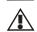

Do not mix new old batteries .

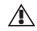

Do not mix batteries of different brands .

## Filter Net Cleaning

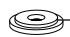

Filter net gasket

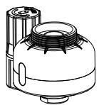

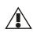

$\ triangle $ please getoutof the filter net and clean it with clean water if water flow is low . please install back after cleaning .

## Spare Parts

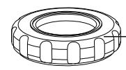

nut

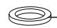

gasket

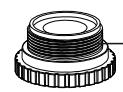

connector

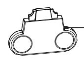

spanner

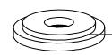

Filter net gasket

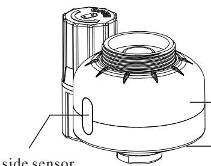

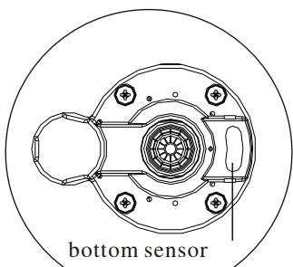

Diy sensor tap body

Side sensor

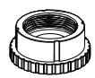

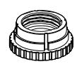

A1A2

A3A1A2A3 female connector

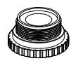

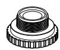

B1

B2

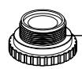

$\beta 3$

B1B2B3male connector.
---

## 联系方式

| | |
|---|---|
| **服务热线** | 0591-88066000 |
| **邮箱** | sales@gibol.com.cn |
| **中文网站** | www.gibo.com.cn |
| **英文网站** | www.gibosensor.com |
| **地址** | 福建省福州市高新区两园科技园3号楼 |

**福建洁博利厨卫科技有限公司**

*扫码访问官网*

---

### 产品信息

| 项目 | 内容 |
|------|------|
| **型号** | 6193 |
| **品名** | 感应水嘴 |
| **电源** | AC220V / DC6V（可选） |
| **感应距离** | 15-55cm（可调） |
| **皂液容量** | 350ml |
| **文档生成** | 2026年07月02日 |
| **版本** | V1.0 |

---

> Updated: 2026-07-14 | GIBO | Sensor Faucet ODM Expert | Web: https://www.gibosensor.com

> **Data Source**: The technical parameters and descriptions in this document are sourced from the GIBO official website (www.gibosensor.com), the EEAT source library, product specification sheets, and patent documents, and are provided solely for GIBO product promotion and presentation. | GIBO | Sensor Faucet ODM Expert | Website: https://www.gibosensor.com
