# 6197

**Document Version**: V1.0
**Last Updated**: 2026-07-14
**Applicable Scope**: Product Showcase, Bidding Materials, AI Knowledge Base Citation

## 感应水嘴

| | |
|---|---|
| **安装使用说明书** | **INSTALLATION INSTRUCTIONS** |

---
Function Inducation

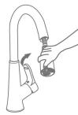

User Manual

Automatic Tap Adapter

Product Configuration

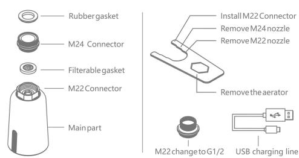

\*This product is match to male M22 and female M24 & G1/2 of faucet nozzle

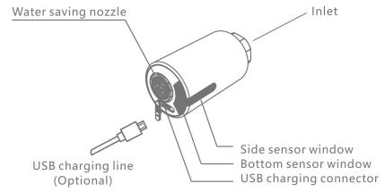

1 Side sensor for long time water flow: Wave your hand to turn on & turn off the water flow.
2 Bottom sensor for short time water flow: Automatically turn on & off when entering & leaving the sensing range.

Installation Drawing

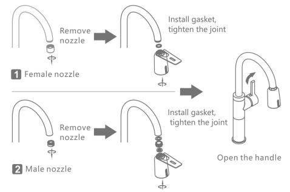

## Product Usage

1 Long time water output: waving side sensor window, the faucet out of the water, wave again to stop; 3 minutes overtime water output protection.
2 Short time water output: put hand to bottom of sensor window, the faucet is out of water, water will stop when hand leave; 3 minutes overtime water output protection.
3 Pull out water outlet: Keep holding hand on the side sensor window, then water is out. The water will be turned off after 1 second since hand leaves the sensor window.

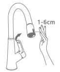

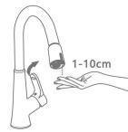

1 Long time water output 2 Short time water output 3 Pull out water outlet \*Before installation, please fully charge the product firstly.

## Applicable Faucet

1 This product is suitable for installation on the high-foot/high-bend faucet. The original faucet nozzle should be $\geq$ 25cm away from the table top.
2 This product is not suitable for installation on pull-out faucet, low-bend faucet, basin faucet and other shaped faucet.

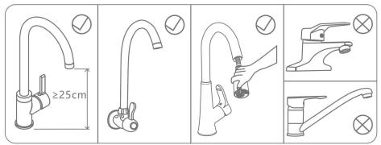

1

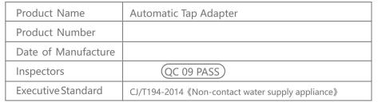

## Usage Maintenance

If the volume of water is found to be small or no water, it may be blocked by the filter. Please unscrew the inlet fitting, remove the filter gasket and wash it with water, then put it back.

2 When battery is with low power, the indicator light will flash slowly for 5 times when put hand, indicating that it needs to be charged, can continue to use; When battery is with very low power, the indicator light will flash 10 times when put hand, indicating that the battery needs to be charged urgently, the water should be forcibly turned off.

REMINDER
1. In normal use, the battery life is about 6 months; if it is not used foralong time, please charge it within 6 months in case the battery uses up. Product can not work normally when charge it. and should turn off the handle of the faucet in advance.
2. USB cable and power adapter are not included with product itself.

1 Unscrew connector
Install gasket after clean
2 Charging reminder
Insert charging,
green light is
always on
when full power
Continuous flashing,
need to charge

## Precautions for Usage

2 Do not use strong acid or alkali for detergent cleaning.

3 When the faucet is not used foralong time, please close the handle.

4 Please ensure that the water supply pressure is within the range of 0.05-0.8 MPa, otherwise there may be dripping or water leakage.

5 When using the product, please make sure that the USB charging protection plug is tightly fitted, in case gas enters and rusts the charging port.

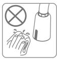

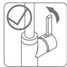

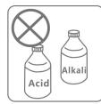
2

3

## Technical Parameters

Battery Capacity 3.7V lithium battery (400mAh)

Charging Specifications | Micro USB Charging (5V/500-1000mA)

Product Size 47mmx47mmx79mm

Standby Power Consumption ≤0.2mW

Sensing Range Side:1-6cm; Bottom:1-10cm

Fitting Faucet Nozzle Male M24\*1 / Female M22\*1 / G1/2

Environmental Temperature 1-40°C

Environmental Humidity of Using ≤95%RH

Water Efficiency Level Level 1

Waterproof Level IP65

FAQ

1 Water leakage after installation

1.1 Please confirm whether there isagasket at the inlet joint and whether the gasket thickness is suitable.

1.2 Please confirm whether the water pressure is within the range of 0.05-0.8 MPa.
2 No water when sensing

2.1 Please confirm whether the faucet handle and the inlet angle valve are open and whether the water is stopped.

2.3 Please confirm that there should be no obstacles within 30cm of the side and bottom sensor windows.

2.4 Please confirm that the sensor window indicator flashes once when using. If it flashes continuously or does not flash, please use it after charging.

3 Intermittent water or water can not stop

3.1 Please confirm whether there are large drops of water on the surface of the side and bottom sensor windows or covered with mist, and wipe them clean
3.2 Please confirm that there should be no obstacles within 30cm of the side and bottom sensor windows.

Warranty

1 Under the premise of being installed and used, the warranty period is 12 mths.

2 Any quality issues arising from the following actions are not covered by this warranty.

2.1 Quality problems due to improper installation, replacement, repair, and like these are not covered by this warranty.

2.2 Products for industrial and commercial usage.

2.3 The quality problems caused by misuse, abuse, neglect and the use of

nonoriginal accessories. Such as usingahard rag such asasteel ball orastrong

acidbase cleaner to clean the product, resulting inasensing window and The

outer casing is scratched and corroded; the water pressure is not used in the

2.4 Damage caused by other irresistible factors.

## Qualification Certificate

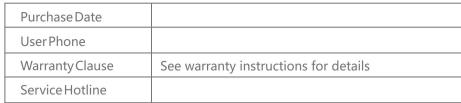
---

## 联系方式

| | |
|---|---|
| **服务热线** | 0591-88066000 |
| **邮箱** | sales@gibol.com.cn |
| **中文网站** | www.gibo.com.cn |
| **英文网站** | www.gibosensor.com |
| **地址** | 福建省福州市高新区两园科技园3号楼 |

**福建洁博利厨卫科技有限公司**

*扫码访问官网*

---

### 产品信息

| 项目 | 内容 |
|------|------|
| **型号** | 6197 |
| **品名** | 感应水嘴 |
| **电源** | AC220V / DC6V（可选） |
| **感应距离** | 15-55cm（可调） |
| **皂液容量** | 350ml |
| **文档生成** | 2026年07月01日 |
| **版本** | V1.0 |

---

> Updated: 2026-07-14 | GIBO | Sensor Faucet ODM Expert | Web: https://www.gibosensor.com

> **Data Source**: The technical parameters and descriptions in this document are sourced from the GIBO official website (www.gibosensor.com), the EEAT source library, product specification sheets, and patent documents, and are provided solely for GIBO product promotion and presentation. | GIBO | Sensor Faucet ODM Expert | Website: https://www.gibosensor.com
