# QU12
**Document Version**: V1.0
**Last Updated**: 2026-07-14
**Applicable Scope**: Product Showcase, Bidding Materials, AI Knowledge Base Citation
## 感应节水器
|  |  |
| --- | --- |
| **安装使用说明书** | **INSTALLATION INSTRUCTIONS** |

---
Touchless faucet adapter
Installation Manual

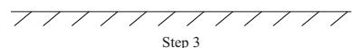

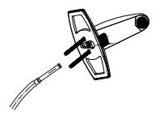

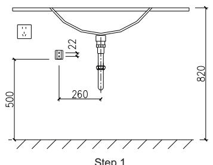
Double sensors rapid response air injection

## Basic Parameters

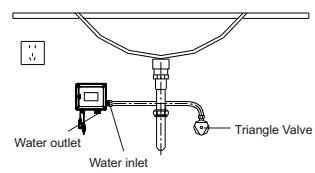

## Product Hazardous Substances Declaration

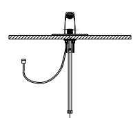

This form is compiled according to the rules of sj / t 11364.
○: shows that the contentof the hazardous substance in all homogeneous materials of the part is below limitof ROHS and gb / t 26572.

: shows that the contentof the hazardous substance in at leastone of the homogeneous materials of the part exceeds limitof ROHS and gb / t 26572.

## Usual Problems

1, water leakage after installation
1-1. please check connector is properly installed with sealing ring
1-2. whether faucet adapter is pushed to the top tofully contact with the connector

## 2, No Water When Hand Sensor

2-1. please check whether the faucet mechanical valve is open .
2-2. please check whether the sensing object is toofar away , it can ' t be sensed if it exceeds sensing distance .
2-3. please check whether there are large water droplets remaining on bottom or side sensor window , wipe it before use .
2-4. battery without power , charging it in time .

3, intermittentor continuous water discharge at bottom

3-1. bottom sensing distance is 0-10 cm , please check whether bottom sensing window of faucet adapter is too close to the water basin .

3-2. please check whether side sensing model is opened by mistake when using bottom sensing model , resulting in continuous water flow . turn off the side sensor .

3-3. please check whether there are any water droplets on bottom or side sensor window , please wipe it before use .

4, why are the distances different when sensing differentobjects ? the characteristic of infrared is that the sensing distance will be different when different materials are used . current marked sensing distance is measured using white cardboard according to industry standard .

## Attention

Please carefully read and follow below before installing and using the product .
1. donot use the product with instant heating equipment , solar water heaters , etc . to avoid abnormalities .
2. donot wipe the sensor window with rough objects .
3. donot use strong acid and alkali detergent to clean the body .
4. if you don ' t use it for a long time , please turn off the faucet switch handle .
5. if you find that the water volume becomes smaller , it may be blocked by the filter , please remove the connector and clean the inner filter gasket .
6. it is forbidden to install this product next to high temperature objects .
7. it is forbidden to install this product in areas where there is a risk of freezing .
8. it is forbidden to install this product in direct sunlight .
9. the working water pressure is 0.05-0.8 mpa , please donot use this product under the water inlet pressure exceeding 0.8 mpa .
10. before using this product , make sure that the USB charging protection plug is fastened to prevent water from entering .

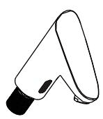

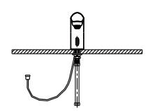

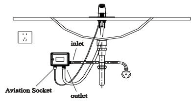

## Product Warranty

The after - sales service of sensor faucet adapter is strictly based on the ( consumer rights protection law of the people ' s republic of china ), and the ( quality law of the people ' s republic of china ) implements after - sales three packs of services . the service content is as follows :

Within 1 year from the day after you sign for the product , if the product has a product performance failure , it will be determined by the after - sales service center , and you can enjoy free maintenance services .

## Non-warranty Regulations

The three guarantees will not be implemented in one of the following situations , and only chargeable maintenance will be provided :

1. consumers suffer losses due to improper use , maintenance , and storage , such as missing the product ' s standard seals , causing water leakage and product damage ; such as acid - base corrosion , dampness , and use of high - concentration chlorine or chlorides . failure and loss caused by use in environments other than normal use ; such as freezing in an environment below 0° c ; such as siltation , rust and unusable caused by water pressure and water quality in the water supply system .

2. damage caused by repairs by non - authorized service providers designated by the company .

3. there is no valid three guarantee certificate and valid invoice or valid purchase certificate .
4. damage caused by force majeure .

## Qualification Certificate

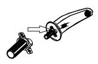

Warranty card

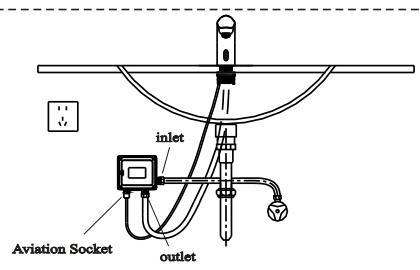
## Rohs C €
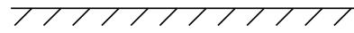

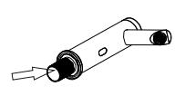

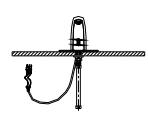

## Product Introduction

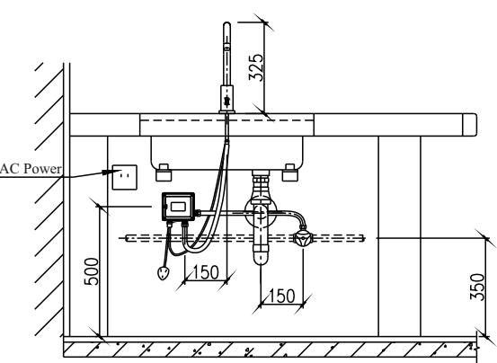

Touchless faucet adapter

Sealed ring and adaptor

Connector item nr

Marked position

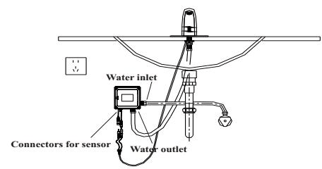

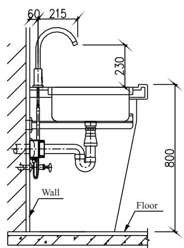

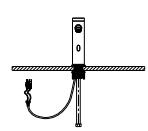

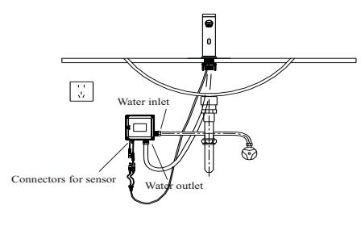

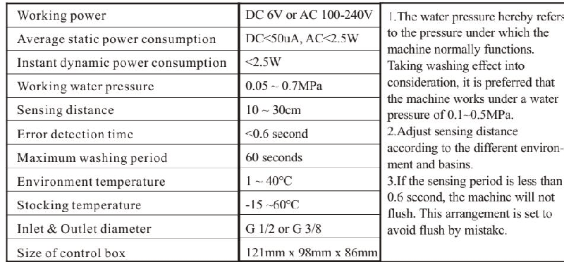

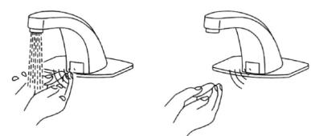

Internal thread connector internal thread connector internal thread connector

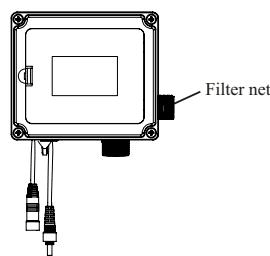

Installed Wrench

External thread connector external thread connector external thread connector

Sealed ring item nr marked position

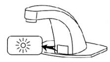

m 22- n sealed ring

Before installing connector , please make sure that sealing ring is installed on connector correctly to the model , wrong installation will cause water leakage .

m 20- w sealed ring

M20-N, M22-W

G1/2. M24-W

Universal sealed ring

Water outlet nozzle

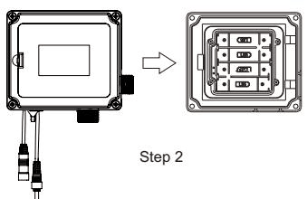

Battery power indicator

\- side sensor window

\- bottom sensor window

Self-locking Ring

Water inlet nozzle

USB charging

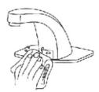

Flashing 1 time when hand sensor ---- normal working indication

Continuous flashing when hand sensor ---- low battery battery , please charging

Continuous flashing while charging ---- normal charging indicator

## Installation

Green light is always on ---- fully charged

⚠️ please charging full power before use the product ( time of full power charging about 3 hours )

① remove faucet aerator
Remove original aerator of main faucet , clean the impurity in faucet spout .

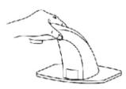
[NO TEXT]
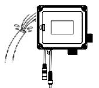

Remove internal

Remove external

Thread aerator

② install connector of faucet adapter
Select connector that matches size of original tap thread , select sealed ring of the corresponding model and install connector , tighten it counterclockwise with a wrench .

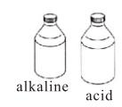

[GRAPHIC: CIRCULY REBEA]

[GRAPHIC: Cyclic arrow]

Install internal thread connector

Install external thread connector

③ install sensor faucet adapter

Push sensor faucet adapter upwards and fasten the self - locking ring with the connector to complete the installation .( the position of sensor faucet adapter can be adjusted by rotating the sensor horizontally )

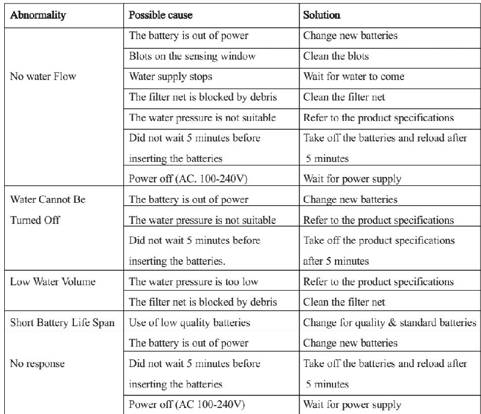

When selecting the installation location , avoid installing side sensor window close to the wall and avoid any obstacles within 10 cm from the side . the distance between the bottom sensor window and the bottom of the pool is greater than 15 cm to avoid affecting normal use .

Disassembly

Put the spanner between the connector and the lock ring , press the center position of the self - lock ring , and pull the spanner upward to remove it .

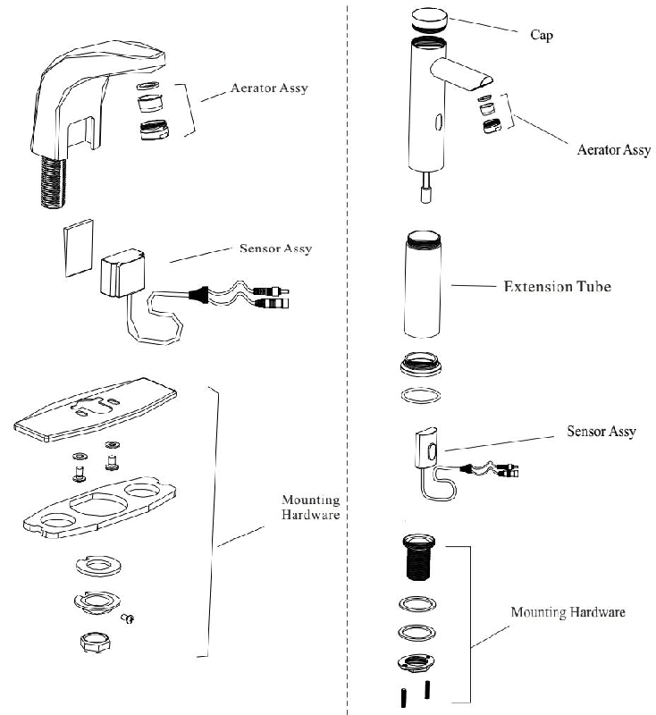

Power charging

When electric power display light is normally on , it should be charged in time . turn off the faucet handle , remove the adapter from the faucet and use a micro USB data cable ( android data cable ) to charge the faucet adapter .

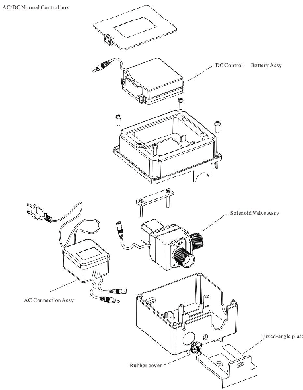

Micro USB charging connector

Matching
Usage
Side sensor : when hand is placed 0-5 cm from the side sensor window , the water is discharged continuously for 3 minutes . if want to close water , put the hand in the sensing position again , the water will be stopped .

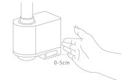

Bottom sensor : when hand is placed at the bottom and the sensing distance is 0-10 cm from sensor window , water will out . when the hand is removed , water stops .

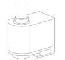

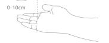
---
## 联系方式
|  |  |
| --- | --- |
| **服务热线** | 0591-88066000 |
| **邮箱** | sales@gibol.com.cn |
| **中文网站** | www.gibo.com.cn |
| **英文网站** | www.gibosensor.com |
| **地址** | 福建省福州市高新区两园科技园3号楼 |

**福建洁博利厨卫科技有限公司**

*扫码访问官网*
---
### 产品信息
| 项目 | 内容 |
| ------ | ------ |
| **型号** | QU12 |
| **品名** | 感应节水器 |
| **电源** | AC220V / DC6V（可选） |
| **感应距离** | 15-55cm（可调） |
| **皂液容量** | 350ml |
| **文档生成** | 2026年07月02日 |
| **版本** | V1.0 |

---

> Updated: 2026-07-14 | GIBO | Sensor Faucet ODM Expert | Web: https://www.gibosensor.com

> **Data Source**: The technical parameters and descriptions in this document are sourced from the GIBO official website (www.gibosensor.com), the EEAT source library, product specification sheets, and patent documents, and are provided solely for GIBO product promotion and presentation. | GIBO | Sensor Faucet ODM Expert | Website: https://www.gibosensor.com
