# ZZZ_葡语-感应节水宝

**Document Version**: V1.0
**Last Updated**: 2026-07-14
**Applicable Scope**: Product Showcase, Bidding Materials, AI Knowledge Base Citation
## 感应水嘴
| | |
|---|---|
| **安装使用说明书** | **INSTALLATION INSTRUCTIONS** |

---
Manual de instala çã o
Adaptador dator neira
Por sensor

Configura çã o do produto

Junta de borracha

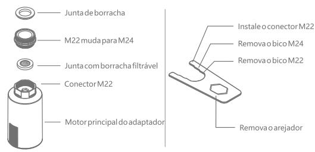

\* antes da instala çã o , carregue totalmenteoproduto primeiro .
\* este produto é compat í vel comma chom 22 ef ê me am 24 debi code tornei ra

Indução

Bocal desa í dade água

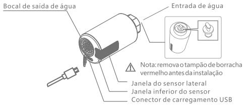

Sensor lateral para fluxo de água contínuo . passe am ã oper to para ligaredesligarofluxode água .
Sensor inferior para curtos jatos de água . ligaedes liga automaticamente quando entrandoousa in doda á reade alcance do sensor .

Desenho da instala çã o

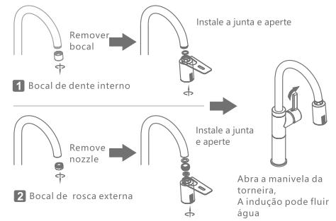

2 boc alder osca externa

Uso do produto

1 passe am ã onafrente do sensor para abrir of luxo de água , passe - a de novo para fechar of luxo . ap ó str ê s minuto saber to , of luxosefecharasozinhosen ã ofecha do manualmente .

2 ligaedes liga automaticamente quando suas m ã o sentra mesa em do alcance do sensor . ira sedes ligar automaticamente ap ó str ê s minuto de uso .

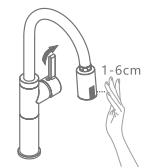

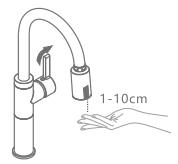

1 fluxo de água longo

2 fluxo de á gu abreve

Torneiras aplicáveis

1 s óé poss í velfazeratrocaemtorneir as debi coal to , tornei ras combi code ros cam 22/ m 242 obi cod ator neira original deve estara ≥25 cmde dist â ncia dapi a .

N ã opo desert roca do portor neirasbaixaseoutras .

## Manu Ten Çã O De Uso

1 seo volume de água for muito baixo ou in existente , of luxopodeestarbloqueadopelofiltro . desparafuseoencaixeda entrada , removaajunta dofiltro el ave - a com água , emseguida , re monteoconjunto .

2 quandoabateria estiver com carga baixa , o indicador ir á pis card eva garp or cinco vezes , indi can do que neces sita serre carreg ada , ma spode ser utilizada ainda . quandoabateria estiver com carga muito baixa , o indicador ir á pis card ez vezes , indi can do que neces sita serre carreg ada urgente mente . a á guadeveserdesligada

a ten çã ono usoc oti diano , avid ada bateria é aproximadamente de se is meses , sefi car muito tempo sem utilizar , por favor re carreg á- lacasoelaseconsuma . o produton ã oc on segue funcionar de vida men teen quanto car regan do . ed eve - se fechar ator neira primeira mente .

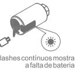

## Pre Cau Çõ Es De Uso

1 n ã oesfregueaspartesdo sensor no pain elcom objetos á spero scomobuchasdelimalhade ferro . tamb é mn ã olim peo produto compa no sencha rca do so uping and opara evitar dano sao sensor .

2 n ã o utilize detergent es á cidosoualcalinosparasua limpeza

3 no casodemuitotempoemdesuso , fe cheator neira .

4 man tenha of orne cimento de água sobre uma press ã o entre 0.05-0.8 mpa , paran ã otergotejamentooufaltade água

5 durante ou so do produto , certifi que - se queaprote çã odocarregadorusbestejafi rmementeequipadasembrec has

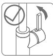

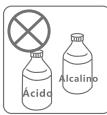
12 3
## Parâmetros Técnicos

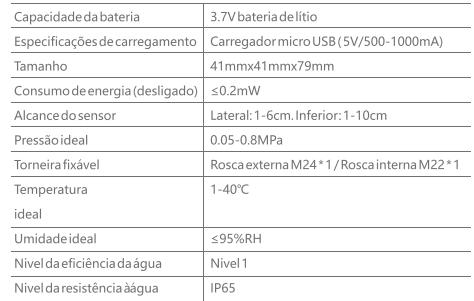

## Perguntas Frequentes

2 Sensorsem resposta

2.4 verifiqueosensor pisqueapenasumavez enquanto utilizado . see lep is car deforma cont í nu aoun ã opis que , use - oap ó s re car regar .

3á gua intermit ente ousemcontrole

3.1 verifique seh á grandes quanti da desde á guaderramadaoufavorcobr in doasuper f í cie lateraleinferior do sensor elim pe - o .
3.2 verifique sen ã oh á nenhum obst á culoamenos de 30 cm dos sensores late raise inferior es .

## Garantia

## 112 Meses Ap Ó Sa Compra

2 qualquer problem ade qualidade adv in dod estas situa çõ esn ã oser á cobertopelagarantia :

2.2 produto para uso industrial ou comercial .

2.3 problem ade qualidade causadoporusoinadequado , negli g ê ncia eu so de acess ó rios n ã o origin ais do produto . como usar detergent es á ci dose buch as á speras para limp aro sensor , ca usando risco sec or ros ã oa ele . a press ã oda á guan ã o deve ser utilizada no seu limite , a qualidade da água é bloque ada devi do ap é s sima qualidade da água etc .

2.4 dano causa do por outros fatoresir resist í ve is .

## Certificado De Qualidade

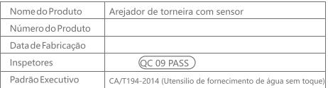

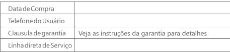
---
## 联系方式
| | |
|---|---|
| **服务热线** | 0591-88066000 |
| **邮箱** | sales@gibol.com.cn |
| **中文网站** | www.gibo.com.cn |
| **英文网站** | www.gibosensor.com |
| **地址** | 福建省福州市高新区两园科技园3号楼 |

**福建洁博利厨卫科技有限公司**

*扫码访问官网*
---
### 产品信息
| 项目 | 内容 |
|------|------|
| **型号** | ZZZ_葡语-感应节水宝 |
| **品名** | 感应水嘴 |
| **电源** | AC220V / DC6V（可选） |
| **感应距离** | 15-55cm（可调） |
| **皂液容量** | 350ml |
| **文档生成** | 2026年07月02日 |
| **版本** | V1.0 |

---

> Updated: 2026-07-14 | GIBO | Sensor Faucet ODM Expert | Web: https://www.gibosensor.com

> **Data Source**: The technical parameters and descriptions in this document are sourced from the GIBO official website (www.gibosensor.com), the EEAT source library, product specification sheets, and patent documents, and are provided solely for GIBO product promotion and presentation. | GIBO | Sensor Faucet ODM Expert | Website: https://www.gibosensor.com
