# 63068

**Document Version**: V1.0
**Last Updated**: 2026-07-14
**Applicable Scope**: Product Showcase, Bidding Materials, AI Knowledge Base Citation

## 感应大便器

| | |
|---|---|
| **安装使用说明书** | **INSTALLATION INSTRUCTIONS** |

---
日

# AUTOMATICTOILETFLUSHER

INSTALLATION INSTRUCTIONS

## BEFOREYOUBEGIN

● Please read theinstructions ca refully.

Pleasegive theinstructions to the end customer afterinstallation●

the shape and components of the product do not necessarily comply with the illumination which is only for your reference

Please purchaseAsuitable And usa ble con necter.●

It is recommended that the customerinvite professiona lsfor theinstallation.●

Get these tools at ha nd: adjusta ble wrench screwd rivers thread sea la nt pl iers electric● hammer and etc

The following pictures for yourreference do not necessa ri ly com ply with the prod ucts.● Please contact the seller if you haveAnyquestion related toinstallation

## PREPARATIONDESCRIPTION

1.Intelligent fl ush: the machine has Aintelligent control according to the use frequency And use period of theuri nalto save water

2.Water saving mode: Controlling the work mode accord ing to the frequency of useunde various circumstances to save water

3.Intelligent odor proof: When theuri nate is left unused forAlong ri me, the machine will activate

A fl ush every 24 hours to prevent the water in the trap fromdrying UP andgiving off odor 4.Low power ind ication: When there is not enough power to support normal fu nctioning theAutomaticind icator willind icate to change battery

## PRODUCTSPECIFICATIONS

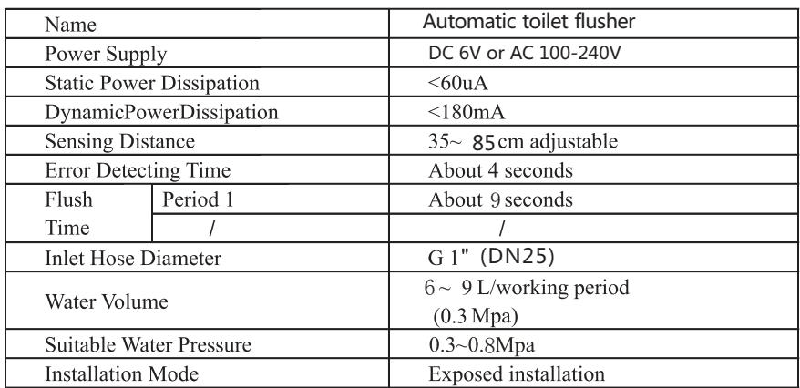
UNIT mm:

## PREPARATORYWORK

1.C heck whetherthe suPPlycha rgeis comp l ied with ratedspecificationbefore yourIN sta llatiON .

2. measure the installation position of the squat and flushing machine panel make sure the squat on the same 3 center line with the flushing machine 4 make sure the diameter of inlet must bigger than g1dn25

5. Pleaseopen the master va lve to clean the water way before IN stall i ng the product to avoid the bloc kag e.

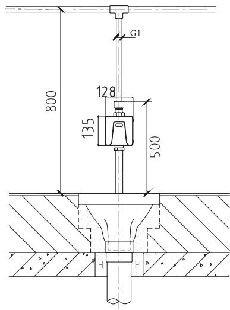

## INSTALLATIONDRAWING

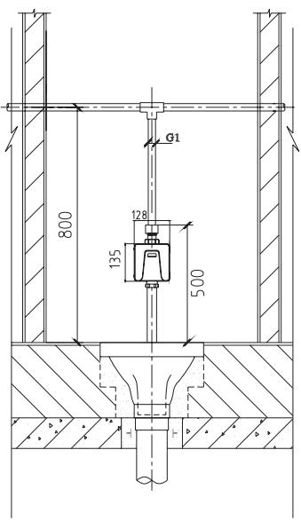

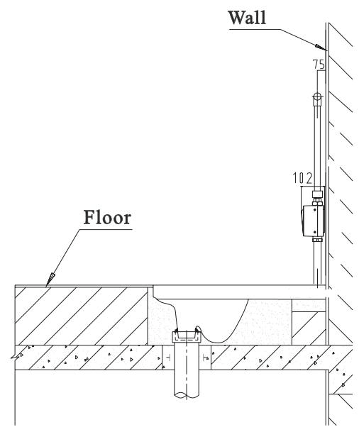

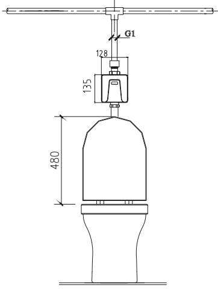

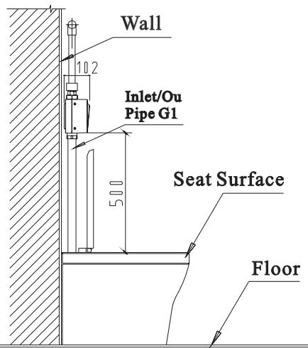

## NOTE

test run the water for the inlet pipe to ensure it is free of leakage

## USAGEEXPOSITION

1When someone enters sensingArea more than 4 seconds the machine actuates

2Auto fl ush is actuated 9 seconds after someone has used it

3When the sq uat is unused forAlong time the machine will activateAfl ush every 24 hou rs..

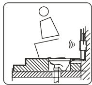

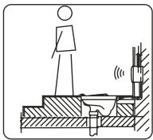

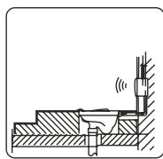

## MAINTENANCEINSTRUCTIONS

1 .If THE water volume IS not suitabl e foruse, pleaseAdjust topropervolume withAfl atbl A - descrewd river (tu rn UP the volume cl oc kwise And turndown the volume cou ntercl oc kwise) 2. CleanIN g THE filternet

If you need to clean the filter useAwrench rotati ng the va lve cover remove the piston filter Ri n se with the cleanwater

after THE re - IN sta llback Cleanthe filter befo reN OTE : the water suPPly va lve to be closed .

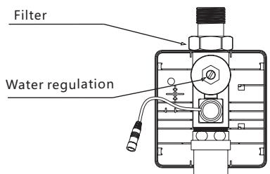

## CHANGEOFBATTERY

Take out the battery box from themo u nti ngAND IN se rt IN batteriesAcco rd IN g to hints ( ＋ － ) NOTE:

\*Th e po lArity of THE batteries ( ) nust be co rrect;＋ －

\* Do notmixol d And new batteries norbatteries ofdifferentbra nd s;

\* Pleasecha ngebatteries when theind icatelig ht keeps flAshingind icati ng the batteries do not have enough power. (Fo r DC currentproducts)

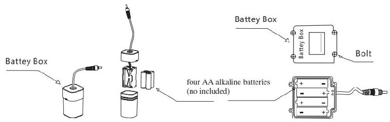

## NOTE

Please do not directly washit with water Use wet cloth to cleanit\* Do notcrush it or failure may be ca used .\* Do not cleanit with acid or Alka linedete rgents\*

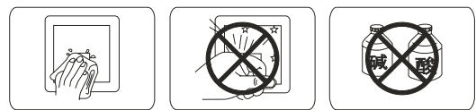

## COMMONTROUBLESHOOTING

if anything abnormal happens while using please refer to the following table and solve accordingly if the problem remains call the service number

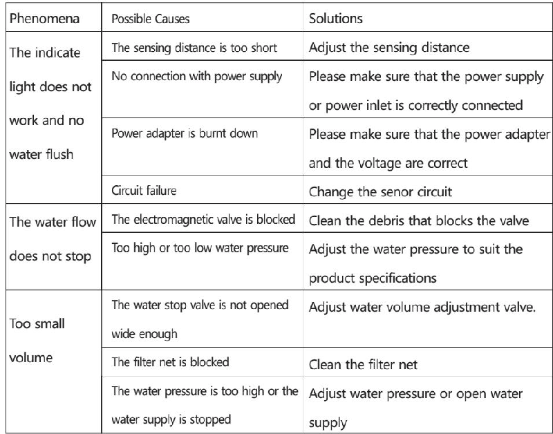

## SERVICEPARTSPAGE

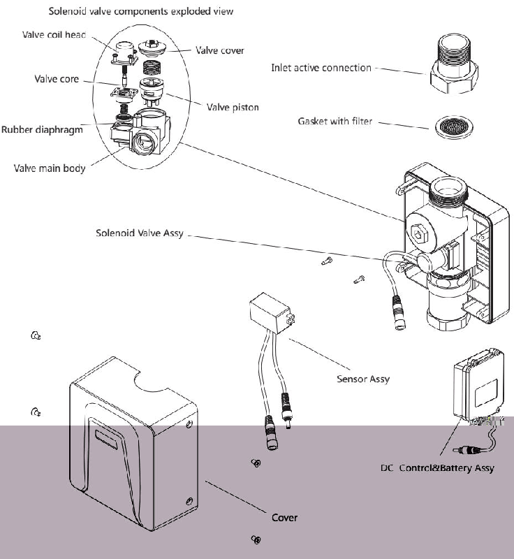

## B&CMODEL

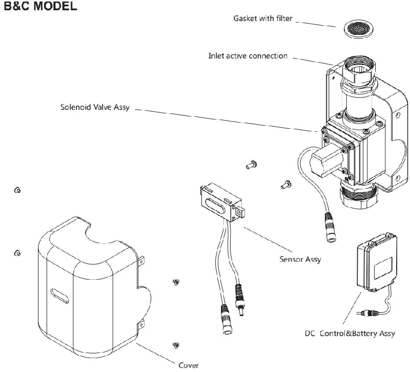

## ONE-YEARWARRANTY

\*Ou r company has Anextensive quAlityprom ise to the end cu sto mers. Our productsproved to be co rrectly IN sta lled Andprope rly usedenjoyAmainte na nce period of 1 year during whichAny products with quAlitydefectsshall be re paired withoutAnycha rg e \*Qu Alitydefects ca used by the following factorsAre notinclu d ed IN thepromise: 1) QuAlitydefects ca used byim p roperIN sta llation re placi ng And re pairingAre notinclu d ed IN theprom ise

2) Products ofindustrialAnd commercialuseAre notincl uded IN theprom iseHowever the end customersAreincl uded

3) QuAlitydefects ca used bymisu seA bu se ca rel ess ness And employment of no our compo nentsAre notincl uded IN theprom ise.

\* Please keep you rinvoice of our productpro perly to en sure better service fromus.

\*Th e company keep its right of use thelatest compo nent for re pairing .

## INSTALLATIONDRAWINGFOR B&CMODEL

UNIT : mm

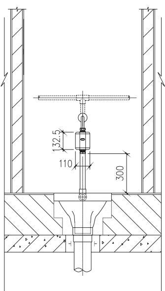

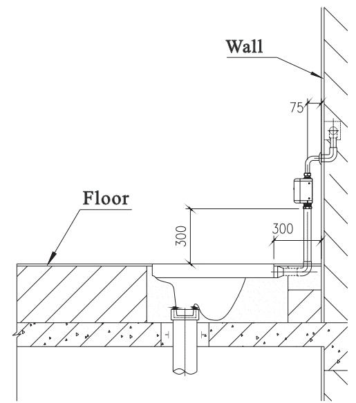
---

## 联系方式

| | |
|---|---|
| **服务热线** | 0591-88066000 |
| **邮箱** | sales@gibol.com.cn |
| **中文网站** | www.gibo.com.cn |
| **英文网站** | www.gibosensor.com |
| **地址** | 福建省福州市高新区两园科技园3号楼 |

**福建洁博利厨卫科技有限公司**

*扫码访问官网*

---

### 产品信息

| 项目 | 内容 |
|------|------|
| **型号** | 63068 |
| **品名** | 感应大便器 |
| **电源** | AC220V / DC6V（可选） |
| **感应距离** | 15-55cm（可调） |
| **皂液容量** | 350ml |
| **文档生成** | 2026年07月01日 |
| **版本** | V1.0 |

---

> Updated: 2026-07-14 | GIBO | Sensor Faucet ODM Expert | Web: https://www.gibosensor.com

> **Data Source**: The technical parameters and descriptions in this document are sourced from the GIBO official website (www.gibosensor.com), the EEAT source library, product specification sheets, and patent documents, and are provided solely for GIBO product promotion and presentation. | GIBO | Sensor Faucet ODM Expert | Website: https://www.gibosensor.com
