# 64106

**Document Version**: V1.0
**Last Updated**: 2026-07-14
**Applicable Scope**: Product Showcase, Bidding Materials, AI Knowledge Base Citation

## 感应大便器

| | |
|---|---|
| **安装使用说明书** | **INSTALLATION INSTRUCTIONS** |

---
## SENSORSHOWER

## INSTALLATIONINSTRUCTIONS

## PREPARATORYWORK

1.C heck whether the suPPly charge is comp l ied with ratedspecificationbefore yourIN sta llati ON .

2 M ea sure the IN sta llation positionof the And pa nelshower em bedded box make sure the ON the3 s hower head same centerline with the em bedded box 4 make sure thedia meter of IN l et must bigge r than G 1/2 " (D N 15) 5 Pleaseopen the master va lve to clean the water way before IN stall i ng the product to avoid the blockag e.

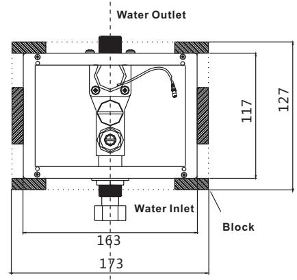
Embedded dimens i on

## IN STAL LATIONSTEPPANELINSTALLATION

1 Fix construction protection cover onto pre la id electron ic box- .

2 C learthe wall And ti le the wall as shown IN the f1gure make sure the ti les pa rallel. with the construction protection cover And the wall is closely attachedAround the cover after f1 n IS h IN g the wall .

3 Remove construction protection cover after the wall is finished And connect the ower su pply. Connect the power terminalwith solenoid va lve And fix the pa nel onto the pre la id electron ic box-

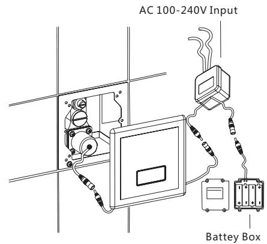

## BEFOREYOUBEGIN

● Please read theinstructions ca refully.

Pleasegive theinstructions to the end customer afterinstallation.●

the shape and components of the product do not necessarily comply with the illumination which is only for your reference

Please purchaseAsuitable And usa ble con necter.●

It is recommended that the customerinvite professiona lsfor theinstallation.●

Get these tools at ha nd: adjusta ble wrench screwd rivers thread sea la nt pl iers electric● hammer And etc.

The following pictures for yourreference do not necessa ri ly com ply with the prod ucts. Please● contact the seller if you haveAnyquestion related toinstallation

## PREPARATIONDESCRIPTION

1.automatic shower actuated and stopped automatically responding to the infrared signal 2 intelligent adjustment adjust the automatic adjustment distance by remote

3 .Ti me-d el ay water closing : When the bodyleaves the sensor range of theshower there will be 3 second sdel ay before the water closed to avoid theinterm ittent work

4. Low powerind icatio n : Indicate batterycha ngingAuto matically when the power of it IS not enough to support no rmalfunctioning of the mac hine.

5 .AC&DC adApta bility: can work with AC&DC currency at the same time And can switch between AC&DC cu rrency.

## FEATURESOFTHEPRODUCT

1. convenience automatically open and close water supply needless of manual operation

2. hygiene no need to touch any switch or parts ensuring your health

3. Water saving : Stretchthe body to actuate And withdraw to sto p.

Activate IN sta nt lyON se nsIN g to save wate r.

4. E ne rgy saving : Powered by 4 N o. 5 Alka line batte ries, the machine can work withoutcha nging batteries atAfrequency of 3000 ti mes/mo nth for 1. 5 yea rs.

## TO FIX THE PRE LAIDBOX-

1. place pre laid box into pre laid hole with the outlet facing upwards

2. lay the inlet pipe and outlet pipe into the inlet and outlet of the embedded box and locknuts make sure the outlet rests on the same center line with the shower 3 insert the power cord through the electric hole of the pre laid box and connect it with the power supply of the sensor

4. Level the bo rd eri ngArea of thepre lAid box with studsAnd make sure thepre lAid- - box pa ra llel with theground .

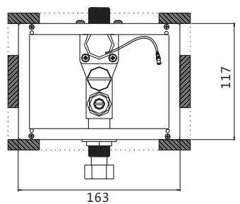
Size A

UNIT mm:

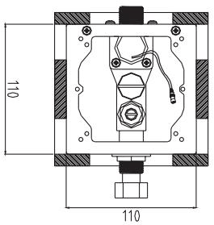
Size B

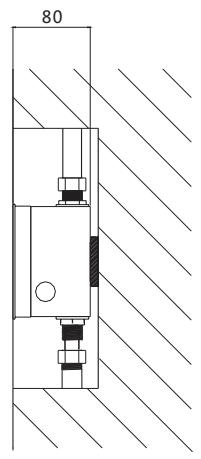
Size A

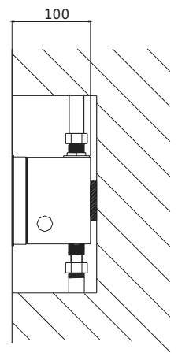
Size B

## NOTE

\*Test run the water for the IN l et pipe to ensure it IS free oflea kage .

## MAINTENANCEINSTRUCTIONS

1 .If THE water volume IS not suitabl e foruse, pleaseAdjust topropervolume withAfl atbl A - descrewd river (tu rn UP the volume cl oc kwise And turndown the volume cou ntercl oc kwise) 2. CleanIN g THE filternet

If youneed to cleanthe fi lte r, useAwrench rotati ngthe va lve cove r, remove the pistonfilter Ri n se with the cleanwater after the re - IN sta llback

N OTE : Cleanthe filter before the water suPPly va lve to be closed .

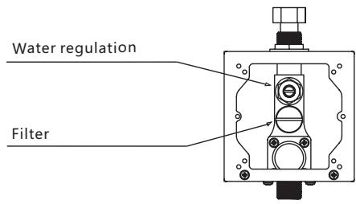

## CHANGEOFBATTERY

Take out the battery box from the mounting And IN sert IN batteries according to hints ( ＋ － ) NOTE:

\*Th e po lArity of the batteries ( ) nust be co rrect;＋ －

\* Do notmixol d And new batteries norbatteries ofdifferentbra nd s;

\* Pleasecha ngebatteries when theind icatelig ht keeps flAshingind icati ng the batteries do not have enough power. (Fo r DC currentproducts)

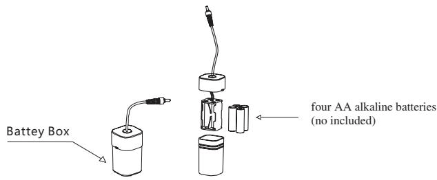

## NOTE

Please do not directly washit with water Use wet cloth to cleanit\* Do notcrush it or failure may be caused\* Do not cleanit with acid or Alka linedete rgents.\*

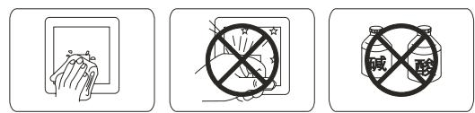

UNIT : mm

The senso rlet out water when the body reaches sensi ngArea .

The sensorstops the water fl ow when the bodyleaves the sensi ngArea .

## TECHNICALSTATISTICS

## IN STAL LATIONSTEP

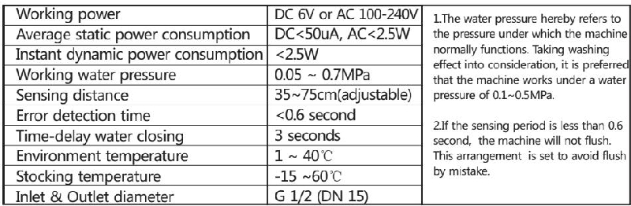

## COMMONTROUBLESHOOTING

if anything abnormal happens while using please refer to the following table and solve accordingly if the problem remains call the service number

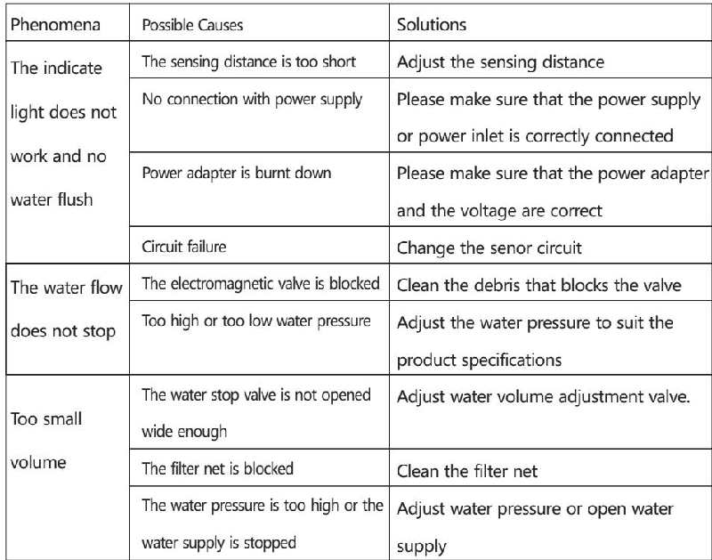

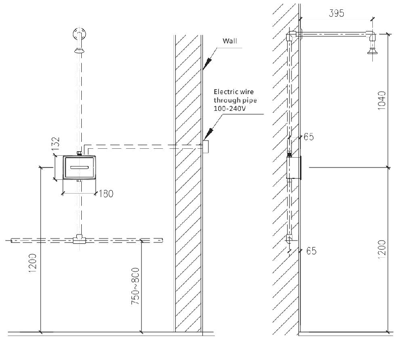

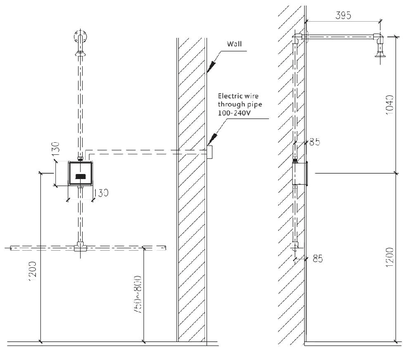
UNIT : mm

## ONE-YEARWARRANTY

\*Ou r company has Anextensive quAlityprom ise to the end customers Our productsproved to be co rrectly IN sta lled Andpro perly used enjoyAmaintena nce period of 1 year during whichAny products with quAlitydefectsshall be re paired withoutAnycha rg e. \*Qu Alitydefects ca used by the following factorsAre notinclu d ed IN thepromise: 1) QuAlitydefects ca used byim p roperIN sta llation re placi ng And re pairingAre notinclu d ed IN theprom ise

2) Products ofindustrialAnd commercialuseAre notincl uded IN theprom iseHowever the end customersAreincl uded

3) QuAlitydefects ca used bymisu seA bu se ca rel ess ness And employment of no our compo nentsAre notincl uded IN theprom ise

please keep your invoice of our product properly to ensure better service from us

\*The company keep its right of use thelatest compo nent for repairing .
---

## 联系方式

| | |
|---|---|
| **服务热线** | 0591-88066000 |
| **邮箱** | sales@gibol.com.cn |
| **中文网站** | www.gibo.com.cn |
| **英文网站** | www.gibosensor.com |
| **地址** | 福建省福州市高新区两园科技园3号楼 |

**福建洁博利厨卫科技有限公司**

*扫码访问官网*

---

### 产品信息

| 项目 | 内容 |
|------|------|
| **型号** | 64106 |
| **品名** | 感应大便器 |
| **电源** | AC220V / DC6V（可选） |
| **感应距离** | 15-55cm（可调） |
| **皂液容量** | 350ml |
| **文档生成** | 2026年07月01日 |
| **版本** | V1.0 |

---

> Updated: 2026-07-14 | GIBO | Sensor Faucet ODM Expert | Web: https://www.gibosensor.com

> **Data Source**: The technical parameters and descriptions in this document are sourced from the GIBO official website (www.gibosensor.com), the EEAT source library, product specification sheets, and patent documents, and are provided solely for GIBO product promotion and presentation. | GIBO | Sensor Faucet ODM Expert | Website: https://www.gibosensor.com
