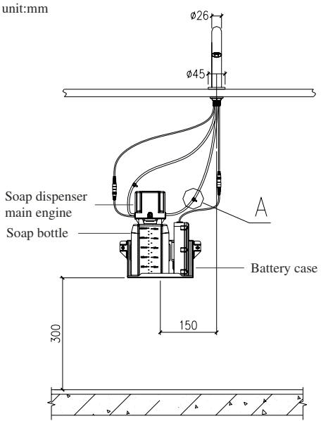
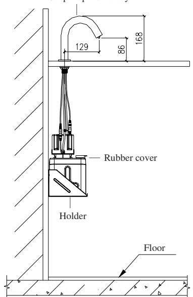
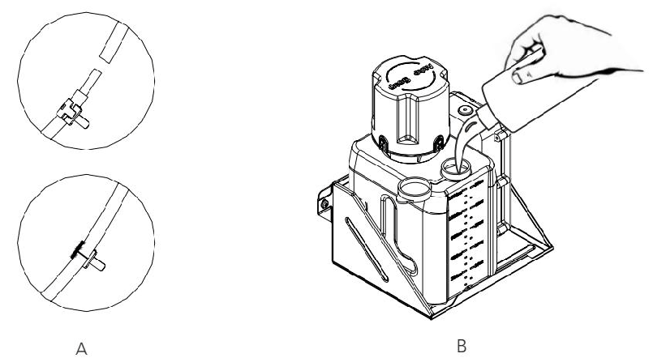
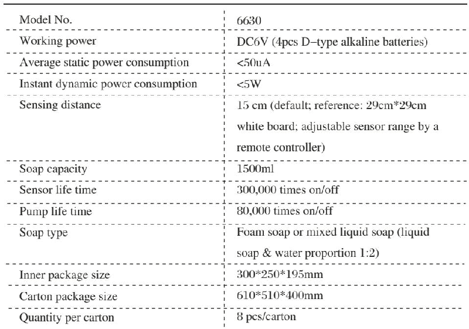
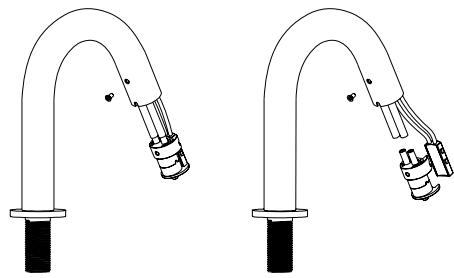
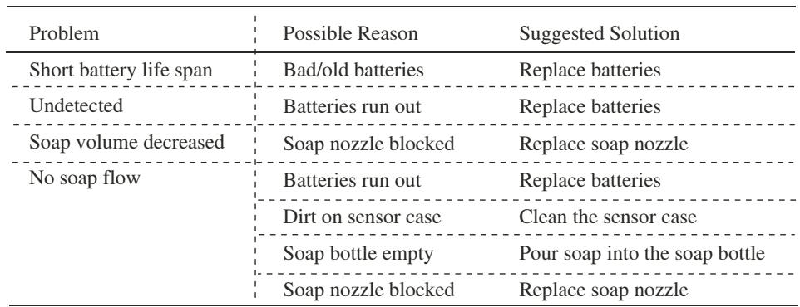

# 6630

**Document Version**: V1.0
**Last Updated**: 2026-07-14
**Applicable Scope**: Product Showcase, Bidding Materials, AI Knowledge Base Citation

## 感应洗手机

| | |
|---|---|
| **安装使用说明书** | **INSTALLATION INSTRUCTIONS** |

---
## Note Before Installation

1. Please read the instructions carefully .

2. the sketch map is only for reference . product appearance and accessories may differ from illustrations in manual

3. although the installation is simple it should be done byalicensed plumber 4. the following are needed for proper installations : screwdriver , electronic hammer , etc .

## Installation Notes

1. please note that foam soap or mixed liquid soap is required ( liquid soap & water proportion 1:2).

2. unit ' s infrared sensor may not work properly if unit is installed nearareflective surface or if it is facing bright lights

## Installation Instructions

## Step 1: Install Soap Dispenser Body .

Remove the soap dispenser from the package and unscrew the fixing nut and gaskets fix the soap dispenser onto the basin with the fixing nut and gaskets .

## Step 2: Install Holder

Drill two holes on the wall according to the holder fixing holes ' size put expansion screws into the hole and fix the holder that holds the both the soap bottle and battery case to the inside of the cabinet wall .

Step 3: install soap dispenser main engine

Connect the main engine and the soap bottle .

## Step 4: Install Batteries

Insert four d - type alkaline batteries into the battery case in the proper order . place the battery case next to the soap bottle on the holder . batteries are excluded . step 5: connect soap hoses .

Connect soap hose to the dispenser soap hose ( transparent hose to transparent hose & blue hose to blue hose ).

Step 6: pour soap .

Pour foam soap or mixed liquid soap into the soap bottle and cover the rubber cover . step 7: wire connection

Connect battery case cable to the soap dispenser power cable ( red color ). connect pump cable to the soap dispenser cable ( black color ).

Installation finished and the soap dispenser is ready to use .

## Note:

1. priming soap dispenser for first time use : swipe your hands five to eight (5-8) times across the sensor to prime the dispenser until soap dispensed the soap dispenser is now primed and will dispense soap as the dispense - time set .

2. please make sure no any impurities in the soap .

3. please shake up the mixed liquid soap before put it into usage .

Soap dispenser body

## I Nstructions

1. soap dispenser automatically supplies foam soap as the dispense - time set as soon as hands in sensor range

2. soap dispenser automatically stops working if hands outof sensor range .3. sensor distance and soap volume adjustable byaremote controller .

## Remote Controller Instruction

1) press button "1" one time the sensor range lengthens by 1-2 cm 2) press button "2" one time , the sensor range shortens by 1-2 cm 3) press button "3" one time , the soap dispense time lengthens by 1 s 4) press button "4" one time the sensor range shortens by 1 s

4. low power indication : soap dispenser sensor flash to indicate that it is time to replace existing batteries with new ones if there is not enough power going to the unit . no soap dispensed at this time if hands in the sensor range .

5. four d - type alkaline batteries shall last approximately 3000 times / month for 6 months .6. it is suggested cleaning the soap hoses with clean tap water if you will not use the soap dispenser for more than 1 week how to clean : please pour clean tap water into the soap bottle and sense the soap dispenser until the tap water dispensed

## Technical Information

## Maintenance

1. do not immerse soap dispenser in water . please use damp towel or cotton cloth to wipe gently .

2. please avoid any rocking or violent motion .

3. please do not use acid / alkaline detergents for cleaning .

## Soap Aerator Installation

Step 1: use screwdriver to take out soap aerators crew . disconnect soap hoses and ir sensor from the soap aerator and get itout from the faucet body .

Step 2: replaceanew soap aerator connect two soap hoses and fix their sensor to the soap aerator . take back the soap aerator to the faucet body .

Step 3: fix the soap aerator to the faucet body with the screw . replacement finished .

## Battery Installation

1. indicator light will flash if battery power is low , alerting you to change batteries .

2. do not worry : if battery power runs out the sensor will shut off and soap will not dispensed .

Step : please unscrew the battery screws and remove the battery case cover .1 step : replace with four pieces d - type alkaline batteries and reinsert the screws 2 back into the battery case

Note : make sure the batteries are installed correctly ("+" positive and "-" negative charge ) do not mix new old batteries do not mix batteries of different brands .

## Troubleshooting

## One-year Warranty

1. the faucet hasalimited one year warranty if the faucet is properly installed and used . but quality problems due to incorrect installation replacement repair or similar improper actions are excluded .

2. original receipt is required for proof of purchase as warranty is one year from date of original purchase .
---

## 联系方式

| | |
|---|---|
| **服务热线** | 0591-88066000 |
| **邮箱** | sales@gibol.com.cn |
| **中文网站** | www.gibo.com.cn |
| **英文网站** | www.gibosensor.com |
| **地址** | 福建省福州市高新区两园科技园3号楼 |

**福建洁博利厨卫科技有限公司**

*扫码访问官网*

---

### 产品信息

| 项目 | 内容 |
|------|------|
| **型号** | 6630 |
| **品名** | 感应洗手机 |
| **电源** | AC220V / DC6V（可选） |
| **感应距离** | 15-55cm（可调） |
| **皂液容量** | 350ml |
| **文档生成** | 2026年07月01日 |
| **版本** | V1.0 |

---

> Updated: 2026-07-14 | GIBO | Sensor Faucet ODM Expert | Web: https://www.gibosensor.com

> **Data Source**: The technical parameters and descriptions in this document are sourced from the GIBO official website (www.gibosensor.com), the EEAT source library, product specification sheets, and patent documents, and are provided solely for GIBO product promotion and presentation. | GIBO | Sensor Faucet ODM Expert | Website: https://www.gibosensor.com
