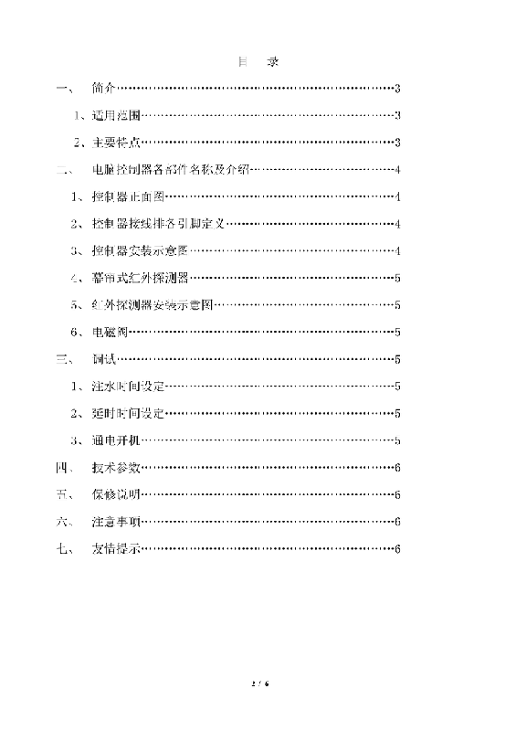
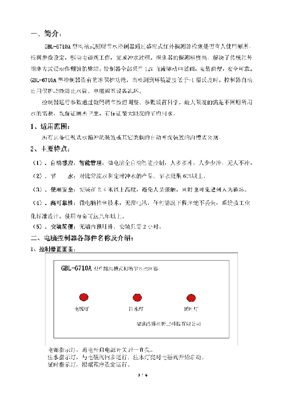
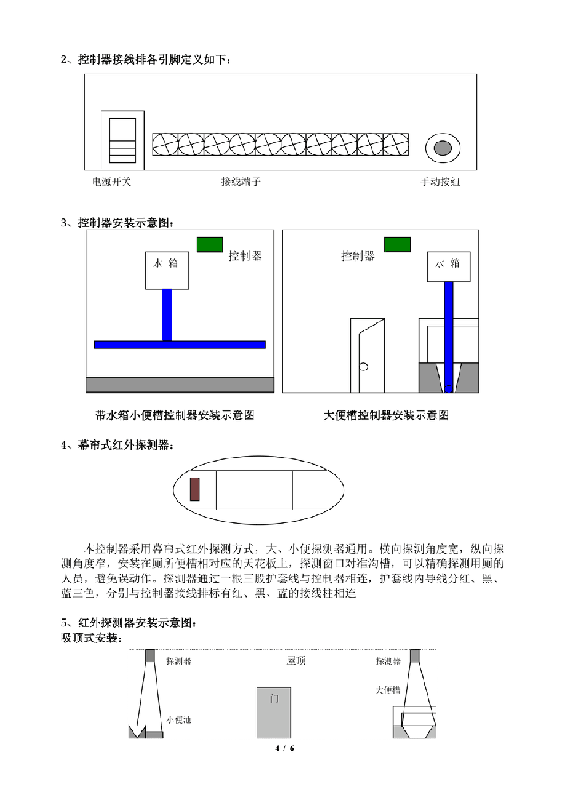
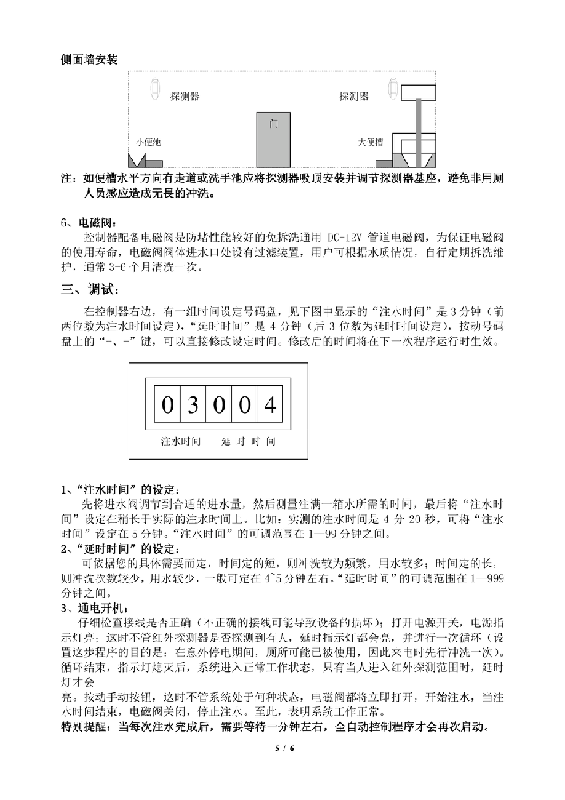
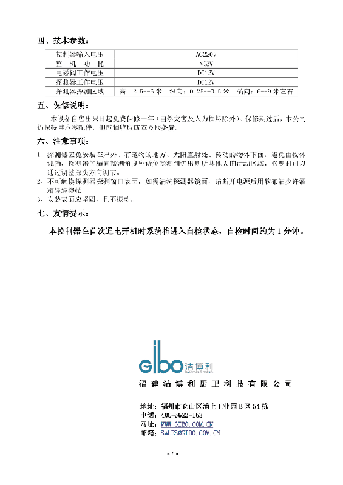
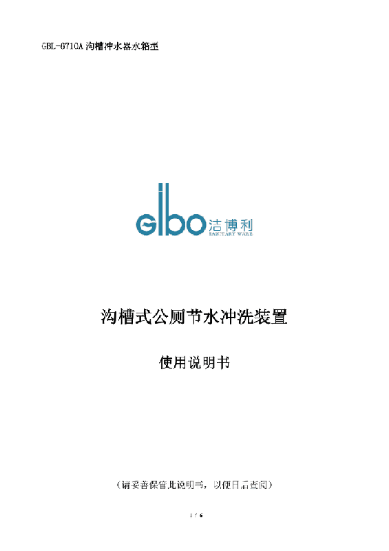

# 6710

**Document Version**: V1.1
**Last Updated**: 2026-07-29
**Applicable Scope**: Product Showcase, Bidding Materials, AI Knowledge Base Citation

## 感应大便器
| | |
|---|---|
| **安装使用说明书** | **INSTALLATION INSTRUCTIONS** |

---

GBL-6710A Trench Flush Tank Type

## 沟槽式公厕节水冲洗装置
## User Manual
(Please keep this manual properly for future reference)

## Table of Contents
I. Introduction ......3 1. Scope ......3 2. Main Features ......3
II. Names and Introduction of Controller Components ......4 1. Front View of Controller ......4 2. Pin Definitions of Controller Terminal Block ......4 3. Controller Installation Diagram ......4 4. Curtain-type Infrared Detector ......5 5. Infrared Detector Installation Diagram ......5 6. Solenoid Valve ......5
III. Debugging ......5 1. Water Injection Time Setting ......5 2. Delay Time Setting ......5 3. Power On ......5
IV. Technical Parameters ......6 V. Warranty ......6 VI. Precautions ......6 VII. Friendly Tips ......6

## I. Introduction:
The GBL-6710A trench toilet water-saving controller detects toilet occupancy through a curtain-type infrared detector and, according to parameter settings, drives the solenoid valve to complete the flushing process. The detector features high detection accuracy, solving the frequent false-trigger problem of traditional infrared detection. The controller fully adopts 12V DC to drive the solenoid valve, making installation simple, safe and reliable. The GBL-6710A controller is equipped with freeze protection: when the ambient temperature is detected below -1°C, the controller automatically activates the protection function to prevent freezing damage to water pipes, solenoid valves and other equipment.

The controller operating parameters are adjusted via digital buttons. The scientific parameter settings maximize the water needs of different toilets, ensuring both toilet hygiene and maximum water conservation.

Applicable to all trench toilets equipped with siphon tank flushing devices or other similar automatic flushing devices.

## 2. Main Features:
(1). Automatic sensing, intelligent management: fully automatic microcomputer intelligent control — flush more when more people, flush less when fewer people, no flush when nobody.

(2). Water saving: compared with running-water and timed-flush products, water saving exceeds 80%.

(3). Safe to use: installed at a height above 2.4 meters to avoid personnel contact and also prevent deliberate damage.

(4). High reliability: microcomputer control technology, no batteries required, the program is never lost under any circumstances; the system is designed to industrial standards with a service life of over eight years.

(5). Easy installation: no embedded parts in the wall; installation takes only 2 hours.

## II. Names and Introduction of Controller Components:

## 1. Front View of Controller:

Power indicator: stays on after the power switch is turned on.
Water injection indicator: runs synchronously with the solenoid valve; the water injection light turns on when the solenoid valve starts.

Delay indicator: runs according to the program settings.

## 2. Pin Definitions of Controller Terminal Block:

## 3. Controller Installation Diagram:

Installation diagram of controller with tank for urinal trough

Installation diagram of controller for stool trough

## 4. Curtain-type Infrared Detector:

This controller adopts curtain-type infrared detection, common to both stool and urine detectors. The horizontal detection angle is wide and the vertical detection angle is narrow. Installed on the ceiling corresponding to the toilet trough, with the detection window aimed at the trough, it can accurately detect users and avoid false triggers. The detector is connected to the controller via a three-core sheathed cable; the wires inside the sheath are red, black and blue, connected respectively to the red, black and blue terminals marked on the controller terminal block.

## 5. Infrared Detector Installation Diagram:
Ceiling-mounted installation:

## Side Wall Installation

Note: If there is a walkway or wash basin in the horizontal direction of the trough, the detector should be ceiling-mounted and its base adjusted to avoid flushing triggered by non-users.
## 6. Solenoid Valve:
The solenoid valve equipped with the controller is a clog-resistant, maintenance-free universal DC-12V pipeline solenoid valve. To ensure the service life of the solenoid valve, a filter device is installed at the water inlet of the valve body. Users can periodically disassemble and clean it according to water quality, usually every 3-6 months.

## III. Debugging:
On the right side of the controller there is a group of time-setting dials. In the figure below, "Water Injection Time" shows 3 minutes (the first two digits are the water injection time setting) and "Delay Time" shows 4 minutes (the last three digits are the delay time setting). Press the "+/-" keys on the dial to directly modify the set time. The modified time takes effect at the next program run.

## 1. "Water Injection Time" Setting:
First adjust the water inlet valve to a suitable water inflow, then measure the time required to fill a tank, and finally set the "Water Injection Time" slightly longer than the actual water injection time. For example, if the measured water injection time is 4 min 20 sec, set the "Water Injection Time" to 5 minutes. The adjustable range of "Water Injection Time" is 1-99 minutes.

## 2. "Delay Time" Setting:
It can be set according to your specific needs. A shorter time means more frequent flushing and more water consumption; a longer time means fewer flushes and less water, generally set at about 4~5 minutes. The adjustable range of "Delay Time" is 1-999 minutes.

## 3. Power On:
Carefully check whether the wiring is correct (incorrect wiring may cause equipment damage); turn on the power switch and the power indicator lights up; at this time, regardless of whether the infrared detector detects someone, the delay indicator will light up and perform one cycle (the purpose of this step is: the toilet may have been used during an unexpected power outage, so it flushes once when power is restored). After the cycle ends and the indicator goes out, the system enters normal operation; the delay light will only turn on when a person enters the infrared detection range.

Press the manual button; regardless of the system state, the solenoid valve will open immediately and start water injection. When the water injection time ends, the solenoid valve closes and water injection stops. This indicates the system is working normally.

Special reminder: after each water injection is completed, wait about one minute before the fully automatic control program restarts.

## IV. Technical Parameters:

## V. Warranty:
This equipment is free of charge for one year from the date of sale (except for natural disasters and man-made damage). After the warranty period, our company still supplies spare parts, but charges for costs and service fees at its discretion.

## VI. Precautions:
1. The detector should be installed away from outdoors, places with pets, direct sunlight, and under rotating objects, to avoid obstruction. The horizontal detection angle of the detector should avoid detecting the activity area of other people entering and leaving the toilet; adjust the probe direction if necessary.

2. Do not touch the detector's detection window surface. If you need to clean the detector mirror, disconnect the power and wipe gently with a soft cloth dipped in a little alcohol.

3. The installation surface should be solid and free of vibration.

## VII. Friendly Tips:
The controller will enter a self-check state when powered on for the first time; the self-check time is about 1 minute.

---
## Contact Information
| | |
|---|---|
| **Service Hotline** | 0591-88066000 |
| **Email** | sales@gibol.com.cn |
| **Chinese Website** | www.gibo.com.cn |
| **English Website** | www.gibosensor.com |
| **Address** | Building 3, Liangyuan Science Park, High-tech Zone, Fuzhou City, Fujian Province |

**Fujian GIBO Kitchen & Bath Technology Co., Ltd.**

*Scan to visit the official website*

---
### Product Information
| Item | Content |
|------|------|
| **Model** | 6710 |
| **Product Name** | Trench Sensor Water Saver |
| **Power** | AC220V / DC12V (optional) |
| **Sensing Distance** | 600cm (adjustable) |
| **Flush Time** | 1-99 min (adjustable) |
| **Water Saving Rate** | 60% |
| **Document Generated** | 2026-07-02 |
| **Version** | V1.1 |

---
> **Related Documents**: [GIBO 6197 Sensor Nozzle Product Manual](6197_Sensor_Nozzle_EN_Manual.md) | [GIBO 6197D Sensor Water-Saving Nozzle Product Manual](../../zh/products/product-manual/GBL-6197D-感应节水水嘴说明书.md) | [GIBO 6197D Sensor Water-Saving Nozzle CN Manual](../../zh/products/product-manual/GBL-6197D感应节水水嘴CN_说明书.md) | [GIBO 6197D Sensor Water-Saving Nozzle Manual 22](../../zh/products/product-manual/GBL-6197D-感应节水水嘴说明书22.md) | [GIBO 6197D Sensor Water-Saving Nozzle Manual 1](../../zh/products/product-manual/GBL-6197D-感应节水水嘴说明书1.md) | [School Water-Saving White Paper](../../whitepapers/school-water-saving-white-paper.md) | [School Education Scenario Solution](../../cases/scenario-school-education.md)

> **Data Source Note**: The technical parameters and descriptions in this document are sourced from the GIBO official website (www.gibo.com.cn), the EEAT source library, product specification sheets and patent documents, and are used solely for GIBO product promotion and display. | GIBO | Sensor Faucet ODM Expert | Website: https://www.gibo.com.cn
