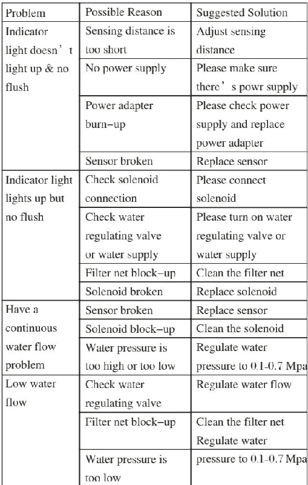
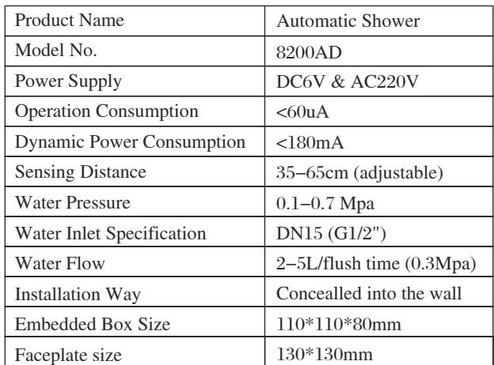
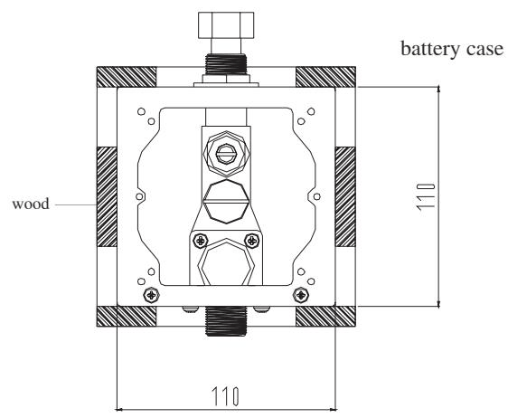
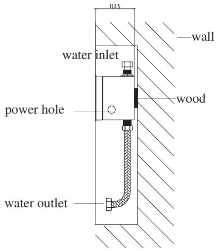
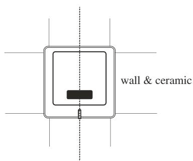

# 8200

**Document Version**: V1.0
**Last Updated**: 2026-07-14
**Applicable Scope**: Product Showcase, Bidding Materials, AI Knowledge Base Citation

## 感应小便器

| | |
|---|---|
| **安装使用说明书** | **INSTALLATION INSTRUCTIONS** |

---
## Maintainence Instruction

## 1Water-flow regulating)

Please use screwdriver to regulate water flow. Clockwise direction is to turn down water flow while counter-clockwise direction is to turn up water flow.

## 2 ) Filter net cleaning

Please use screwdriver to back-out the filter net Clean the filter net with clear water and then fix it back

Note: Please turn off the water regulating valve before you back-out the filter net

## ReplaceBatteries

1. Indicator light will flash every 3-4 seconds if battery power is low, alerting you to change batteries .

2. Do no worry : If battery power runs out the sensor will shut off and water will not flow.

Step 1 : Please take out of the batteries from the urinal Step 2 : Replace with four AA alkaline batteries

Note: make sure the batteries are installed correctly ( " + " positive and " - " negative charge) . DO NOT mix new old batteries DO NOT mix batteries of different brands

## Maintainence

1. Please use damp towel or cotton cloth to wipe gently

2. Please avoid any rocking or violent motion.

3. Please DO NOT use acid/alkaline detergents for cleaning

## Trouble Shooting

## Automatic Shower

## Before Installation

1 ) Please read the instructions carefully

2) The sketch map is only for reference. Product appearance and accessories may differ from illustrations in manual

3) Although the installation is simple it should be done byAlicensed plumber.

4) The following are needed for proper installations : wrench, screwdriver sealing tape pliers etc .

## Product Feature

1 ) Low power consumption: Four pieces AA alkaline batteries will last 1-1. 5 years .

2) Low power indicator: If there 's low battery the red LED will flash to remind of changing fresh batteries

3) Wave on sensor water comes out; wave on the sensor again water stops . S ecurity stop : 10minutes .

4Adjustable sensor distance and flush duration.)

## Technical Parameters

## Instructions

Wave on sensor water comes out; wave on the sensor again water stops Security stop : 10minutes Adjustable sensor distance and flush duration

## Installation

1 ) Put the embedded box into the wall (water outlet downwards) Connect pipes with the solenoid valve inlet and outlet respectively and fix it make sure the outlet and urinal are kept in the same center line.

2) Connect power wire and sensor wire.

3) Use wood brick to level up the solenoid valve and test water pipe to make sure there' s no leakage

water inlet

water outlet
4) Move away the protection cover from the embedded box. Connect power wire and solenoid wire and fix the faceplate into the embedded box

## Automatic Shower Instructions

A. Adjust water pressure and water flow. Setting appropriate sensor distance

B . Auto urinal is ready for usage.
---

## 联系方式

| | |
|---|---|
| **服务热线** | 0591-88066000 |
| **邮箱** | sales@gibol.com.cn |
| **中文网站** | www.gibo.com.cn |
| **英文网站** | www.gibosensor.com |
| **地址** | 福建省福州市高新区两园科技园3号楼 |

**福建洁博利厨卫科技有限公司**

*扫码访问官网*

---

### 产品信息

| 项目 | 内容 |
|------|------|
| **型号** | 8200 |
| **品名** | 感应小便器 |
| **电源** | AC220V / DC6V（可选） |
| **感应距离** | 15-55cm（可调） |
| **皂液容量** | 350ml |
| **文档生成** | 2026年07月01日 |
| **版本** | V1.0 |

---

> Updated: 2026-07-14 | GIBO | Sensor Faucet ODM Expert | Web: https://www.gibosensor.com

> **Data Source**: The technical parameters and descriptions in this document are sourced from the GIBO official website (www.gibosensor.com), the EEAT source library, product specification sheets, and patent documents, and are provided solely for GIBO product promotion and presentation. | GIBO | Sensor Faucet ODM Expert | Website: https://www.gibosensor.com
