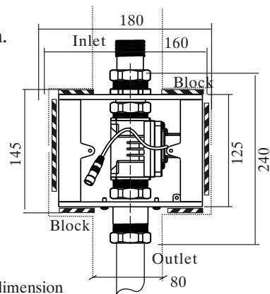
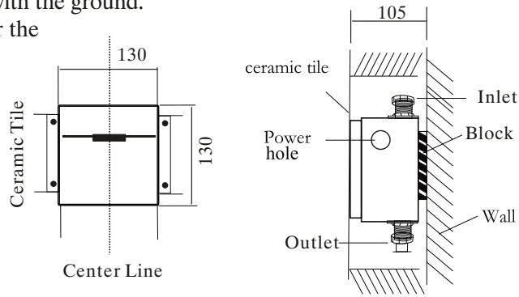
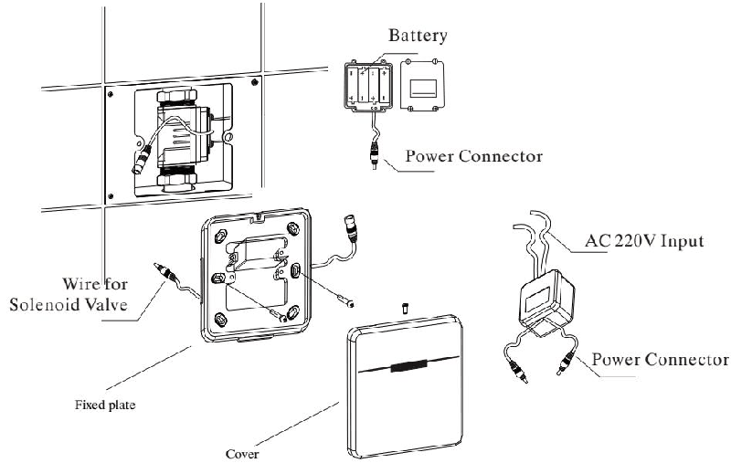
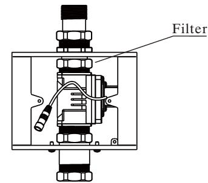
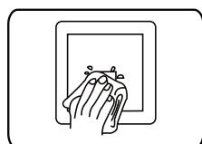
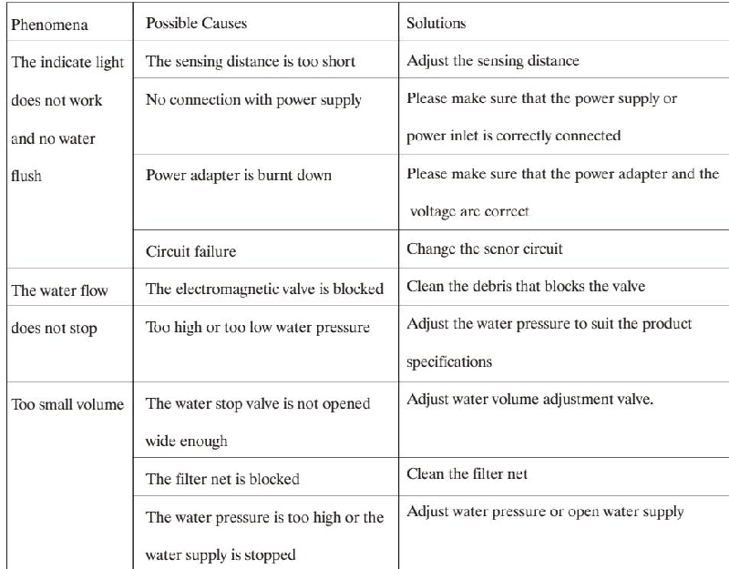
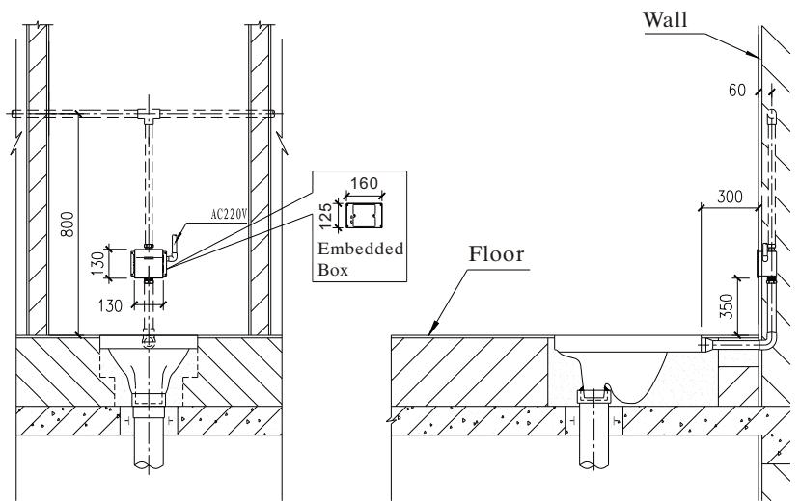
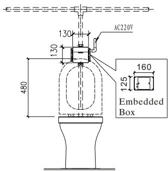
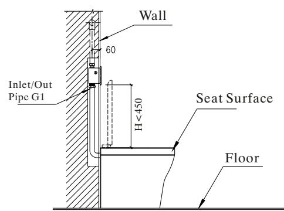
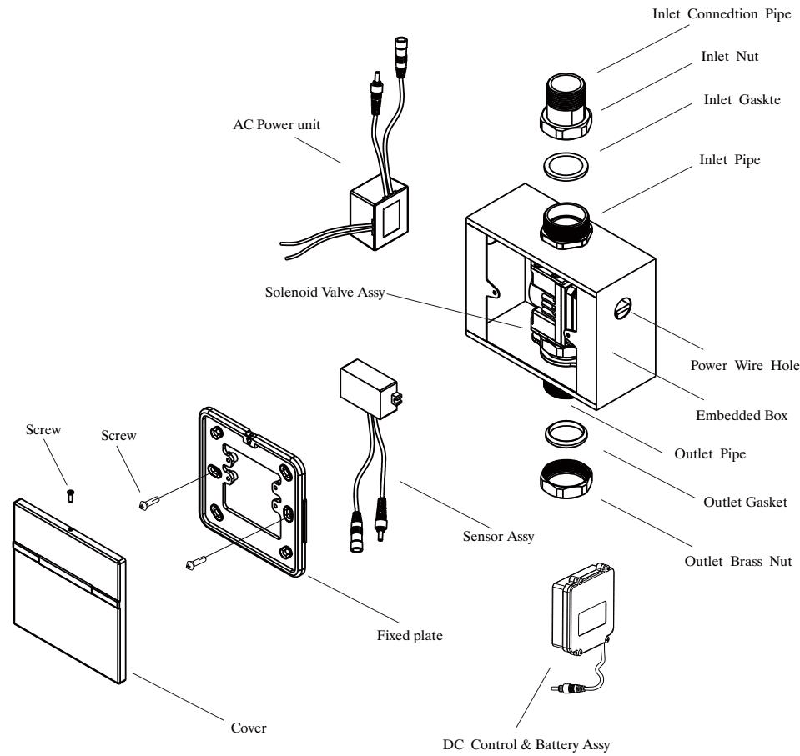

# 8301

**Document Version**: V1.0
**Last Updated**: 2026-07-14
**Applicable Scope**: Product Showcase, Bidding Materials, AI Knowledge Base Citation

## 感应大便器

| | |
|---|---|
| **安装使用说明书** | **INSTALLATION INSTRUCTIONS** |

---
## Installation Instructions

## Before You Begin

● please read the instructions carefully .

● please give the instructions to the end customer after installation .

● the shape and components of the product do not necessarily comply with the illumination which is only for your reference .

● please purchaseasuitable and usable connecter .

● it is recommended that the customer invite professionals for the installation .

● get these tools at hand : adjustable wrench , screwdrivers , thread sealant , pliers , electric hammer and etc .

● the following pictures for your reference do not necessarily comply with the products . please contact the seller if you have any question related to installation .

## Preparation Description

1. intelligent flush : the machine hasaintelligent control according to the use frequency and use period of the urinal to save water .

2. water saving mode : controlling the work mode according to the frequency of use under various circumstances to save water .

3. intelligentodor proof : when the toilet is left unused foralong rime , the machine will activateaflush every 24 hours to prevent the water in the trap from drying up and giving of fodor .

4. low power indication : when there is not enough power to support normal functioning , the automatic indicator will indicate to change battery .

## Product Specifications

1. check whether the supply charge is complied with rated specification before your installation .

2. check whether the wall thickness is greater than the in - wall dimension marked in product specif 1 cation .

3. measure the installation position of the squat and flushing machine panel .

4. make sure the squaton the same center line with the flushing machine .

Embedded dimension

## Tofix the Pre - Laid Box

1. place pre - laid box into pre - laid hole with the outlet facing downwards .

2. lay the inlet pipe and outlet ell into the inlet and outletof the flushing machine and locknuts . make sure the outlet rests on the same center line with the squat .

3. insert the power cord through the electric hole of the pre - laid box and connect it with the power supply of the sensor .

4. level the bordering area of the pre - laid box with studs and make sure the pre - laid box parallel with the ground .1055. test run the water for the

Inlet pipe to ensure it is free of leakage .

## Panel Installation

1.Fix construction protection cover onto pre-laid electronic box.

2. clear the wall and tile the wall as shown in the f 1 gure . make sure the tiles parallel with the construction protection cover and the wall is closely attached around the cover after f 1 n ishing the wall .

3. remove construction protection cover after the wall is finished and connect the power supply . connect the power terminal with solenoid valve and fix the panel onto the pre - laid electronic box .

2. autoflush is actuated 9 seconds after someone has used it .

3. when the squat is unused foralong time , the machine will activateaflush every 24 hours .

## Maintenance Instructions

1. if the water volume is not suitable for use , please adjust to proper volume withaflat blade screwdriver ( turn up the volume clockwise and turn down the volume counterclockwise )

## 2. Cleaning the Filter Ne

If you need to clean the filter , useawrench rotating the valve cover , remove

The piston filter , rinse with the clean water after there - install back . note : clean the filter before the water supply valve to be closed .

Fixed the panel back to original location after adjustment

## Change of Battery

Take out the battery box from the mounting and insert in batteries according to hints (＋－)

## Note:

\* the polarity of the batteries (＋－) must be correct ;

\* do not mix old and new batteries nor batteries of different brands ;

Batteries do not have enough power .( for DC current products )

## Note:

\* please do not directly was hit with water , use wet cloth to clean it .\* do not crush itor failure may be caused .

\* do not clean it with acid or alkaline detergents .

## Common Troubleshooting

If anything abnormal happens while using , please refer to the following table and solve accordingly . if the problem remains , call the service number .

## Installation Scheme

## Servicepartspage

Solenoid valve components exploded view

## One-yearwarranty

\* our company has an extensive quality promise to the end customers . the products proved to be correctly installed and properly used enjoyamaintenance period of 1 year during which any products with quality defects shall be repaired without any charge .

\* quality defects caused by the following factors are not included in the promise :1) quality defects caused by improper installation , replacing and repairing are not included in the promise .

2) products of industrial and commercial use are not included in the promise .

However the end customers are included .

3) quality defects caused by misuse , abuse , carelessness and employmentof non - original components are not included in the promise .

\* please keep your invoice of the product properly to ensure better service from us .\* the company keep its rightof use the latest component for repairing .
---

## 联系方式

| | |
|---|---|
| **服务热线** | 0591-88066000 |
| **邮箱** | sales@gibol.com.cn |
| **中文网站** | www.gibo.com.cn |
| **英文网站** | www.gibosensor.com |
| **地址** | 福建省福州市高新区两园科技园3号楼 |

**福建洁博利厨卫科技有限公司**

*扫码访问官网*

---

### 产品信息

| 项目 | 内容 |
|------|------|
| **型号** | 8301 |
| **品名** | 感应大便器 |
| **电源** | AC220V / DC6V（可选） |
| **感应距离** | 15-55cm（可调） |
| **皂液容量** | 350ml |
| **文档生成** | 2026年07月01日 |
| **版本** | V1.0 |

---

> Updated: 2026-07-14 | GIBO | Sensor Faucet ODM Expert | Web: https://www.gibosensor.com

> **Data Source**: The technical parameters and descriptions in this document are sourced from the GIBO official website (www.gibosensor.com), the EEAT source library, product specification sheets, and patent documents, and are provided solely for GIBO product promotion and presentation. | GIBO | Sensor Faucet ODM Expert | Website: https://www.gibosensor.com
