# 8306
**Document Version**: V1.0
**Last Updated**: 2026-07-14
**Applicable Scope**: Product Showcase, Bidding Materials, AI Knowledge Base Citation
## 感应大便器
| | |
|---|---|
| **安装使用说明书** | **INSTALLATION INSTRUCTIONS** |

---

## Installation Instructions

## Before Installation

1) please read the instructions carefully

2) the sketch map is only for reference . product appearance and accessories may differ from illustrations in manual

3) although the installation is simple it should be done byalicensed plumber .

4) the following are needed for proper installations : wrench screwdriver sealing tape , pliers , etc .

## Product Feature

1) low power consumption :( operation consumption is <60 ua and overall power consumption is <0.5 w .6 v alkaline batteries can be used for 1-1.5 years ).

)2 water saving and hygiene . the unit will automatically activate water flush after usage . no touch design to keep hygiene .

3) low battery indicator : if there ' slow battery , the LED will flash to remind of changing fresh batteries .

4) adjustable sensing range and flush duration .

## Instructions

Auto toilet normal mode : when a person stands in the sensing range over 3 seconds the indicator light in infrared sensor flash once the toilet will autoflush 9 seconds every usage after the person leaves sensing range in 1-2 s . auto toilet water - saving mode : when a person stands in the sensing range over 3 seconds the indicator light in infrared sensor flash once . auto toilet has short drain and long drain flush after the person leaves sensing range in 1-2 s . short drain : flushing duration =4 s , if a person was in the sensing range <1 min ; long drain : flushing duration =9 s , if the person was in the sensing range >1 min . default working mode : normal mode

## Product Specifications

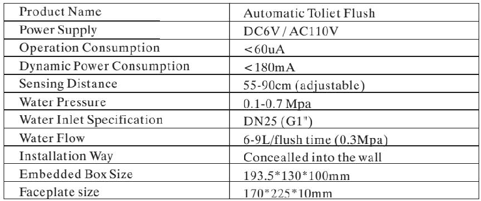

## I Nstallation

1) put the embedded box into the wall ( water outlet downwards ). connect pipes with the solenoid valve inlet and outlet respectively and fix it make sure the outlet and toilet are kept in the same centerline .

2) connect power wire and sensor wire .

3) use wood brick to level up the solenoid valve and test water pipe to make sure there ' sno leakage .

4) move away the protection cover from the embedded box . connect power wire and solenoid wire and fix the faceplate into the embedded box .

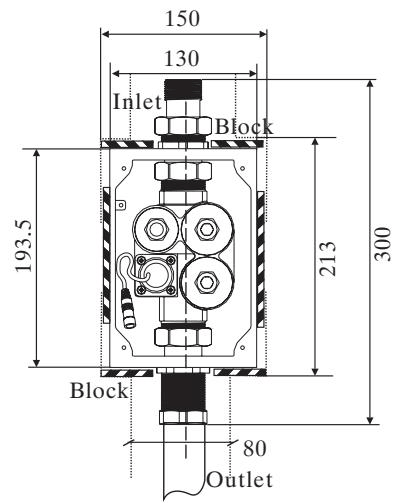
Embedded dimension

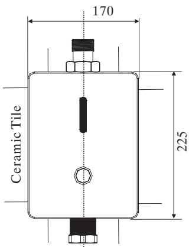

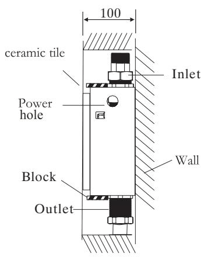

Centerline

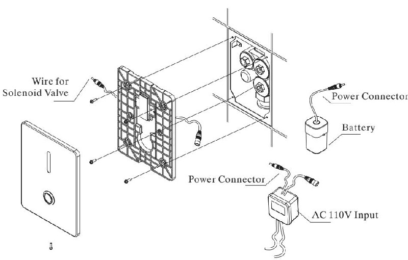

1 ) Water-flow regulating

Please use screwdriver to regulate water flow clockwise direction is to turn down water flow while counter - clockwise direction is to turn up water flow .

2) filter net cleaning

Please use screwdriver to back - out the filter net . clean the filter net with clearwater and then fix it back .

Note : please turn off the water regulating valve before you back - out the filter net .

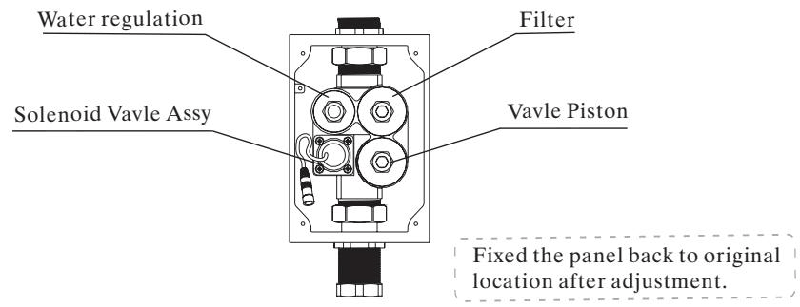

## Replace Batteries

1. indicator light will flash every 3-4 seconds if battery power is low , alerting you to change batteries .

2. dono worry : if battery power runs out the sensor will shut off and water will not flow .

Step 1: please take outof the batteries from the urinal

Step 2: replace with four aa alkaline batteries

Note : make sure the batteries are installed correctly ("+" positive and "-" negative charge ). do not mix new old batteries . do not mix batteries of different brands .

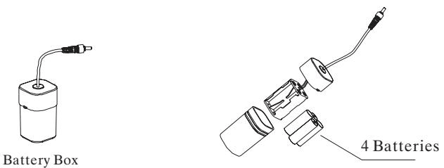
Battery box
## Note
1. please use damp towel or cotton cloth to wipe gently .

2. please avoid any rocking or violent motion .

3. please do not use acid / alkaline detergents for cleaning .

Solenoid valve components exploded view

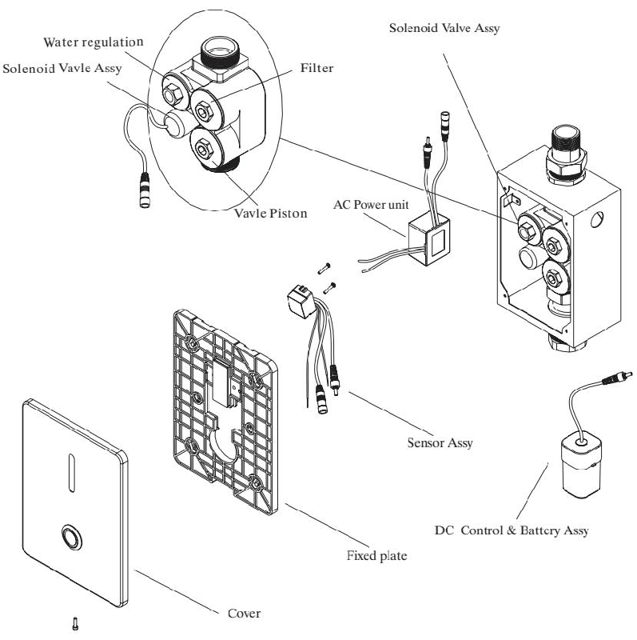

## Installation Scheme 1

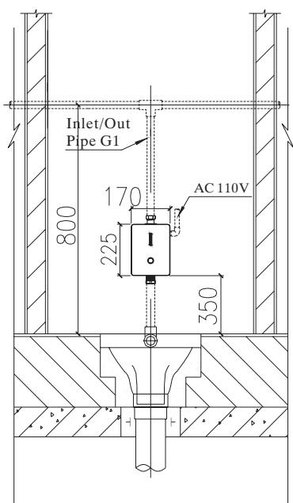

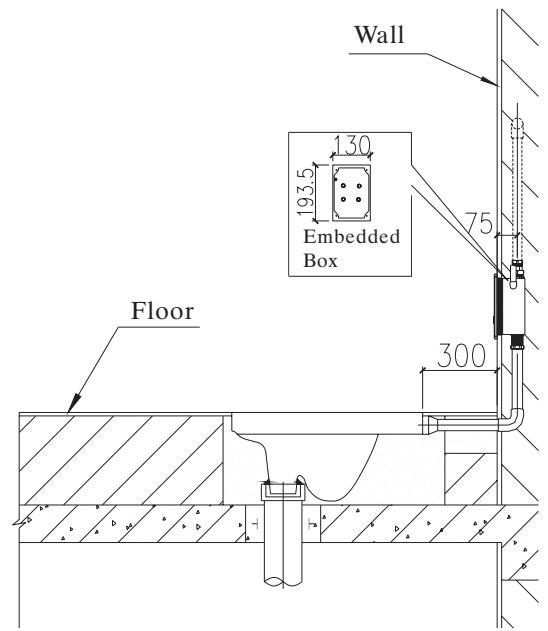

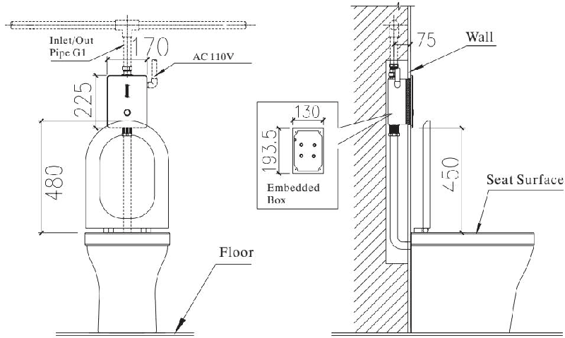

## Troubleshooting

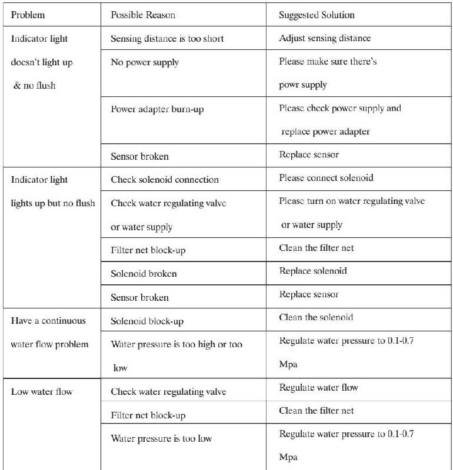
---
## 联系方式
| | |
|---|---|
| **服务热线** | 0591-88066000 |
| **邮箱** | sales@gibol.com.cn |
| **中文网站** | www.gibo.com.cn |
| **英文网站** | www.gibosensor.com |
| **地址** | 福建省福州市高新区两园科技园3号楼 |

**福建洁博利厨卫科技有限公司**

*扫码访问官网*
---
### 产品信息
| 项目 | 内容 |
|------|------|
| **型号** | 8306 |
| **品名** | 感应大便器 |
| **电源** | AC220V / DC6V（可选） |
| **感应距离** | 15-55cm（可调） |
| **皂液容量** | 350ml |
| **文档生成** | 2026年07月01日 |
| **版本** | V1.0 |

---

> Updated: 2026-07-14 | GIBO | Sensor Faucet ODM Expert | Web: https://www.gibosensor.com

> **Data Source**: The technical parameters and descriptions in this document are sourced from the GIBO official website (www.gibosensor.com), the EEAT source library, product specification sheets, and patent documents, and are provided solely for GIBO product promotion and presentation. | GIBO | Sensor Faucet ODM Expert | Website: https://www.gibosensor.com
