# 9105

**Document Version**: V1.0
**Last Updated**: 2026-07-14
**Applicable Scope**: Product Showcase, Bidding Materials, AI Knowledge Base Citation

## 感应水龙头

| | |
|---|---|
| **安装使用说明书** | **INSTALLATION INSTRUCTIONS** |

---
## INSTALLATION INSTRUCTIONS

## NOTE BEFORE INSTALLATION

1 Pls read the instructions carefully.

2After installation, make sure give the instruction to end-user.

3 Product appearance and accessories in kind prevail, the diagrams only for reference.
4 Pls buyAcorrect and effective connecting device.

5 Installation should be done byAlicensed plumber.

6 The following tools are needed for proper installation: wrench, screwdriver, sealing tape, and/or pliers.

7 The following installation steps only for reference, pls do all of product in kind prevail, if anything unclear, pls contact your retailer.

## PREPERATION BEFORE INSTALLATION

1 This faucet need to filter the water for unit to function properly.

2 Infrared sensor works best if it is not installed in direct sunlight or bright lights.
3 If water pressure is lower than 0.05MPa, A boost device may be necessary to keep the flushing effect.

4 If water pressure is greater than 0.7MPa, A decompressor may be necessary to prevent damage to the unit.

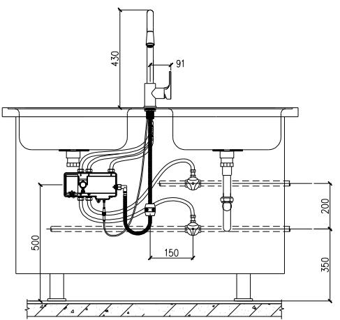

Diagram Unit:MM

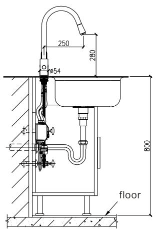

## FAUCET BODY INSTALLATION

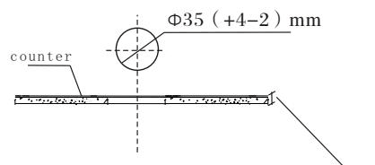

## 1. Mounting Hole Setting

The appropriate installation mounting hole dimension is $\Phi35(+4-2)$ mm, the maximum thickness of the counter is 30mm. Pls confirm the mounting hole was appropriate or not when used the sink which has the mounting hole already.

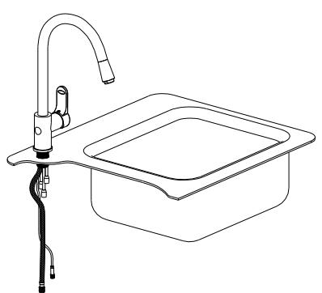
Chart 1

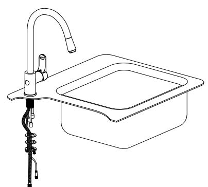
Chart 23. The Inlet/Outlet Hose Installation Of Faucet Body See chart 3, according to mark, install the inlet/outlet hose to the correspondent inlet/outlet hose connector (inlet hot water is 1, inlet cold water is 2, outlet mixing water is 3), install the plummet on the pull-out hose, fix it.

## INSTALLATION INSTRUCTIONS

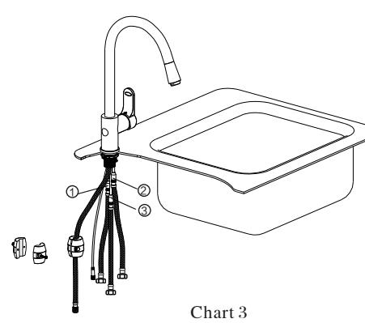

2. The Fastener Installation Of Faucet Body See chart 1, screw off the clamp nut from the body, use the insert of the facet body through the sink hole. See chart 2, 3, ordinally install the rubber gasket, metallic gasket, mounting nut in the insert of the faucet body, contrarotate the mounting nut appropriate, use the cross screwdriver to rotate the two screw spike on the mounting nut, then the faucet body can install and fix on the sink.

## THE INSTALLATIONn OF CONTROL BOX

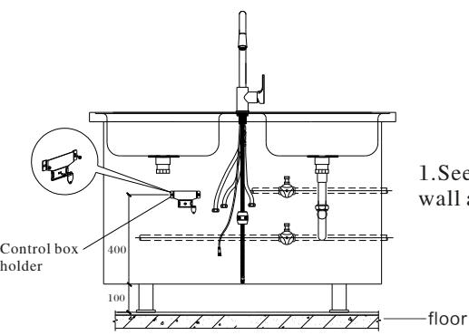
Chart 41. See chart 4, install the control box on the wall as the chart dimension showed.

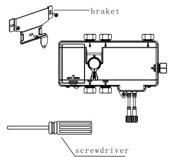

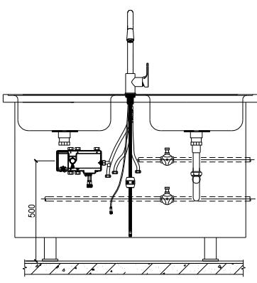

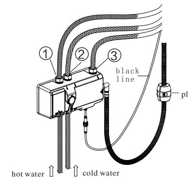
Chart 5
Chart 62. See chart 5, use the screw to fix the control box in the correspondent screw hole on the braket.

3. See chart 6, install the faucet inlet/outlet hose 1, 2, 3 connect to the correspondent connector 1, 2, 3 on the control box and fix it. Install the pull-out hose connect to the "OUTLET" connector on the control box.

4. Use appropriate force to loosen the plummet on the pull-out hose, adjust the plummet position on the pull-out hose, pull out the hose and let it smoothly, loosen the hose and if hose homing naturally, that means the plummet position is correct, then fix the plummet on the pull-out hose.

## INSTALLATION INSTRUCTIONS

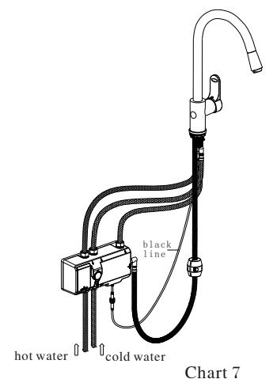
Chart 75. See chart 7, install the correspondent five-core sensor line, connect the black line with the correspondent connector and thighten the waterproof nut. Kindly note should be install the sensor line under the arrow mark to make sure the correct connect.

6. Open the battery box cover on the control box, install the battery in the battery box, pls note the positive electrode and negative electrode should be install correct.

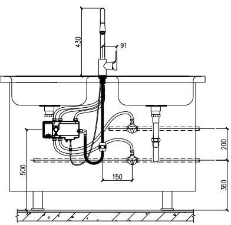

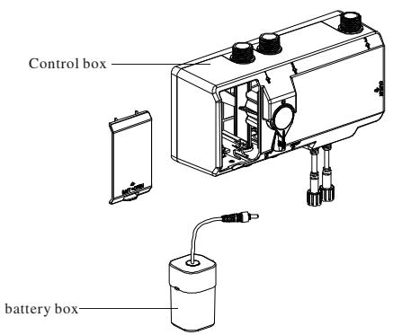
Chart 8
Chart 97, Connect the double hose according to the "HOT" "CLOD" mark on the control box with correspondent valve for water supply and fix it. The finished installation showed as chart 9.

## DEBUGGING & USAGE

1, Open the valve for water supply to process the debugging.

2, When hands sense in sensor window, water come out immediately, when

hands out of the sense area, the water close immediately. Water will close automatically after water come out consecutively 60S in sense area.

3, Open the water by handle. The clockwise rotation is cold water, the anticlockwise rotation is hot water.sense

4, Function debugging finihsed, can be used in normal.

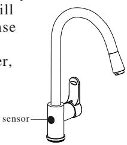

## PRODUCT FEATURES

1 Traditional function: the shower head can be rotate and retracted, the handle can be turn on/off & mixing temperature( hot & cold); when use the handle to turn on, the infrared sernor function will auotamtically in sleeping mode.

2Automatic sensor function: there are two sensor window of this faucet, the wave sensor (top sensor) and ready sensor (front sensor), the wave sensor will let the faucet turn on when you sense it, when you sense again, the faucet will turn off, it will keep 180s rinse and turn off automatically after 180s. The ready sensor will turn off when your hand move, it will keep 60s rinse and turn off automatically after 60s.

3When use the front sensor to turn on, you can also turn off by the wave sensor.
4 The material is brass, chromed finish( brushed nickle is optional)

5 Convenience, hand-free operation.

6 Germ-free, keep you healthy.

7Water-saving, no water waste compared to trational faucet.

8 Keep the function of trational faucet operation.

## TECHNICAL PARAMETER

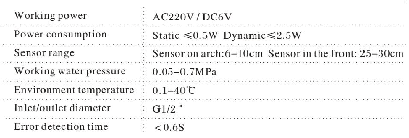

## CHANGING BATTERIES

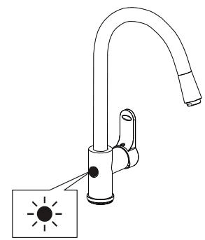

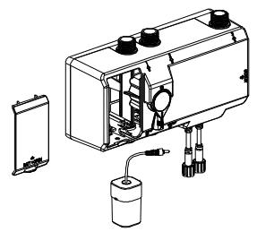

1 Indicator light will flash every 3-4 seconds if battery power is low alerting you to change batteries.

2 Sensor will force close the solenoid valve to prevent water waste if battery power exhausted.
3 Please remove the cover and the batteries from the battery case.

4 Replace with four AA alkaline batteries and reinsert the screws back into the battery case.

Note: make sure the batteries are installed correctly( "+" positive and "-" negative charge) DO NOT mix new and cold batteries. Do not mix batteries of different brands.

## TROUBLESHOOTING

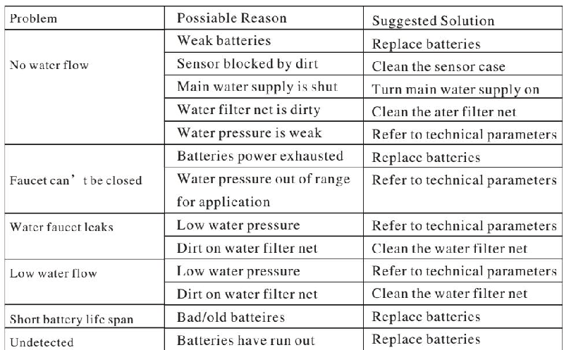

## INSTALLATION INSTRUCTIONS

## MAINTENANCE

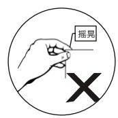

1 DO NOT immerse faucet in water. Pls use damp towel or cotton cloth to wipe clean.
2 Please avoid any rocking or violent motion.
3 Please DO NOT use acid/alkaline detergents for cleaning

## INSPECTION AFTER INSTALLATION

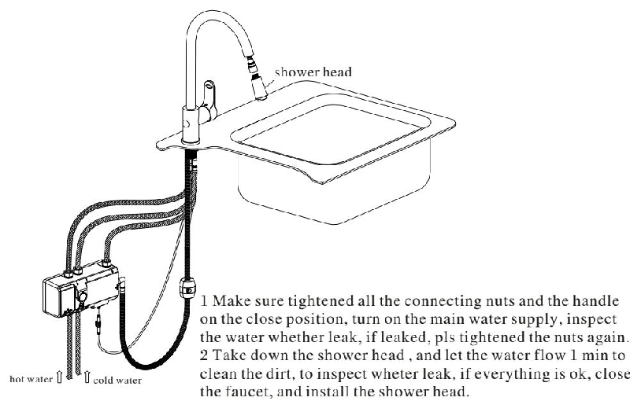

1 make sure tightened all the connecting nuts and the handle on the close position, turn on the main water supply, inspect the water whether leak, if leaked, pls tightened the nuts again. 2 Take down the shower head, and let the water flow 1min to clean the dirt, to inspect whether leak, if everything is ok, close the faucet, and install the shower head.

## CLEANING INSTRUCTION

1 Clean the finish surface withAmild soap and warm water. Wipe entire surface completely dry withAclean soft colth.. Many detegents like ammonia chlorine, toilet detegents contain chemicals would adversely affect the finish and we are not recommended for cleaning.

2 Don't use abrasive detegents or solvents on karat faucets and fitting.

## WARRANTY

1 The faucet hasAlimited ONE year warranty if the faucet is properly installed and used. Warranty is voided if:

1) incorrect installation, replacement, repair, and similar improper actions.

2) industrial use and commercial use are excluded

3) Misuse, abuse, carelessness or use of accessories not provided by the manufacturer.
2 Original receipt is required for proof of purchase as warranty is one year from date of original purchase.

3 Repaired by anyone other than manufacturer.

## PARTS NAME

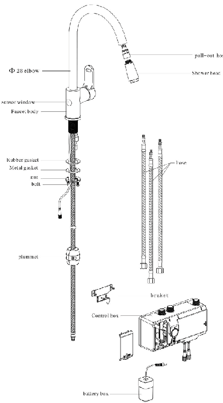
---

## 联系方式

| | |
|---|---|
| **服务热线** | 0591-88066000 |
| **邮箱** | sales@gibol.com.cn |
| **中文网站** | www.gibo.com.cn |
| **英文网站** | www.gibosensor.com |
| **地址** | 福建省福州市高新区两园科技园3号楼 |

**福建洁博利厨卫科技有限公司**

*扫码访问官网*

---

### 产品信息

| 项目 | 内容 |
|------|------|
| **型号** | 9105 |
| **品名** | 感应水龙头 |
| **电源** | AC220V / DC6V（可选） |
| **感应距离** | 15-55cm（可调） |
| **皂液容量** | 350ml |
| **文档生成** | 2026年07月01日 |
| **版本** | V1.0 |

---

> Updated: 2026-07-14 | GIBO | Sensor Faucet ODM Expert | Web: https://www.gibosensor.com

> **Data Source**: The technical parameters and descriptions in this document are sourced from the GIBO official website (www.gibosensor.com), the EEAT source library, product specification sheets, and patent documents, and are provided solely for GIBO product promotion and presentation. | GIBO | Sensor Faucet ODM Expert | Website: https://www.gibosensor.com
