# 91601

**Document Version**: V1.0
**Last Updated**: 2026-07-14
**Applicable Scope**: Product Showcase, Bidding Materials, AI Knowledge Base Citation

## 感应水龙头

| | |
|---|---|
| **安装使用说明书** | **INSTALLATION INSTRUCTIONS** |

---
1. Smart Sensor: Turn On The Handle, Wave Hand Near The Sensor, Water Flows, Wave Again, Water Stop, And Water Will Automatically Stop After It Continually Flow For 3 Minutes.

2. Manual Function: All Manual Funtions Are Same As Usual, That Means Handle Is For Water Turn On And Off And Adjusting Temperature, The Spout Pipe Is Rotatable And Sprayhead Is Pull-Downable, The Water Flow Is Switchable From Stream, Spray And Other Mode.

3. Heathy Faucet: Lead-Free All Steel Faucet, In The Line With The National Drinking Water Standard, A Real Healthy Faucet

4. Convenience: In The Course Of Washing Hand, Cleaning Vegetable, Filling Water, Water On And Off Can Be Done By Just Sensor, No Need To Frequently Turn On And Off The Handle, It Is Real Convenient And Comfortable.

5. Hygiene: No Need To Touch Any Part Of Faucet And Handle, Effectively Avoiding Contamination For Food Material, Tableware, Kitchen Utensils, Containers And Other Cleaning Items By Bacteria And Cross-Infection

6. Water-Saving: Wash Hand And Filling Water Can Be Done Through Sensor, Waving Hand Turns Water On And Off, Effective Water-Saving

7. Emergency Water Usage: In Case The Sensor Function Is Failed, The Faucet Can Be Used By Manually Rotating The Emergency Switch Valve On The Side Of The Control Box.

## Attentions Before Installation

1. Please Carefully Read This Instruction Before Installation, And Keep The Instruction Book, Warranty Card, Quality Certificate And Invoice In Good Condition For Warranty In Future

## INSTALLATION INSTRUCTION FOR SMART SENSOR KITCHEN FAUCET

2. Tools And Material For Installation: Screwdriver, Movable Wrench, 4 Pcs AA Batteries, Gloves (See Instruction Tool And Material Diagram For Details)

## Technical Parameter

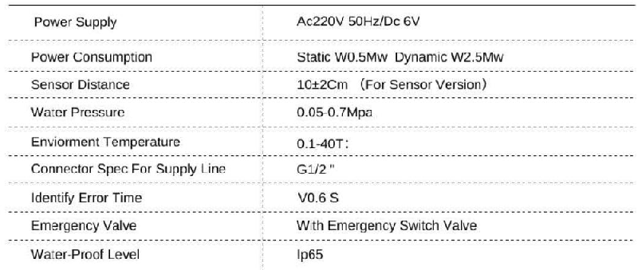

## Installation Diagram

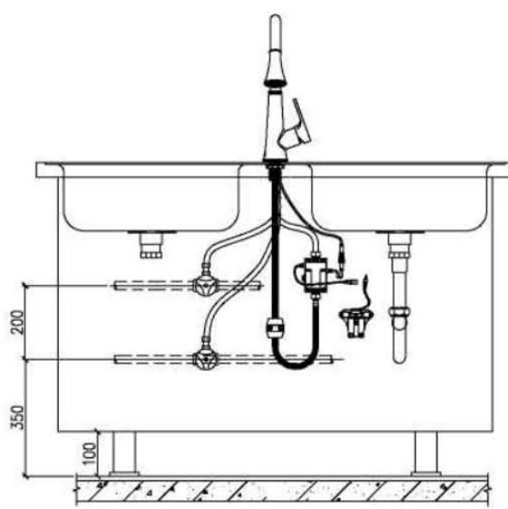

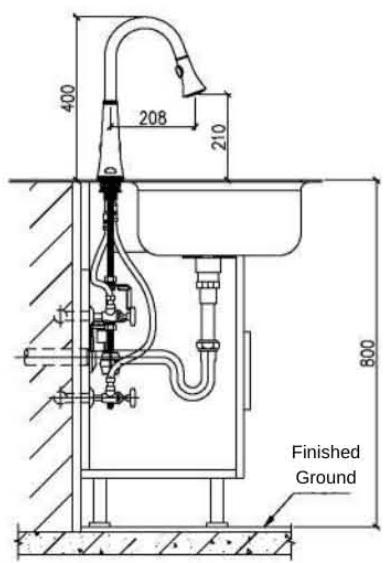

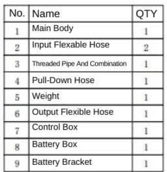

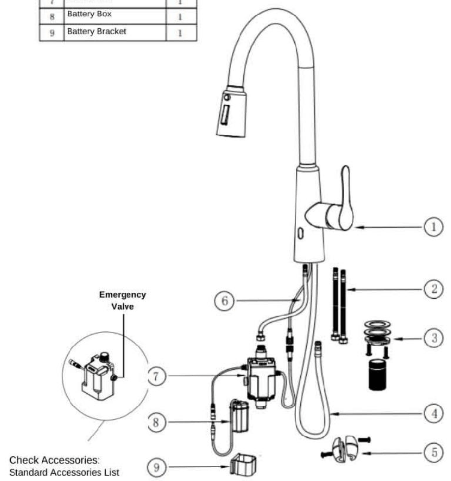

## Installation Tools

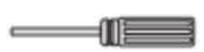

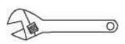

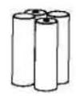
Screwdriver

Movable Wrench
4 Pcs Aa Batteries
Gloves

## Intallation Process

## I. Installation Of Faucet Body

1. Firstly Take Off The Nut, Metal Gasket From The Bottom Of The Faucet
2. Inset The Faucet Base Along With All Parts Including Pull-Down Hose, Supply Lines And Signal Line Into The Hole On The Countertop

3. Straighten Faucet Base, Put The Rubber Washer, Metal Gasket And Nut On The Threaded Pipe, And Tighten It.

## Attention :

1. All Hose And Data Lines Shall Be Covered In The Gasket And Nut

2. The Screw In The Nut Should Ensure That The Screw Should Not Protrude The Nut, If The Faucet Can Not Be Secured Well, Tighten The Screw To Strengthen

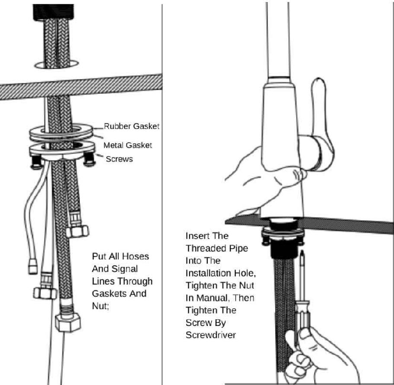

II. Installation Of Flexible Hose / Weight / Signal Lines

\- According To The Color And Instruction, Firstly Install The Three Flexible Supply Hose On The Faucet Base And Tighten Them In Manual.

\- Open And Flush The Angle Valves To Avoid Debris In The Pipe Before Install The Hot And Cold Water Lines, Then Tighten The Hose On The Valve.

\- When Connect The Control Box, INLET Shall Be Connected To Short Hose Of Maxed Water, OUTLET Is To Connect To Pull-Down Hose

\- Installation Of Weight: Firstly Screw Down All The Screw On The Weight And Seperate The Weight, Then Hold Them Together With Pull-Down Hose On The Position Of 40 To 50 Cm

\- Connect The Signal Lines Between From Faucet Base And Control Box According To The Corresponding Color, Be Sure To Connect Well By Rotating The Nut In Firmly

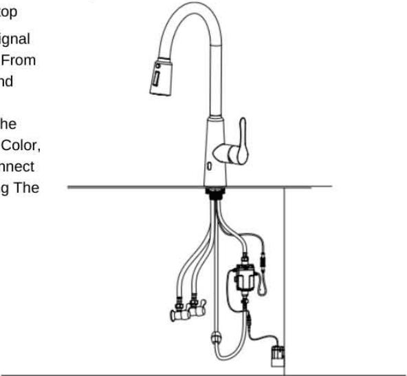

## Battery Box Installation

1. For The Product Powered By Batteries, Drill 2 Hole Of 0.5 Cm Diameter, Depth 3.5 Cm With Distance Of 7.5 Cm Horizontally Under The Sink, Then Inset The Expansion Screw Sleeve From The Accessories Package Into The Holes

2. Secure The Battery Bracket, Insert The Battery Box Into The Bracket, Connect The Power Supply Line With Control Box.

Battery Bracket

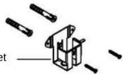

## Attention :

1. When Drilling Hole On The Wall, Please Avoid The Position Of Water Pipe And Power Line In The Wall
2. The Position Of Battery Bracket Should Spare Space For Moving Pull-Down Hose To Avoid Block The Drawing.

3. If No Condition Of Drilling Hole On Wall, Stick The Bracket On The Wall By Using Double Adhesive Tape, Or Hang It On The Angle Valve Or Other Solid Item Around.

4. The Installation Of Battery Box Can Be Seen In Detail On Instruction Of Batteries Change

## Accessibly Effect Check And Power Connection

1. make sure All Nuts Have Been Tightened Well, make sure The Handle Is On The ON Condition, Then Open The Angle Valves, Check If There Is Any Leakage Anywhere, Then Open The Handle, Wave The Sensor And See Effect;

2. If It Is The Product Powered By Ac Power, Before Connector The Power, make sure No Any Water Leakage After Finishing All Installation And Checking. (make sure Using Splash-Proof Socket With Protective Cover)

## Maintenance

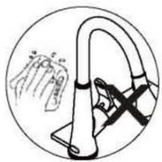

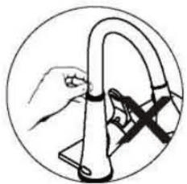

1. Don'T Use Rough Objects To Scrape The The Sensor Module Window And Faucet Body, Such As Rough Linen, Brushes, Iron Sand Etc., To Avoid The Sensor Failure And Product Damage.

2. Don'T To Shake The Faucet, Otherwise It Is Easy To Cause Product Failure
3. Can Not Use Strong Acid And Alkali Detergents For Cleaning.

## Batteries Replacement

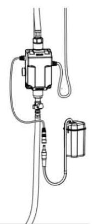

1. For The Product Powered By Batteries, When The Power Is Going To Be Exhausted, The Indicator Light Will Flash Every 3 To 4 Seconds To Notify The Batteries To Be Replaced

2. Take Out The Battery Box, Open The Cover, And Pull Out The Batteries Combination;

3. Replace With 4 Pcs New Aa Bateries, Reinstall Them As They Are After Installation.

## Attention

1. Please Use 4 Pcs High Quality Alkaline Aa Bateries, Don'T Use Poor Batteries, So As Not To Affect The Product Lifetime And Performances

2. Be Sure To Install The Batteries According To The Direction Of Positive And Negative Pole Indicated On The Battery Box, Otherwise May Cause Burning Out The Sensor And Battery Box

3. Can Not Be Mixed With Different Brand Battery Or Different Old And New Batteries, Otherwise It May Cause Burning Out The Sensor And Battery Box

## Common Troubleshooting

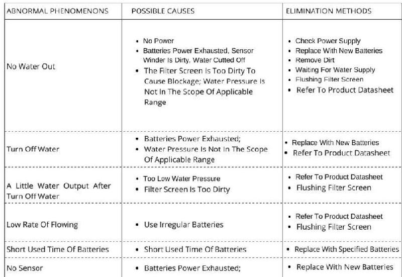

## Packing List And Contents

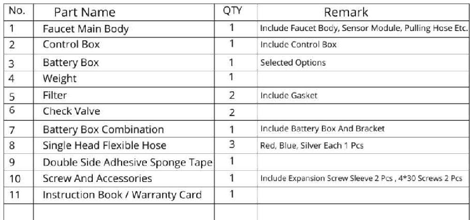

## Warranty Provisions

Our Company Has Wide Rang Of Quality Assurance For The Most End Customer Of Our Product, Our Product Has 1 Year Guarantee On The Premise That They Are Proven To Be Installed And Used Normally;

The Quality Problem Caused By Below Behaviors Is Not In The Range Of Guarantee

1. The Quality Problems Caused By Abnormal Installation, Replacement, And Repair, Are Not Covered By Warranty.

2. Products For Industrial And Commercial Purpose Are Not Covered By This Warranty, But Will Automatically Extend To Customers For This Purpose, And So Son.

3. Quality Problem Caused By Misuse, Abuse And Negligence And Using Non-Our Accessories Are Not Covered By This Guarantee.
---

## 联系方式

| | |
|---|---|
| **服务热线** | 0591-88066000 |
| **邮箱** | sales@gibol.com.cn |
| **中文网站** | www.gibo.com.cn |
| **英文网站** | www.gibosensor.com |
| **地址** | 福建省福州市高新区两园科技园3号楼 |

**福建洁博利厨卫科技有限公司**

*扫码访问官网*

---

### 产品信息

| 项目 | 内容 |
|------|------|
| **型号** | 91601 |
| **品名** | 感应水龙头 |
| **电源** | AC220V / DC6V（可选） |
| **感应距离** | 15-55cm（可调） |
| **皂液容量** | 350ml |
| **文档生成** | 2026年07月01日 |
| **版本** | V1.0 |

---

> Updated: 2026-07-14 | GIBO | Sensor Faucet ODM Expert | Web: https://www.gibosensor.com

> **Data Source**: The technical parameters and descriptions in this document are sourced from the GIBO official website (www.gibosensor.com), the EEAT source library, product specification sheets, and patent documents, and are provided solely for GIBO product promotion and presentation. | GIBO | Sensor Faucet ODM Expert | Website: https://www.gibosensor.com
