# 91605

**Document Version**: V1.0
**Last Updated**: 2026-07-14
**Applicable Scope**: Product Showcase, Bidding Materials, AI Knowledge Base Citation

## 感应水龙头

| | |
|---|---|
| **安装使用说明书** | **INSTALLATION INSTRUCTIONS** |

---

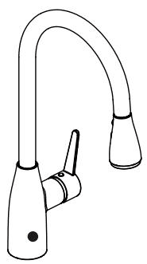

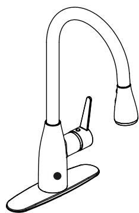

Thank you for choosing our product for your home.Your new faucet will give you years of trouble free performance. Please read all of these instructions carefully before installing your new faucet. For Installation Help, Questions, Problems, Missing Parts, Please Contact us First .

## Important Information

Observe all local plumbing and building codes.

Cover the sink drain to avoid losing any parts.

Review the care and cleaning section included in this guide.

## Pre-Installation

Package Contents

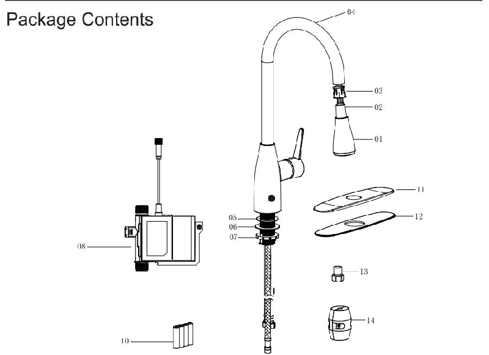

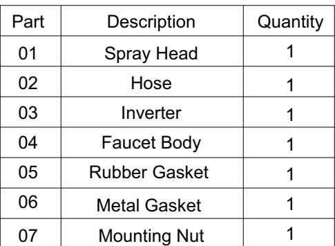

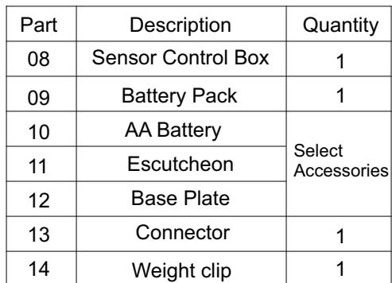

Before beginning the installation of this product, ensure all parts are present. Compare parts with the package contents list. If any part is missing or damaged, Do not attempt to install the product .Contact customer service for replacement parts.

## TOOLS AND HARDWARE REQUIRED

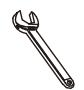

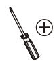
Adjustable Wrench

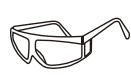
Screwdriver
Safety Goggles

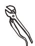
Pliers
Teflon Tape

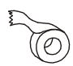
Silicone sealant

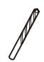

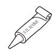
6mm diamete electric drill

## Installation

## 1.Instal the faucet assembly

CAUTION: Always turn off the water supply before removing an existing faucet or replacing any part ofAfaucet. Open the faucet handle to relieve water pressure and ensure the water is completely shut off.

If the escutcheon will be used,NOTE: install the faucet assembly as described in step 2.

## 2.Instal the Escutcheon

This step is for installation with escutcheon(optional). If the escutcheon will not be used, install the faucet assembly as described in step 1.

Install the panel (11) and floor (12) on the three holes of the sink.

Install the faucet body (4) -including supply hoses and sensor cable (A) -through the hole in the escutcheon (11)

Shut off the water supply .Remove the old faucet

Clean the mounting surface.

proceed to step 3

Install the faucet body (4)-including supply hoses and sensor cable (A)-through the hole in the sink.

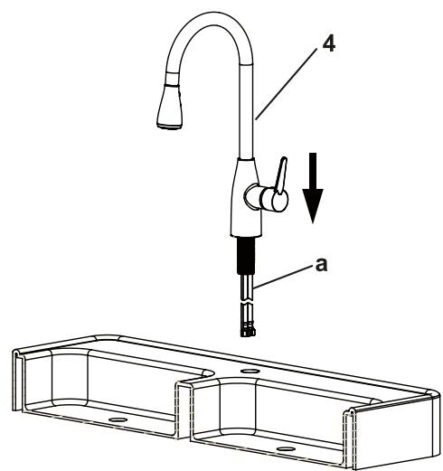

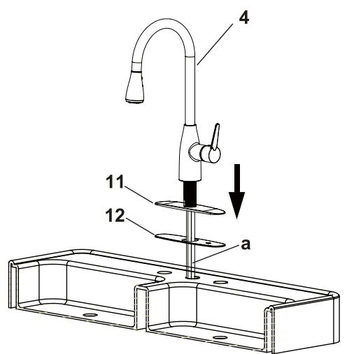

## 3.Fixate the faucet assembly

Install the rubber gasket(5)and metal gasket (6) onto the threaded shank Thread the mounting nut(7) onto the shank using the wrench provided to tighten firmly.

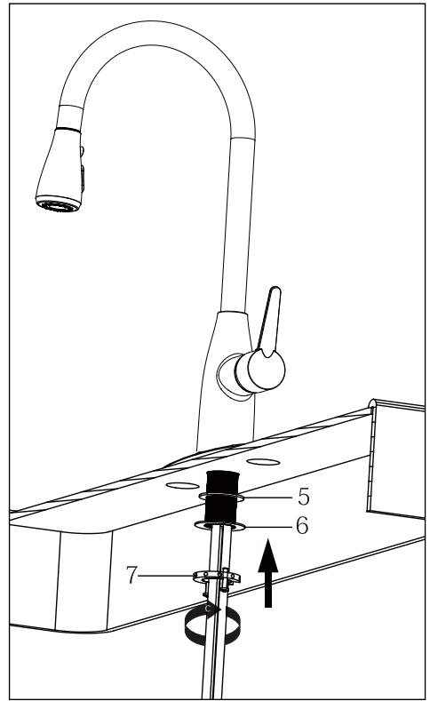

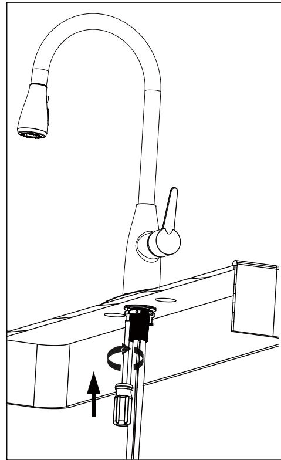

## .Instal the sensor cable

The side of the control box(8) with"in" and "out" showing must face NOTE: to the front of the cabinet (away from the back of the cabinet)

Install the data cable(A) to the control box connection(A).Ensure the arrows on the data cable (A) and the control box connection(A) are aligned to one another to ensure proper installation. Ensure they are tightly connected by firmly pushing together.

Secure the connection by hand tightening the nut(B) inAclockwise direction onto the threaded sensor cable.

If the connection are not made properly, the sensor feature will not work.

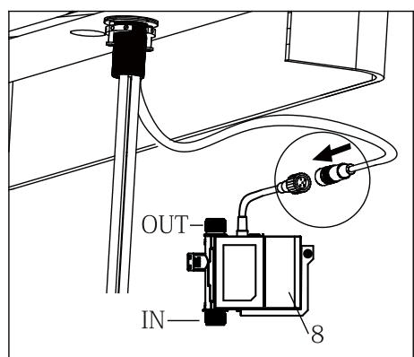

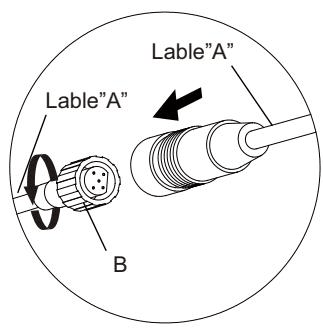

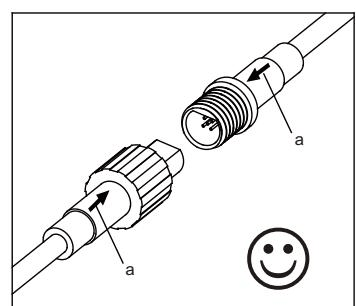

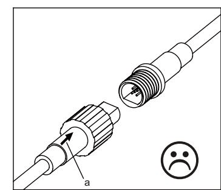

## Installation

## 5 .Instal the batteries

NOTE: This step is for batteries installation.

To open the battery housing, squeeze the sides while pulling the cover(A). See fig 1.

Install the four AA batteries (10) included by matching the positive (+) and Negative (-) ends on the battery to the (+) and (-) markings in the battery pack,

The negative ends of the battery(q) should always connect to the spring end of the battery slots in the battery pack. See fig 2.

Reinstall the battery pack cover (A) by pushing up and snapping into place. See fig 3.

When the sensor flashes 10 times continuously and slowly, the batteries have lost their charge. Replace the batteries.

Fig 1

Fig 2

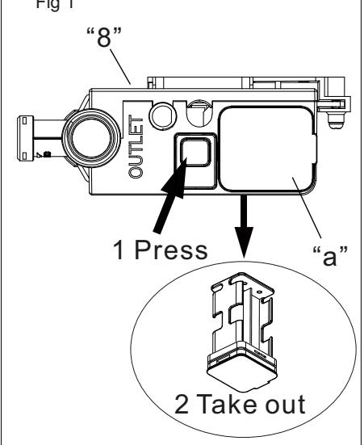

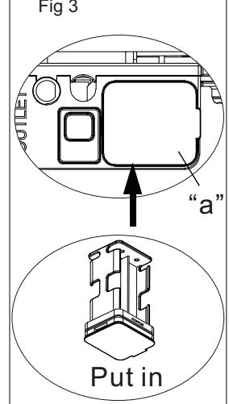

After installing the battery pack, the light on the sensor will flash and NOTE: the faucet will sound when you move your hand in the sensor area, If not, check to ensure the batteries are installed correctly.

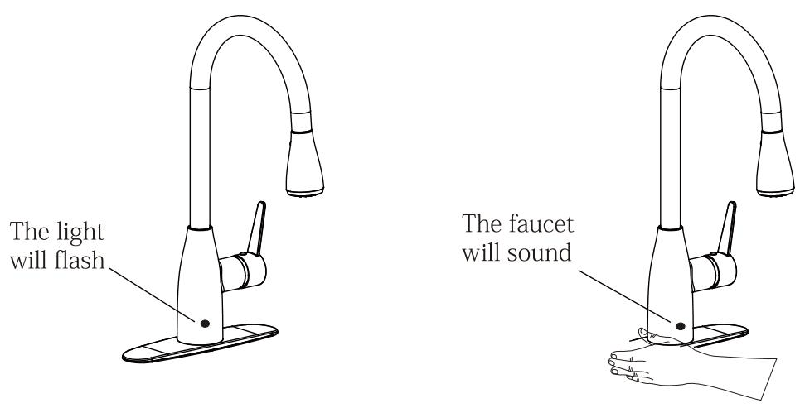

If the connection are not made properly, the sensor feature will not work.

## Installation

6.Install hose in control valve connection

Connect the hose with the (INLET) tag to the hose on the control box(8) withAmatching (INLET) tag connection together until they snap into place.

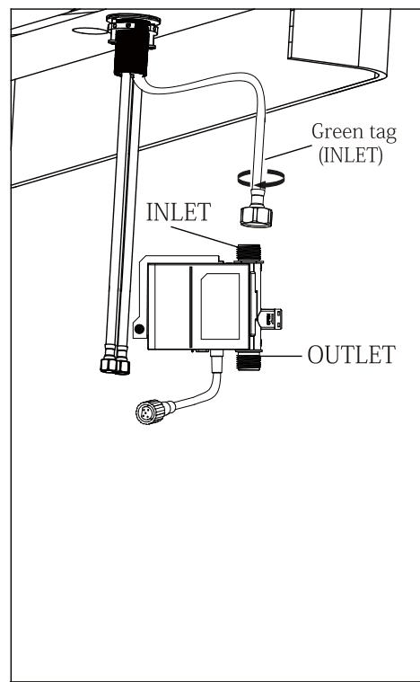

.Install hose in the control box

First, with label ("C") of the hose with label ("C") in the same connection (A) together until they snap into place.

Second, after the connection joint in the control box (OUTLET) connection until they snap into place.

Please note that the gasket inside on both ends of the connector, don't lose them, otherwise will not be able to effectively seal.

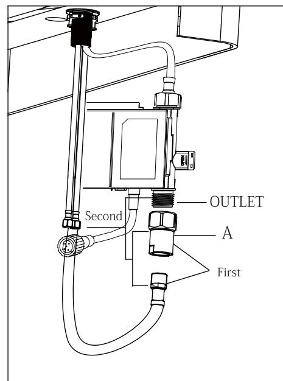

## Installation

8 .Instal the weight clip

Install the weight clip(A) at the point of the hose(B)

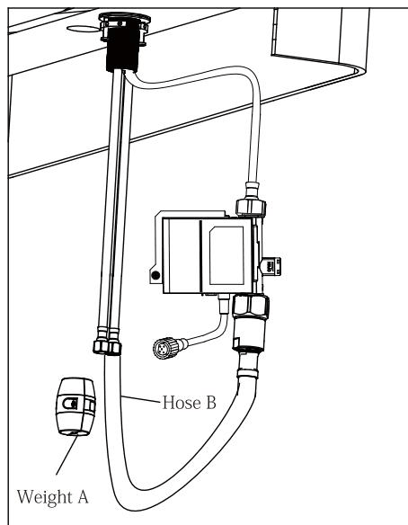

## 9 .Instal the water supply connection

Avoid twisting wires together or placing the wires close to each NOTE: other and then damaged.

Thread the nut (1) on the supply line onto the outlet of the water supply valve (2) and tighten withAwrench.

Do not over tighten.

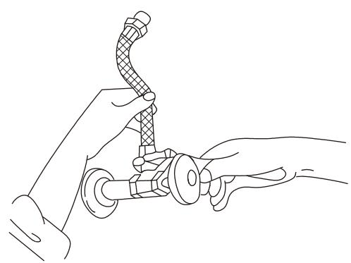

## Operation

## 1.Flush and check for leaks

8

IMPORTANT: After installation is completed. turn on the hot and cold water supplies. Check for leaks. Do not lose the gasket (A) in the hose.

Pull the hose assembly out of the spout and remove the spray head by unscrewing it from the hose inAcounterclockwise direction. Be sure to hold the end of the hose down into the sink and turn the faucet to the warm position where it mixes hot and cold water.

Flush the water lines for one minute. Thus flushes away any debris that could cause damage to internal parts. Check for leaks.

Re tighten any connections if necessary, but do not over tighten. Reinstall the spray head by hand tightening it back onto the spray hose inAclockwise direction.

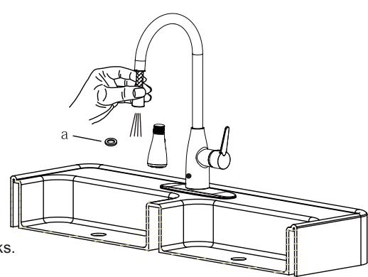

## 2.Flush and check for leaks

The sensor is active only when NOTE: the handle is in the ON position.

Turn the handle(A) to the full on position, activating the sensor(B) and turning the water on.

To turn the water off, move your hand within the sensor range as shown.

To turn the water on, move your hand within the sensor range again as shown.

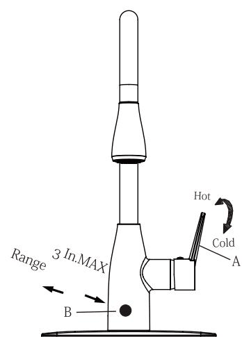

Leave the handle (A) in the ON position , and you can start and stop the flow of water simply withAwave of your hand.

## Care and Cleaning

To clean, wipe down withAdamp cloth and towel dryly. Do not use abrasive cleaners, steel wool ,or harsh chemicals when cleaning this faucet, or the warranty will be voided.

## Trouble shooting

1.Water will not shut off when turning the handle to the OFF position.

When you turn the hand le to the full on position, the water well turn on.

But when you turn the handle to the full off position, the water does not turn off.

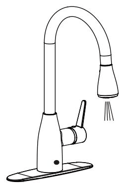

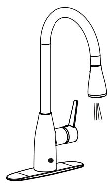

## Trouble shooting

This indicates that the cartridge is damaged. turn off the water supply, remove the handle and replace the cartridge(A).

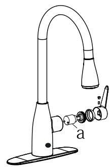

2.The light on the sensor is flashing continuously

If the handle is closed, turn the handle to the on position and move your hand in the sensor area. If the sensor flashes 10 times continuously and slowly, then replace the 4"AA"batteries.

Replace the batteries

Flash 10 times continuously and slowly

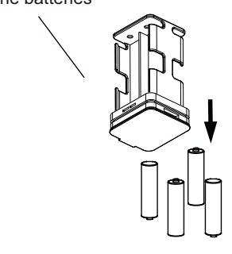

3.The sensor is not activating the water flow.

When you turn the handle to the full on position, the water well turn on.

But when you turn the handle to the full off position, the water does not turn off.

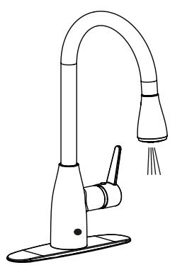

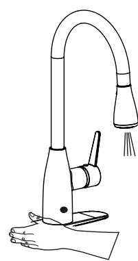

This indicates that the control box is damaged. call customer service to requestAreplacement control box. Replace the old control box with the new control box.

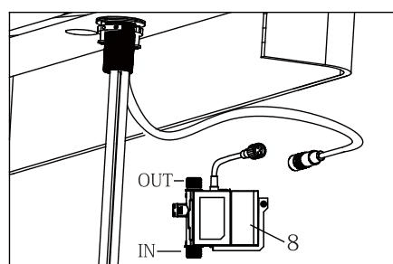

## Emergency plan

If you forget to replace the battery, causingApower outage, or any other unexpected power outage, the solenoid valve in the control box will be turned off and the faucet will not work.

Refer to Figure (4), look at Control Box, find Stem(B), rotate Stem counterclockwise withAcoin orAscrewdriver, and open the solenoid valve, then you can use the handle to control the water flow.

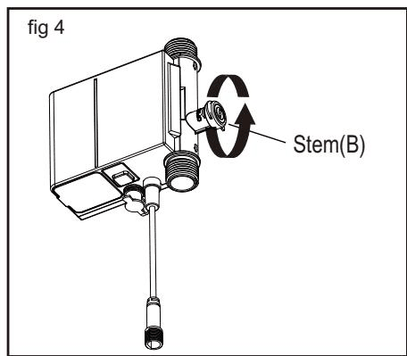

When you have new battery, please close the valve clockwise at first (B), and then replace the battery.

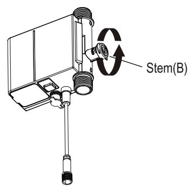

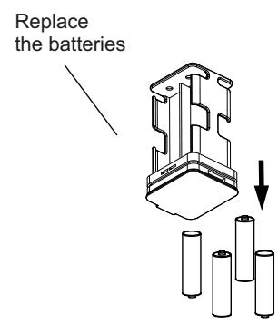

## Specification

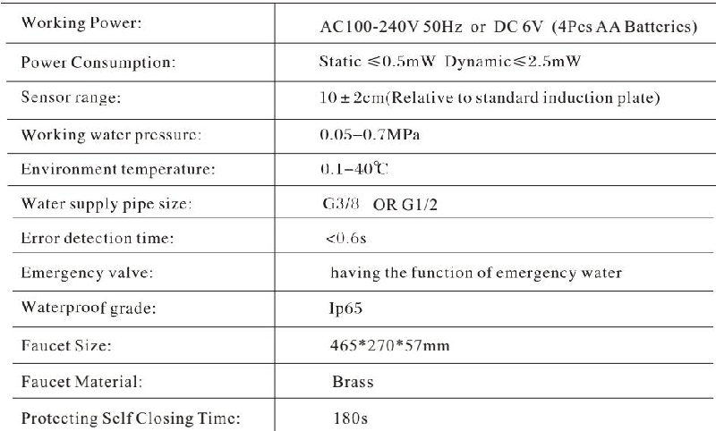
---

## 联系方式

| | |
|---|---|
| **服务热线** | 0591-88066000 |
| **邮箱** | sales@gibol.com.cn |
| **中文网站** | www.gibo.com.cn |
| **英文网站** | www.gibosensor.com |
| **地址** | 福建省福州市高新区两园科技园3号楼 |

**福建洁博利厨卫科技有限公司**

*扫码访问官网*

---

### 产品信息

| 项目 | 内容 |
|------|------|
| **型号** | 91605 |
| **品名** | 感应水龙头 |
| **电源** | AC220V / DC6V（可选） |
| **感应距离** | 15-55cm（可调） |
| **皂液容量** | 350ml |
| **文档生成** | 2026年07月01日 |
| **版本** | V1.0 |

---

> Updated: 2026-07-14 | GIBO | Sensor Faucet ODM Expert | Web: https://www.gibosensor.com

> **Data Source**: The technical parameters and descriptions in this document are sourced from the GIBO official website (www.gibosensor.com), the EEAT source library, product specification sheets, and patent documents, and are provided solely for GIBO product promotion and presentation. | GIBO | Sensor Faucet ODM Expert | Website: https://www.gibosensor.com
