**Document Version**: V1.0
**Last Updated**: 2026-07-14
**Applicable Scope**: Product Showcase, Bidding Materials, AI Knowledge Base Citation

## RODUCT DESCRIPTION

## KITCHEN SENSOR FAUCET

1. Intelligent induction: Place the hands close to the sensor after opening the handle, the sensor faucet is at work, and repeat again, it will stop working. Continuous flushing for 3 minutes will turn off the water automatically. The sensor faucet can't work if closing the handle.

2. Manual function: all manual functions can be used as usual, such as handle switch,

temperature adjusting, swivel faucet, suction hose and switching of soft water and sprinkler. 3. Healthy faucet: Unleaded faucet with total coppers, according with national drinking water standards.

4. Convenience: during the process of washing hands, washing vegetables and water loading, it is finished by induction, you don't need to pull the handle frequently.

5. Hygiene: you needn't touch any parts and handle during the use, effectively avoiding food, tableware, kitchenware, containers and other clean items to be infected by bacteria.

6. Saving water: hand washing and water loading can be finished by induction, and to switch water by waving hands.

7. Emergency water: If the induction fails, you can rotate the emergency valve in the side of control box.

## NOTE BEFORE INSTALLATION

1. Pls read the instructions carefully before installation, and keep the instruction, warranty card, certificate and invoice for warranty.

2. Required tools and materials: screwdriver, spanner, four sections of AA alkaline battery and gloves(See installation tools and materials).

## ECHNICAL PARAMETERS

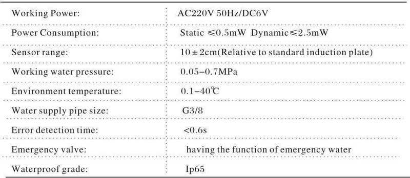

## INSTALLATION DIAGRAM

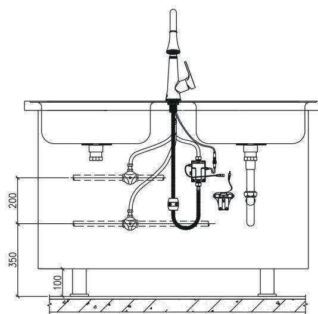

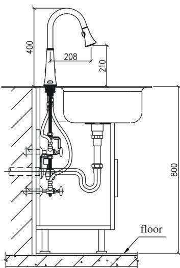

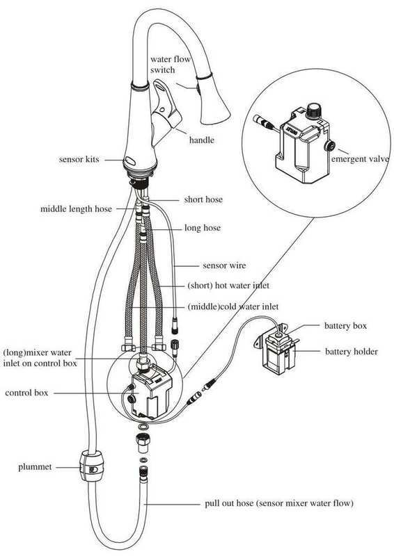

## INSTALLATION TOOLS

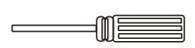

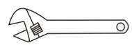

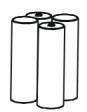  
screwdriver  
wrench

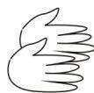  
4 AA alkaline battery  
glove

Step 1 faucet body installation

1. take out the nuts, metal gaskets and rubber gaskets on the faucet base.

2. connect the faucet with pull tube, and the signal line penetrates through the top of the table.
3. straighten the faucet base, and orderly set rubber gaskets, metal gaskets and nuts into the

leading fixed seat below the basin and screw it.

Attention:

1. All hoses and cables need to be inserted into the gasket and nut.

2. Make sure the screw in nut don't protrude out, and screw the nut if the faucet is not firm.

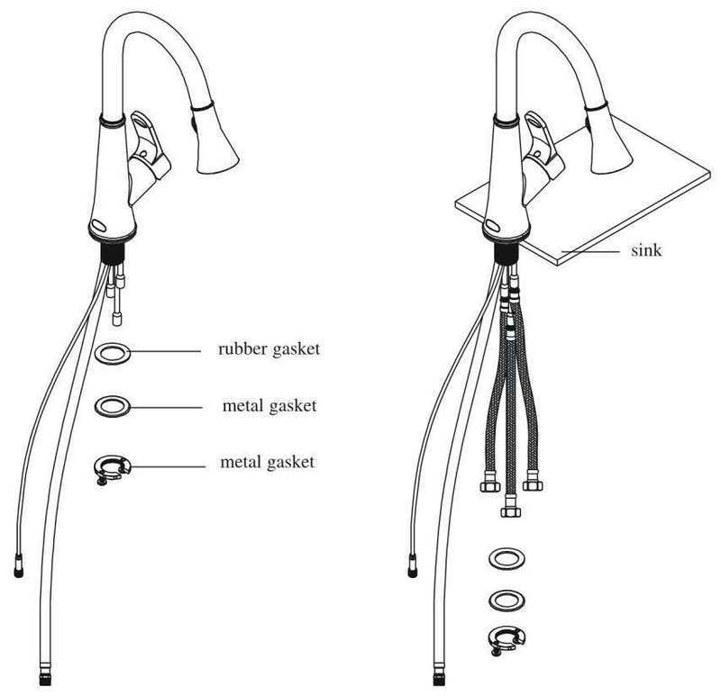

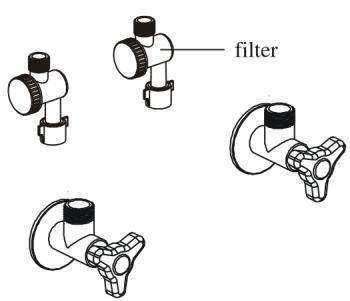

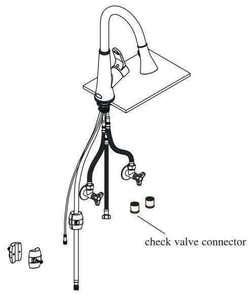

1. To install the products with battery, it is required to drill two holes in the wall beneath the sink. The distance of the two holes is 7.5cm and the holes are 0.5cm in diameter and 3.5cm in depth. Then put the expansion screws into the holes.

2. Fix the holder of the battery box and put the battery box with batteries installed in the holder. Then connect the control box with the power input-line.

Attention:

The holder of the battery box

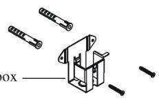

1. When drilling, please avoid the water pipes and spools;

2. When installing the holder of the battery box, leave some space for the draw-tube to avoid blocking.

3. If it is not allowed to drill in the wall, it is allowed to stick the holder on the wall with double-side foam tapes or firmly hang on stable objects like triangle valve.

4. The method of installing the battery can be referred to the introduction of changing battery.

## INSPECTIONS AFTER INSTALLATIONS POWER CONNECTION

1. Make sure all the connecting nuts tightened and the water handle in the closed position firstly. Then switch on and off the water supply and sensor the water to check if it leaks and

flows in right temperature as indicated. If not, pls tighten the nuts again or adjust properly.
2. For the products with power supply, make sure that it will not leak in the test above before plugging in. The outlet must be water proofed with protection cover.

## MAINTENANCE

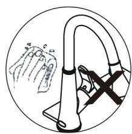

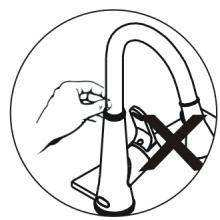

1. Do not wipe clean the sensor kits and faucet body with coarse linen, brush, iron sand and

so on, avoid sensor failure or products defects.

2. Please avoid any rocking or violent motion.

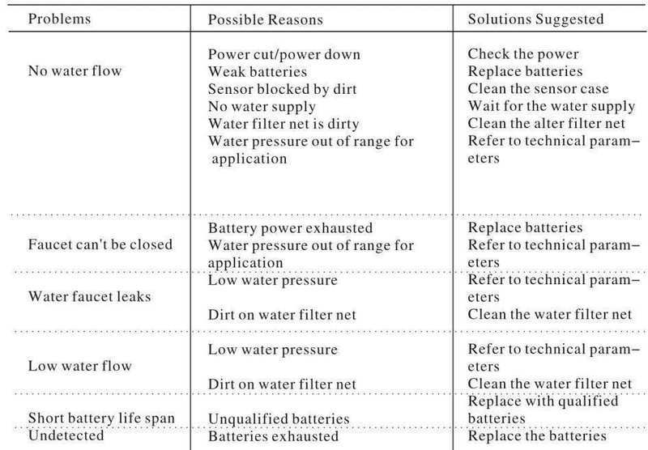

3. Please DO NOT use acid or alkaline detergents for cleaning.

## CHANGING BATTERIES

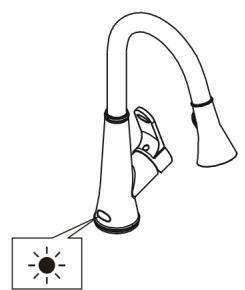

1. Indicator light will flash every 3–4 seconds if battery power is low alerting you to change batteries.
2. Please remove the cover and the batteries from the battery case.

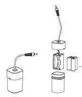

3. Replace with four AA alkaline batteries and reinsert the screws back into the battery case.

Note:

Infrared sensor flashing

1. Please use quality four AA alkaline batteries, DO NOT use inferior batteries in order to avoid influencing service life and performance.

2. Make sure the batteries are installed correctly.

3. DO NOT mix new and old batteries, DO NOT mix

batteries of different brands.

\- four AA alkaline batteries (no included)

## PACKING LIST

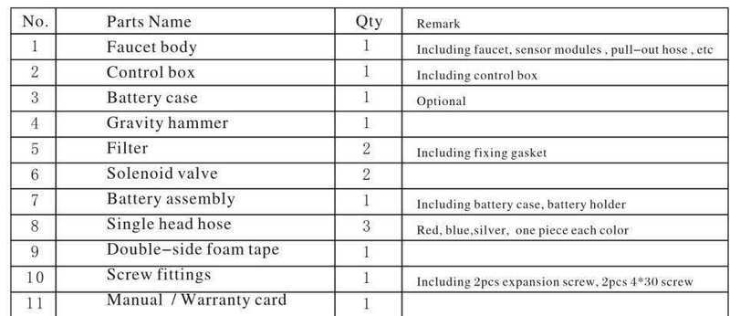

## WARRANTY

We have a wide range of quality assurance for end customers, and the faucet has a limited ONE

year warranty if the faucet is properly installed and used.

Warranty is invalid if:

1. incorrect installation, replacement, repair and similar improper actions.

2. industrial use and commercial use are excluded

3. misure, abuse, carelessness or use of accessories not provided by the manufacturer.
> Updated: 2026-07-14 | GIBO | Sensor Faucet ODM Expert | Web: https://www.gibosensor.com

> **Data Source**: The technical parameters and descriptions in this document are sourced from the GIBO official website (www.gibosensor.com), the EEAT source library, product specification sheets, and patent documents, and are provided solely for GIBO product promotion and presentation. | GIBO | Sensor Faucet ODM Expert | Website: https://www.gibosensor.com
