# G1
**Document Version**: V1.0
**Last Updated**: 2026-07-14
**Applicable Scope**: Product Showcase, Bidding Materials, AI Knowledge Base Citation
## 智能盖板
| | |
|---|---|
| **安装使用说明书** | **INSTALLATION INSTRUCTIONS** |

---

## Auto Constant Temp Heated Toilet Seat

## Operation Manual

## Advantage

1 constant temperature the seat were heated to 31-35 fast and stable intelligently .:℃2 noiseless double buffers make the seatopen and closes oud lessly :

## Features

1 intelligent . the our ' s mini control systemmake the seat keepasuitable constant temperature without handoeration

2 security . the exposed adapter supply 12 VDC current with complete waterproof by UL certified .3 good - looking 25 mm super thickness design with streamline the high - quality material will not yellowing and hold the original color long time

4 health the seat made by PP was cleaned easily and avoid the large growth of bacteria 5 durable the complete seat and the core units were pass the testof aging extreme environment anti - jamming

6 energy saving . the power consumption less than 0.5 degree per day via the 25 w smart control system .

7 comfort the seat were designed toawide ring to sit comfortable

8 quick release . the quick release design to easy installation and replace ,

## Complete List

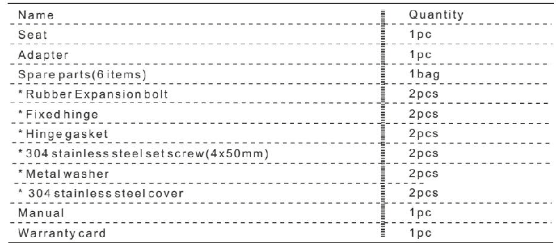
unit mm

## Installation Steps

1 remove the old seat and clean the top surface of bowl

Nst all the new seat refer to the " installation guide " connect the power and done ., i 2

Important

Tools needed : a phillips screwdriveraruler .!

## Installation Guide

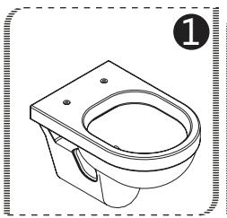

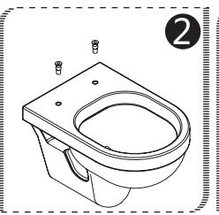
1 remove the old toilet seat and clean the top surface of bowl
2 insert the expansion bolt into the holes

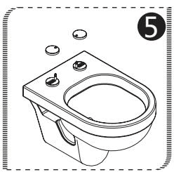
5 put the covers on the hinges .

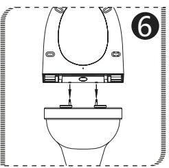
6 push the seaton the hinge .

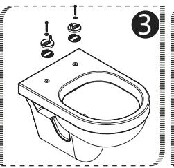

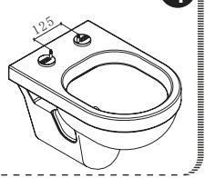
3 screw the hinge gaskets and . the fixed hinges on the bowl .( do not tighten )
4 adjust the distance of the hinges to 125 mm in center and tighten them .

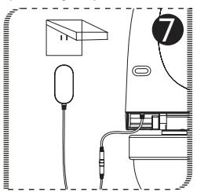
7 connect to the adapter . and plug it in

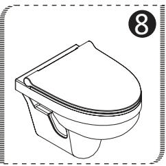
8 store the redundant wire and . close the socket cover .

## Dimensions

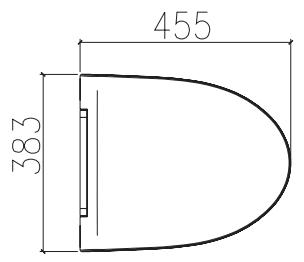

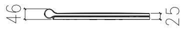

## Specifications

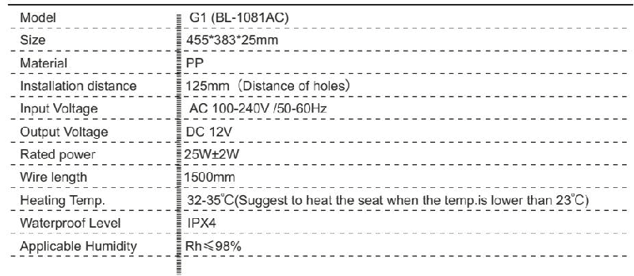

## Instruction of Use

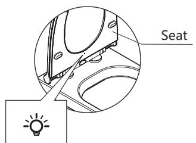
1. the seat start to heatonce accessing power , and the LED light is on
LED indicator light
2 the seat start to heat when its temperature is lower than 31 and the LED light is on ℃3. the seats top heating when its temperature ℃ up to 35, and the LED light is off .4. the seat was heated cyclically .
## Notice
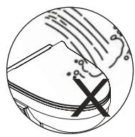

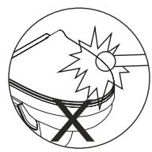

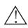

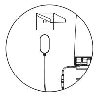

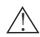

Do not cleaning the toilet seat by water directly it can be cleaned byadamp cloth !

Do not be at the toilet seat by any sharp object like as screwdriver , hammer , etc .

Do not use the strong acid and alkali detergent to clean the toilet seat , including detergent , mordant .!

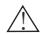

Please use the protective socket to prevent electric leakage .

## Spare Parts Diagram

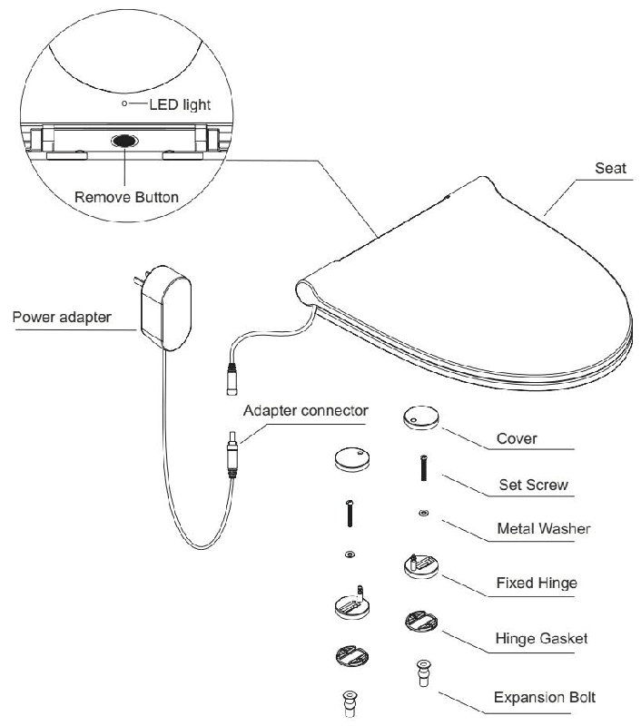
---
## 联系方式
| | |
|---|---|
| **服务热线** | 0591-88066000 |
| **邮箱** | sales@gibol.com.cn |
| **中文网站** | www.gibo.com.cn |
| **英文网站** | www.gibosensor.com |
| **地址** | 福建省福州市高新区两园科技园3号楼 |

**福建洁博利厨卫科技有限公司**

*扫码访问官网*
---
### 产品信息
| 项目 | 内容 |
|------|------|
| **型号** | G1 |
| **品名** | 智能盖板 |
| **电源** | AC220V / DC6V（可选） |
| **感应距离** | 15-55cm（可调） |
| **皂液容量** | 350ml |
| **文档生成** | 2026年07月01日 |
| **版本** | V1.0 |

---

> Updated: 2026-07-14 | GIBO | Sensor Faucet ODM Expert | Web: https://www.gibosensor.com

> **Data Source**: The technical parameters and descriptions in this document are sourced from the GIBO official website (www.gibosensor.com), the EEAT source library, product specification sheets, and patent documents, and are provided solely for GIBO product promotion and presentation. | GIBO | Sensor Faucet ODM Expert | Website: https://www.gibosensor.com
