**Document Version**: V1.0
**Last Updated**: 2026-07-14
**Applicable Scope**: Product Showcase, Bidding Materials, AI Knowledge Base Citation

## NOTE BEFORE INSTALLATION 安装之前

1. Please read the instructions carefully

2. Please give the instructions to the end customer after installation

3. The sketch map is only for reference. Product appearance and accessories please subject to the real object.

4. Please purchase a suitable and usable connector

5. The installation process is easy to implement, but we highly recommended that the plumbing is carried out by a qualified plumber.

6. Please prepare the following tools: wrench, screwdriver, sealing tape, pliers, electric hammer etc.

7. The following installation steps are for reference. Please contact seller if you have any questions on installation.

1、请详细阅读本说明书

2、安装完毕后，请务必将本说明书交给最终客户

3、产品外形及所包含的配件以实物为准，示意图仅供参考

4、请购买一个正确且有效的连接装置

5、建议客户请专业的安装人士安装

6、准备以下工具：活动扳手，螺丝刀，密封胶带，钳子，电锤等

7、以下图例安装步骤仅供参考，一切以所购买实物为准，如遇到不清楚之处，请联系您的销售商

## PREPARATION BEFORE INSTALLATION

1. Please note that tap water is required. Too dirty water will damage solenoid or other devices.

2. In general, infrared sensor faucets may be affected by highly reflective surfaces.

Please do not install too close to shiny surfaces or its sensor directly facing bright lights.

3. Booster should be adopted if the water pressure is lower than $0.05\mathrm{Mpa}$ to ensure faucet flush performance.

4. Decompressor should be adopted if the water pressure is higher than $0.7\mathrm{Mpa}$ to prevent devices damage.

## 安装使用准备工作

1、本机器应使用自来水，不得使用未经过滤和处理的污水不然将可能对机器电磁阀造成损坏。

2、选择安装位置时，应避开阳光或强烈灯光会直接照射到感应窗的位置以免机器性能下降。

3、在水压低于 $0.05\mathrm{MPa}$ 使用时，应加装升压装置，以免冲洗效果下降。

4、在水压高于 $0.7\mathrm{MPa}$ 使用时，应加装减压装置，以免对机器造成破坏。

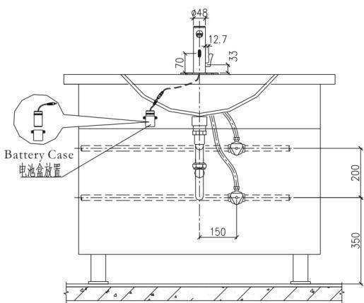

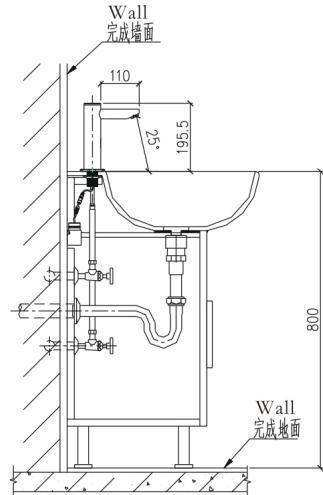

## FAUCET INSTALLATION

Step 1: Screw and fix two flexible hoses at the bottom of the faucet.

Note: Make sure the cold and hot flexible hose are installed correctly according to instruction.

Step 2: Install gasket, nut and screw in sequence showed in the sketch map and fix the assembled faucet onto the basin.

Step 3: Fix battery case foundation onto the wall underneath the basin. Make sure battery case wire and faucet wire can connect with each other.

Put 4AA alkaline batteries into the battery case. Make sure the batteries are installed correctly (“+” positive and “-” negative charge). Put the battery case into the foundation. Connect battery case wire and faucet wire correctly.

This installation process is now complete and the sensor faucet is ready to use.

## 龙头安装

第一步：

如图所示，将两条4分软管对准龙头体底部的进水孔旋入并拧紧。

注意：请按进水孔冷热指示正确接入冷、热水软管。

第二步：

将垫片、螺母、螺丝按图示顺序组装好，再将装好的龙头体锁固

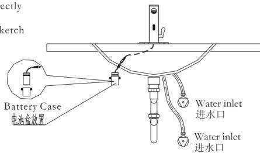

在面盆上。

第三步：

将电池盒基座锁固在台盆下面的墙面上，并确保电池盒线能以龙头引出线对接；

将电池盒按正负极要求装上电池；并把电池盒放置在电池盒基座上，

将电池盒线与龙头引出线按正确正负极方向接驳，这样自动水龙头就全部组装好了。

## FUNCTIONS

1. Automatic flush: Infrared sensor faucet automatically turns on and turns off.

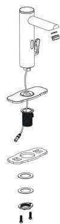

2.Cold & hot water: There is a mixer to adjust water temperature.

3. Work with time limit: When washing time exceeds 60 seconds, the machine will automatically shut down the water supply to avoid water waste cause by blockage of the sensor.

4. Low power indication: Indicate battery changing automatically when the power of it is not enough to support normal functioning of the machine.

## 产品功能

1. 自动冲洗：红外线感应自动开启和关闭。

2. 冷热可调：手动调节调温手柄，冷热温度随意调节。

3. 限时工作：当洗涤时间超过60s时，自动关闭水源，避免因异物长时间感应出水造成资源浪费。

4. 无电提示：当电池电能不足以提供机器正常工作时，自动提示更换新电池。

## FEATURES OF THE PRODUCT

1. Convenience: Automatically open and close water supply needless of manual operation.

2. Hygiene: No need to touch any switch or parts, ensuring your health.

3. Water saving: Stretch the hand to actuate and withdraw to stop. Activate instantly on sensing to save water.

4. Energy saving: Powered by 4 No.5 alkaline batteries, the machine can work without changing batteries at a frequency of 3000 times/month for 1 years.

## 产品特点

1. 方便：开启和关闭水源均由机器自动完成，无需人为操作。

2. 卫生：不需接触任何开关和部件，使您身心健康得以保证。

3.节水：伸手开水，收手停水，即感应即动作，有效节水。

4. 省电：使用4节5号碱性电池，以3000次/月的使用频率，约1年不需要更换电池。

## TECHNICAL STATISTICS

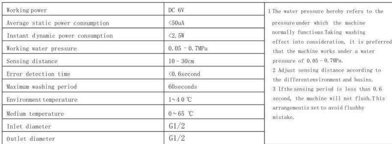

## 技术参数

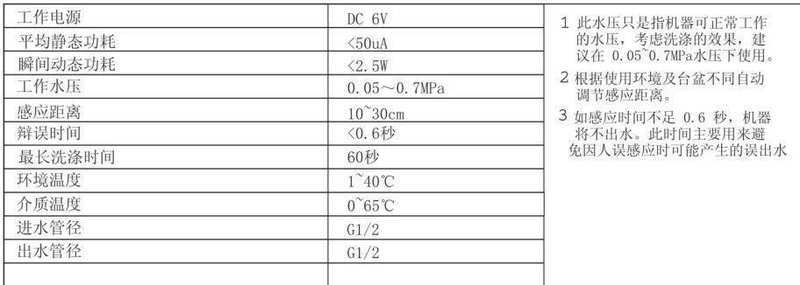

## INSTRUCTIONS 使用说明

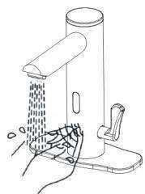

1. Faucet automatically supplies water as soon as hands in sensing range.

1、当手伸到感应范围时，龙头自动出水。

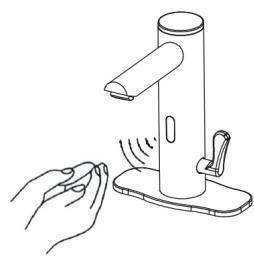

2. Faucet automatically stops working 1s after hands out of sensing range.

2、当手离开感应范围时，龙头自动关水。

## MAINTENANCE 维护保养

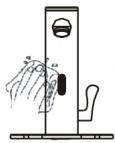

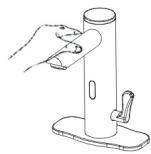

1. Always keep faucet surface clean and dry. DO NOT immerse faucet in water. Please use damp towel or cotton cloth to wipe gently if cleaning is required.

2. Please avoid any rocking or violent motion.

1、请不要用水擦洗，应使用洁净的干软布清洁。

2、请不要摇晃龙头，否则易引起故障。

3. Please DO NOT use acid/alkaline detergents for cleaning.

3、不能用酸碱一类强洗涤剂擦洗。

## BATTERY INSTALLTION

Indicator light will flash every 3-4 seconds if batteries run out, which indicates you should change batteries.

The sensor will force to shut down solenoid if batteries run out to save water. Step 1: Please screw out the battery screws and take out of the battery case cover. Step 2: Replace new 4AA alkaline batteries and fix back the battery case cover. Note: Make sure the batteries are installed correctly ("+" positive and "-" negative charge). DO NOT mix new/old batteries.

DO NOT mix batteries with different brands.

## 更换电池

电池电能耗尽时，该指示灯每隔3\~4s闪亮一次，以通知物业部门更换电池。

电池电能耗尽时，感应器将强制关闭电池阀，防止水资源浪费。

第一步：将电池盒盖上1个螺丝拧下，并拆下电池盒盖。

第二步：换上四节新的5号碱性电池，安装完毕后照原样装回。

注意：电池的正负极性必须正确，不同新旧或不同品牌的电池不能混用。

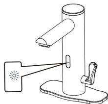

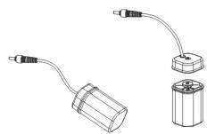

## FAULT DETECT

Please refer to the following suggested solutions if any abnormal phenomena happens. Any problems please contact local distributor.  
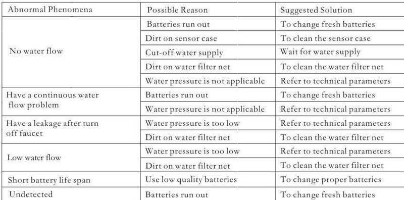

## 简单故障排除

如果在使用过程中发现异常情况，请参照下表来解决。若仍有疑问，请拨打销售商服务电话联系解决。

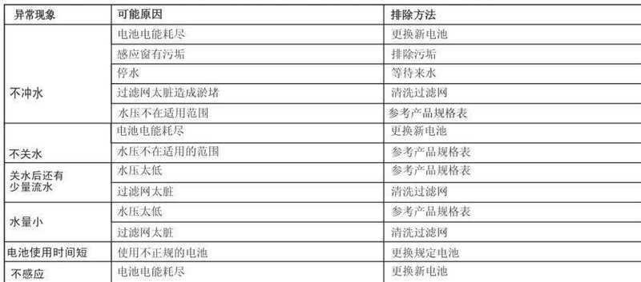

## ONE-YEAR WARRANTY

The faucet has ONE year warranty on the precondition that the faucet is proved to be correctly installed and properly used. Any quality problem within the warranty period will be solved for free.

The following quality problems are EXCLUDED in warranty.

Incorrect installation, replacement, repair and similar improper actions.

2) Industrial use and commercial use will not be guaranteed.

3) Misuse, abuse, carelessness usage or use accessories not provided by the supplier.

Please safekeep receipt after you buy the product.

Supplier has right to use latest maintenance accessories.

## 1年有限担保

\* 我司对产品的最终客户有广泛的质量保证，我司产品在被证明正常安装和使用的请提下，保修期为1年。在保修期内对有质量问题的产品免费维修。

\* 对于在以下行为中产生质量问题的不包括在此保证范围内

1）因非正常安装，替换，修理及类似的行为中产生的质量问题的不包括在此保证范围内

2）对于工业和商业用途的产品不包括在此保证范围内，但此保证会自动延续到此用途的客户手中，依此类推

3）对于误用，滥用，疏忽和使用非我司配件所产生的质量问题不包括在此保证范围内

\* 请妥善保管购买产品时的发票，以便我们能更好的为您服务

\* 公司保留维修时使用最新配件的权利

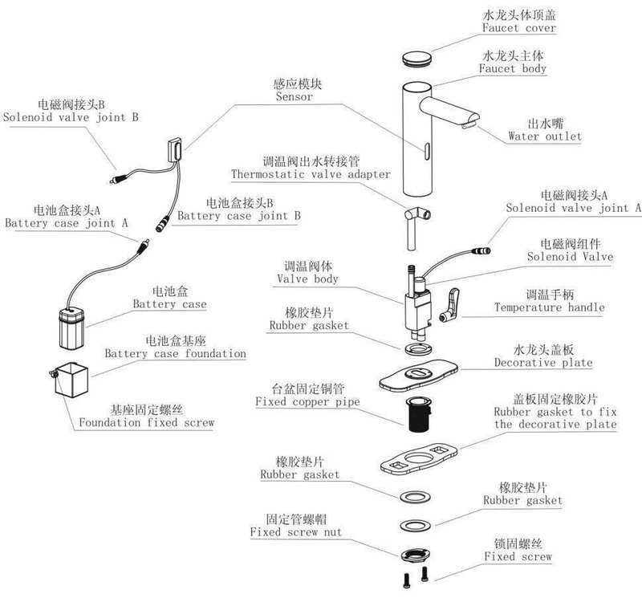

## GBL-6108D感应龙头出货检验标准

检测依据: CJ/T194-2004《非接触式给水器具》

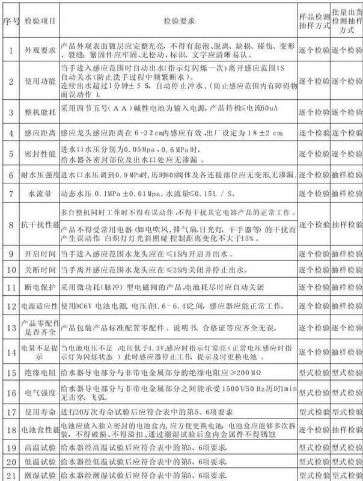

## GBL-6108D InspectionStandards

Inspection Basis:CJ/T194-2004 "Touch Free Water Supply Facility"  
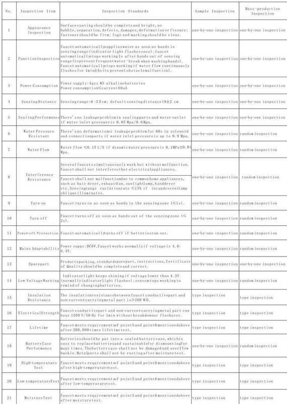
> Updated: 2026-07-14 | GIBO | Sensor Faucet ODM Expert | Web: https://www.gibosensor.com

> **Data Source**: The technical parameters and descriptions in this document are sourced from the GIBO official website (www.gibosensor.com), the EEAT source library, product specification sheets, and patent documents, and are provided solely for GIBO product promotion and presentation. | GIBO | Sensor Faucet ODM Expert | Website: https://www.gibosensor.com
