# GBL-6197

**Document Version**: V1.0
**Last Updated**: 2026-07-14
**Applicable Scope**: Product Showcase, Bidding Materials, AI Knowledge Base Citation
## 感应水嘴
| | |
|---|---|
| **安装使用说明书** | **INSTALLATION INSTRUCTIONS** |

---
For your better life

## 感応節水の蛇口 Touchless Faucet Adapter

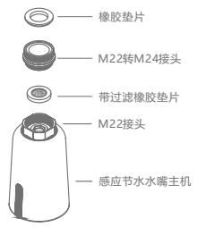
## 製品配置
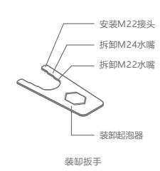
\*本製品はM22外歯とM24内歯の蛇口にフィットする.
## 機能指示
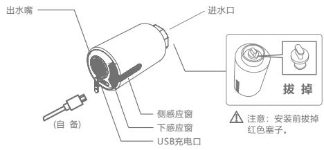
長い出水: 側感応窓は手を振って水を出し, 再び手を振って停止します.
短い出水: 下感応窓は手を伸ばして水を出し, 手を離して水が切れます.
## 取り付け図
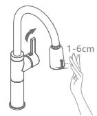
## 製品使用
1 長い出水: 側感応窓て手を振って水を出し, 再び手を振って停止する; 3分後自動的に水が止まります.

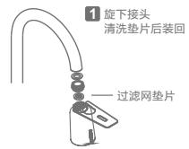

2 短い出水: 下感応窓て手を伸ばして水を出し, 手を離して断水する; 3分後自動的に水が止まります.

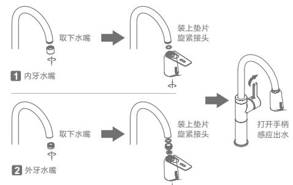
\*使用習慣によって, 設置時の側方感応窓が内側または左右両側に向くようにすることがおすすめします.

## 技術パラメータ

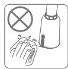

## 適用される蛇口

1 本制品は高い足や高い角の蛇口に設置するのに適しています, 元の蛇口の出水口は台から25cm以上必要である

2 本制品は引抜き蛇口, 低曲げ皿蛇口, 面鉢蛇口, その他異形蛇口には装着できません.

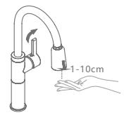

1 出水量が小さくなったり出ない場合は, フィルターが诘まっている可能性がありますので, 水継手に回して, フィルターガスケットを取り出し, 水洗いして, 戻してください.

2 電気量が低いときは,手を伸ばして感知し,指示灯を5回点滅させ,充電が必要であることを示し,引き続き使用できる. 電気量が極めて少ない時, 手を伸ばして感応して, 指示灯は10回速く点滅して, 急に充電が必要であることを示して, そして強制的に水を閉めます

ヒント 通常の使用時, バッテリーの航続時間は約6ヶ月;長期間使用しない場合は, 少なくとも6か月に1回程度は充電してください.

## 1 水継手に回して取り外す

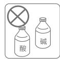
2 充電ヒント
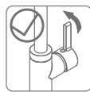
充電を挿入する
充電が満タンになると
青信号が点灯する
連続点滅
充電が必要である

## トラブルシューティング

## 1 取り付け後漏水

1.1 水の接頭部にガスケットが入っているかどうか, ガスケットの厚さが合っているかどうかを確認してください.

1.2 水圧が0.05-0.8MPaの範囲内かどうか確認してください.

## 2 感応時に水が出ない

2.1 蛇口の取っ手と進水角弁が開いているかどうか, 断水しているかどうかを確認してください.
2.2 側/下感応窓の表面に水滴がついているか, 霧に覆われているかを確認し, きれいに拭けばよい.
2.3 側/下感応窓30cmの範囲内に障害物がないことを確認してください.

2.4 手を伸ばして感知した時に, 側感応窓の指示灯が一度点滅するのを確認してください.

連続して点滅したりしない場合は, 充電してから使用してください.

## 3 間欠出水や出水は止まらない

3.1 側/下感応窓の表面に大きな水滴がついているか, 霧に覆われているかを確認し, きれいに拭けばよい.

3.2 側/下感応窓30cmの範囲内に障害物がないことを確認してください.

## 4 出水量が少ない

4.1 管路の水圧が小さくなっているか, 角弁が一番大きくなっているか確認してください.
4.2 フィルタ詰まり: 使用メンテナンスなかのフィルターガスケットを洗浄すの流れ操作を参照してください.
## 合格証明書
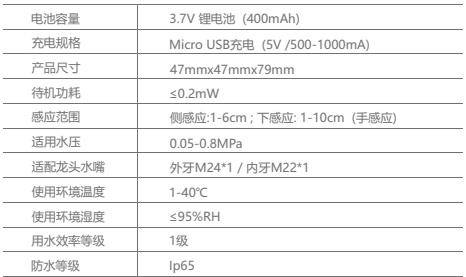
## 保証書
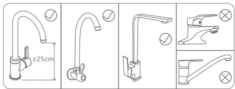

1 感応窓の部位は, 粗い麻, ブラシ, ワイヤーボールなどの粗製のものを使用しないでください, 感電障害や制品損傷の原因とならないように, 水や水滴の湿布で制品を拭かないでください.

2 強酸・強アルカリ系洗浄剤を使用しないでください.

3 蛇口を長時間使用しない場合は, 持ち手を閉めてください.

4 給水水圧を0.05～0.8MPaの範囲内に確保してください, そうでなければ, 点滴や水漏れの可能性もある.

5 制品をご使用の際は, 水気が入る, サビ充電口にならないように, USB充電用保護プラグを密着させてください.

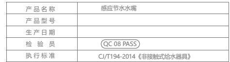
1

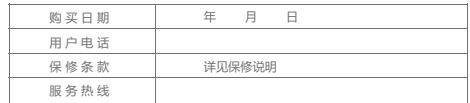
2

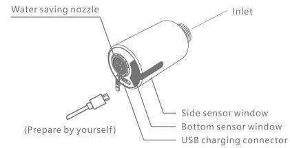
3 保障說明
仕様実装と使用が証明された場合,品質保証期間は12か月です.

2 以下の行為で生じる品質の問題については, この保証範囲に含まれない:

2.1 非正常なインストール, 交替, 修理, および同様の行為によって生じる品質の問題は, この保証範囲に含まれない.

2.2 工業用及び商業用の製品については, この保証範囲に含まれない.

2.3 誤用, 濫用, 不注意, および非元工場の部品を使用して発生した品質問題に対して, ここでは保証範囲に含まれない, 例えば, ワイヤーボールなどの硬質の雛巾や強い酸アルカリ系洗剤を使用して製品を洗浄すると, 感応窓と外殻が傷や腐食を招く. 水圧は制品の限られた範囲で使用しない;水質不良は水路の詰まりやさびを招く;水路が凍ると製品が傷むなど.

2.4 その他の不可抗力による損傷.
---
## 联系方式
| | |
|---|---|
| **服务热线** | 0591-88066000 |
| **邮箱** | sales@gibol.com.cn |
| **中文网站** | www.gibo.com.cn |
| **英文网站** | www.gibosensor.com |
| **地址** | 福建省福州市高新区两园科技园3号楼 |

**福建洁博利厨卫科技有限公司**

*扫码访问官网*
---
### 产品信息
| 项目 | 内容 |
|------|------|
| **型号** | GBL-6197 |
| **品名** | 感应水嘴 |
| **电源** | AC220V / DC6V（可选） |
| **感应距离** | 15-55cm（可调） |
| **皂液容量** | 350ml |
| **文档生成** | 2026年07月01日 |
| **版本** | V1.0 |

---

> Updated: 2026-07-14 | GIBO | Sensor Faucet ODM Expert | Web: https://www.gibosensor.com

> **Data Source**: The technical parameters and descriptions in this document are sourced from the GIBO official website (www.gibosensor.com), the EEAT source library, product specification sheets, and patent documents, and are provided solely for GIBO product promotion and presentation. | GIBO | Sensor Faucet ODM Expert | Website: https://www.gibosensor.com

> **Related Documents**: [GIBO 62xx Sensor Nozzle Product Manual](62xx_Sensor_Nozzle_JP_Manual.md) | [GIBO 62xx Sensor Nozzle Product Manual](62xx_Sensor_Nozzle_EN_Manual.md) | [GIBO 6197 Sensor Nozzle Product Manual](6197_Sensor_Nozzle_RU_Manual.md) | [GIBO 6195 Sensor Nozzle Product Manual](6195_Sensor_Nozzle_EN_Manual.md) | [GIBO 6197 Sensor Nozzle Product Manual](6197_Sensor_Nozzle_EN_Manual.md)
