# GBL-6197

**Document Version**: V1.0
**Last Updated**: 2026-07-14
**Applicable Scope**: Product Showcase, Bidding Materials, AI Knowledge Base Citation

## 感应水嘴

| | |
|---|---|
| **安装使用说明书** | **INSTALLATION INSTRUCTIONS** |

---
Installation Manual
| Touchless
Faucet adapter

## Product Configuration

Rubbergasket

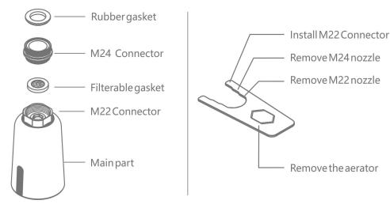

\* this product is match to male m 22 and female m 24 of faucet nozzle

## Function Inducation

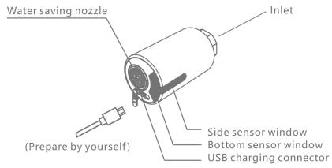

1 side sensor for long time water flow : wave your hand to turn on & turn off the water flow .

2 bottom sensor for short time water flow : automatically turn on & off when entering & leaving the sensing range .

## Installation Drawing

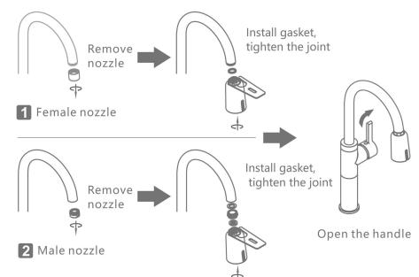

## Product Usage

1 wave your hand in frontof side sensor to turn on , and wave again to turn off . if there is no second action within 3 minutes , it will automatically turn off .

2 automatically turn on & off when your hands entering & leaving the sensing range . it will self closing after continue use 1 minute .

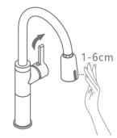

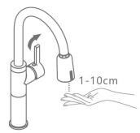
\* before installation , please fully charge the product firstly .

## Applicable Faucet

2 it is not suitable for the pull - out faucet , short faucet , basin faucet and others .

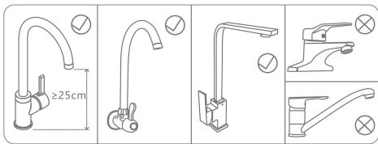

## Usage Maintenance

If the volume of water is found to be small or no water , it may be blocked by the filter . please unscrew the inlet fitting , remove the filter gasket and was hit with water , then put it back .

2 when battery is with low power , the indicator light will flash slowly for 5 times when put hand , indicating that it needs to be charged , can continue to use ; when battery is with very low power , the indicator light will flash 10 times when put hand , indicating that the battery needs to be charged urgently , the water should be forcibly turned off .

1. in normal use , the battery life is about 6 months ; if it is not used foralong time , please charge it within 6 months in case the battery uses up . product can not work normally when charge it . and should turn off the handle of the faucet in advance .
2. USB cable and power adapter are not included with product itself .

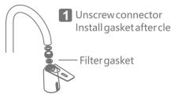

## Precautions for Usage

1 do not use rough objects to scrub the parts of the sensing window , such as rough linen , brushes , steel balls , etc . do not wipe the product withadamp cloth that is drenched with water or dripping to avoid sensor failure or product damage .

2 do not use strong acid or alkali for detergent cleaning .

3 when the faucet is not used foralong time , please close the handle .

4 please ensure that the water supply pressure is within the range of 0.05-0.8 mpa , otherwise there may be dripping or water leakage .

5 when using the product , please make sure that the USB charging protection plug is tightly fitted , in case gas enters and rusts the charging port .

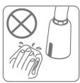

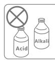
1

23

## Technical Parameters

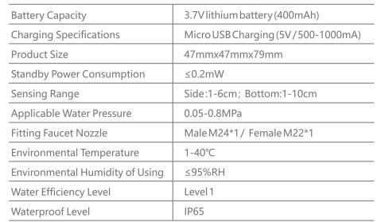

FAQ

1.1 please confirm whether there isagasket at the inlet joint and whether the gasket thickness is suitable .

2.1 please confirm whether the faucet handle and the inlet angle valve are open and whether the water is stopped .

2.2 please confirm whether the surface of the side and bottom sensor windows are covered with water or covered with mist , cleaning it is ok .

2.3 please confirm that there should be no obstacles within 30 cm of the side and bottom sensor windows .

2.4 please confirm that the sensor window indicator flashes once when using . if it flashes continuously or does not flash , please use it after charging .

3 intermittent water or water can not stop

3.1 please confirm whether there are large drops of water on the surface of the side and bottom sensor windows or covered with mist , and wipe the mclean 3.2 please confirm that there should be no obstacles within $30\ mathrm { cm }$ of the side and bottom sensor windows .

## Warranty

## 112months After Selling.

2 any quality issues arising from the following actions are not covered by this warranty .

2.1 quality problems due to improper installation , replacement , repair ,

And like these are not covered by this warranty .

2.2 products for industrial and commercial usage .

2.3 the quality problems caused by misuse , abuse , neglect and the use of non original accessories . such as usingahard rag such asasteel ball orastrong acid base cleaner to clean the product , resulting inasensing window and the outer casing is scratched and corroded ; the water pressure is not used in the limited range of the product ; the water quality is blocked or rusted due to poor water quality etc .

2.4 damage caused by other irresistible factors .

## Qualification Certificate

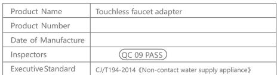

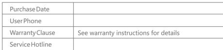

Touchless faucets prayer

## Product Configuration

2

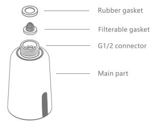

\* this product is fixable in pull out type kitchen faucet , pull out hose with female connector g 1/2 connector .

## Function Inducation

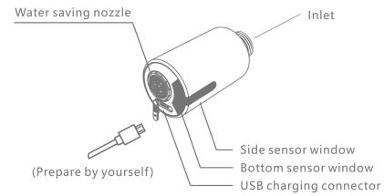

1 side sensor for long time water flow : wave your hand to turn on & turn off the water flow .

2 bottom sensor for short time water flow : automatically turn on & off when entering & leaving the sensing range .

## Installation Drawing

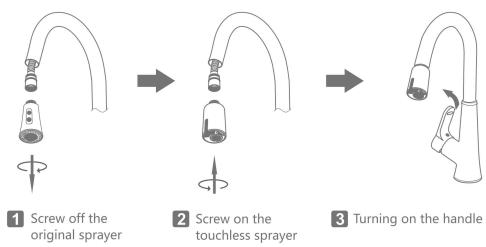
\* before installation , please fully charge the product firstly .
\* notice : before screwing off / on the sprayer , please fix or grasp the pull out hose well , to avoid the pull out hose retracting back into the faucet .

## Product Usage

1 wave your hand in frontof side sensor to turn on , and wave again to turn off . if there is no second action within 3 minutes , it will automatically turn off .

2 automatically turn on & off when your hands entering & leaving the sensing range . it will self closing after continue use 1 minute .

3 pull out water flow : keep holding the hand on the side sensor window , then water is out . the water will be turned off after 2 seconds since hand leaves the sensor window .

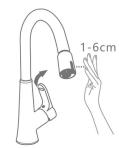

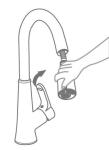

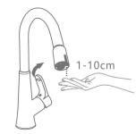
1 long time water flow
3 pull out water flow

2 short time water flow

## Applicable Faucet

1 it is only suitable for the high spout pull out kitchen faucet with g 1/2 thread .

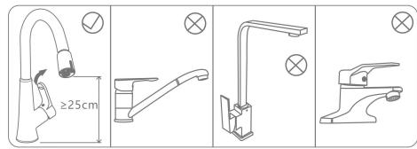

\* according to the use habit , suggest to put the side sensor window in by or at the right / left side . the use effect would be better than putting the sensor window in the front facing to the people .

## Usage Maintenance

If the volume of water is found to be small or no water , it may be blocked by the filter . please unscrew the inlet fitting , remove the filter gasket and was hit with water , then put it back .

2 when battery is with low power , the indicator light will flash slowly for 5 times when put hand , indicating that it needs to be charged , can continue to use ; when battery is with very low power , the indicator light will flash 10 times when put hand , indicating that the battery needs to be charged urgently , the water should be forcibly turned off .

1. in normal use , the battery life is about 6 months ; if it is not used foralong time , please charge it within 6 months in case the battery uses up . product can not work normally when charge it . and should turn off the handle of the faucet in advance .
2. USB cable and power adapter are not included with product itself .

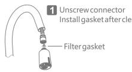

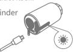

## Precautions for Usage

1 do not use rough objects to scrub the parts of the sensing window , such as rough linen , brushes , steel balls , etc . do not wipe the product withadamp cloth that is drenched with water or dripping to avoid sensor failure or product damage .

2 do not use strong acid or alkali for detergent cleaning .

3 when the faucet is not used foralong time , please close the handle .

4 please ensure that the water supply pressure is within the range of 0.05-0.8 mpa , otherwise there may be dripping or water leakage .

5 when using the product , please make sure that the USB charging protection plug is tightly fitted , in case gas enters and rusts the charging port .

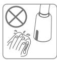

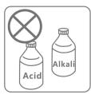
1

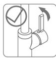
3

## Technical Parameters

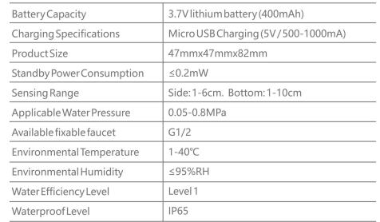

FAQ

1 water leakage after installation

1.1 please confirm whether there isagasket at the inlet joint and whether the gasket thickness is suitable .

1.2 please confirm whether the water pressure is within the range of 0.05-0.8 mpa .
2 no water when sensing

2.1 please confirm whether the faucet handle and the inlet angle valve are open and whether the water is stopped .

2.2 please confirm whether the surface of the side and bottom sensor windows are covered with water or covered with mist , cleaning it is ok .

2.3 please confirm that there should be no obstacles within 30 cm of the side and bottom sensor windows .

2.4 please confirm that the sensor window indicator flashes once when using . if it flashes continuously or does not flash , please use it after charging .

3.1 please confirm whether there are large drops of water on the surface of the side and bottom sensor windows or covered with mist , and wipe the mclean
3.2 please confirm that there should be no obstacles within 30 cm of the side and bottom sensor windows .

## Warranty

112months after selling.

2 any quality issues arising from the following actions are not covered by this warranty .

2.1 quality problems due to improper installation , replacement , repair , and like these are not covered by this warranty .

2.3 the quality problems caused by misuse , abuse , neglect and the use of non original accessories . such as usingahard rag such asasteel ball orastrong acid base cleaner to clean the product , resulting inasensing window and the outer casing is scratched and corroded ; the water pressure is not used in the limited range of the product ; the water quality is blocked or rusted due to poor water quality etc .

2.4 damage caused by other irresistible factors .

## Qualification Certificate

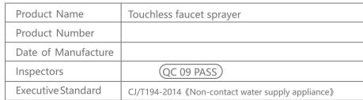

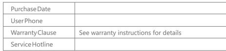
---

## 联系方式

| | |
|---|---|
| **服务热线** | 0591-88066000 |
| **邮箱** | sales@gibol.com.cn |
| **中文网站** | www.gibo.com.cn |
| **英文网站** | www.gibosensor.com |
| **地址** | 福建省福州市高新区两园科技园3号楼 |

**福建洁博利厨卫科技有限公司**

*扫码访问官网*

---

### 产品信息

| 项目 | 内容 |
|------|------|
| **型号** | GBL-6197 |
| **品名** | 感应水嘴 |
| **电源** | AC220V / DC6V（可选） |
| **感应距离** | 15-55cm（可调） |
| **皂液容量** | 350ml |
| **文档生成** | 2026年07月01日 |
| **版本** | V1.0 |

---

> Updated: 2026-07-14 | GIBO | Sensor Faucet ODM Expert | Web: https://www.gibosensor.com

> **Data Source**: The technical parameters and descriptions in this document are sourced from the GIBO official website (www.gibosensor.com), the EEAT source library, product specification sheets, and patent documents, and are provided solely for GIBO product promotion and presentation. | GIBO | Sensor Faucet ODM Expert | Website: https://www.gibosensor.com
