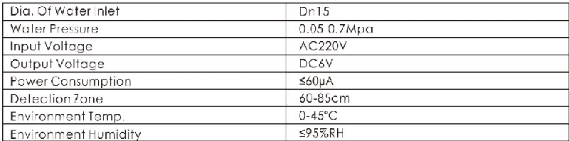
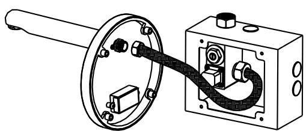
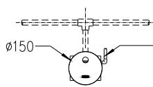
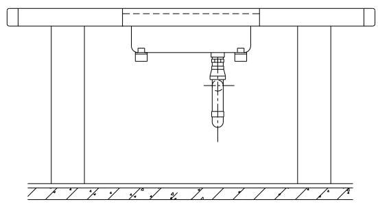
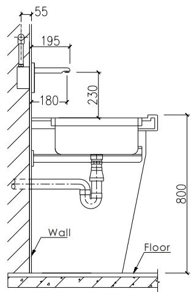

# GBL-6198

**Document Version**: V1.0
**Last Updated**: 2026-07-14
**Applicable Scope**: Product Showcase, Bidding Materials, AI Knowledge Base Citation
## 感应水嘴
| | |
|---|---|
| **安装使用说明书** | **INSTALLATION INSTRUCTIONS** |

---
## Automatic Hand Washer

## Use Instruction

Thankyou for choosing our sanitaryware . hope to bring you sat is fa tion and good service !

Pls install the washer according to the below drawing . it ' s convenient & hygienic for using and water saving . suit for hotels , restaurants , wcs , hospitals , commercial buildings and other public places . it has past national ma quality certification .

1. features : w / infrared sensing principle , wall mounted sensor hand washer gbl -6198 ad is set to water once detected .

2. using : when people get into detection zone ( around 12 cm in frontof the washer ), the light will turn on and water comes out . when finished , people leave detection zone , the water will stop .

3. installation : pls install the water strictly according to the below drawing and the instruction on the protecting case by professionals .

4. testing : detection zone has been set before ex - factory . it can be use after connecting to water and power . some special places needaspecial detection zone . pls use screwdriver to adjust the button on pcb . clockwise rotation make it longer when anticlockwise make it shorter .

## Technical Parameters

## Installing Scheme for Gbl -6198 Ad

Power wire comes through pipe AC 220 v

Unit: mm

## Notes
Install the controller strictly according to the direction in left drawing .

When flow rate becomes small or no water comes out , pls clean the filter in water inlet . don ' t remove it !

Keep the sucker well for future maintenance .

Keep the glass of sensor eye clean . not to clean it by chemical liquid . only neutral detergent and clean water is acceptable .
---
## 联系方式
| | |
|---|---|
| **服务热线** | 0591-88066000 |
| **邮箱** | sales@gibol.com.cn |
| **中文网站** | www.gibo.com.cn |
| **英文网站** | www.gibosensor.com |
| **地址** | 福建省福州市高新区两园科技园3号楼 |

**福建洁博利厨卫科技有限公司**

*扫码访问官网*
---
### 产品信息
| 项目 | 内容 |
|------|------|
| **型号** | GBL-6198 |
| **品名** | 感应水嘴 |
| **电源** | AC220V / DC6V（可选） |
| **感应距离** | 15-55cm（可调） |
| **皂液容量** | 350ml |
| **文档生成** | 2026年07月01日 |
| **版本** | V1.0 |

---

> Updated: 2026-07-14 | GIBO | Sensor Faucet ODM Expert | Web: https://www.gibosensor.com

> **Data Source**: The technical parameters and descriptions in this document are sourced from the GIBO official website (www.gibosensor.com), the EEAT source library, product specification sheets, and patent documents, and are provided solely for GIBO product promotion and presentation. | GIBO | Sensor Faucet ODM Expert | Website: https://www.gibosensor.com
