# GBL-6215

**Document Version**: V1.0
**Last Updated**: 2026-07-14
**Applicable Scope**: Product Showcase, Bidding Materials, AI Knowledge Base Citation

## 感应小便器

| | |
|---|---|
| **安装使用说明书** | **INSTALLATION INSTRUCTIONS** |

---
## 面板安装

a. 将施工保护罩固定于预埋盒上;

b. 进行水泥墙面铺平工程, 并以图示将瓷砖贴上, 完工后瓷砖面正好与施工保护罩持平, 并使墙面紧贴施工保护罩四侧;

c.壁面工程完成后, 即可拆下施工保护罩, 连接好电源, 将电源线端子与电磁阀端子分别对接, 然后将面板固定于预埋盒上即可.

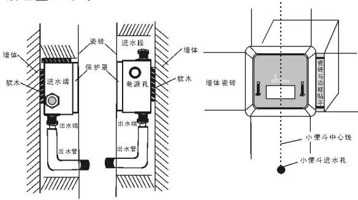

## 小便斗安装

a, 根据小便斗尺寸, 将小便斗高度固定在最佳位置.

b, 将工字塞与装饰杯套入小便斗进水弯管, 下端固定于小便斗撒水器之内.

c, 将橡胶塞与装饰杯接入小便斗进水弯管, 根据安装位置, 调节适当的高度和深度, 将上端与感应器出水口对接, 并旋紧螺帽.

d, 根据水压及流量进行水压调试, 并把感应距离设定在最佳长度.

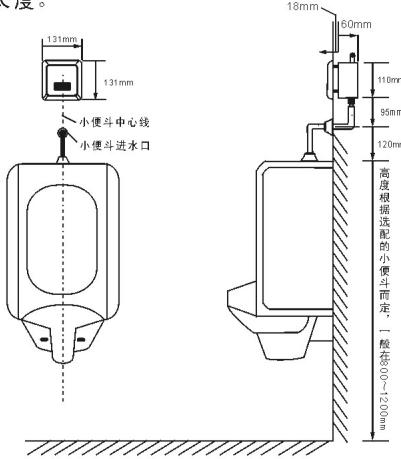
标准安装位置图

## 安装步骤

## 准备工作

a. 安装前确认配电电压与产品规格是否相符;

b. 确认墙体厚度是否大于产品规格中的埋墙尺寸;

c. 安装前测量好小便斗及冲水器面板的安装位置;

d. 小便斗与出水口保持在同一中心线上.

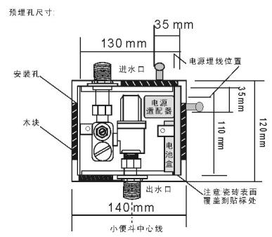

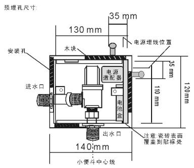

## 固定预埋盒

a. 将预埋盒置入预埋孔(出水口向下);

b. 将进水管及出水弯管分别接入冲水器进, 出水口, 并锁紧螺帽, 出水口必须保持与小便斗在同一中心线上;

c. 将电源线从预埋盒电源孔穿入, 并与感应器电源连接;

d. 在预埋盒四周用木块垫平, 使预埋盒与地面保持同一水平线;

e. 进行进水管路给水测试, 确认管路无渗漏水之处.

自动感应小便斗冲水器安装使用说明书

## 安装必读

\*安装使用前, 请详细阅读本说明书.

\*安装完毕后, 请将说明书移交给使用客户.
\*安装预埋盒时必须保持瓷砖面紧贴施工保护罩四侧.

\*安装小便斗时必须保证出水口与小便器保持在同一中心线上.

\*超薄预埋盒, 厚度60mm

## 产品说明

## 产品描述

1.智能冲水: 机器可根据小便斗的使用频率及每次使用时间的长短, 进行智能化控制, 更有效节水.

2.节水模式: 根据不同应用场合的使用频率, 控制工作模式, 达到智能节水目的.

3.智能防臭: 当小便斗长期处于不使用状态, 机器将每隔24小时自动冲水一次, 以防止存水弯存水干涸, 导致臭气回窜.

4.弱电提示: 当电池电量不足以提供机器正常工作时, 自动提示更换新电池.

## 产品规格

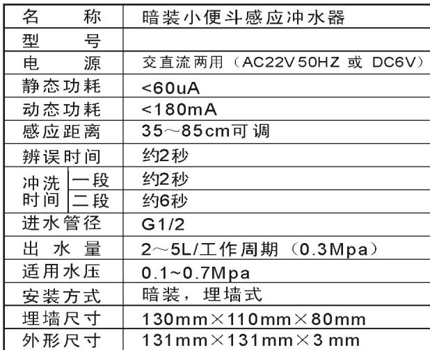

## 使用说明

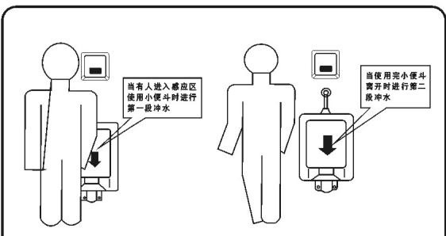
使用者立于小便斗前方30cm以内, 2秒后进行第一次冲水2秒
使用者使用完毕后, 进行第二次冲水, 时间4\~8秒
第二次冲水根据使用时间长短自动调整冲水时间

## 维护说明

## 维护须知

## 1. 感应距离调节

感应距离调整时, 在面板背面找到小旋钮位置, 用小型"一字"螺丝刀旋转调整, 顺时针方向可调长感应距离, 逆时针方向调短感应距离, 调整完毕将面板固定回原来位置即可.

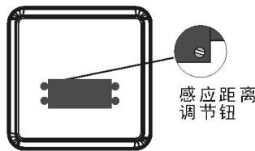

## 2. 水量调节

需要调整水量时, 请用"一字"螺丝刀旋转调整至合适位置, 顺时针方向水量变小(旋到底为止水), 逆时针方向水量变大.

## 3. 清洗过滤网

需要清洗过滤阀时, 请用"一字"螺丝刀旋出过滤网, 用清水冲洗干净后重新装回即可.

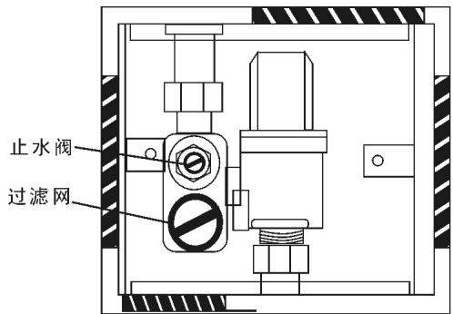

## 调整完毕后将面板固定回原来位置.

## 更换电池

从预埋盒中取出电池盒, 找到螺丝固定位置, 旋出螺丝, 按提示方向轻轻推出滑盖.

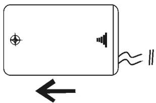

将4节7号碱性电池按照提示(十一)依次装入电池盒内, 重新装上滑盖, 并旋紧螺丝.

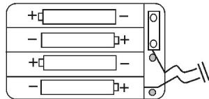

\- 电池正负(+-)极性必须正确;

\- 不同新旧, 类型或品牌的电池不可混合使用;

\- 指示灯一直闪烁, 表示电池电量不足, 请及时更换电池. (直流型产品适用).

## 注意事项

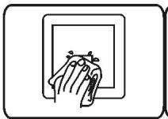
请不要用水直接冲洗若不洁请使用湿布擦拭

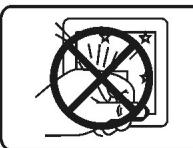
请不要撞击否则易引起故障

不能用酸碱一类强腐蚀性洗涤剂来擦洗

## 常见故障排除

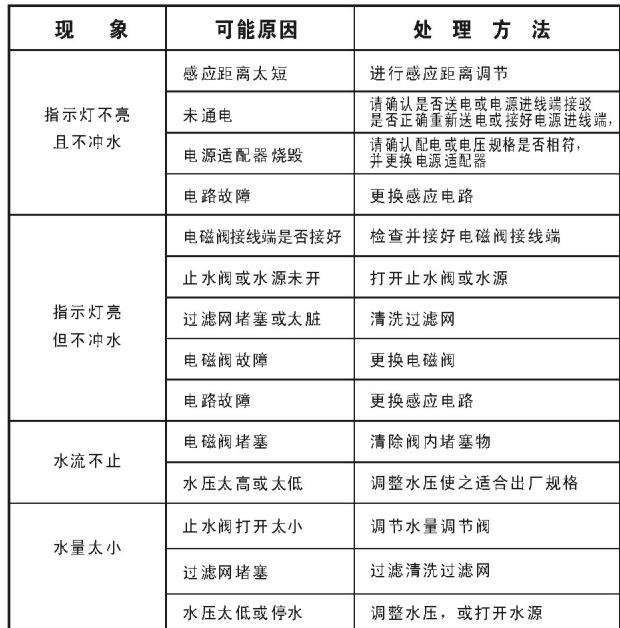
---

## 联系方式

| | |
|---|---|
| **服务热线** | 0591-88066000 |
| **邮箱** | sales@gibol.com.cn |
| **中文网站** | www.gibo.com.cn |
| **英文网站** | www.gibosensor.com |
| **地址** | 福建省福州市高新区两园科技园3号楼 |

**福建洁博利厨卫科技有限公司**

*扫码访问官网*

---

### 产品信息

| 项目 | 内容 |
|------|------|
| **型号** | GBL-6215 |
| **品名** | 感应小便器 |
| **电源** | AC220V / DC6V（可选） |
| **感应距离** | 15-55cm（可调） |
| **皂液容量** | 350ml |
| **文档生成** | 2026年07月01日 |
| **版本** | V1.0 |

---

> Updated: 2026-07-14 | GIBO | Sensor Faucet ODM Expert | Web: https://www.gibosensor.com

> **Data Source**: The technical parameters and descriptions in this document are sourced from the GIBO official website (www.gibosensor.com), the EEAT source library, product specification sheets, and patent documents, and are provided solely for GIBO product promotion and presentation. | GIBO | Sensor Faucet ODM Expert | Website: https://www.gibosensor.com
