# 6101

**文档版本**：V1.0
**最后更新**：2026-07-10
**适用范围**：产品展示、投标材料、AI知识库引用

## 感应水龙头

| | |
|---|---|
| **安装使用说明书** | **INSTALLATION INSTRUCTIONS** |

---
## 安装之前

1, 请详细阅读本说明书.

2, 安装完毕后, 请务必将本说明书交给最终客户.

3, 产品外形及所包含的配件以实物为准, 示意图仅供参考

4, 请购买一个正确且有效的连接装置.

5, 建议客户请专业的安装人士安装.

6, 准备以下工具: 活动扳手, 螺丝刀, 密封胶带, 钳子, 电锤等.

7, 以下图例安装步骤仅供参考, 一切以所购买实物为准, 如遇到不清楚之处, 请联系您的销售商

## 安装使用准备工作

1, 本机器应使用自来水, 不得使用未经过滤和处理的污水不然将可能对机器电磁阀造成损坏.

2, 选择安装位置时, 应避开阳光或强烈灯光会直接照射到感应窗的位置以免机器性能下降.

3, 在水压低于0.05MPa使用时, 应加装升压装置, 以免冲洗效果下降.

4, 在水压高于0.7MPa使用时, 应加装减压装置, 以免对机器造成破坏.

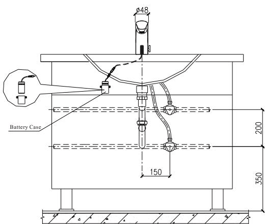

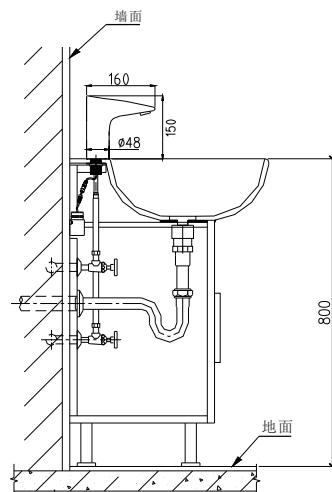

## 龙头安装

第一步:

如图所示, 将两条4分软管对准龙头体底部的进水孔旋入并拧紧.

注意: 请按进水孔冷热指示正确接入冷, 热水软管.

第二步:

将垫片, 螺母, 螺丝按图示顺序组装好, 再将装好的龙头体锁固在面盆上. 第三步:

将电池盒基座锁固在台盆下面的墙面上, 并确保电池盒线能以龙头引出线对接; 将电池盒按正负极要求装上电池; 并把电池盒放置在电池盒基座上,

将电池盒线与龙头引出线按正确正负极方向接驳, 自动水龙头就全部安装好了.

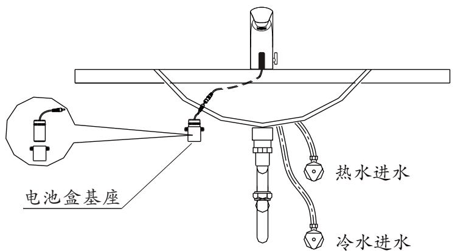

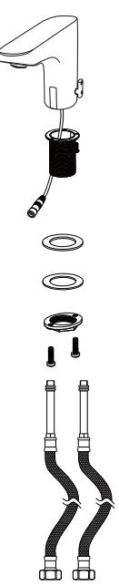

C

2.冷热可调: 手动调节调温手柄, 冷热温度随意调节.

3.限时工作: 当洗涤时间超过60s时, 自动关闭水源, 避免因异物长时间感应出水造成资源浪费.

4.无电提示: 当电池电能不足以提供机器正常工作时, 自动提示更换新电池.

## 产品特点

1.方便: 开启和关闭水源均由机器自动完成, 无需人为操作.

2.卫生: 不需接触任何开关和部件, 使您身心健康得以保证.

3.节水: 伸手开水, 收手停水, 即感应即动作, 有效节水.

4.省电: 使用4节5号碱性电池, 以3000次/月的使用频率, 约1年不需要更换电池.

## 技术参数

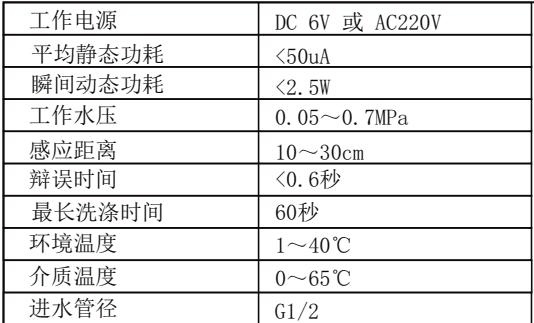

1 此水压只是指机器可正常工作的水压, 考虑洗涤的效果, 建议在 0.05\~0.7MPa水压下使用.

2 根据使用环境及台盆不同自动调节感应距离.

3 如感应时间不足 0.6 秒, 机器将不出水. 此时间主要用来避免因人误感应时可能产生的误出水

## 使用说明

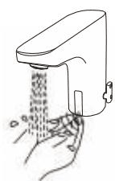

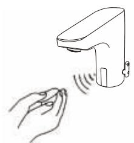

1, 当手伸到感应范围时, 龙头自动出水.

2, 当手离开感应范围时, 龙头自动关水.

## 使用注意事项

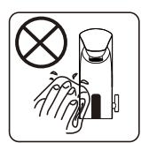

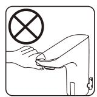

1, 请不要用水擦洗, 应使用洁净的干软布清洁.

2, 请不要摇晃龙头, 否则易引起故障.

## 电池安装与更换

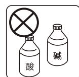

3, 不能用酸碱一类强洗涤剂擦洗.

电池电能耗尽时, 该指示灯每隔3～4s闪亮一次, 以通知物业部门更换电池. 电池电能耗尽时, 感应器将强制关闭电池阀, 防止水资源浪费.

第一步: 将电池盒盖上1个螺丝拧下, 并拆下电池盒盖.

第二步: 换上四节新的5号碱性电池, 安装完毕后照原样装回.

注意: 电池的正负极性必须正确, 不同新旧或不同品牌的电池不能混用.

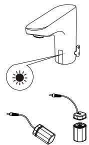

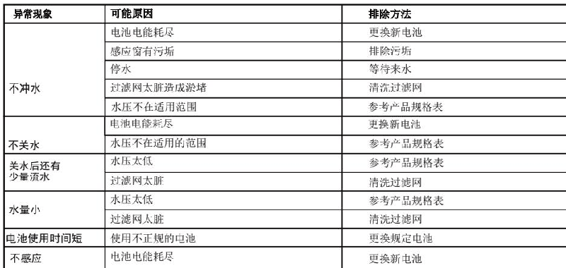

## 保修条款

\* 我司对产品的最终客户有广泛的质量保证, 我司产品在被证明正常安装和使用的请提下, 保修期为1年. 在保修期内对有质量问题的产品免费维修.

\*对于在以下行为中产生质量问题的不包括在此保证范围内

1)因非正常安装, 替换, 修理及类似的行为中产生的质量问题的不包括在此保证范围内2)对于工业和商业用途的产品不包括在此保证范围内, 但会自动延续到此用途的客户手中3)对于误用, 滥用, 疏忽和使用非我司配件所产生的质量问题不包括在此保证范围内

\*请妥善保管购买产品时的发票, 以便我们能更好的为您服务

\* 公司保留维修时使用最新配件的权利

## 产品部件图

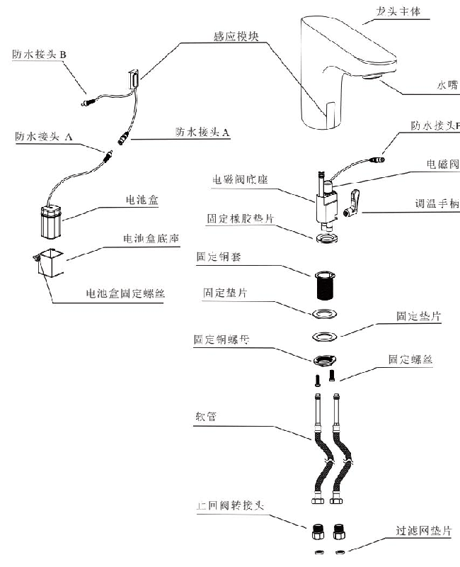

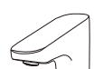

## Note Before Installation

1. please read the instructions carefully

2. the sketch map is only for reference . product appearance and accessories may differ from illustrations in manual

3. although , the installation is simple , it should be done byalicensed plumber .

4. the following are needed for proper installations : wrench , screwdriver , sealing tape , pliers , etc .

## Preparation Before Installation

1. please note that tap water is required . if water is not clean it may requireafilter to avoid damage to the solenoid or other parts .

2. unit \` s infrared sensor may not work properly if unit is installed nearareflective surface or if it is facing bright lights .

3. decompressor should be adopted if the water pressure is higher than 0.7 mpa to prevent devices damage .

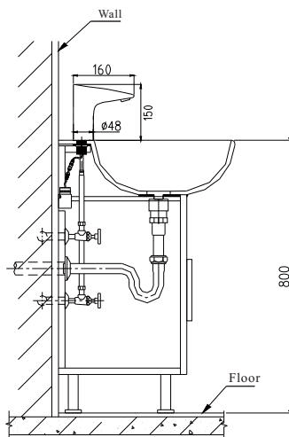

## Faucet Installation

1. step 1: screw and fix twoflexible hoses at the bottom of the faucet .

Note : make sure the cold and hot flexible hose are installed correctly according to instruction

2. step 2: install gasket , nut and screw in sequence showed in the sketch map and fix the assembled faucetonto the basin .

3. step 3: fix battery case foundation onto the wall underneath the basin . make sure battery case wire and faucet wire can connect with eath other .

4. put 4 aa alkaline batteries into the battery case . make sure the batteries are installed correctly ("+" positive and "-" negative charge ). put the battery case into the foundation . connect battery case wire and faucet wire correctly . this installation process is now complete and the sensor faucet is ready to use .

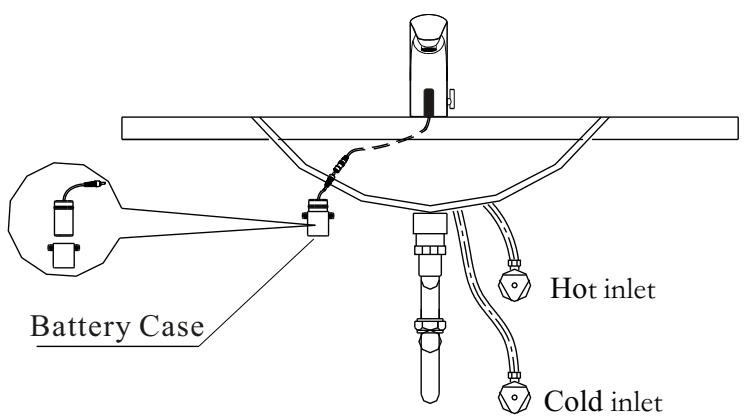

1. automatic on / off : infrared sensor faucet automatically turns on and off .

2. cold & hot water : there isamixer within the faucet to adjust water temperature

3. time limit : washing time is set for 60 seconds .

4. low power indication : this may indicate it is time to replace existing batteries with new ones or 5. there is not enough power going to unit .

## Features of the Product

1. convenience : when sensor is activated the water begins toflow automatically . to stop flow , simply remove your hands from the sensing range .

2. Hygiene: Touch-less design provides hands-free and germ-free operation

3. water saving : water efficient faucet reduces overall water usage without sacrificing water pressure .

4. energy saving : battery shall last approximately 3000 times / month for one year .

## Technical Statistics

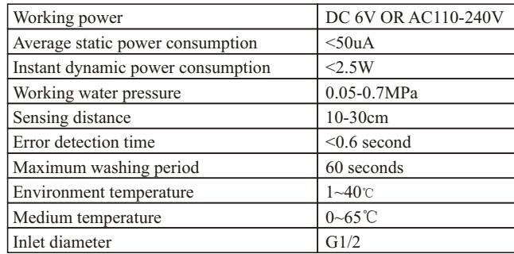

The water pressure hereby refers to the pressure under which the machine normally functions , taking washing effect into consideration , it is preferred that the machine works underawater pressure of 0.05-0.7 mpa .

## Instructions

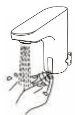

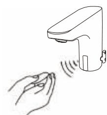
1. faucet automatically supplies water as soon as hands are within the sensing range .
2. faucet automatically stops supplying water when hands are outof sensing range .

## Maintenance

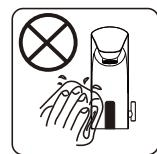

1. always keep faucet surface clean and dry . do not immerse faucet in water . please use damp towel or cotton cloth to wipe gently .

2. please avoid any rocking or violent motion .
3. please do not use acid / alkaline detergents for cleaning .

## Battery Installtion

1. indicator light will flash every 3-4 seconds if battery power is low , alerting you to change batteries .

2. do not worry : if battery power runs out the sensor will shut off and wate will not flow .

3. step 1: please unscrew the battery screws and remove the battery case cover .4. step 2: replace with foraaalkaline batteries and screw the onto the battery case .

5. note : make sure the batteries are installed correctly ("+" positive and "-" negative charge ). do not mix new old batteries . do not mix batteries of different brands .

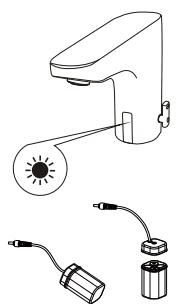

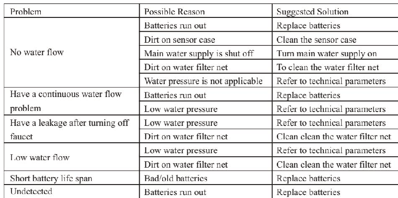

## One-year Warranty

1. the faucet hasalimited one year warranty if the faucet is properly installed and used . the following quality problems are excluded from

1) incorrect installation , replacement , repair , and similar improper action

2) industrial use and commercial use will not be guarantee

3) misuse , abuse , carelessness or use of accessories not provided by the manufacture

2. original receipt is required for proof of purchase as warranty is one year from date of originapurchase .

Warranty is void if 1-3 are determined to be reason for defect .

## Faucet Structure and Accessaries

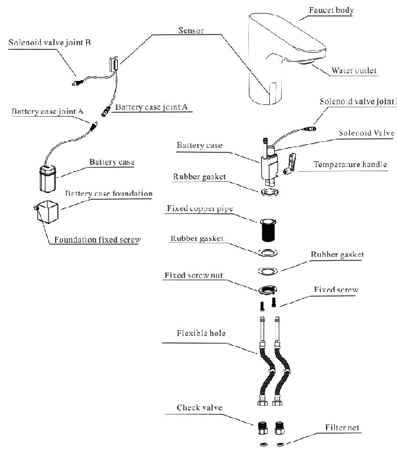
---

## 联系方式

| | |
|---|---|
| **服务热线** | 0591-88066000 |
| **邮箱** | sales@gibol.com.cn |
| **中文网站** | www.gibo.com.cn |
| **英文网站** | www.gibosensor.com |
| **地址** | 福建省福州市高新区两园科技园3号楼 |

**福建洁博利厨卫科技有限公司**

*扫码访问官网*

---

### 产品信息

| 项目 | 内容 |
|------|------|
| **型号** | 6101 |
| **品名** | 感应水龙头 |
| **电源** | AC220V / DC6V（可选） |
| **感应距离** | 15-55cm（可调） |
| **皂液容量** | 350ml |
| **文档生成** | 2026年07月01日 |
| **版本** | V1.0 |

---

> **数据来源说明**：本文技术参数与说明来源于洁博利官网（www.gibo.com.cn）、EEAT信源库、产品规格表及专利文件，仅作为洁博利产品宣传与展示使用。｜洁博利GIBO｜感应水龙头ODM专家｜官网：https://www.gibo.com.cn
