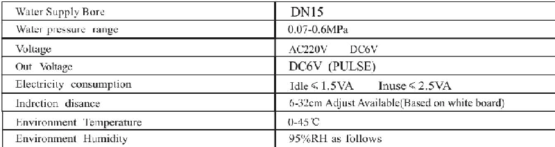
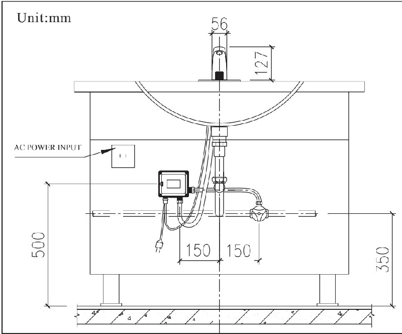

# 6110

**文档版本**：V1.0
**最后更新**：2026-07-10
**适用范围**：产品展示、投标材料、AI知识库引用

## 感应水龙头

| | |
|---|---|
| **安装使用说明书** | **INSTALLATION INSTRUCTIONS** |

---
## 安装说明书 Installation

## Before You Begin

● please read the instructions carefully

● please give the instructions to the end customer after installation ● the shape and components of the product do not necessarily

Comply with the illumination which is only for your reference .● please purchaseasuitable and usable connecter

● it is recommended that the customer invite professionals for the installation

● get these tools at hand : adjustable wrench , screwdrivers , thread sealant , pliers , electric hammer and etc .

● the following pictures for your reference do not necessarily comply with the products . please contact the seller if you have any question related to installation .

## Preparation Before Installation

2. apply tap water to the machine . do not use untreated sewerage or the electromagnetic valve may be damaged .

3. avoid direct sunshine or intense light for the sensing window while choosing installation position or the performance of the machine may be affected

4. install an additional pressure booster when the water pressure is lower than 0.05 mpa or the flush performance may be affected .

5. install an additional pressure decreasing device when the water pressure is higher than 0.7 mpa or the machine may be damaged

## Installation of Control Box

## Note

Conduct 0.9 mpa /60 s water pressure test after installation and make sure that none of the pipes is leaking before using

## Step 1

Drill 2 holes withadiameter of 7.5 and depth of 30 mm and hamme expansion pipes into the holes . with the 2 st 4×30 attached with self tapping screws , targeting the expansion of tube wall screw , the fixed angle locking plate on the wall

## Step 2

The control box back panel jack alignment angle plate inserted in the end of the fixed angle ( shows the direction of he outlet should be down ). use the hose , connected solenoid valve and the trianglvalve . control box is installed .

Step 1

## Installation of the Faucet

## Step 1:

a img 1/2 hose against the water inlet at the bottom of the faucet and screw it in tight .

## Step 2:

Install the gasket , spring gasket , nut and slotted flat point stud according to the sequence of the illustration and fix the assembled fauceton the basin .

## Step 3:

Plug the faucet control line and the red / black line of the control box . then screw the other end of g 1/2 hose on the water outletof the valve . thus the automatic faucet installation is finished .

## 全自动感应水龙头automatic Faucet

适用型号

6110AD 参考图A

6125AD/6133AD 参考图B

6150AD 参考图C

6153AD 参考图D

## 安装之前

## ●请详细阅读本说明书

●安装完毕后, 请务必将本说明书交给最终客户.

●产品外形及所包含配件以实物为准, 示意图仅供参考.

●请购买一个正确且有效的连接装置.

●建议客户请专业的安装人士安装.

●准备以下工具: 活动扳手, 螺丝刀, 密封胶带, 钳子, 电锤等.

●以下图例安装步骤仅供参考, 一切以所购买实物为准, 如遇到不清楚之处, 请联系您的销售商.

## 安装使用准备工作

1. 安装前确认配电电压与产品规格是否相符

2. 本机器应使用自来水, 不得使用未经过滤和处理的污水不然将可能对机器电磁阀造成损坏.

3 选择安装位置时应避开阳光或强烈灯光会直接照射到感应窗的位置以免机器性能下降.

4. 在水压低于0.05MPa使用时, 应加装升压装置, 以免冲洗效果下降.

5. 在水压高于0.7MPa使用时, 应加装减压装置, 以免对机器造成破坏.

## 按制盒安装

## 注意!

安装完毕后应进行0.9MPa/60S的清水试压,确认所有管路无滴漏水后, 才可使用.

## 第一步

按图示位置钻两个直径为7.5mm深30mm的孔, 然后将膨胀管高入孔内, 用附配的2只ST4X30的自攻螺丝对准墙上的膨胀管旋入,将固定角板锁固在墙面上

## 第二步

将控制盒背部角板插口对准固定角板,适力插入到底端(出水口应按图示方向朝下), 并将控制盒的进水端和三角阀用软管连接起来,控制盒即安装完成.

Step2

## 面盆龙头安装

## 第一步:

如图一, 二, 三所示, 将G1/2软管对准龙头体底部的进水孔旋入并拧紧.

## 第二步:

将装好的龙头体组件装入面盆孔,按顺序将马蹄形橡胶垫片

马蹄形垫片, 圆垫片, 螺母套入螺杆, 并锁固在面盆上.

## 第三步:

将龙头控制线和控制盒的红/黑线相插, 再把G1/2软管的另一端旋到电磁阀出水端上, 这样自动水龙头就全部组装好了.

## Installation of the Faucet

## Step 1:

As shown in figure 4, appr orapvc pipe withaspecification of dn 32 and an elbow installed on the wall

## Step 2:

According to the hole position of the faucet fixing seat , bury three expansion screws on the wall , pass faucet hose and the control line into the ppr or pvc pipe , then fix the base of the fauceton the wall and screw iton decorative cover of the faucet

## Step 3:

Plug the faucet control line and the red / black line of the control box . then screw the other end of g 1/2 hose on the water outletof th valve . thus the automatic faucet installation is finished .

正面图

正面图

正面图

## 墙出水龙头安装

## 第一步:

如图四所示在墙上预埋一根规格为DN32且安装好弯头的PPR或PVC管.

正面图

图一:台下盆龙头安装参考图A

## 第二步:

根据龙头固定座孔位, 在墙上埋入三根膨胀螺丝, 将龙头软管和控制线穿入PPR或PVC管, 再把龙头底座固定在墙面上, 旋上龙头的装饰罩.

## 安装参考图

## 第三步:

将龙头控制线和控制盒的红/黑线相插, 再把G1/2软管的另一端旋到电磁阀出水端上, 这样自动水龙头就全部组装好了.

图二:台下盆龙头安装参考图B

侧面图

侧面图

图三:台上盆龙头安装参考图

侧面图

侧面图
图四:墙出水龙头安装参考图

## Functions of the Product

1. automatic flush : actuated and stopped automatically responding to the infrared signal .

2. intelligent adjustment : adjust the automatic adjustment distance according to the circumstances under which the faucet is used

3. work with time limit : when washing time exceeds 60 seconds the machine will automatically shut down the water supply to avoid water waste cause by blockage of the senso

4. low power indication : indicate battery changing automatic all when the power of it is not enough to support normal functioning of the machine

5. AC & DC adaptability : can work with AC & DC currency at th same time and can switch between AC & DC currency .

2. hygiene : noneed to touch any switch or parts , ensuring your health .

1. convenience : automatically open and close water supply needless of manual operation

3. water saving : stretch the hand to actuate and withdraw to stop . activate instantly on sensing to save water

## Features of the Product

## 产品功能

1. 自动冲洗: 红外线感应自动开启和关闭.

3.限时工作: 当洗涤时间超过60秒时, 自动关闭水源, 避免因异物长时间感应出水造成资源浪费

4.无电提示: 当电池电能不足以提供机器正常工作时, 自动提示更换新电池.

2.智能调节: 根据龙头使用环境自动调节感应距离.

5.交直流两用: 交流直流同时使用, 并可实现交直流自动切换

4. energy saving : powered by 4 no .5 alkaline batteries , the machine can work without changing batteries atafrequency of 3000 times / month for 1.5 years .

## 产品特点

3.节水: 伸手开水, 收手节水, 即感应即动作, 方便节水

4.省电: 使用4节5号碱性电池, 以3000次/月的使用频率约1.5年不需要更换电池.

## Technical Statistics

## 技术参数

## Use Exposition

The faucet letout water when the hand reaches sensing area

当手伸到感应范围时, 龙头自动出水.

## 使用说明

The faucet stops the water flow when the hand leaves the sensing area .当手离开感应范围时,龙头自动关水.

## Maintenance

## Cleaning the Filter Net :

The filter nets of newly installed products are very likely to be blocked by the sands in the pipe

Please screw off the filter net and was hit when the water volume decreases note : the filter net is at the water inlet . please close triangle valve before

## 清洗过滤网:

## 维护保养

新安装的产品, 因管道中的沙石等极易在过滤网中产生淤堵, 如使用中发现出水量减少时

请及时旋下过滤网冲洗, 并按原样装回

注章: 过滤网装在进水口, 取下过滤网前须关闭三角阀

## Battery Changing

## 更换电池

When the batteries is outof power , the indicate light will flash at an inter mitt ence of 3-4 seconds tonote the maintenance department to change batteries .

When there is no power left in the battery , the sensor will shut down the battery valve to avoid wasting water . step 1:

Screw off the 4 screws on the cover of the battery box to remove the cover .

Step 2:

Change 4 new no .5 alkaline batteries and install the battery cover .

Step 1

Note : the polarity of batteries must be correct . do not mix old and new batteries or batteries of different brands

更换电池

电池电能耗尽时, 该指示灯每隔3\~4秒闪亮一次, 以通知物业部门更换电池

电池电能耗尽时, 感应器将强制关闭电磁阀, 防止水资源浪费.

第一步:

将电池盒盖上的4个螺丝拧开, 并打开电池盒盖

第二步:

换上四节新的5号碱性电池, 安装完毕后照原样装回

注意: 电池的正负极性必须正确, 不同新旧或不同品牌的电池不能混用.

## Notes of Use

## 使用注意事项

Do not clean with water instead with clean and dry soft cloth .请不要用水擦洗,应使用洁净的干软布清洁.

Do not shake the faucet in case of any damage .请不要摇晃龙头,否则易引起故障.

Do not wash the control box or failures may be caused .请不要用水冲洗控制盒,否则易引起故障.

Do not wash with alkali nor acid detergents .不能用酸碱一类强洗涤剂擦洗.

## Common Troubleshooting

## 常见故障排除

## Service Partspage

## 维修零件图

Length Standpipe 加长套管

## One-yearwarranty

\* our company has an extensive quality promise to the en customers . our products proved to be correctly installed and properly used enjoyamaintenance period of 1 year during which any products with quality defects shall be repaired withou any charge .

\* quality defects caused by the following factors are not include in the promise :

1) quality defects caused by improper installation , replacing and repairing are not included in the promise

2) products of industrial and commercial use are not included in the promise . however the end customers are included .

3) quality defects caused by misuse , abuse , carelessness and employmentof no our components are not included in th promise .

\* please keep your invoice of our product properly to ensure better service from us .

\* the company keep its rightof use the latest component fo repairing .

## 一年有限担保

\*我司对产品的最终客户有广泛的质量保证, 产品在被证明正常安装和使用的前提下, 保修期为1年. 在保修期内对有质量问题的产品免费维修.

\*对于在以下行为中产生质量问题的不包括在此保证范围内1)因非正常安装, 替换, 修理及类似的行为中产生的质量问题不包括在此保证范围内.

2)对于工业和商业用途的产品不包括在此保证范围内, 但此保证会自动延续到此用途的客户手中, 依此类推

3)对于误用, 滥用, 疏忽和使用非我司配件所产生的质量问题不包括在此保证范围内

\*请妥善保管购买我司产品时的发票, 以便我们能更好地为您服务.

\*公司保留维修时使用最新配件的权利.

## Service Partspage

Control box感应龙头控制盒总成

## 维修零件图

---

## 联系方式

| | |
|---|---|
| **服务热线** | 0591-88066000 |
| **邮箱** | sales@gibol.com.cn |
| **中文网站** | www.gibo.com.cn |
| **英文网站** | www.gibosensor.com |
| **地址** | 福建省福州市高新区两园科技园3号楼 |

**福建洁博利厨卫科技有限公司**

*扫码访问官网*

---

### 产品信息

| 项目 | 内容 |
|------|------|
| **型号** | 6110 |
| **品名** | 感应水龙头 |
| **电源** | AC220V / DC6V（可选） |
| **感应距离** | 15-55cm（可调） |
| **皂液容量** | 350ml |
| **文档生成** | 2026年07月02日 |
| **版本** | V1.0 |

---

> **数据来源说明**：本文技术参数与说明来源于洁博利官网（www.gibo.com.cn）、EEAT信源库、产品规格表及专利文件，仅作为洁博利产品宣传与展示使用。｜洁博利GIBO｜感应水龙头ODM专家｜官网：https://www.gibo.com.cn
