# 6122

**文档版本**：V1.0
**最后更新**：2026-07-10
**适用范围**：产品展示、投标材料、AI知识库引用

## 感应水龙头

| | |
|---|---|
| **安装使用说明书** | **INSTALLATION INSTRUCTIONS** |

---
## AUTOMATIC SENSOR FAUCET

INSTALLATION INSTRUCTIONS

Applicable model 6122:Refer to Figure 1 6125:Refer to Figure 2

## BEFORE YOU BEGIN

●Please read the instructions carefully

●Please give the instructions to the end customer after installation

●The shape and components of the product do not necessarily comply with the illumination which is only for your reference.

●Please purchaseasuitable and usable connecter

●It is recommended that the customer invite professionals for the installation

●Get these tools at hand: adjustable wrench, screwdrivers, thread sealant, pliers, electric hammer and etc.

●The following pictures for your reference do not necessarily comply with the products. Please contact the seller if you have any question related to installation.

## PREPARATION BEFORE INSTALLATION

1.make sure the adaptor voltage conforms the product voltage.

2.Apply tap water to the machine. Do not use untreated sewerage or the electromagnetic valve may be damaged.

3.Avoid direct sunshine or intense light for the sensing window while choosing installation position or the performance of the machine may be affected.

4.Install an additional pressure booster when the water pressure is lower than 0.05MPa or the flush performance may be affected.

5.Install an additional pressure decreasing device when the water pressure is higher than 0.7MPa or the machine may be damaged.

## INSTALLATION OF CONTROL BOX

## NOTE!

Conduct 0.9MPa/60S water pressure test after installation and make sure that none of the pipes is leaking before using.

## STEP 1

Drill 2 holes withadiameter of 5mm and depth of 30mm and hammer expansion pipes into the holes. STEP 2

With the 2 ST4×30 attached with self tapping screws, (Shows the direction of he outlet should be down). Use the hose, Connected solenoid valve and the triangle valve. Control box is installed.

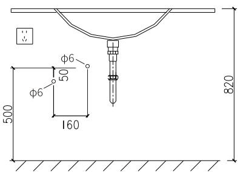
Step 1

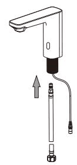
Step 2

## INSTALLATION OF THE FAUCET

## Step 1:

Aim G1/2 hose against the water inlet at the bottom of the faucet and screw it in tight. Step 2:

Install the gasket, spring gasket, nut and slotted flat point stud according to the sequence of the illustration and fix the assembled faucet on the basin

## Step 3:

Plug the faucet control line and the red/black line of the control box.Then screw the other end of G1/2 hose on the water outlet of the valve. Thus the automatic faucet installation is finished.

## INSTALLATION REFERENCE DIAGRAM

Figure 1:6122

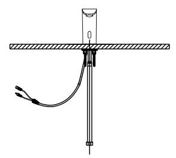
Step 1

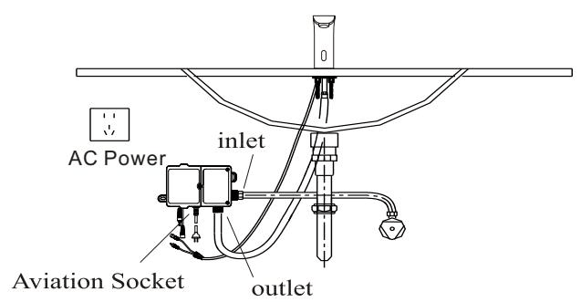
Step 2

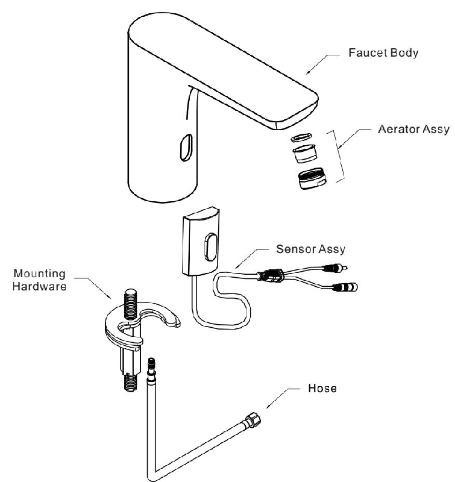
Step 3

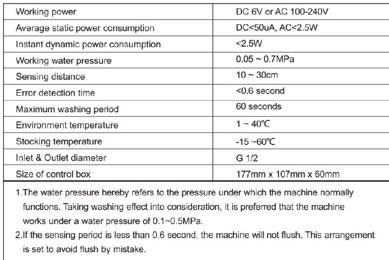

## FUNCTIONS OF THE PRODUCT

1.Automatic flush: actuated and stopped automatically responding to the infrared signal

2.Work with time limit: When washing time exceeds 60 seconds,the machine will automaticall shut down the water supply to avoid water waste cause by blockage of the sensor

3.Low power indication: Indicate battery changing automatically when the power of it is not enough to support normal functioning of the machine.

4.AC&DC adaptability: can work with AC&DC currency at the same time and can switch between AC&DC currency.

## FEATURES OF THE PRODUCT

1.Convenience: Automatically open and close water supply needless of manual operation.

2.Hygiene: No need to touch any switch or parts, ensuring your health.

3.Water saving: Stretch the hand to actuate and withdraw to stop. Activate instantly on sensing to save water.

4.Energy saving: Powered by 4 AA alkaline batteries, the machine can work without changing batteries atafrequency of 3000 times/month for 1.5 years.

## TECHNICAL STATISTICS

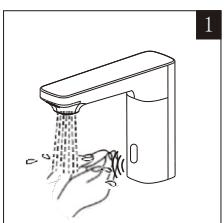

## USE EXPOSITION

1.The faucet let out water when the hand reaches sensing area.

2.The faucet stops the water flow when the hand leaves the sensing area.

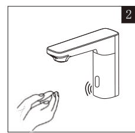

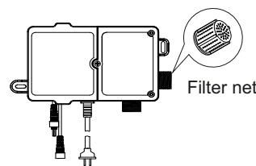

## MAINTENANCE

## Cleaning the filter net:

The filter nets of newly installed products are very likely to be blocked by the sands in the pipe.

Please screw off the filter net and wash it when the water volume decreases

Note: The filter net is at the water inlet. Please close triangle valve before take out the filter net.

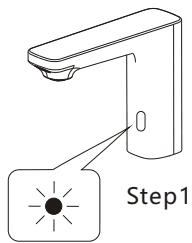

## BATTERY CHANGING

When the batteries is out of power, the indicate light will flash at an intermittence of 3-4 seconds to note the maintenance department to change batteries.

When there is no power left in the battery, the sensor will shut down the battery valve to avoid wasting water.

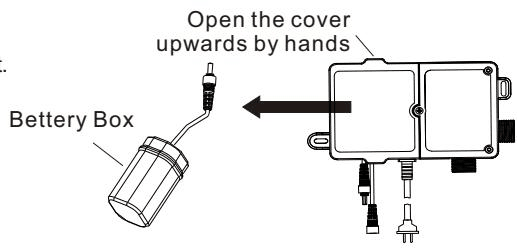

Step 1:

Open the control box cover and take out the battery box, (See the drawing), then unscrew the screws on the battery box cover.

Step 2:

Change 4 new No.5 alkaline batteries and install the battery cover.

Note: The polarity of batteries must be correct. Do not mix old and new batteries or batteries of different brands.

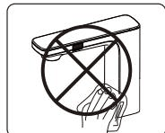

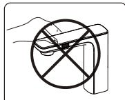

## NOTES OF USE

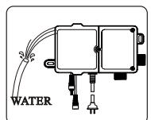

Do not clean with water instead with clean and dry soft cloth

Do not shake the faucet in case of any damage.

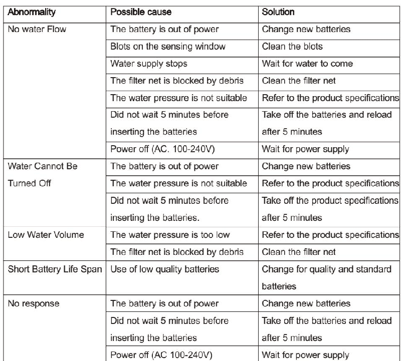

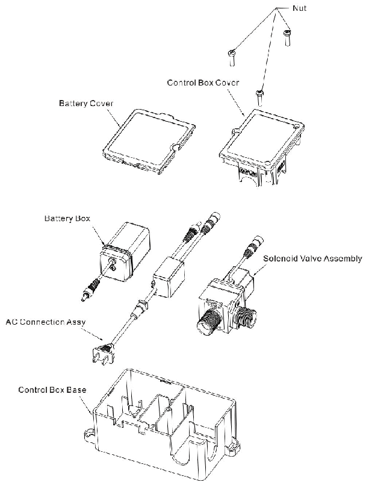

Do not wash the control box or failures may be caused

Do not wash with alkaline or acid detergents.

## COMMON TROUBLE SHOOTING

## SERVICE PARTSPAGE

## ONE-YEARWARRANTY

\*Our company has an extensive quality promise to the end customers. Our products proved to be correctly installed and properly used enjoyamaintenance period of 1 year during which an

products with quality defects shall be repaired without any charge.

\*Quality defects caused by the following factors are not included in the promise:

1) Quality defects caused by improper installation, replacing and repairing are not included in the promise.

2) Products of industrial and commercial use are not included in the promise. However the end customers are included

3) Quality defects caused by misuse, abuse, carelessness and employment of no our components are not included in the promise.

\*Please keep your invoice of our product properly to ensure better service from us. \*The company keep its right of use the latest component for repairing.

## SERVICE PARTSPAGE

Control box Assy

---

## 联系方式

| | |
|---|---|
| **服务热线** | 0591-88066000 |
| **邮箱** | sales@gibol.com.cn |
| **中文网站** | www.gibo.com.cn |
| **英文网站** | www.gibosensor.com |
| **地址** | 福建省福州市高新区两园科技园3号楼 |

**福建洁博利厨卫科技有限公司**

*扫码访问官网*

---

### 产品信息

| 项目 | 内容 |
|------|------|
| **型号** | 6122 |
| **品名** | 感应水龙头 |
| **电源** | AC220V / DC6V（可选） |
| **感应距离** | 15-55cm（可调） |
| **皂液容量** | 350ml |
| **文档生成** | 2026年07月01日 |
| **版本** | V1.0 |

---

> **数据来源说明**：本文技术参数与说明来源于洁博利官网（www.gibo.com.cn）、EEAT信源库、产品规格表及专利文件，仅作为洁博利产品宣传与展示使用。｜洁博利GIBO｜感应水龙头ODM专家｜官网：https://www.gibo.com.cn
