# 6158

**文档版本**：V1.0
**最后更新**：2026-07-10
**适用范围**：产品展示、投标材料、AI知识库引用

## 感应水龙头

| | |
|---|---|
| **安装使用说明书** | **INSTALLATION INSTRUCTIONS** |

---
## AUTOMATIC FAUCET 全自动感应水龙头

## 安装说明书 INSTALLATION INSTRUCTIONS

## BEFORE YOU BEGIN

\- Please read the instructions carefully

\- Please give the instructions to the end customer after installation
- The shape and components of the product do not necessarily comply with the illumination which is only for your reference.
- Please purchaseasuitable and usable connector

\- It is recommended that the customer invite professionals for the installation

\- Get these tools at hand: adjustable wrench, screwdrivers, thread sealant, pliers, electric hammer and etc.

\- The following pictures for your reference do not necessarily comply with the products. Please contact the seller if you have any question related to installation.

可调钳
Adjustable Pliers

活动扳手
Adjustable Wrench

## PREPARATION BEFORE INSTALLATION

1. make sure the adaptor voltage conforms the product voltage.
2. Apply tap water to the machine. Do not use untreated sewerage or the electromagnetic valve may be damaged.

3. Avoid direct sunshine or intense light for the sensing window while choosing installation position or the performance of the machine may be affected.

4. Install an additional pressure booster when the water pressure is lower than 0.05MPa or the flush performance may be affected.

5. Install an additional pressure decreasing device when the water pressure is higher than 0.7MPa or the machine may be damaged.

## INSTALLATION OF THE FAUCET

## INSTALLATION OF THE FAUCET

1. The wall is installed with DN25 wiring pipe, the turning of wiring pipe is better with 45 degrees for threading easily;
2. The height of the wiring pipe needs to be 300-400mm higher than basin table,;

3. The water outlet pipe up the basin is female G1/2" and can't over tile surface;

MODEL/型号：6158

4. The wiring pipe up the basin can't over tile surface;
5. Wiring pipe part that under basin can be same level of tile surface, the turning point is better with 45 degrees for threading easily.

## 安装之前

## - 请详细阅读本说明书

\- 安装完毕后，请务必将本说明书交给最终客户。
- 产品外形及所包含配件以实物为准，示意图仅供参考。
- 请购买一个正确且有效的连接装置。

\- 建议客户请专业的安装人士安装。

\- 准备以下工具：活动扳手，螺丝刀，密封胶带，钳子，电锤等。

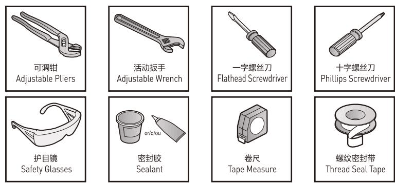

\- 以下图例安装步骤仅供参考，一切以所购买实物为准，如遇到不清楚之处，请联系您的销售商。

一字螺丝刀Flathead Screwdriver

十字螺丝刀Phillips Screwdriver

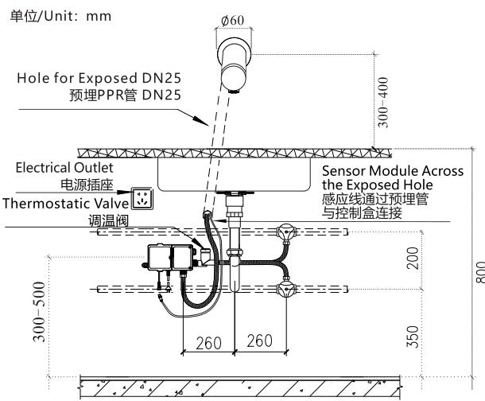

螺纹密封带 Thread Seal Tape

## 安装使用准备工作

1. 安装前确认配电电压与产品规格是否相符。

2.本机器应使用自来水，不得使用未经过滤和处理的污水不然将可能对机器电磁阀造成损坏。

3.选择安装位置时，应避开阳光或强烈灯光会直接照射到感应窗的位置以免机器性能下降。

4.在水压低于0.05MPa使用时，应加装升压装置，以免冲洗效果下降。

5.在水压高于0.7MPa使用时，应加装减压装置，以免对机器造成破坏。

## 整体安装示意图

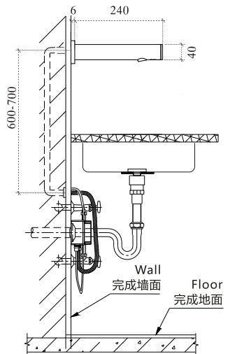

## 布管注意事项

1. 墙内需布DN25穿线管，且穿线管转弯处尽量采用45度，以便穿线；

2. 台上穿线管的高度需高于台面300-400mm;

3. 台上出水管为1/2内牙，且不得突出磁砖面；

4. 台上穿线管不可突出磁砖面；

5.穿线管台下部份可与磁砖面平，转弯处尽量采用45度，以便穿线；

## INSTALLATION

## STEP 1

Drill 2 holes withadiameter of 6mm and depth of 30mm and hammer Expansion ScrewsCinto the holes. With the 2 ST4×30 attached with self tapping screws D, targeting the expansion of tube wall screw, the fixed Control BoxAon the wall.

(Shows the direction of he outlet should be DOWN).

Control Box is installed.

## STEP 2

1. Lock the fixing plateGto the edge of the wiring pipe on the wall with expansion screwsCand D;

2. Insert Faucet Body F (with Sensor Module H, Decorative Plate E, Hose B) into the wiring pipe, pull out wiring pipe under the basin, then connect it to the control box;

3. Tighten the Faucet Body F, Decorative PlateEto the fixing plate G.

## STEP 3

Plug the Sensor ModuleHto the control box A、Plug AC Connection Assy line to the Electrical Outlet; Or open Battery Box Cover, install the 4 AA batteries; Then screw the other end of hose on the outlet of the Control Box A. Thus the automatic faucet installation is finished.

## STEP 1 Fixed Control Box A

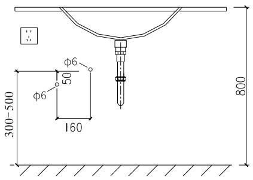

## 安装

## 第一步

按图示位置钻两个直径为7.5mm深30mm的孔，然后将膨胀管C敲入孔内，用附配的2只ST4X30的自攻螺丝D，对准墙上的膨胀管旋入，将控制盒A锁固在墙面上。

(出水口应按图示方向朝下)。

## 第二步

1. 将固定板G用膨胀螺丝C和螺丝D锁固在墙上穿线管边沿；
2. 再将龙头体F(含感应模块H、装饰盖板E、软管B）插入穿线管，从台下穿线管抽出，并对接到控制盒；

3.将龙头体F、装饰盖板E旋紧至固定板G上。

## 第三步

将感应模块线H和控制盒A对接、将电源适配器插入插座中，或打开控制盒上的电池盒盖，装上4节AA电池，再把软管B的另一端插紧到控制盒A的出水端上，这样龙头就全部装好了。

## STEP 2 Setup Faucet

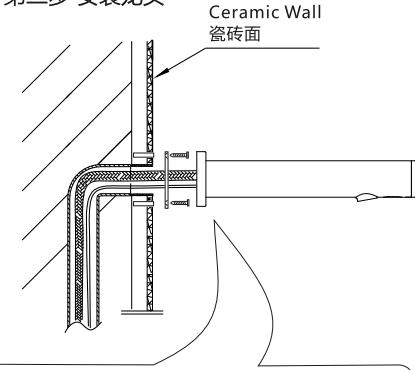

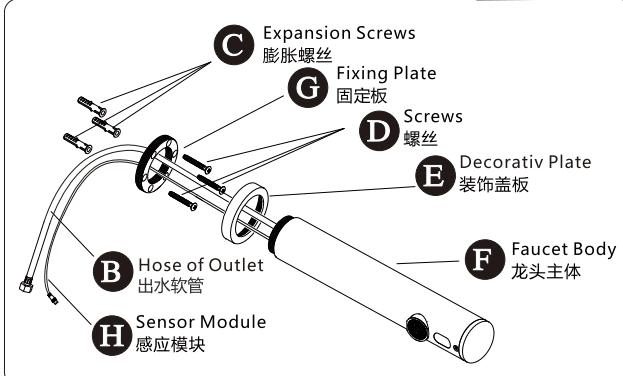

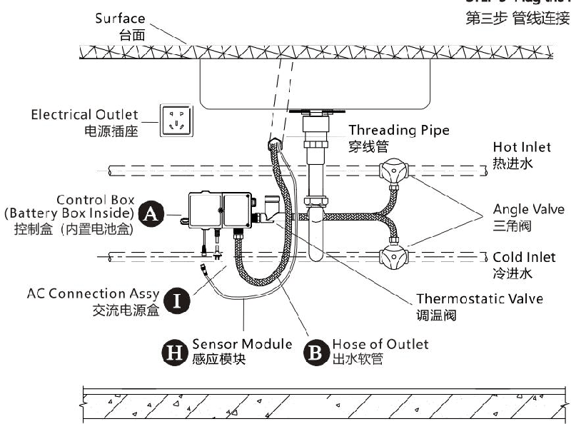

## STEP 3 Plug the line 第三步 管线连接

## FUNCTIONS OF THE PRODUCT

1. Automatic flush: actuated and stopped automatically responding to the infrared signal.

2. Intelligent adjustment: Adjust the automatic adjustment distance according to the circumstances under which the faucet is used.

3. Work with time limit: When washing time exceeds 60 seconds, the machine will automatically shut down the water supply to avoid water waste cause by blockage of the sensor.

4. Low power indication: Indicate battery changing automatically when the power of it is not enough to support normal functioning of the machine.

5. AC&DC adaptability: can work with AC&DC currency at the same time and can switch between AC&DC currency.

1. Convenience: Automatically open and close water supply needless of manual operation.

2. Hygiene: No need to touch any switch or parts, ensuring your health.

## FEATURES OF THE PRODUCT

2.遥控调距：可通过遥控器调节感应距离（选配）。

3. Water saving: Stretch the body to actuate and withdraw to stop. Activate instantly on sensing to save water.

1.自动冲洗：红外线感应自动开启和关闭。

5.交直流两用：交流直流同时使用，并可实现交直流自动切换。

## 产品功能

3.限时工作：当洗涤时间超过60秒时，自动关闭水源，避免因异物长时间感应出水造成资源浪费。

4.无电提示：当电池电能不足以提供机器正常工作时，自动提示更换新电池。

4. Energy saving: Powered by 4 No.5 alkaline batteries, the machine can work without changing batteries atafrequency of 3000 times/month for 1.5 years.

## 产品特点

1.方便：开启和关闭水源均由机器自动完成，无需人为操作。
2.卫生：不需接触任何开关和部件，使您身心健康得以保证。
3.节水：人体进入开水，人体离开停水，即感应即动作，方便节水。

4. 省电：使用4节5号碱性电池，以3000次 / 月的使用频率，约1.5年不需要更换电池。

## TECHNICAL STATISTICS

## 技术参数

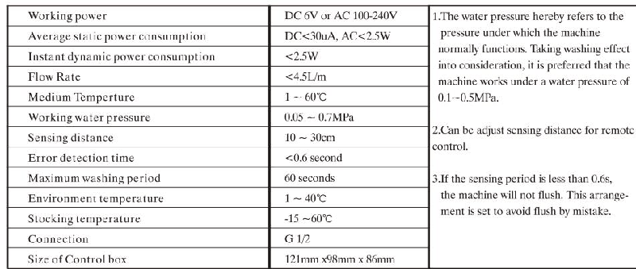

## USE EXPOSITION

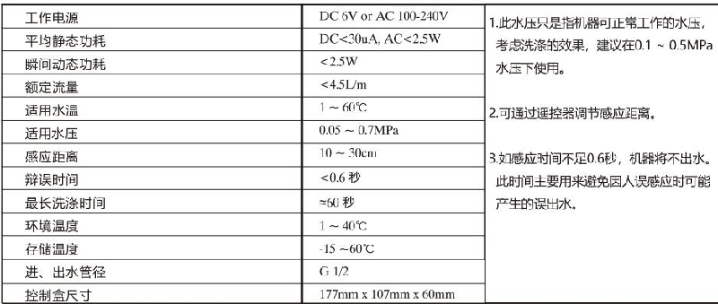

The faucet let out water when the hands reaches sensing area. 当手进入到感应范围时，龙头自动出水。

The faucet stops the water flow when the hands leaves the sensing area.

当手离开感应范围时，龙头自动关水。

## 使用说明

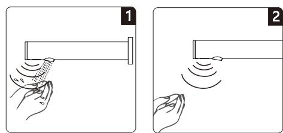

## BATTERY CHANGING

When the batteries is out of power, the indicate light will flash at an intermittence seconds to note the maintenance department to change batteries. When there is no power left in the battery, the sensor will shut down the battery valve to avoid wasting water.

## Step 1:

Open the control box cover and take out the battery box J,(See the drawing), then unscrew the screws on the battery box cover.
Step 2:

Change 4 new No.5 AA alkaline batteries and install the battery cover.
Note: The polarity of batteries must be correct. Do not mix old and new batteries or batteries of different brands.

## 更换电池

电池电能耗尽时，该指示灯每隔3\~4秒闪亮一次，请更换电池。
电池电能耗尽时，感应器将强制关闭电磁阀，防止水资源浪费。
第一步：

打开控制盒上盖，取出电池盒，将电池盒上的螺丝拧开。第二步：

换上四节新的5号AA碱性电池，安装完毕后照原样装回。注意：电池的正负极性必须正确，

不同新旧或不同品牌的电池不能混用。

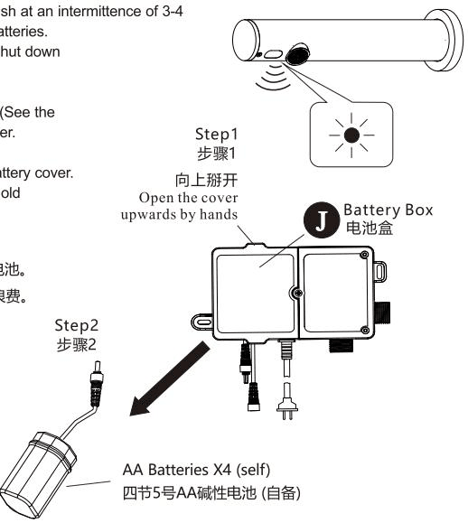

## 更换电池

## NOTES OF USE

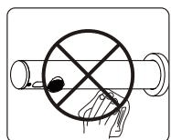

## 使用注意事项

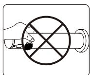
Do not clean with water instead with clean and dry soft cloth. 请不要用水擦洗，应使用洁净的干软布清洁。

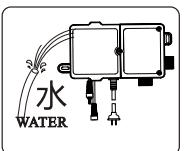

Do not shake the faucet in case of any damage.
请不要摇晃龙头，否则易引起故障。
Do not wash the control box or failures may be caused.
请不要用水冲洗控制盒，否则易引起故障。
Do not wash with alkaline or acid detergents. 不能用酸碱一类强洗涤剂擦洗。

## MAINTENANCE

## Cleaning the filter net:

## 维护保养

The filter nets of newly installed products are very likely to be blocked by the sands in the pipe.

Please screw off the filter net and wash it when the water volume decreases. Note: The filter net is at the water inlet. Please close triangle valve before take out the filter net.

## 清洗过滤网：

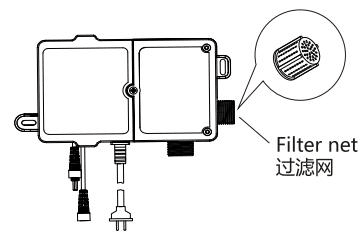

新安装的产品，因管道中的沙石等极易在过滤网中产生淤堵，如使用中发现出水量减少时，请及时旋下过滤网冲洗，并按原样装回。注意：过滤网装在进水口，取下过滤网前须关闭三角阀。

## SERVICE PARTSPAGE

## 维修零件图

Faucet Body Assy
感应龙头体总成

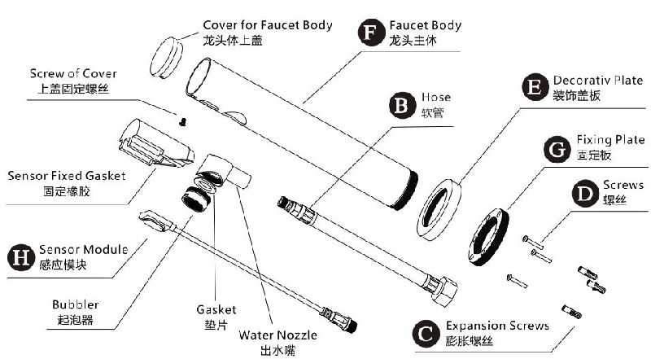
Control box Assy
感应龙头控制盒总成

## SERVICE PARTSPAGE

## 维修零件图

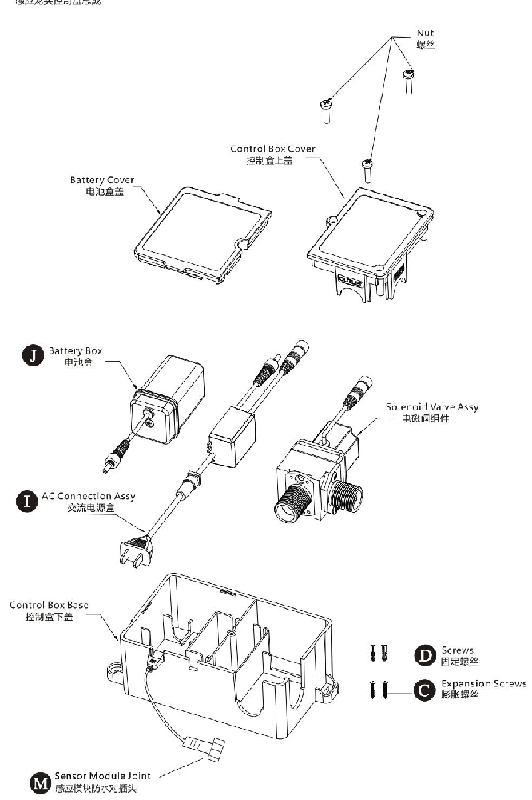

## COMMON TROUBLE SHOOTING

## 常见故障排除

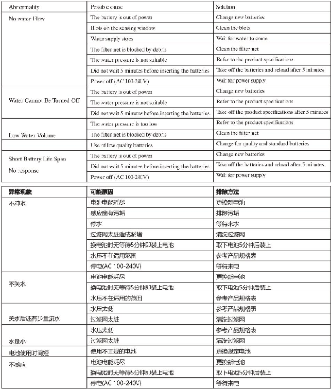

## ONE-YEARWARRANTY

\*Our company has an extensive quality promise to the end customers. The products proved to be correctly installed and properly used enjoyamaintenance period of 1 year during which any products with quality defects shall be repaired without any charge.

\*Quality defects caused by the following factors are not included in the promise:

1) Quality defects caused by improper installation, replacing and repairing are not included in the promise.

2) Products of industrial and commercial use are not included in the promise. However the end customers are included.
3) Quality defects caused by misuse, abuse, carelessness and employment of non-Original components are not included in the promise.

\*Please keep your invoice of the product properly to ensure better service from us.

\*The company keep its right of use the latest component for repairing.

## 一年有限担保

\*我司对产品的最终客户有广泛的质量保证，产品在被证明正常安装和使用的前提下，保修期为1年。在保修期内对有质量问题的产品免费维修。

\*对于在以下行为中产生质量问题的不包括在此保证范围内1)因非正常安装、替换、修理及类似的行为中产生的质量问题不包括在此保证范围内。

2)对于工业和商业用途的产品不包括在此保证范围内，但此保证会自动延续到此用途的客户手中，依此类推。

3)对于误用、滥用、疏忽和使用非我司配件所产生的质量问题不包括在此保证范围内。

\*请妥善保管购买原厂产品时的发票，以便我们能更好地为您服务。

\*公司保留维修时使用最新配件的权利。
---

## 联系方式

| | |
|---|---|
| **服务热线** | 0591-88066000 |
| **邮箱** | sales@gibol.com.cn |
| **中文网站** | www.gibo.com.cn |
| **英文网站** | www.gibosensor.com |
| **地址** | 福建省福州市高新区两园科技园3号楼 |

**福建洁博利厨卫科技有限公司**

*扫码访问官网*

---

### 产品信息

| 项目 | 内容 |
|------|------|
| **型号** | 6158 |
| **品名** | 感应水龙头 |
| **电源** | AC220V / DC6V（可选） |
| **感应距离** | 15-55cm（可调） |
| **皂液容量** | 350ml |
| **文档生成** | 2026年07月01日 |
| **版本** | V1.0 |

---

> **数据来源说明**：本文技术参数与说明来源于洁博利官网（www.gibo.com.cn）、EEAT信源库、产品规格表及专利文件，仅作为洁博利产品宣传与展示使用。｜洁博利GIBO｜感应水龙头ODM专家｜官网：https://www.gibo.com.cn
