# 6193

**文档版本**：V1.0
**最后更新**：2026-07-10
**适用范围**：产品展示、投标材料、AI知识库引用

## 感应水嘴

| | |
|---|---|
| **安装使用说明书** | **INSTALLATION INSTRUCTIONS** |

---
## Function

1. double sensor eyes . designed by our technology one is on the side the other one is on the bottom you can choose either of them for convenient 2. double sensor ways . for the bottom one the water outflow when some - thing into the induction area and the flow stop when it leaves . for the side one the water outflow when first induce the water stop when second induce the water will auto - stop within 3 minutes for both of the ways 3 install & use easily fast installation easily in one minute touchless use by sensor without turn on / off the switch

4. hygiene . touchless operation keep the food the tableware and the kitchenware away from the bacterial cross infection

5. saving water . intelligent turn on and turn off to save the water consumption more than 30%

TECHNICAL INFORMATION

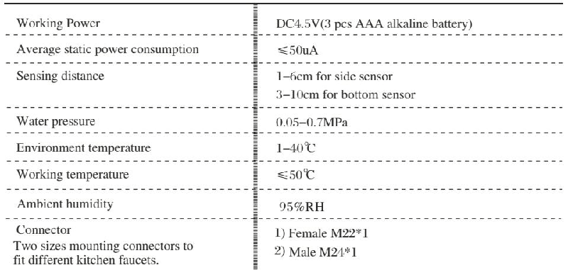

## Les Car Act É Ris Tiques Des Produits

1 lep land ' eau induct if dual : nous la technologie d ' identification d ' effluent intellectuelle l ' induction lat é ral el ' induction du robinet d ' eau le commutateur librep our r é aliserdes exp é riences d ' utilisation perfect es

2 l ' induction intellectuelle : l ' induction du robinet d ' eau c ' est -à- dire à condition u ' il est induct if l ' eau va sortir ; sila main quit tel ' eau arr ê ter al ' eau va arr ê ter de sortir automatiquement depuis elle é couleencontinu 180 secondes ; po url ' induction lat é ralil suffit qu ' on le touche à induction une fois l ' eau arr ê tera d è squ ' on fasselainduction pour la deux i è me fois l ' eau va arr ê ter de sortir automatiquement depuis elle é couleencontinu 180 secondes

3. la conven ance : l ' assemblage pratique quandonselavelavedesl é gumeset la centration del ' eau il peut ê tre fini parl ' effluent à induction on n ' apas besoin de faire lele vier fr é quemment cela est vraiment pratique et confortable .

4. l ' hyg i è ne : onn ' apas besoin de toucher aucune pi è cede robinet del ' eauetlelevieravecdel ' eau il peut é vider val able ment la contamination crois é e et la contamination d ' alimentation de vaisselle d ' us tensile de cusine et der é cipient par lab act é rie 5. l 'é cono mie : le lavage des main set ler é cipienttoussontfinisparl ' induction quand on tend la main l ' eau é coul era quandonr é cup è rela main l ' eau arr ê teils ' appelle l 'é conomi edel ' eau

Les param è tres techniques

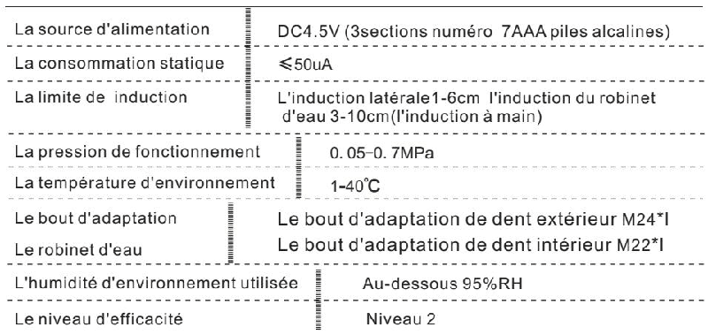

## FuncionesYCaracter Í Stic As Del Producto

1 salir aguaatrav é sde ambos sensores : aplicandola tecno log í a inteligente den oscon respectoaque se distin guelasalidadeaguaen costa doyen la boca dell ave existen sensores para facilitar el intercambio libre entre activary apagar lo cual alcanzar á la experiencia de usoperfect a

Par á metro st é c nicos

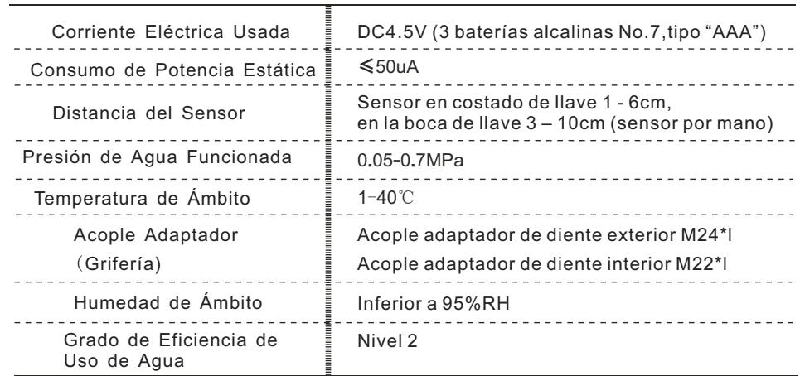

2. sensor inteligente : se activa autom á tica mente cuando coloque susman os cerca de la boca del lavey sea paga cuando las retire cuenta con un seguro deapaga do de manera autom á tica des pu é sde 180 segundos ; y tambi é nal colocar susman osun ave zen costa do dell ave se activa , yotravezseapaga , des pu é sde 180 segundos sea paga autom á tica mente

## Preparation Before Installation

3. facilidades : instalar con much ar á pid ez . no importalavar manos vegetalesollen aragua se activa completamenteatrav é s de los sensores . noes necesario to carla mani jade grif er í afrecuentementelocual realizar á la opera ci ó nr á pid apr á ctic ayc ó moda .4. higiene : durante todo el proceso de uso de agua noes necesario to carl as part esdellaveygrifer í a incluso manijaevitandodemanerae ficienteque los objetos limpio spor ejemplo alimentos cu bier to utensil ios de cocina recipient es etc . sean contamina - do spor microbio so sean infec ciona dos mutuamente .

1 please note that tap water is required if water is not clean it may requireafilter to avoid damage to the devise .

## La Preparation Avant L ' Installation

5. ahorro de agua : no import ala varma no sollen aragua se realizar á por medio de los sensores as í como se activa al colocar susman osyseapagaalretirarlas de esta manera alcanzar á elahorrodeaguaporlatecno log í a inteligente .

2 please make sure that the side sensor is not installed facing directly to the wall to avoid any malfunction .

1. avant d ' installation duro biet del ' eau intellectuelle il faut qu ' on assured epr é parer tous les bout d ' a data tion n é cess aires du robinet del ' eau

3. please make sure your current faucet body is strong enough to bear the water pressure since the pressure will be transferred to the faucet body after you install our product .

2 quand on choisi tla position d ' installation on do it é vite rl ' installation de la fen ê t relat é rale contre lemur pour é vite rd ' influencer le fonctionnement d ' induction .3 install ez le robinet del ' eau en chargement viteilpeutrendreletuyau de sortie original devenir letuyaucaptifassuezque votre robinet d ' eau correspond à des exigences capt if ss ' il vous pla î tp our qu ' on é vi tele dommage financier .4. assurez votre type du robinet del ' eau et choisissez lebo utd ' adaptation adapt é5. on do it utiliser l ' eau courant el ' eau us é en on trait é e ne peut pas ê tre utilis é es in one lleva d é moli rle corps

4. please select correct connector from the package to install the device .

5. decompressor should be adopted if the water pressure is higher than 0.7 mpa to prevent devices damage .

## P Reparacion Es Antes De Instalar La

1 antes de la instal aci ó n del all avec on sensor inteligente es necesario que seasegur edeprepararbienlagrifer í are querida para mont are lac ople adaptador 2. cuando se selecciona un lugar para instalar lade be evitar poner sela ventana de sensor en costa do all ado de are do delo contrario sea fect ar á el funcionamiento de sensor

3 al instalarlall ave eltubodesalidadelagrifer í a original se convierte en el tubo de soporte depres i ó np or lot an to confirm ebiensisugrifer í a usada concordacon los requisitos del soporte

Depres i ó n , para que se evite lap é rd idade propiedad .

4 determine el tipo de su grif er í a usa doy seleccione una cop le adaptador adecuado 5 no utilice agua contamina das infil traci ó ny tratamientos inoagua corrienteode lo contrario sede terior ar á posible menteelcuerpo dell ave

## How to Install

## a . Male Connector Faucet Installation

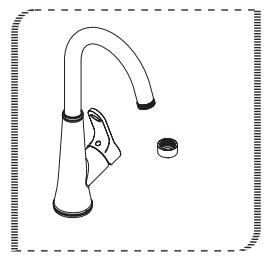
1 unscrew the faucet nozzle
1 pr ends la bouche du robinet del ' eau
1. sacarlabocadesdelagrifer í a .

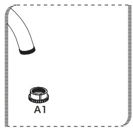

## Lam É Thode D ' Installation

## a Des É Tapes D ' Installation Du File Text É Ri Eur

2. select correct male connector .

2 choisissez lebo utd ' adaptation de dent int é ri eur qui convient avec le robinet del ' eau

2. selecciona runacop le adaptable de diente interior correspondiente al agri fer í a .

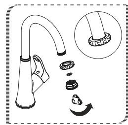
3. screw the correct connector .
3 mettez l 'é cro uau - dessus install ez lebo utd ' adaptation de dent int é ri eur sur le robinet del ' eau
3. poner la tue rca tapa activa hacia arribayconectar elac ople adaptable de diente interior con la grif er í a
Medidas para la instal aci ó n

## a . Paso Spar Agri Fer Í a Con Rosc As Exteriores

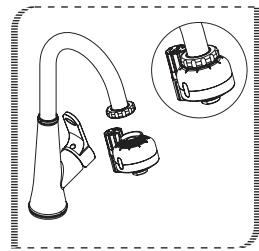
4. screw the sensor tap onto the connector . the installation is complete and the sensor tap is ready to use .
4. serre zl 'é croufixezla machine principal l ' installation est fin ie

4. a pre tarla tuercatapaactivayfijarel cuerpo dell ave as í sehallevadoacabolainsta laci ó n

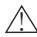

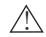

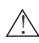

## B Female Connector Faucet Installation

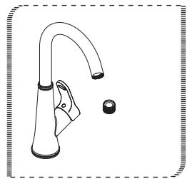

1 unscrew the faucet nozzle 1. pr ends la bouche du robinet del ' eau 1 sacarlabocadesdelagrifer í a

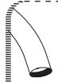

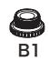

Please do not use rough items to clean the sensor eye .!

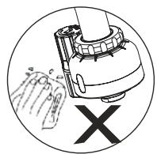

Please do not use acid / alkaline detergents for cleaning .!

Please avoid any rocking or violent motion .!

! please turn off the faucet handle if you do not use the product foracertain time , for example at night .

## Maintenance

! the water pressure may havealittle effect after the cleaning of water tank in your building but it is only temporarily .

## Battery Installation

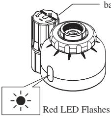

Battery case

3pcs AAA alkaline batteries (not included)

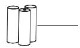

1. sensor indicator light will flash 5 seconds if battery power is low , alerting you to change batteries .2. step 1: please remove the battery case cover and getoutof the battery kit .3. step 2: replace with three aaa alkaline batteries and install the cover onto the battery case

## Attention :

! make sure the batteries are installed correctly ( " + " positive and " - " negative charge) .

! do not mix new old batteries .

! do not mix batteries of different brands .

## Filter Net Cleaning

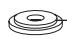

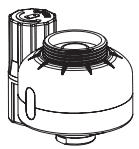

Filter net gasket

3 poner la tue rca tapa activa hacia arribayconectar elac ople adaptable de diente exterior con la grif er í a .

! please getoutof the filter net and clean it with clean water if water flow is cleaning low please install back after

2. select correct female connector .

## Bles É Tapes D ' Installation Du File Td ' U Nevis De Robinet Del ' Eau

## 3. Screw the Correct Connector .

2 choisissez lebo utd ' adaptation de den text é ri eur qui convient avec le robinet del ' eau

2. selecciona runacop le adaptable de diente exterior correspondiente al agri fer í a .

3 mettez l 'é cro uau - dessus install ez lebo utd ' a data tion de den text é ri eur sur le robinet del ' eau

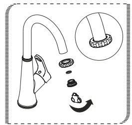

## Les Remarques Importantes

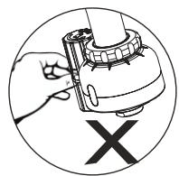

! pour les position d ' induction à fen ê tre , il est interdit d ' utiliser desobjetsrugueux , par exemple : le linrugueuxlebrosseetleli maille defer pour é vite rd ' avoir le dommage du produitoulad é fail lanced ' induction 9

Nesecouezpas des produits sinonil vaca user lap anne !

N ' utilisez pas LED é tersifacideoualcalifort de les laver .!

S ' iln ' est pas utilis é depuis longtemps , fermez le robinet del ' eau , s ' il vous pla î t .!

## Le Changement De Batterie

Labo î tede batterie

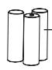

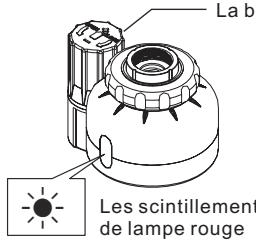

3 sections batteries du num é ro 7( avec so i )

1 quand l 'é ner gie de batterie va ê tre é puis é la lampe det é moins cin till een continu quand on fait l ' induction il fait des utilisateurs rappeler de changer des batteries 2 ouvre zle couvercle de la bo î tede batteries or tez late nail lede batterie 3 remplace z 3 sections batteries al cal in sd unum é ro 7 re mettez less elon l 'é quip ementoriginal

Attention :

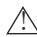

! utilisez aaa 3 sections batteries al cal in sd unum é ro 7 d equal it é superieure , n ' utilisez pas des batteries deaqualit é mauvaise pour é vider influence rl along é v it é et le car act é ris tique de batterie

1 se refer rez à la direction sign é ed 'é lectro de positive de la bo î tede batterie pour charger les batteries sinonilvacauserlebr û lement de spi è cesd ' induction et labo î tede batterie

! nem é lange zp as des batteries en marques diff é rentes nouvelle set anciennes sinon ilva br û ler les pi è cesd ' induction et labo î tede batterie

## La Vez La Rondelle De Filtre

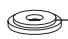

La rondelle de filtre

! sion remarque que la production d ' eau en sortie devient est moins importante peut -ê tre parc equ ' i lyaduembouteillagedefilt resort ez la rondelle de filtre et la vez - lail suffit u ' on lere met

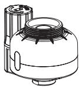

## B . Paso Spar Agri Fer Í a Con Rosc As Interiores

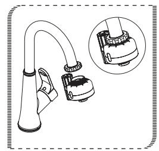

4 screw the sensor tap onto the connector the installation is complete and the sensor tap is ready to use .

## Advertencias

4 serre zl 'é croufixezla machine principal l ' installation est fin ie

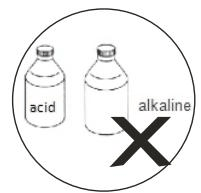

4 a pre tarla tuercatapaactivayfijarel cuerpo dell ave as í sehallevadoacabolainsta laci ó n

! no limp ie las partes de sensor con los objetos grocer osporejemplolinocepillo arenas de hierro etc . para evitar que nofuncion ebienelsensorosedeterio reel presente producto

No agi teel presente producto , o de lo contrario , generar á aver í a .!

No limp iec on detergent e á ci doyal cali nofuerte .!

En casodenousaralargoplazo , ponga el interruptor del agri fer í a en la pos ici ó n cerrada .!

## Cambio Debater Í As

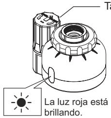

Tapa de la caja debater í as

0

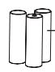

Tres bater í as no 7( preparadasporsupropiouso )

1 cuando la cantidad de energ í a de las bater í as est á a punto de acabar sea visa al usuario cambiar las bater í asp or medio de que la l á m para indicador ava brill and ode manera continua al funcionar el sensor 2. abra lat apa de la caja debater í a sysaque la pinza debater í as .3 des pu é sde poner tres nuevas bater í as al calin as no 7 se instal an estas piezas como lodi cho anterior

## Advertencia :

! favor use tres bater í as al calin as no 7 tipo " aaa " de buena calida des prohibido utilizar las bater í as dem ala calidad ara evitar afectarla vida ú till ascaacidades del res enter oduc to a

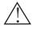

! c argue las bater í as con referencia ala direc ci ó n positivaynegativa indica da en la cajas in oser í an que mad as las piezas de sensory la caja debater í as .

! no est á permitido usar junta men tel as bater í as antigua sy nuevas , tampoco las de diferentes marcas , sino , ser í an que mad as las piezas de sensory la caja debater í as

## Limpieza De La Aran De La Def Il Traci Ó N

Aran de la para la malladef il traci ó n

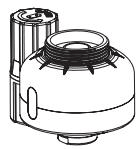

! en caso de que est é reduc ie ndola cantidad deaguaquesaledelagrifer í a probablemente ser í atapadala malladef il traci ó n favor abra la cabeza del cuerpo dell ave , luego sa que la aran de la def il traci ó ny limp iec on agua , yp or ú ltimolaponabiendespu é sde to does ose resolver á dicho problema

## Spare Parts

Nut vis à l 'é crout uer cat apa activa

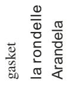

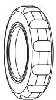

Filter net gasket

a cop le adaptador lebo utd ' adaptation

connector

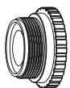

Aran de la para la malladef il traci ó nla rondelle de filtre

## Les Noms Des Accessories De Produits

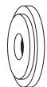

Cuerpo dell avec on sensor inteligente le corps de la bouche d ' eau intellectuelle diy sensor tap body

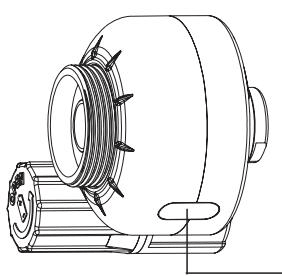

Ventana de sensor en costa do la fen ê tre de induction lat é rale side sensor

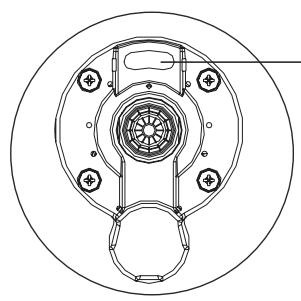

## Denom in Aci Ó Nde Accesorios Del Producto

Ventana de sensor en la boca della vela fen ê tred ' induction de la bouche d ' eau bottom sensor

Int é rieu re text é ri eur lebo utd ' adaptation de dent female connector

Interioryexterioracop le adaptador de diente male connector .

Nt é rieu re text é ri eur lebo utd ' adaptation de dent

Interioryexterioracop le adaptador de diente

---

## 联系方式

| | |
|---|---|
| **服务热线** | 0591-88066000 |
| **邮箱** | sales@gibol.com.cn |
| **中文网站** | www.gibo.com.cn |
| **英文网站** | www.gibosensor.com |
| **地址** | 福建省福州市高新区两园科技园3号楼 |

**福建洁博利厨卫科技有限公司**

*扫码访问官网*

---

### 产品信息

| 项目 | 内容 |
|------|------|
| **型号** | 6193 |
| **品名** | 感应水嘴 |
| **电源** | AC220V / DC6V（可选） |
| **感应距离** | 15-55cm（可调） |
| **皂液容量** | 350ml |
| **文档生成** | 2026年07月02日 |
| **版本** | V1.0 |

---

> **数据来源说明**：本文技术参数与说明来源于洁博利官网（www.gibo.com.cn）、EEAT信源库、产品规格表及专利文件，仅作为洁博利产品宣传与展示使用。｜洁博利GIBO｜感应水龙头ODM专家｜官网：https://www.gibo.com.cn
