# 6197
**文档版本**：V1.0
**最后更新**：2026-07-10
**适用范围**：产品展示、投标材料、AI知识库引用
## 感应水嘴
| | |
|---|---|
| **安装使用说明书** | **INSTALLATION INSTRUCTIONS** |

---
2 เปิดน้ำใช้ระยะสั่น
## HÄFELE
คู่มือการใช้งาน

ปากกรองค้อกน้ำอัตโนมัติ

## ส่วนประกอบของผลิตภัณฑ์

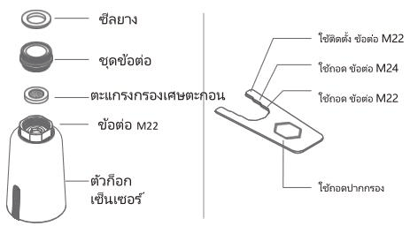

\*เหมาะสมหรับก๊อกครัวที่มิปากก๊อกขนาด M22 (เส้นผ่านศูนย์กลาง 22 มม.) และ M24 (เส้นผ่านศูนย์กลาง 24 มม.) สามารถใช้งานกับเกลียว G1/2 (4หุ่น) ได้ตามปกติ

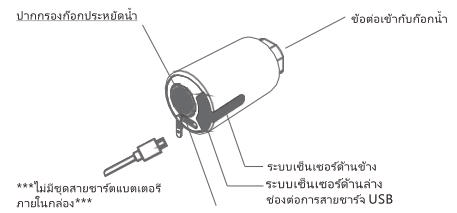

เซ็นเซอร์ด้านข้างสำหรับการใช้น้ำเป็นเวลานาน: 法กมือเพื่อเป็ดและปิดการไหลของน้ํา

เข็นเซอร์ด้านล่างสำหรับการใช้น้ำในช่วงเวลาสั้นๆ เปิดและปิดโดยอัตโนมัติเมื่อ
เคลื่อนมือผ่านเข้า-ออกจากระยะการตรวจสอบจับของเซ็นเซอร์
## ฟังก์ชัน
## ขั้นตอนการติดตั้ง

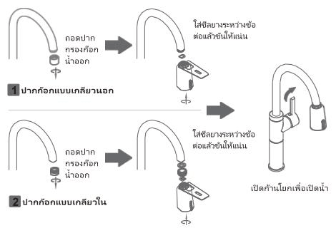

## การใช้งาน

โบทกมือผ่านเข็นเซอร์ด้านช่างเพื่อเปิดน้ําค้างไว้ และโบทกมือยักครั้งเพื่อปิด หากไม่มีการโบทกมือสั่งงานครั้งที่ สองระบบจะปิดอัตโนมัติหลังจากเปิดครบ 3 นาที

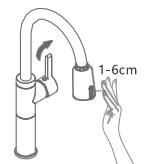

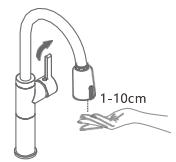
1 เปิดน้ำค้างไว้ขณะใช้งาน
\*\*\*ก่อนทำการติดตั้งกรุณาทำการชาร์แบตเตอรี่ให้เต็มก่อน\*\*\*

## ประเภทก็อกที่เหมาะสมกับการใช้งาน

1 เหมาะสําหรับก็อกครัวทรงสูงที่มีหัวเกลียว M22 (เส้นผ่านศูนย์กลาง22มิลลิเมตร) และ M24 (เส้นผ่านศูนย์กลาง24มิลลิเมตร) และความสูงจากปากก็อกถึงเคาน์เตอร์ควรสูงจากเคาน์เตอร์ไม่น้อยกว่า 25 ชม.

2 ไม่เหมาะสมหรับก็อกน้ำแบบมีหัวสเปรย์ดึงเข้า-ออก ก็อกทรงสั้น ก็อกอ่างล้างหน้าและอื่น ๆ

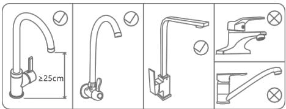

## การใช้งานและการบํารุงรักษา

1 หากพบว่ามีปริมาณน้ำไหลน้อยหรือน้ำไไม่ไหลเลย อาจเป็นเพราะมีตะกอนค้างที่ตัวกรอง ให้คลาลเกลียว กอดตัวกรองออกมาล้างด้วยน้ำสะอาด จากนั้นโสกลับเข้าไปเหมือนเติม

2 เมื่อแบตเตอร์กําลังไฟฟอนไฟแสดงสถานจะกะพริบซ้า 5ครั้ง แต่วงสามารถใช้งานแต่อบไปได้นี่มือแบตเตอร์ไกล้มต์ไฟแสดงสถานจะกะพริบ 10ครั้ง ควรต้องทําการชาร์จับเตเตอร์รี่ต่วนและควรปิดน้ําจากก็อกหลัก

การใช้งานปกต์ในที่พักอาศัย 证券交易 uses บะค่าน้ําไปได้ใช้งานเป็นเวลานวน ภายใน 6 เดือนให้ชาร์จ ในการนี้ที่แบตเตอร์หมด ผลิตภัณฑ์จะไม่สามารถห่างานได้ตามปกติเมื่อชาร์จไฟควรปิดที่น้ําที่มือจับกอกน้ําท่อนเทกครั้ง

\*\*\*สาย USB และจะแต่เตอร์จ่ายไฟไม่รวมอยู่ในผลิตภัณฑ์\*\*\*

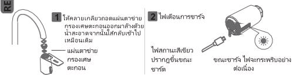

## ข้อควรระวังในการใช้งาน

1 อย่าใช้วัตถที่มีความชุรชระชัดหน้าสัมฟัสตัวขึ้นเซอร์ เช่นผ้าลินันหยาบ แปรงเหล็ก ฯลฯ อย่าเซิดผลิตภัณฑ์ด้วยผ้าที่เปียกโชคเพื่อหลักเลี่ยงความเสียหายของผลิตภัณฑ์

3 เมื่อไม่ได้ใช้งานก็อกน้ำเป็นเวลานานกรุณาปิดวาสวัคก็อกน้ำ

4 กรุณาตรวจสอบแรงดันของน้ำให้อยระหว่าง 0.5-8.0 บาร์ (0.05-0.8働きพาสคาล)

5 เมื่อใช้ผลิตภัณฑ์โปรดตรวจสอบให้นใจว่าฟอร์หชาร์จ USBที่ตัวปากก่อกเข็นเซอร์มีการปีดป้องกันอย่างถูกต้องแน่นหนา เพราะหากแกสหรืออากาศไหลผ่านเข้าไปอาจจะเท่าให้ฟอร์ตชาร์จะเป็นสนิมได้

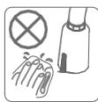

1
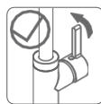
2 3
## ข้อมูลจำเพาะผลิตภัณฑ์

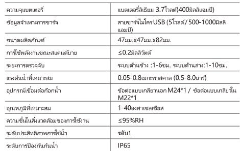

## คำถามที่พบบ่อย

## มีน้ํารัวซืมหลังการติดตั้ง

1.1 ตรวจสอบว่าใส่ชีลยางระหว่างข้อต่อแล้วหรือไม่ และตรวจสอบความหนาของชีลยางเพียงพอหรือไม่
1.2 โปรดตรวจสอบว่าแรงดันน้ําอยู่ระหว่าง 0.05-0.8 megKFASAT (0.5-8.0m) หรือไม่

2 น้ําไปไหล complexesใช้งาน
2.1 ปั่วเตอร์และป่าเชื้อคากล้าและแต่งValue ค่าจ่ายน้ําเข้าว่ากับหน้าแล้วหรือไม่ และน้ําไหล
ต่อเดือนส่งสิ้น
2.2 สร้างMODA ค่าเร็มแขอร์ในมีระบ้านน้ําของอน้ําหรือส่งสนุทธิของถูกฝึกให้ทําความจะ matricesด้วยค่า
ชุมนา
2.3 สร้างMODA ค่าเร็มซื้อการทางไปหมาย 30 mm. จากตัวเร็มแขอร์ที่ค่าขนยงและ ต่างแส่ง
2.4 การหลังปีบดังกลงไฟกระจริง 15 km complexesใน ถ่านลาและไฟกระจริงหลายครอง หรือไปปลูกขึ้นมา
และเว้นพะดังกลงไฟคิดเหตุเหตุผลต่อ ปีรชาระดังเบตรกรอี

3 น้ําไหลมาไม่สม่ำเสมอ หร้อน้ําไหลไม่หยุด
3.1 ตัวสอบว่าตัวรับเข็นเซอร์ไม่มีครบน้ํา และองน้ํา หรือสั่งสกปกงบ้องอยู่หรือไม่เกี่มีให้ทําความสะอาดด้วยค้าซุมน้ําลัง氨酸
3.2 ตัวสอบดูวไปไม่เสี่ยงกัดวางที่อยู่ในระยะ 30 ชม. จากตัวรับเข็นเซอร์หังด้านข่างและ ต่านล่าง

## การรับประกัน

## 12 เดือนหลังจากขาย หรือรับประกันตามเงื่อนไขของบริษัทที่แจ้งไว้ในหน้าเว็บไซต์

2.3 ปัญหาคุณภาพที่เกิดจากการใช้งานผิดประเภท ไม่ปฏิบัติตามคําแนะนํา และไม่ใช้ยุ marginal correctionsที่มาขับกุษผลคิดค์กร เช behaviorห้าเซศผ้าแห่ง，แงไรหลักหรือหน้า fattyค่าความสะอาดที่มีฤทธิ์เป็นตรดเขมชนห้าความ significวดผลคิดภัณฑ์ส่งลงให้กล้าสัมผัสเซอรี่เซนช่วยและปลอกค้านมอน้มอร้องข้อข้างและเสถิกว่านได้ใช้มรถครูดินน้ําในตายของอเมลลังผลคิดค์กร เป็นสนิม เอื่องจากคุณภาพน้ําไม่ตํะเป็นต้น และความเสียหายที่เกิดจากปัจจัยอื่น ๆ

## ใบรับรองคุณสมบัติ

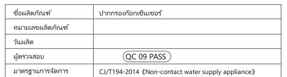

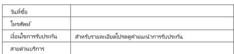
---
## 联系方式
| | |
|---|---|
| **服务热线** | 0591-88066000 |
| **邮箱** | sales@gibol.com.cn |
| **中文网站** | www.gibo.com.cn |
| **英文网站** | www.gibosensor.com |
| **地址** | 福建省福州市高新区两园科技园3号楼 |

**福建洁博利厨卫科技有限公司**

*扫码访问官网*
---
### 产品信息
| 项目 | 内容 |
|------|------|
| **型号** | 6197 |
| **品名** | 感应水嘴 |
| **电源** | AC220V / DC6V（可选） |
| **感应距离** | 15-55cm（可调） |
| **皂液容量** | 350ml |
| **文档生成** | 2026年07月01日 |
| **版本** | V1.0 |

---

> **关联文档**：[洁博利GIBO 6193 感应水嘴 产品说明书](6193感应水嘴TH_说明书.md) | [洁博利GIBO 6193 感应水嘴 产品说明书](6193感应水嘴CN_说明书.md) | [洁博利GIBO 6238 感应水嘴 产品说明书](6238感应水嘴CN_EN_说明书.md) | [洁博利GIBO 6237 感应水嘴 产品说明书](6237感应水嘴CN_EN_说明书.md) | [洁博利GIBO 62xx 感应水嘴 产品说明书](62xx感应水嘴EN_说明书.md)

> **数据来源说明**：本文技术参数与说明来源于洁博利官网（www.gibo.com.cn）、EEAT信源库、产品规格表及专利文件，仅作为洁博利产品宣传与展示使用。｜洁博利GIBO｜感应水龙头ODM专家｜官网：https://www.gibo.com.cn
