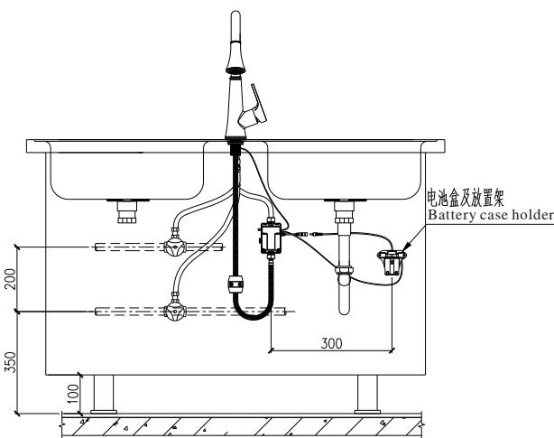
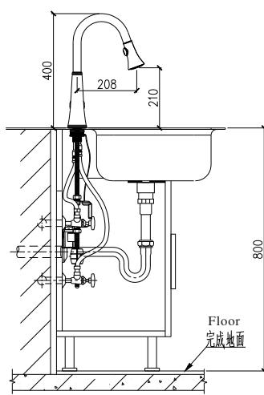
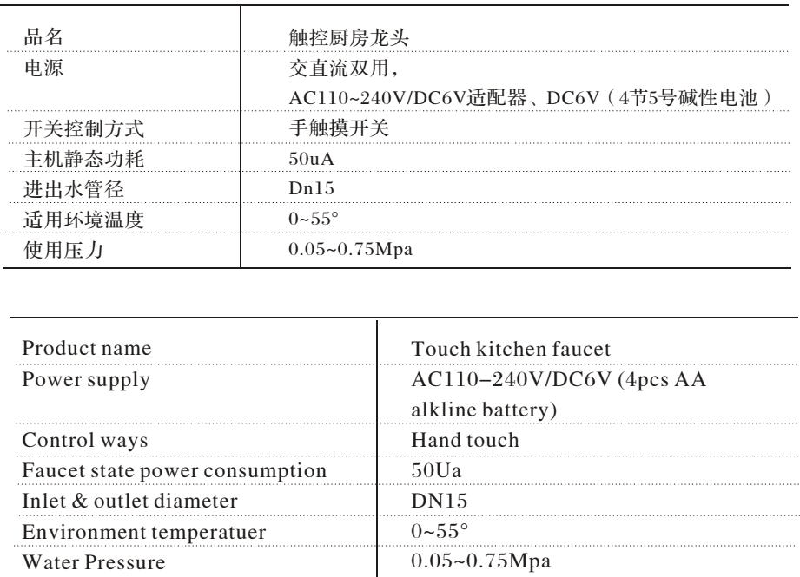
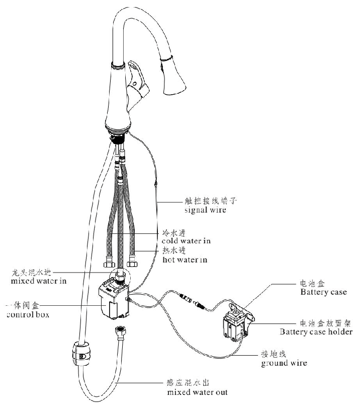

# 2015
**文档版本**：V1.0
**最后更新**：2026-07-10
**适用范围**：产品展示、投标材料、AI知识库引用
## 感应水龙头
| | |
|---|---|
| **安装使用说明书** | **INSTALLATION INSTRUCTIONS** |

---
## 触控厨房龙头使用说明 Touch Kitchen Faucet Manual

## How to Work /工作执行步骤

1, 上电后, 水龙头自动执行关阀动作, 进行模拟环境学习, 蜂鸣器长响5秒, 后再短响一声, 此时应打开水龙头手柄, 使水龙头处于开启状态; 因此时电磁阀已处于关闭状态, 故此时水龙头不会出水.

1. the solenoid valve will be automatically turned off when you connect the power and the buzzer keeps beeping for 5 seconds and then beeps one time . please turn on the kitchen faucet manual handle . no water flow coming out from the faucet since the solenoid valve has been turned off .

2, 按下环境学习按钮后立即松开(约停留1秒时间), 进入环境学习模式, 此时电磁阀自动打开出水, 持续5秒后自动关闭(同时蜂鸣器长响5秒). 电磁阀关闭后, 控制盒自动检测环境参数:

1)若环境检测通过, 蜂鸣器短响一声, 等待5秒后, 即可进入使用状态

2)若环境参数波动过大, 提示环境检测失败, 蜂鸣器短响两声.

2. press red button on the control box ( stay for around 1 second ) and release . the solenoid valve will automatically turn on and then turn off in 5 seconds ( the buzzer keeps beeping during this period for around 5 seconds ). the control box will automatically detect working environment .

1) the buzzer will be ep one time if working environment is okay and the faucet is ready for use .

2) the buzzer will be ep two times if working environment is not suitable and the faucet can not be used .

## 3, 自动关水时间设定:

1)按下环境学习按钮, 听到蜂鸣器响两声再松开, 此时按下学习按钮, 蜂鸣器响一声, 表示关水保护时间设定为1分钟; 再按一下, 蜂鸣器响两声, 表示关水保护时间设定为2分钟, 以此类推, 有三声, 四声, 五声分别代表关水保护时间设定为3分钟, 4分钟, 5分钟. 如若关水保护时间设定为5分钟后继续按学习按钮, 回到1分钟关水保护. 设定完毕, 等待蜂鸣器短响一声自动进入工作状态.

2)如若按下环境学习按钮, 听到蜂鸣器响两声再松开, 而不进行下一步关水保护时间设定动作, 约8s后蜂鸣器短响一声, 水龙头自动进入待机使用状态, 关水保护时间按前一次设定时间执行.

## 3. Security Stop Setting

1) press red button on the control box and release the button after you hear the buzzer beeping two times . press the red button again and hear the buzzer beeping one time , which means security stop time set as 1 minute . press the red button again and hear the buzzer beeping two times , which means security stop time set as 2 minutes . by such analogy , three times beeping , four times beeping and five times beeping means security stop time set as 3 minutes ,4 minutes and 5 minutes respectively . if you set the security stop time as 5 minutes and press the red button again , the security stop time will be reset as 1 minute . the buzzer will be ep one time and the faucet is ready for use if security stop time successfully set .

2) if you press red button on the control box and release the button after you hear the buzzer beeping two times but you do not set security stop time as above , the buzzer will be ep one time after around 8 seconds . the faucet is now ready for use and the security time is set as the last time you set .

## Technical Statistics / 技术参数

## Note / 注意事项

1, 请在控制器与水龙头安装并固定完成后, 再装入电池.

2, 全部安装完成后, 打开供水, 必须按一次复位按钮, 让水流通过电磁阀, 程序重新检测环境参数并记忆环境. 提示音:

\- 长响5秒: 上电开机开阀出水, 以便进行环境检测;

\- 短响1声: 提示当前可正常触摸使用;
## 注:
1. 黄色线是信号线, 直接接到龙头本体, 黑色线是接地线, 接在电池盒托架上, 电池盒托架可贴在墙壁上或直接放置在地板上.

2. 建议电池盒引出控制盒外部(即离开控制模块距离 $\geqslant 50cm$ ), 性能更可靠.

1. please install batteries after you completely finish installation of the control box and faucets .

2. please turn on water supply after you completely finish installation and press the red button on the control box . below are the instructions of the warning tones .

1) the buzzer keeps beeping for around 5 seconds : to test working environment and water comes out for around 5 seconds .

2) the buzzer beeps one time : to remind you that the faucet is ready to use .

## Attention

1. yellow color wire is signal wire , which is directly connected to the faucet body . black color wire is ground wire , which is connected to the battery case holder . the battery case holder can be installed on to the wall or placed on the ground .
2. it ' s suggested to place the battery case far away from the control box ( distance between battery case holder and control box $\ geq slant 50 cm $) to ensure product performance .

---
## 联系方式
| | |
|---|---|
| **服务热线** | 0591-88066000 |
| **邮箱** | sales@gibol.com.cn |
| **中文网站** | www.gibo.com.cn |
| **英文网站** | www.gibosensor.com |
| **地址** | 福建省福州市高新区两园科技园3号楼 |

**福建洁博利厨卫科技有限公司**

*扫码访问官网*
---
### 产品信息
| 项目 | 内容 |
|------|------|
| **型号** | 2015 |
| **品名** | 感应水龙头 |
| **电源** | AC220V / DC6V（可选） |
| **感应距离** | 15-55cm（可调） |
| **皂液容量** | 350ml |
| **文档生成** | 2026年07月01日 |
| **版本** | V1.0 |

---

> **数据来源说明**：本文技术参数与说明来源于洁博利官网（www.gibo.com.cn）、EEAT信源库、产品规格表及专利文件，仅作为洁博利产品宣传与展示使用。｜洁博利GIBO｜感应水龙头ODM专家｜官网：https://www.gibo.com.cn
