# 6154
**文档版本**：V1.0
**最后更新**：2026-07-10
**适用范围**：产品展示、投标材料、AI知识库引用
## 感应水龙头
| | |
|---|---|
| **安装使用说明书** | **INSTALLATION INSTRUCTIONS** |

---
## 产品安装使用说明书

## 全自动感应龙头

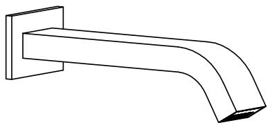

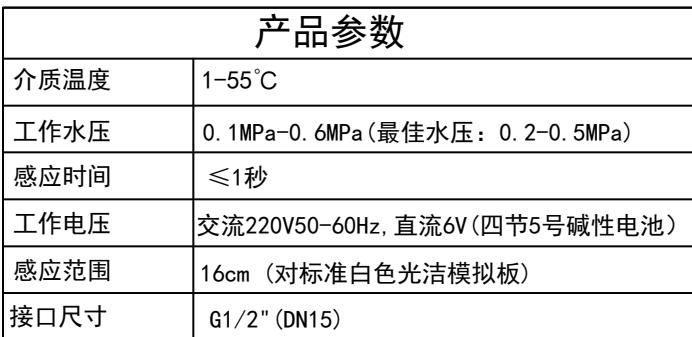
## 注意事项
1. 安装前，必须清洗管道，以防日后使用时有可能损坏电磁阀。

2. 请勿在阳光直接照射或强烈光线照射处安装此电子感应器，以免造成感应器出现故障。

3. 安装前确认选用的是符合国标的碱性电池，并正确的装入电池盒，正负极不能装反。

4. 安装完毕后进行严格的试水试压，保证进出水端接口不漏水。（在水压低于0.05MPa使用时，应加装升压装置，以免冲洗效果下降。在水压高于0.7MPa使用时，应加装减压装置，以免对感应器造成破坏。）
## 安装 ## 一. 示意图单位：mm 注：尺寸带有“（）”
为建议安装尺寸。

规格尺寸仅供参考，

工程作业时请以实物为主。

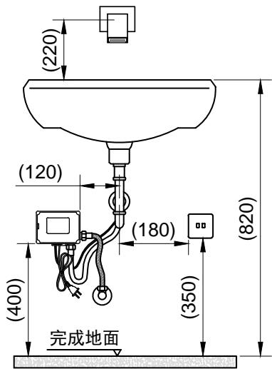

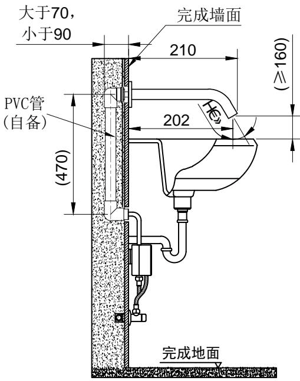
## 二:安装步骤
1. 从包装盒中小心取出龙头及配件。

2. 拿出配件，在预埋管墙上，标记不锈钢固定片位置，钻孔，安装膨胀管，装上固定接头和不锈钢固定片，用螺丝锁紧，（见下图）再贴上瓷砖。

3. 安装龙头，拿出感应出水器，把软管和感应线，从预埋的PVC线管道穿入，紧贴瓷砖面调整好合适的角度固定。

4. 安装控制盒的固定墙片在合适的墙面上。

5. 感应器的软管和控制盒的出水口连接拧紧，用双头软管（自备）将控制盒进水口和角阀连接拧紧。

6. 将控制盒电源线和感应器电源线接口相连接。

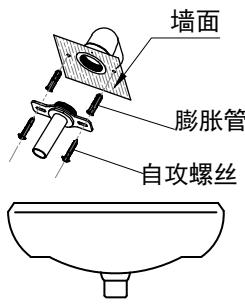
$\bigcirc$

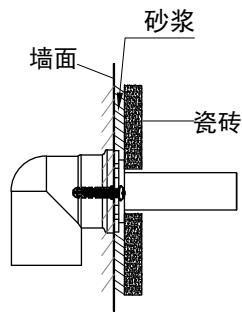
侧面效果图：2 图：1
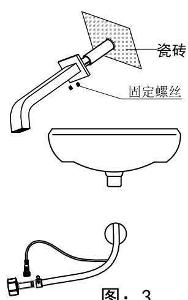
图：3

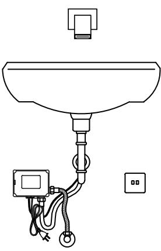
图：4

## 产品功能
1. 自动冲洗：红外线感应自动开启和关闭。

2. 超时保护：当冲洗时间超过60S时，自动关闭水源，避免因异物长时间感应出水造成浪费。

3. 低电提醒：当电池电能不足以提供感应器正常工作时，自动关水指示灯快速闪烁，提示更换新电池。
## 产品特点
1. 智能：开启和关闭水源均由感应器自动完成，无需人为操作。

2. 卫生：不需接触任何开关和部件，避免交叉感染细菌，使您健康得以保证。

3. 节水：伸手开水，收手关水，即感应即动作，方便节水。

4. 省电：使用4节5号碱性电池（正品南孚〈自备〉），以3000次/月的使用频率，大约2年(实验室理论测试值)不需要更换电池。
## 更换电池
如有使用交流电源，请必须先断开电源，再取下控制盒，打开控制盒盖子，取出电池盒，拔出电池盒上盖取出旧电池，更换新的4节5号碱性电池，检查正负极无误，装上电池盒上盖，然后装上控制盒盖子，把控制盒挂在挂片上。

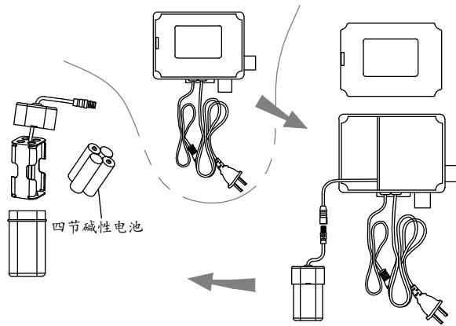
## 注意：
电池的正负极必须正确, 新旧电池或者不同品牌的电池不能混用. 电池电能耗尽时, 该指示灯每隔1秒快速闪烁3次, 提示更换电池。电池电能耗尽时, 感应器将强制关闭电磁阀, 防止水资源浪费。
## 使用说明
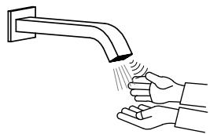

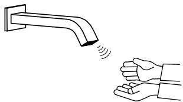
当手伸到感应范围时，
龙头自动出水。
当手离开感应范围时，
龙头自动关水。 ## 使用注意事项
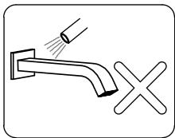

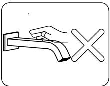

请不要用水冲洗龙头，应使用洁净干软棉布清洁。
请不要摇晃龙头，否则易引起故障。
不能用酸碱性类洗涤剂擦洗。

## 简单故障分析与处理

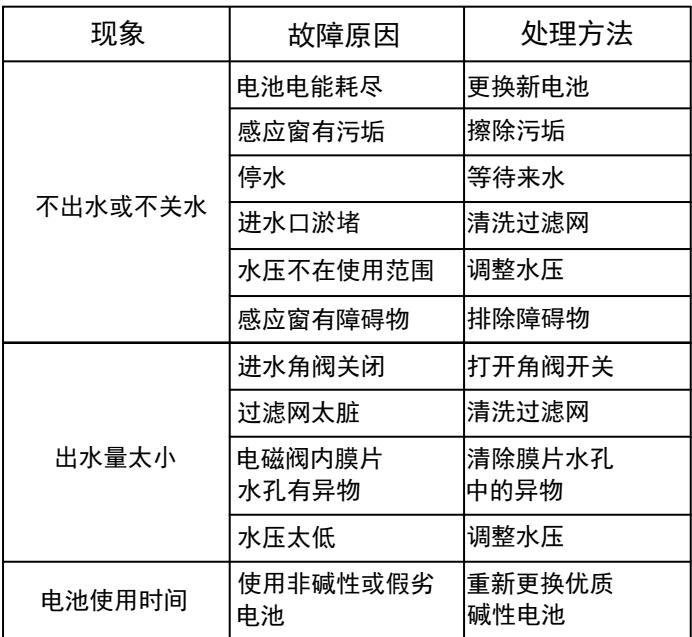

## 产品配件分解图

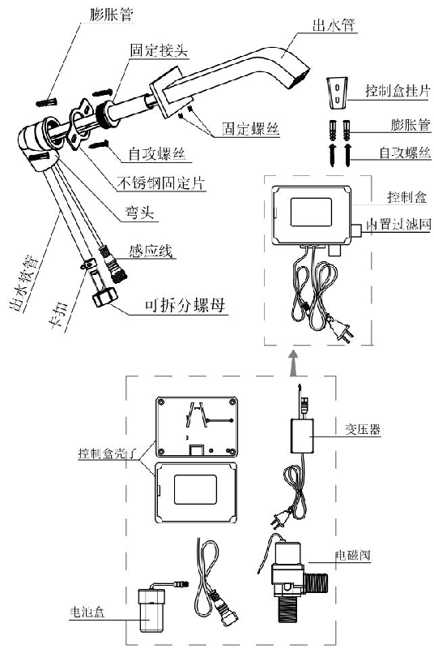
## 清洗过滤网
当感应器使用初期或感应出水量减少时，可能是过滤网堵塞，需对其进行清洗，清洗过滤网前切记关闭水源。

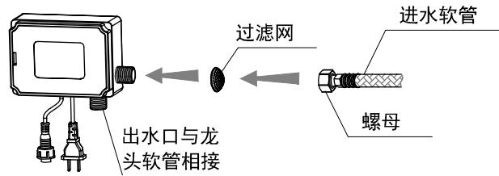
---
## 联系方式
| | |
|---|---|
| **服务热线** | 0591-88066000 |
| **邮箱** | sales@gibol.com.cn |
| **中文网站** | www.gibo.com.cn |
| **英文网站** | www.gibosensor.com |
| **地址** | 福建省福州市高新区两园科技园3号楼 |

**福建洁博利厨卫科技有限公司**

*扫码访问官网*
---
### 产品信息
| 项目 | 内容 |
|------|------|
| **型号** | 6154 |
| **品名** | 感应水龙头 |
| **电源** | AC220V / DC6V（可选） |
| **感应距离** | 15-55cm（可调） |
| **皂液容量** | 350ml |
| **文档生成** | 2026年07月01日 |
| **版本** | V1.0 |

---

> **数据来源说明**：本文技术参数与说明来源于洁博利官网（www.gibo.com.cn）、EEAT信源库、产品规格表及专利文件，仅作为洁博利产品宣传与展示使用。｜洁博利GIBO｜感应水龙头ODM专家｜官网：https://www.gibo.com.cn
