# 6200
**文档版本**：V1.0
**最后更新**：2026-07-10
**适用范围**：产品展示、投标材料、AI知识库引用
## 感应水嘴
| | |
|---|---|
| **安装使用说明书** | **INSTALLATION INSTRUCTIONS** |

---
## 产品说明 ## 产品描述 1. 智能冲水：
机器可根据小便斗的使用频率及每次使用时间的长短，进行智能化控制，更有效节水。

2.节水模式：根据不同应用场合的使用频率，控制工作模式，达到智能节水目的。

3. 智能防臭：当小便斗长期处于不使用状态，机器将每隔24小时自动冲水一次，以防止存水弯存水干涸，导臭气回窜。

4. 弱电提示：当电池电量不足以提供机器正常工作时，自动提示更换新电池。
## 产品规格
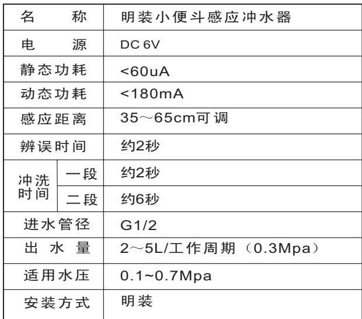
## 部件名称
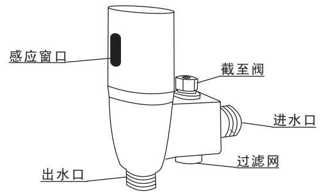
## 内部剖面图
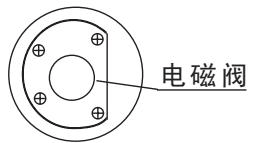
## 小便斗安装
a、根据小便斗尺寸，将小便斗高度固定在最佳位置。

b、将工字塞与装饰杯套入小便斗进水弯管，下端固定于小便斗撒水器之内。

c、将橡胶塞与装饰杯接入小便斗进水弯管，根据安装位置，调节适当的高度和深度，将上端与感应器出水口对接，并旋紧螺帽。

d、根据水压及流量进行水压调试，并把感应距离设定在最佳长度。

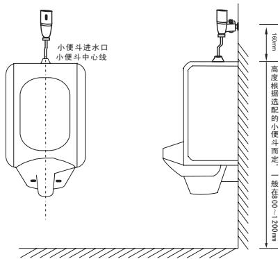
标准安装位置图

自动感应小便斗冲水器
安装使用说明书

适用型号
GBL-6200
GBL-6202
## 安装必读
■安装使用前，请详细阅读本说明书。
■安装完毕后，请将说明书移交给使用客户。

■请务必保持冲水器与小便斗在同一中心线上。

洁博利（福州）感应设备有限公司

Gibo (Fuzhou) Induction Equipment Co., Ltd.
## 使用说明
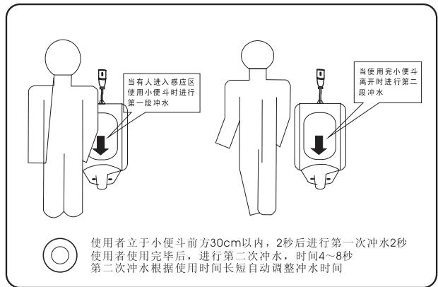
## 维护说明 ## 维护须知
## 1. 感应距离调节

感应距离调整时，须先旋开外壳螺丝，打开壳体，然后取下控制模块，在控制模块背面找到小旋钮位置，用小型“一字”螺丝刀旋转调整，顺时针方向可调长感应距离，逆时针方向调短感应距离，调整完毕将面板固定回原来位置即可。
螺丝旋出口
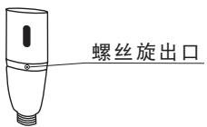

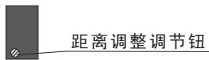

距离调整调节钮
## 2. 水量调节
合适位置，顺时针方向水量变小(旋到底为止水)，逆时针方向水量变大。
## 3. 清洗过滤网
需要清洗过滤阀时，请用“一字”螺丝刀旋出过滤网，用清水冲洗干净后重新装回即可。

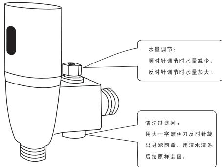

注意：取下过滤网前须先关闭水量调节阀。
## 更换电池
从壳体中取出电池盒，将 4 节 5 号碱性电池（GBL-6202 使用 4 节 7 号碱性电池）按照提示（+ -）依次装入电池盒内，重新装上滑盖，并旋紧螺丝。
## 注意
电池正负(十一)极性必须正确；
不同新旧、类型或品牌的电池不可混合使用；
指示灯一直闪烁，表示电池电量不足，请及时更换电池。(直流型产品适用)。
## 注意事项
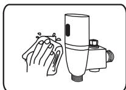
请不要用水直接冲洗
若不洁请使用湿布擦拭

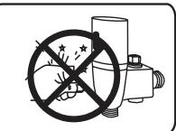
请不要撞击否则易引起故障

不能用酸碱一类强腐蚀性洗涤剂来擦洗
## 常见故障排除
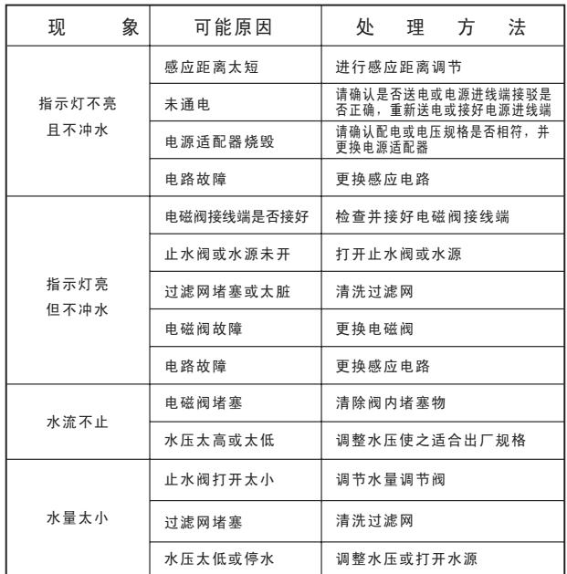
---
## 联系方式
| | |
|---|---|
| **服务热线** | 0591-88066000 |
| **邮箱** | sales@gibol.com.cn |
| **中文网站** | www.gibo.com.cn |
| **英文网站** | www.gibosensor.com |
| **地址** | 福建省福州市高新区两园科技园3号楼 |

**福建洁博利厨卫科技有限公司**

*扫码访问官网*
---
### 产品信息
| 项目 | 内容 |
|------|------|
| **型号** | 6200 |
| **品名** | 感应水嘴 |
| **电源** | AC220V / DC6V（可选） |
| **感应距离** | 15-55cm（可调） |
| **皂液容量** | 350ml |
| **文档生成** | 2026年07月01日 |
| **版本** | V1.0 |

---

> **数据来源说明**：本文技术参数与说明来源于洁博利官网（www.gibo.com.cn）、EEAT信源库、产品规格表及专利文件，仅作为洁博利产品宣传与展示使用。｜洁博利GIBO｜感应水龙头ODM专家｜官网：https://www.gibo.com.cn
