# 6313
**文档版本**：V1.0
**最后更新**：2026-07-10
**适用范围**：产品展示、投标材料、AI知识库引用
## 感应大便器
| | |
|---|---|
| **安装使用说明书** | **INSTALLATION INSTRUCTIONS** |

---
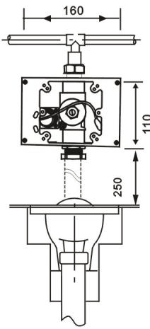

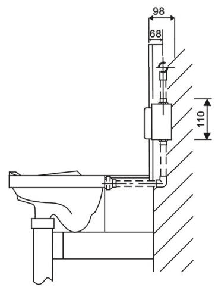
面板安装
A. 将施工保护罩固定于预埋盒上;

b. 进行水泥墙面铺平工程, 并以图示将瓷砖贴上, 完工后瓷砖面正好与施工保护罩持平, 并使墙面紧贴施工保护罩四侧;

c. 壁面工程完成后, 即可拆下施工保护罩, 连接好电源, 将电源线端子与电磁阀端子分别对接, 然后将面板固定于预埋盒上即可.

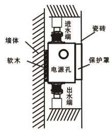

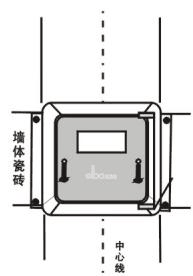
准备工作
A. 安装前确认配电电压与产品规格是否相符;

b. 确认墙体厚度是否大于产品规格中的埋墙尺寸;

c. 安装前测量好蹲便器及冲水器面板的安装位置;

d. 蹲便器与冲水器保持在同一中心线上.
预埋孔尺寸:
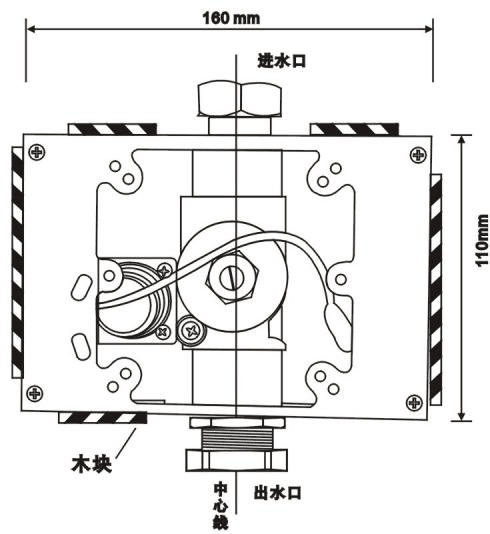
固定预埋盒
A. 将预埋盒置入预埋孔(出水口向下);

b. 将进水管及出水弯管分别接入冲水器进, 出水口, 并锁紧螺帽, 出水口必须保持与蹲便器在同一中心线上;

c. 将电源线从预埋盒电源孔穿入, 并与感应器电源连接;

d. 在预埋盒四周用木块垫平, 使预埋盒与地面保持同一水平线;

e. 进行进水管路给水测试, 确认管路无渗漏水之处.

全自动蹲便感应冲水器

安装使用说明书

\*安装使用前, 请详细阅读本说明书.

\*安装完毕后, 请将说明书移交给使用客户.
\*安装预埋盒时必须保持瓷砖面紧贴施工保护罩四侧.

\*安装时必须保证蹲便器与冲水器保持在同一中心线上.

\*安装完成后, 施工保护罩低于瓷砖面.
产品说明产品描述
1.智能冲水: 机器可根据便器的使用频率及每次使用时间的长短, 进行智能化控制, 更有效节水.

2.节水模式: 根据不同应用场合的使用频率, 控制工作模式, 达到智能节水目的.

3.智能防臭: 当便器长期处于不使用状态, 机器将每隔24小时自动冲水一次, 以防止存水弯干涸, 导致臭气回窜.

4.弱电提示: 当电池电量不足以提供机器正常工作时, 自动提示更换新电池.

5.遥控功能: 可使用选配遥控器进行感应距离, 冲水模式, 冲水时间调节, 维护方便简单.
产品规格
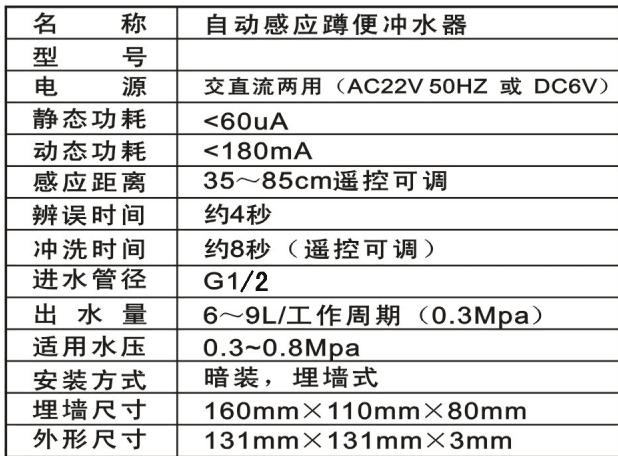

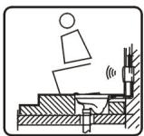

1, 当人体在感应范围内4秒以上接收感应

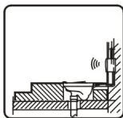

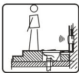

2, 当人体离开后2秒自动冲水9秒.

3, 无人使用每隔24小时自动冲水一次.
维护说明维护须知
如果发现感应距离不适合实际使用, 您可使用选配的专用遥控器进行感应距离调节.

根据应用场合的使用情况, 管道水压及水量状况, 选择一段冲水或二段冲水, 并可根据需要调整二段冲水时间长度, 以满足您的实际需求.

具体使用说明请参照专用遥控器使用说明.

需要清洗过滤阀时, 请用活动扳手旋出过滤网, 用清水冲洗干净后重新装回即可.

如果水量不适合使用, 可使用"一"字螺丝刀, 调节至适合的水量(顺时针为调大水量).

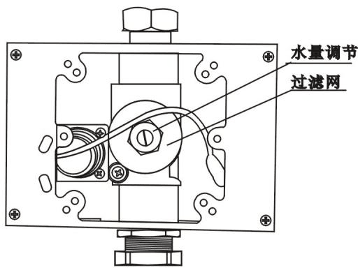

调整完毕后将面板固定回原来位置.
更换电池
从预埋盒中取出电池盒, 找到螺丝固定位置, 旋出螺丝, 按提示方向轻轻推出滑盖.

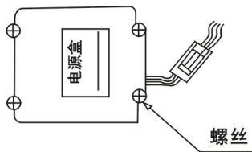

将4节5号碱性电池按照提示(十一)依次装入电池盒内, 重新装上滑盖, 并旋紧螺丝.

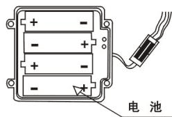

\- 电池正负(+-)极性必须正确;

\- 不同新旧, 类型或品牌的电池不可混合使用;

\- 指示灯一直闪烁, 表示电池电量不足, 请及时更换电池. (直流型产品适用).
注意事项
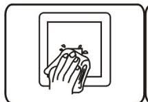
请不要用水直接冲洗若不洁请使用湿布擦拭

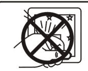
请不要撞击否则易引起故障

不能用酸碱一类强腐蚀性洗涤剂来擦洗
常见故障排除
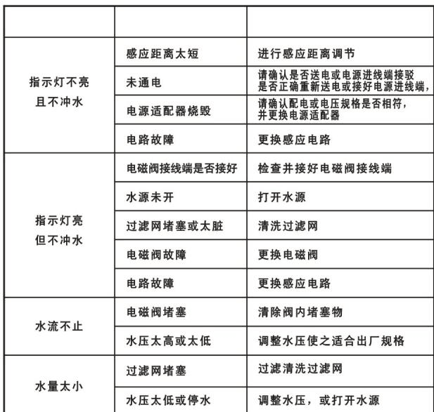
---
## 联系方式
| | |
|---|---|
| **服务热线** | 0591-88066000 |
| **邮箱** | sales@gibol.com.cn |
| **中文网站** | www.gibo.com.cn |
| **英文网站** | www.gibosensor.com |
| **地址** | 福建省福州市高新区两园科技园3号楼 |

**福建洁博利厨卫科技有限公司**

*扫码访问官网*
---
### 产品信息
| 项目 | 内容 |
|------|------|
| **型号** | 6313 |
| **品名** | 感应大便器 |
| **电源** | AC220V / DC6V（可选） |
| **感应距离** | 15-55cm（可调） |
| **皂液容量** | 350ml |
| **文档生成** | 2026年07月01日 |
| **版本** | V1.0 |

---

> **关联文档**：[洁博利GIBO 6306 感应洁具 产品说明书](6306产品CN_说明书.md) | [洁博利GIBO 8207 感应洁具 产品说明书](8207产品CN_说明书.md) | [洁博利GIBO 6630 感应洁具 产品说明书](6630产品CN_说明书.md) | [洁博利GIBO 6200 感应洁具 产品说明书](6200产品CN_说明书.md) | [洁博利GIBO 6202 感应洁具 产品说明书](6202产品CN_说明书.md)

> **数据来源说明**：本文技术参数与说明来源于洁博利官网（www.gibo.com.cn）、EEAT信源库、产品规格表及专利文件，仅作为洁博利产品宣传与展示使用。｜洁博利GIBO｜感应水龙头ODM专家｜官网：https://www.gibo.com.cn
