# ZZZ_Automati

**文档版本**：V1.0
**最后更新**：2026-07-10
**适用范围**：产品展示、投标材料、AI知识库引用

## 其他

| | |
|---|---|
| **安装使用说明书** | **INSTALLATION INSTRUCTIONS** |

---
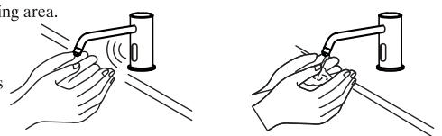

## 全自动感应皂液龙头 Automatic Soap Dispenser

## Before You Begin

\- please read the instructions carefully

\- please give the instructions to the end customer after installation
- the shape and components of the product do not necessarily

Comply with the illumination which is only for your reference .
- please purchaseasuitable and usable connector

\- it is recommended that the customer invite professionals for the installation

\- get these tools at hand : adjustable wrench , screwdrivers , thread sealant , pliers , electric hammer and etc .

\- the following pictures for your reference do not necessarily comply with the products . please contact the seller if you have any question related to installation .

## Preparation Before Installation

1. make sure the adaptor voltage conforms the product voltage .
2. this machine should use specialized foam soap , or common

Liquid soap mixed with water . do not use granular or mixed soap to avoid clogging the pipe .

3. avoid direct sunshine or intense light for the sensing window while choosing installation position or the performance of the machine may be affected .

Note : be sure to conductatest run after installation . and check whether there is any leakage in the soap hose and connection .

## 安装说明书 Installation Instructions

MODEL/型号:6634

## 安装之前

## - 请详细阅读本说明书

● 安装完毕后, 请务必将本说明书交给最终客户.

\- 产品外形及所包含配件以实物为准, 示意图仅供参考.
- 请购买一个正确且有效的连接装置.

●建议客户请专业的安装人士安装.

$\bullet$ 准备以下工具: 活动扳手, 螺丝刀, 密封胶带, 钳子, 电锤等.

● 以下图例安装步骤仅供参考, 一切以所购买实物为准, 如遇到不清楚之处, 请联系您的销售商.

## 安装使用准备工作

1. 安装前确认配电电压与产品规格是否相符.

2.本机器应使用专用泡沫皂液, 或普通液体皂液混合水. 不能使用含颗粒状及混合物皂液, 以免堵塞管道.

3.选择安装位置时, 应避开阳光或强烈灯光会直接照射到感应窗的位置以免机器性能下降.

注意: 安装完成后务必进行试运行. 并确认皂液软管和连接处是否有漏液.

## Installation of Control Box

## Step 1

Drill 2 holes withadiameter of 7.5 and depth of $30\ mathrm { mm }$ and hammer expansion pipes into the holes . with the 2 st 4×30 attached with self tapping screws , targeting the expansion of tube wall screw , the fixed angle locking plate on the wall .

## Step 2

The control box back panel jack alignment angle plate inserted in the end of the fixed angle ( shows the direction of he outlet should be up ).

Control box is installed .

## Step 3

Install the gasket , spring gasket , nut and slotted flat point stud according to the sequence of the illustration and fix the assembled fauceton the basin .

## Step 4

Plug the faucet control , AC power or betterybox line and the red / black line of the control box . then screw the other end of hose on the outletof the valve . thus the automatic faucet installation is finished .

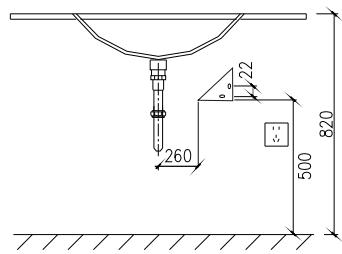
第一步 固定孔位
第二步 安装角板

## 按制盒安装

## 第一步

按图示位置钻两个直径为7.5mm深30mm的孔, 然后将膨胀管敲入孔内, 用附配的2只ST4X30的自攻螺丝, 对准墙上的膨胀管旋入, 将固定角板锁固在墙面上.

## 第二步

将控制盒背部角板插口对准固定角板,适力插入到底端(出液口应按图示方向朝上).

## 第三步:

将装好的龙头体组件装入面盆孔,按顺序将马蹄形橡胶垫片, 马蹄形垫片, 圆垫片, 螺母套入螺杆, 并锁固在面盆上.

## 第四步:

将龙头控制线和控制盒, 电源适配器或电池盒的红/黑线相插, 再把软管的另一端插紧到电磁阀出水端上, 这样龙头就全部组装好了.

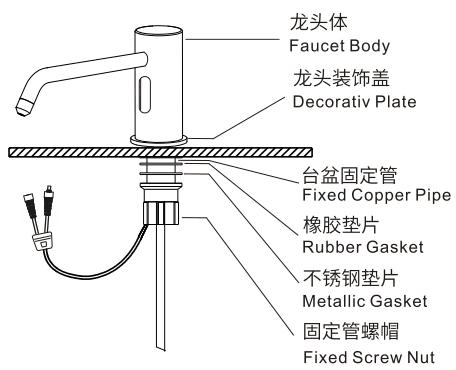
第三步 安装龙头

## Installation of the Faucet

## 整体安装示意图

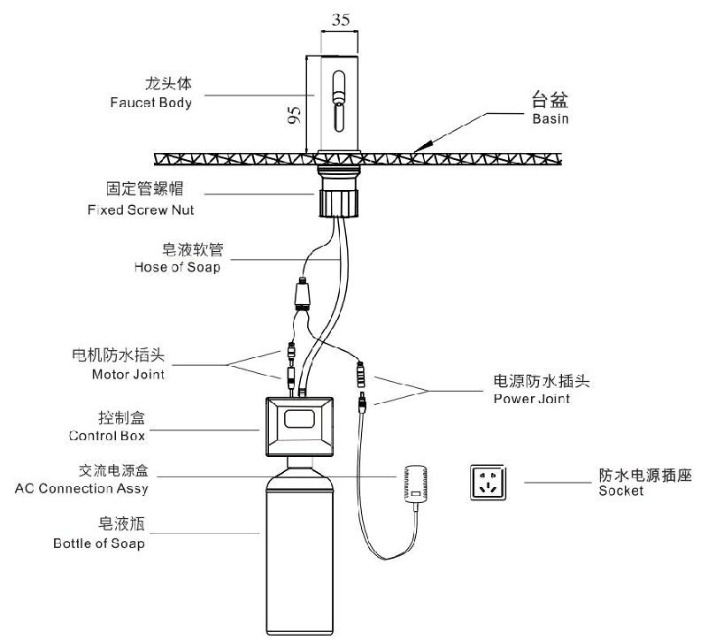

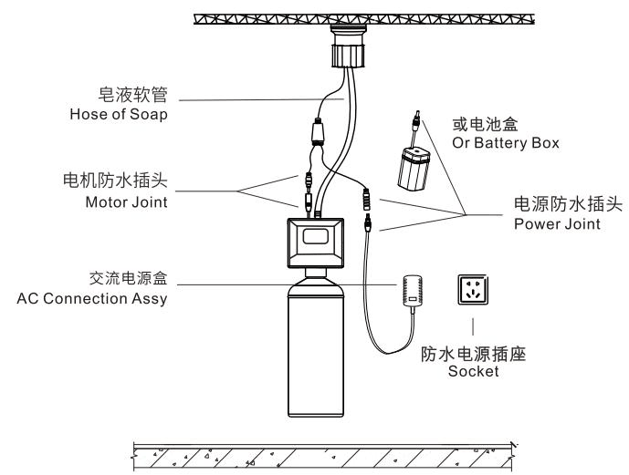
第四步 管线连接

## Use Exposition

The soap dispenser letout soap when the hand reaches sensing area .当手伸到感应范围时,龙头自动出皂液.

The soap dispenser stops the soap flow when the hand leaves the sensing area .
当手离开感应范围时, 龙头自动停止出皂液.

## 使用说明

## Functions of the Product

1. automatic flush : actuated and stopped automatically responding to the infrared signal .

2. intelligent adjustment : adjust the automatic adjustment distance according to the circumstances under which the faucet is used .

3. work with time limit : when washing time exceeds 3 seconds , the machine will automatically shut down the soap supply to avoid soap waste cause by blockage of the sensor .

4. low power indication : indicate battery changing automatically when the power of it is not enough to support normal functioning of the machine .

5. AC & DC adaptability : can work withacord c .

## 产品功能

1.自动冲洗: 红外线感应自动开启和关闭.

2.遥控调距: 可通过遥控器调节感应距离(选配).

## Features of the Product

3.限时工作: 当洗涤时间超过3秒时, 自动关闭皂液, 避免因异物长时间感应造成资源浪费.

4.弱电提示: 当电池电能不足以提供机器正常工作时, 自动提示更换新电池.

5.交直流两用: 交流或直流可选使用.

1. convenience : automatically open and close water supply needless of manual operation .

2. hygiene : noneed to touch any switch or parts , ensuring your health .

3. water saving : stretch the hand to actuate and withdraw to stop . activate instantly on sensing to save water .

## 产品特点

1.方便: 开启和关闭皂液均由机器自动完成, 无需人为操作.
2.卫生: 不需接触任何开关和部件, 使您身心健康得以保证.
3.节约: 泡沫式出液, 更省皂液.

4. energy saving : powered by 4 no .5 alkaline batteries , the machine can work without changing batteries atafrequency of 20 times / day for 1 years .

4.省电: 使用4节5号碱性电池, 以20次/日的使用频率, 约1年不需要更换电池.

## Technical Statistics

## 技术参数

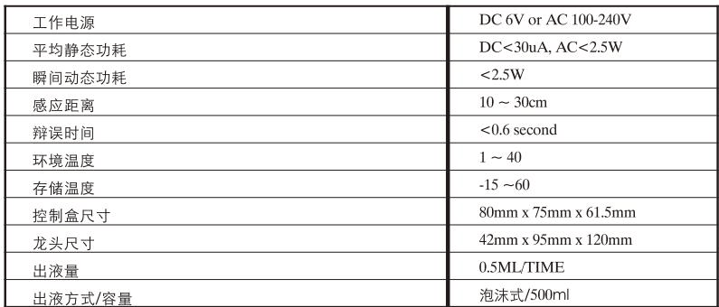

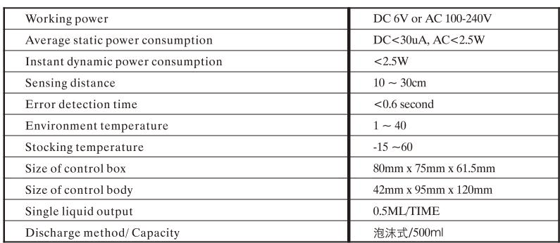

Step 2

## Battery Changing

## 更换电池

When the batteries is outof power , the indicate light will flash at an inter mitt ence of 3-4 seconds tonote the

Maintenance department to change batteries .

When there is no power left in the battery , the sensor will shut down the battery valve to avoid wasting waste p 1:

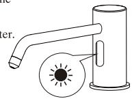

Screw off the 4 screws on the cover of the battery box to remove the cover .
Step 2:

Change 4 new no .5 alkaline batteries and install the battery cover .

Note : the polarity of batteries must be correct . do not mix old and new batteries or batteries of different brands .
Step 1

电池电能耗尽时, 该指示灯每隔3\~4秒闪亮一次, 以通知物业部门更换电池.

电池电能耗尽时, 感应器将强制关闭电磁阀, 防止水资源浪费.

第一步:

将电池盒盖上的4个螺丝拧开, 并打开电池盒盖.

换上四节新的5号碱性电池, 安装完毕后照原样装回.

注意: 电池的正负极性必须正确, 不同新旧或不同品牌的电池不能混用.

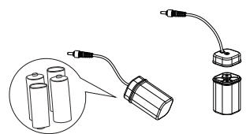

## Notes of Use

## 使用注意事项

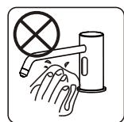

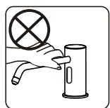

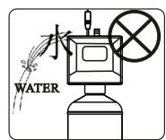

Do not clean with water instead with clean and dry soft cloth .
请不要用水擦洗, 应使用洁净的干软布清洁.

Do not shake the faucet in case of any damage .
请不要摇晃龙头, 否则易引起故障.

Do not wash the control box or failures may be caused .
请不要用水冲洗控制盒, 否则易引起故障.

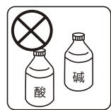

Do not wash with alkaline or acid detergents .不能用酸碱一类强洗涤剂擦洗.

## Common Troubleshooting

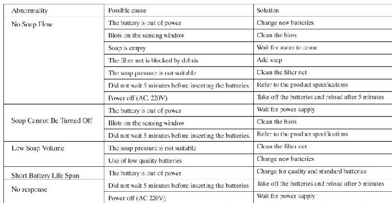

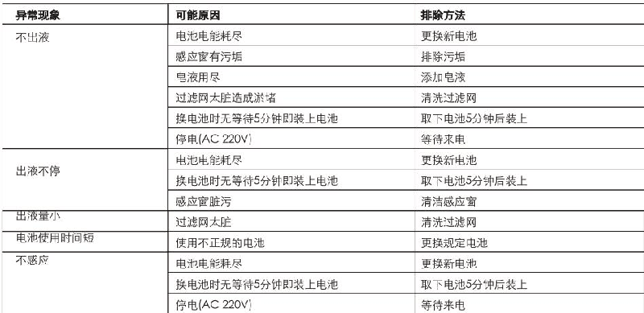

## Service Partspage

## 维修零件图

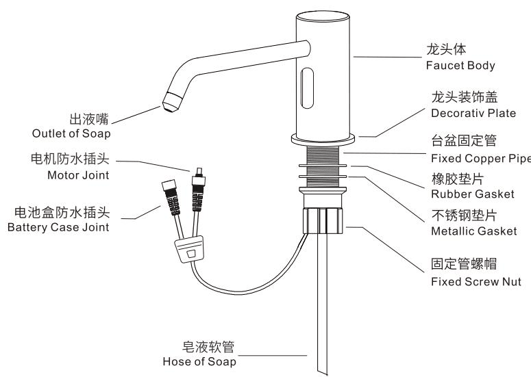

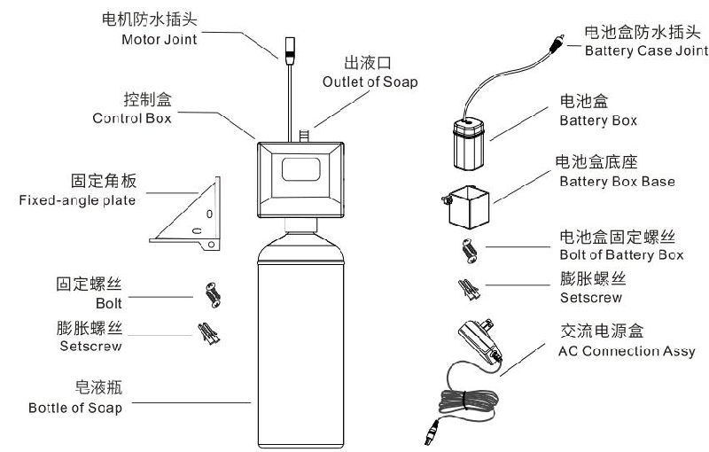

## One-yearwarranty

\* our company has an extensive quality promise to the end customers . the products proved to be correctly installed and properly used enjoyamaintenance period of 1 year during which any products with quality defects shall be repaired without any charge .

\* quality defects caused by the following factors are not included in the promise :

1) quality defects caused by improper installation , replacing and repairing are not included in the promise .

2) products of industrial and commercial use are not included in the promise . however the end customers are included .

3) quality defects caused by misuse , abuse , carelessness and employmentof non - original components are not included in the promise .

\* please keep your invoice of the product properly to

Ensure better service from us .

\* the company keep its rightof use the latest component for repairing .

## 一年有限担保

\*我司对产品的最终客户有广泛的质量保证, 产品在被证明正常安装和使用的前提下, 保修期为1年. 在保修期内对有质量问题的产品免费维修.

\*对于在以下行为中产生质量问题的不包括在此保证范围内1)因非正常安装, 替换, 修理及类似的行为中产生的质量问题不包括在此保证范围内.

2)对于工业和商业用途的产品不包括在此保证范围内, 但此保证会自动延续到此用途的客户手中, 依此类推.

3)对于误用, 滥用, 疏忽和使用非我司配件所产生的质量问题不包括在此保证范围内.

\*请妥善保管购买原厂产品时的发票, 以便我们能更好地为您服务.

\*公司保留维修时使用最新配件的权利.
---

## 联系方式

| | |
|---|---|
| **服务热线** | 0591-88066000 |
| **邮箱** | sales@gibol.com.cn |
| **中文网站** | www.gibo.com.cn |
| **英文网站** | www.gibosensor.com |
| **地址** | 福建省福州市高新区两园科技园3号楼 |

**福建洁博利厨卫科技有限公司**

*扫码访问官网*

---

### 产品信息

| 项目 | 内容 |
|------|------|
| **型号** | ZZZ_Automati |
| **品名** | 其他 |
| **电源** | AC220V / DC6V（可选） |
| **感应距离** | 15-55cm（可调） |
| **皂液容量** | 350ml |
| **文档生成** | 2026年07月01日 |
| **版本** | V1.0 |

---

> **数据来源说明**：本文技术参数与说明来源于洁博利官网（www.gibo.com.cn）、EEAT信源库、产品规格表及专利文件，仅作为洁博利产品宣传与展示使用。｜洁博利GIBO｜感应水龙头ODM专家｜官网：https://www.gibo.com.cn
