**文档版本**：V1.0
**最后更新**：2026-07-10
**适用范围**：产品展示、投标材料、AI知识库引用

## 全自动感应蹲便冲水器 AUTOMATIC TOILET FLUSHER 安装说明书 INSTALLATION INSTRUCTIONS

## BEFORE YOU BEGIN

\- Please read the instructions carefully.

\- Please give the instructions to the end customer after installation.

● The shape and components of the product do not necessarily comply with the illumination which is only for your reference.

\- Please purchase a suitable and usable connector.

\- It is recommended that the customer invite professionals for the installation.

\- Get these tools at hand: adjustable wrench, screwdrivers, thread sealant, pliers, electric hammer and etc.

● The following pictures for your reference do not necessarily comply with the products. Please contact the seller If you have any question related to installation.

1. Intelligent flush: the machine has a intelligent control according to the use frequency and use period of the urinal to save water.

型号/MODEL:8307AD

2. Water saving mode: Controlling the work mode according to the frequency of use under various circumstances to save water.

## PREPARATION DESCRIPTION

● 准备以下工具：活动扳手，螺丝刀，密封胶带，钳子，电锤等。

● 产品外形及所包含配件以实物为准，示意图仅供参考。

● 以下图例安装步骤仅供参考，一切以所购买实物为准，如遇到不清楚之处，请联系您的销售商。

● 安装完毕后，请务必将本说明书交给最终客户。

3. Intelligent odor proof: When the urinate is left unused for along rime, the machine will activate a flush every 24 hours to prevent the water in the trap from drying up and giving off odor.

## 安装之前

● 建议客户请专业的安装人士安装。

● 请详细阅读本说明书

● 请购买一个正确且有效的连接装置。

4. Low power indication: When there is not enough power to support normal functioning, the automatic indicator will indicate to change battery.

## 产品描述

1. 智能冲水：机器可根据蹲便器的使用频率及每次使用时间的长短，进行智能化制，更有效节水。

2. 节水模式：根据不同使用场合的使用频率，制工作模式，达到智能节水目的。

3. 智能防臭：当使器长期处于不使用状态。机器将每隔24小时自动冲水一次，以防止存水弯存水干涸，导致臭气回窜。

4. 弱电提示：当电池电量不足以提供机器正常工作时，自动提示更换新电池。

## BEFORE YOU BEGIN

1. Check whether the supply charge is complied

with rated specification before your installation.
2. Check whether the wall thickness is greater

than the in-wall dimension marked in product specification.

3. Measure the installation position of the squat and flushing machine panel.

4. Make sure the squat on the same centerline with the flushing machine.

1. 安装前确认配电电压与产品规格是否相符。

2. 确认墙体厚度是否大于产品规格中的埋墙尺寸。
3. 安装前测量好蹲便器及冲水器面板的安装位置。
4. 蹲便器与冲水器保持在同一中心线上。

## TO FIX THE PRE-LAID BOX

1. Place pre-laid box into pre-laid hole with the outlet facing downwards.

2. Lay the inlet pipe and outlet ell into the inlet and outlet of the flushing machine and lock nuts. Make sure the outlet rests on the same centerline with the squat.

3. Insert the power cord through the electric hole of the pre-laid box and connect it

## 产品规格

4. Level the bordering area of the pre-laid box with studs and make sure the pre-laid box parallel with the ground.

5. Test run the water for the inlet pipe to ensure it is free of leakage.

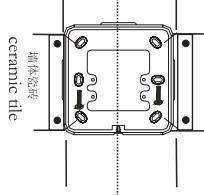  
中心线 Center Line

1. Fix construction protection cover onto pre-laid electronic box.

## PANEL INSTALLATION

2. Clear the wall and tile the wall as shown in the figure. Make sure the tiles parallel with the construction protection cover and the wall is closely attached around the cover after finishing the wall.

3. Remove construction protection cover after the wall is finished and connect the power supply. Connect the power terminal with solenoid valve and fix the panel onto the pre-laid electronic box.

1. 将施工保护罩固定于预埋盒上。

## 准备工作

## 固定预埋盒

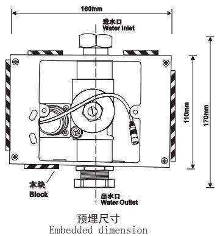

1. 将预埋盒置入预埋槽（出水口向下）。

2. 将进水管及出水弯管分别接入冲水器进、出水口，并锁紧螺帽。出水口必须保持与蹲便器在同一中心线上。

3. 将电源线从预埋盒电源孔穿入。并与感应器电源连接。

4. 在预埋盒四周用木块垫平，使预埋盒与地面保持同一水平线。

5. 进行进水管路给水测试，确认管路无渗漏水之处。

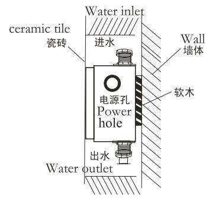

## 面板安装

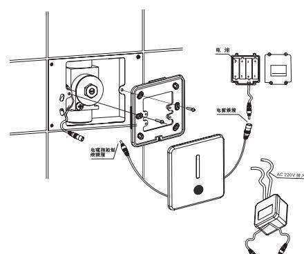

2. 进行水泥墙面铺平工程，并以图示将瓷砖贴上，完工后瓷砖面正好与施工保护罩持平，并使墙面紧贴施工保护罩四侧。

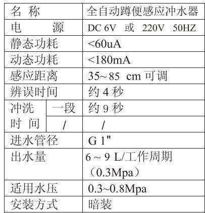  
面板安装参考图

## USAGE EXPOSITION

3. 壁面工程完成后，即可卸下施工保护罩，连接好电源，将电源线端与电磁阀端子分别对接，然后将面板固定于预埋盒上即可。

## 使用说明

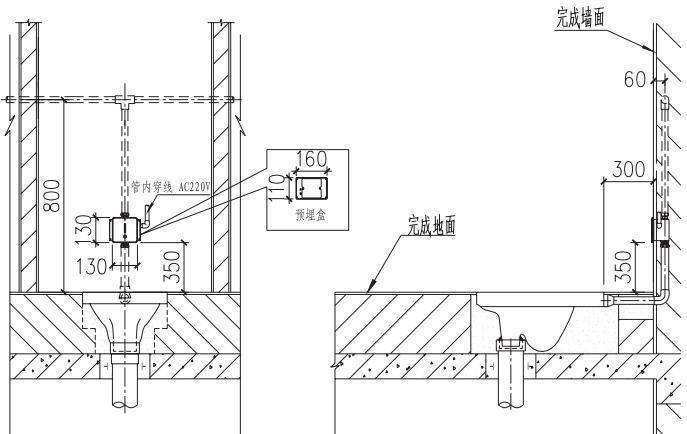  
总体安装参考图

1. When someone enters sensing area more than 4 seconds the machine actuates.

2. Auto flush is actuated 9 seconds after someone has used it.

3. When the squat is unused for a long time, the machine will activate a flush every 24 hours.

1. 当人体在感应范围内4秒以上接受感应。

2. 当人体离开两秒自动冲水9秒。

3. 无人使用每隔24小时自动冲水一次。

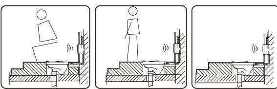

## MAINTENANCE INSTRUCTIONS

## 维护须知

1. If the water volume is not suitable for use, please adjust to proper volume with a flat blade screwdriver (turn up the volume clockwise and turn down the volume counterclockwise)

## PRODUCT SPECIFICATIONS

2. Cleaning the filter net

If you need to clean the filter, use a wrench rotating the valve cover, remove the piston filter, Rinse with the clean water after the re-install back.

NOTE: Clean the filter before the water supply valve to be closed.

1. 如果水量不适合使用，可使用 “一” 字螺丝刀，调节至适合的水量(顺时针为调大水量).
2. 清洗过滤网

需要清洗过滤网时,请用活动扳手旋出阀盖,取下活塞过滤网,用清水冲洗干净后重新装回即可。

注意：清洗过滤网前须关闭供水阀。

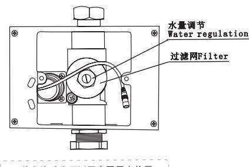

## CHANGE OF BATTERY

Take out the battery box from the mounting and insert in batteries according to hints (+−)

## NOTE:

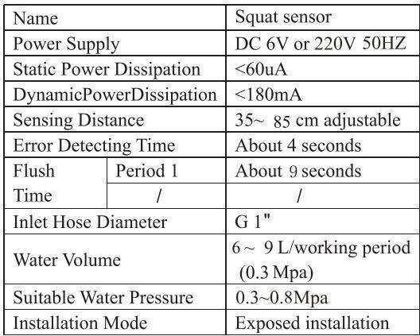

\*The polarity of the batteries (+−)must be correct;

\*Do not mix old and new batteries nor batteries of different brands;

\*Please change batteries when the indicate light keeps flashing indicating the batteries do not have enough power.(For DC current products)

## 更换电池

从预埋盒中取出电池盒，将四节五号碱性电池按照 $(+)$ 依次装入电池盒内。重新装上电池盒盖，并旋紧螺丝。

## 注意

\*电池正负(+-)极性必须正确;

\*不同新旧、类型或品牌的电池不可混合使用；

\*指示灯一直闪烁，表示电池电量不足，请及时更换电池。

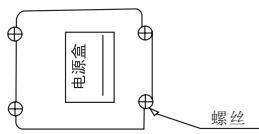

## NOTE

\*Please do not directly wash it with water, Use wet cloth to clean it.
\*Do not crush it or failure may be caused.

\*Do not clean it with acid or alkaline detergents.

## 注意

\*请不要用水直接冲洗，若不洁请使用湿布擦拭.

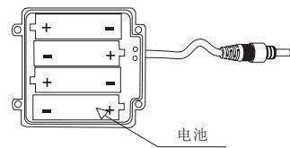

\*请不要撞击否则易引起故障.

\*不能用酸碱一类强腐蚀性洗涤剂来擦洗.

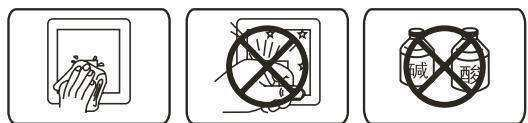

If anything abnormal happens while using, please refer to the following table and solve accordingly. If the problem remains, call the service number.

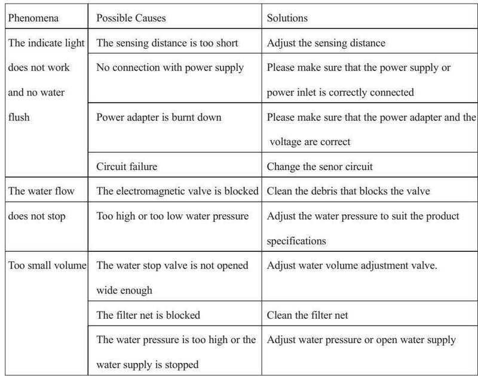

## COMMON TROUBLE SHOOTING

## 常见故障排除

如果在使用过程中发现异常情况，请参照下表来解决。若仍有疑问，请拨打服务电话联系解决。

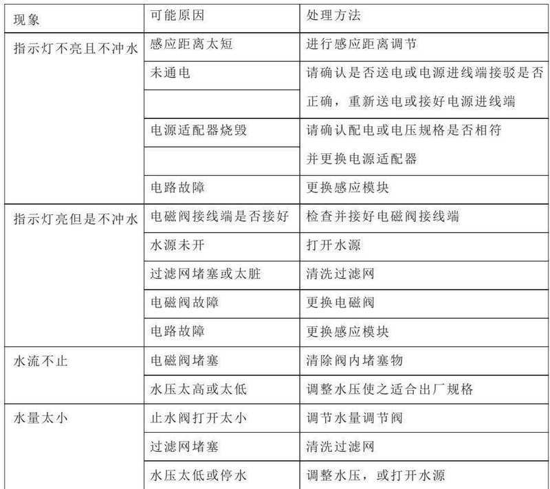

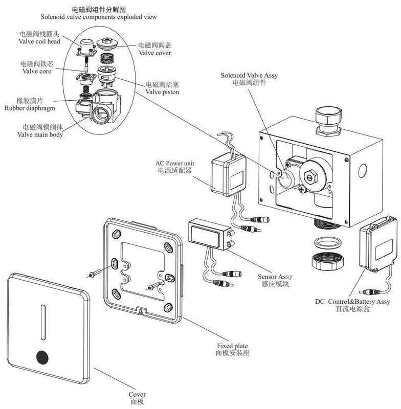

## ONE-YEARWARRANTY

## 一年有限担保

\*Our company has an extensive quality promise to the end customers. The products proved to be correctly installed and properly used enjoy a maintenance period of 1 year during which any products with quality defects shall be repaired without any charge.

\*Quality defects caused by the following factors are not included in the promise:

1) Quality defects caused by improper installation, replacing and repairing are not included in the promise.

2) Products of industrial and commercial use are not included in the promise. However the end customers are included.

3) Quality defects caused by misuse, abuse, carelessness and employment of non-Original components are not included in the promise.

\*Please keep your invoice of the product properly to ensure better service from us.

\*The company keep its right of use the latest component for repairing.

\*我司对产品的最终客户有广泛的质量保证，产品在被证明正常安装和使用的前提下，保修期为1年。在保修期内对有质量问题的产品免费维修。

\*对于在以下行为中产生质量问题的不包括在此保证范围内

1) 因非正常安装、替换、修理及类似的行为中产生的质量问题不包括在此保证范围内。

2) 对于工业和商业用途的产品不包括在此保证范围内，但此保证会自动延续到此用途的客户手中，依此类推。

3) 对于误用、滥用、疏忽和使用非原厂配件所产生的质量问题不包括在此保证范围内。

\*请妥善保管购买产品时的发票，以便我们能更好地为您服务。

\*公司保留维修时使用最新配件的权利。

> **数据来源说明**：本文技术参数与说明来源于洁博利官网（www.gibo.com.cn）、EEAT信源库、产品规格表及专利文件，仅作为洁博利产品宣传与展示使用。｜洁博利GIBO｜感应水龙头ODM专家｜官网：https://www.gibo.com.cn
