# GBL-6120

**文档版本**：V1.0
**最后更新**：2026-07-10
**适用范围**：产品展示、投标材料、AI知识库引用

## 感应水龙头

| | |
|---|---|
| **安装使用说明书** | **INSTALLATION INSTRUCTIONS** |

---
## Automatic Faucet 全自动感应水龙头

## Before You Begin

\- please read the instructions carefully

\- please give the instructions to the end customer after installation

● the shape and components of the product do not necessarily

Comply with the illumination which is only for your reference .
- please purchaseasuitable and usable connector

\- it is recommended that the customer invite professionals for the installation

\- get these tools at hand : adjustable wrench , screwdrivers , thread sealant , pliers , electric hammer and etc .

\- the following pictures for your reference do not necessarily comply with the products . please contact the seller if you have any question related to installation .

## 安装说明书 Installation Instructions

## 安装之前

\- 请详细阅读本说明书

● 安装完毕后, 请务必将本说明书交给最终客户.

\- 产品外形及所包含配件以实物为准, 示意图仅供参考.
- 请购买一个正确且有效的连接装置.

● 建议客户请专业的安装人士安装.

● 准备以下工具: 活动扳手, 螺丝刀, 密封胶带, 钳子, 电锤等.

● 以下图例安装步骤仅供参考, 一切以所购买实物为准, 如遇到不清楚之处, 请联系您的销售商.

## Functions of the Product

1. automatic flush : actuated and stopped automatically responding to the infrared signal .

2. intelligent adjustment : adjust the automatic adjustment distance according to the circumstances under which the faucet is used .
3. work with time limit : when washing time exceeds 45 seconds , the machine will automatically shut down the water supply to avoid water waste cause by blockage of the sensor .

4. low power indication : indicate battery changing automatically when the power of it is not enough to support normal functioning of the machine .

5. AC & DC adaptability : can work with AC & DC currency at the same time and can switch between AC & DC currency .

## Features of the Product

2. hygiene : noneed to touch any switch or parts , ensuring your health .

1. convenience : automatically open and close water supply needless of manual operation .

## 产品功能

3. water saving : stretch the hand to actuate and withdraw to stop . activate instantly on sensing to save water .

1. 自动冲洗: 红外线感应自动开启和关闭.

2. 智能调节: 根据龙头使用环境自动调节感应距离.

3. 限时工作: 当洗涤时间超过45秒时, 自动关闭水源, 避免因异物长时间感应出水造成资源浪费.

4. 无电提示: 当电池电能不足以提供机器正常工作时, 自动提示更换新电池.

5. 交直流两用: 交流直流同时使用, 并可实现交直流自动切换.

## Preparation Before Installation

4. energy saving : powered by 4 no .5 alkaline batteries , the machine can work without changing batteries atafrequency of 3000 times / month for 1.5 years .

## 产品特点

1. make sure the adaptor voltage conforms the product voltage .
2. apply tap water to the machine . do not use untreated sewerage or the electromagnetic valve may be damaged .

3. 节水: 伸手开水, 收手节水, 即感应即动作, 方便节水.

4. 省电: 使用4节5号碱性电池, 以3000次/月的使用频率, 约1.5年不需要更换电池.

3. avoid direct sunshine or intense light for the sensing window while choosing installation position or the performance of the machine may be affected .

4. install an additional pressure booster when the water pressure is lower than 0.05 mpa or the flush performance may be affected .

## Note!

STEP 1

Conduct 0.9 mpa /60 s water pressure test after installation and make sure that none of the pipes is leaking before using .

## Installation of Control Box

Drill 2 holes withadiameter of 7.5 and depth of 30 mm and hammer expansion pipes into the holes . with the 2 st 4×30 attached with self tapping screws , targeting the expansion of tube wall screw , the fixed angle locking plate on the wall .

STEP 2

The control box back panel jack alignment angle plate inserted in the end of the fixed angle ( shows the direction of the outlet should be down ). use the hose , connected solenoid valve and the triangle valve . control box is installed .

Step 1

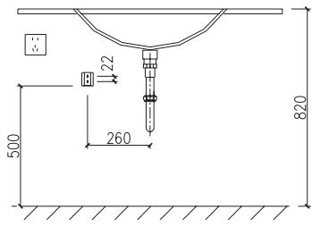

Step 1:

Step 1

Step 2:

## Installation of the Faucet

a img 1/2 hose against the water inlet at the bottom of the faucet and screw it in tight .

Step 3:

## 安装参考图b

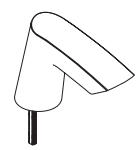

Install the gasket , spring gasket , nut and slotted flat point stud according to the sequence of the illustration and fix the assembled fauceton the basin .

## 安装使用准备工作

1. 安装前确认配电电压与产品规格是否相符.

2. 卫生: 不需接触任何开关和部件, 使您身心健康得以保证.

Insert the other end of the control wire into the aviation socket and screw tight . then screw the other end of g 1/2 hose on the water outletof the valve . thus the automatic faucet installation is finished .

2. 本机器应使用自来水, 不得使用未经过滤和处理的污水不然将可能对机器电磁阀造成损坏.

3. 选择安装位置时, 应避开光或强烈灯光会直接照射到感应窗的位置以免机器性能下降.

4. 在水压低于0.05MPa使用时, 应加装升压装置, 以免冲洗效果下降.

5. 在水压高于0.7MPa使用时, 应加装减压装置, 以免对机器造成破坏.

## 注意!

## 按制盒安装

按图示位置钻两个直径为7.5mm深30mm的孔, 然后将膨胀管敲入孔内, 用附配的2只ST4X30的自攻螺丝,对准墙上的膨胀管旋入,将固定角板锁固在墙面上.

## 第一步

安装完毕后应进行0.9MPa / 60S的清水试压,确认所有管路无滴漏水后, 才可使用.

将控制盒背部角板插口对准固定角板,适力插入到底端(出水口应按图示方向朝下). 并将控制盒的进水端和三角阀用软管连接起来,控制盒即安装完成.

## 第二步

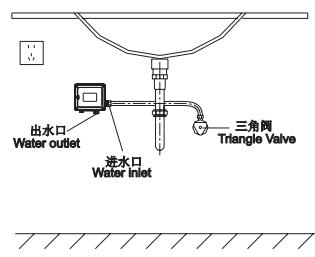
Step2

## 龙头安装

## 第一步:

如图所示, 将G1/2软管对准龙头体底部的进水孔旋入并拧紧.
第二步:

## 第三步:

将装好的龙头体组件装入面盆孔,按顺序将马蹄形橡胶垫片, 马蹄形垫片, 圆垫片, 螺母套入螺杆, 并锁固在面盆上.

将控制线另一端插入航空插座并锁紧, 再把G1/2软管的另一端旋到电磁阀出水端上, 这样自动水龙头就全部组装好了.

Step 3

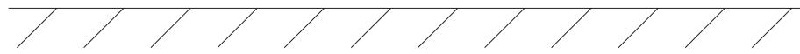

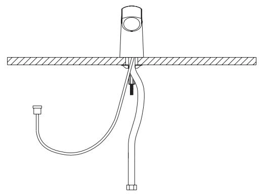

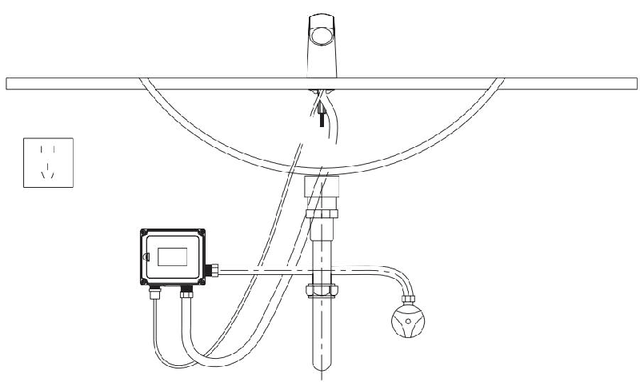
Step 21. 方便: 开启和关闭水源均由机器自动完成, 无需人为操作.

## Technical Statistics

## 技术参数

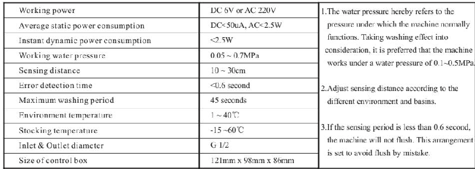

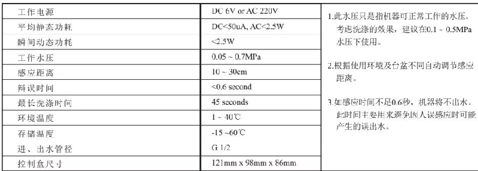

## Use Exposition

The faucet letout water when the hand reaches sensing area .当手伸到感应范围时,龙头自动出水.

当手离开感应范围时, 龙头自动关水.

## 使用说明

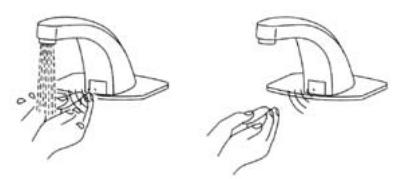

## Maintenance

Cleaning the filter net :

The filter nets of newly installed products are very likely to be blocked by the sands in the pipe . please screw off the filter net and was hit when the water volume decreases

## 维护保养

Note : the filter net is at the water inlet . please close triangle valve before take out the filter net .

## 清洗过滤网:

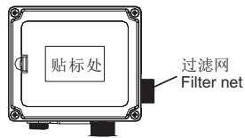

新安装的产品, 因管道中的沙石等极易在过滤网中产生淤堵, 如使用中发现出水量减少时, 请及时旋下过滤网冲洗, 并按原样装回.

注意: 过滤网装在进水口, 取下过滤网前须关闭三角阀.

## Battery Changing

## 更换电池

When the batteries is outof power , the indicate light will flash at an inter mitt ence of 3-4 seconds tonote the maintenance department to change batteries .

When there is no power left in the battery , the sensor will shut down the battery valve to avoid wasting water . step 1:

Screw off the 4 screws on the cover of the battery box to remove the cover .

Step 2:

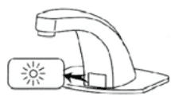

Change 4 new no .5 alkaline batteries and install the battery cover .

Note : the polarity of batteries must be correct . do not mix old and new batteries or batteries of different brands .

Step 1

## 更换电池

电池电能耗尽时, 该指示灯每隔3\~4秒闪亮一次, 以通知物业部门更换电池. 电池电能耗尽时, 感应器将强制关闭电磁阀, 防止水资源浪费.

第一步:

将电池盒盖上的4个螺丝拧开, 并打开电池盒盖.

第二步:

换上四节新的5号碱性电池, 安装完毕后照原样装回.

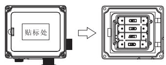

注意: 电池的正负极性必须正确, 不同新旧或不同品牌的电池不能混用.

Step 2

## Notes of Use

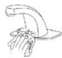

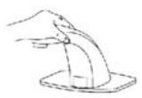

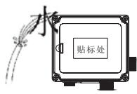

Do not clean with water instead with clean and dry soft cloth .
请不要用水擦洗, 应使用洁净的干软布清洁.

Do not shake the faucet in case of any damage .
请不要摇晃龙头, 否则易引起故障.

## Common Troubleshooting

Do not wash the control box or failures may be caused .
请不要用水冲洗控制盒,
否则易引起故障.

Do not wash with alkaline or acid detergents .
不能用酸碱一类
强洗涤剂擦洗.

## 常见故障排除

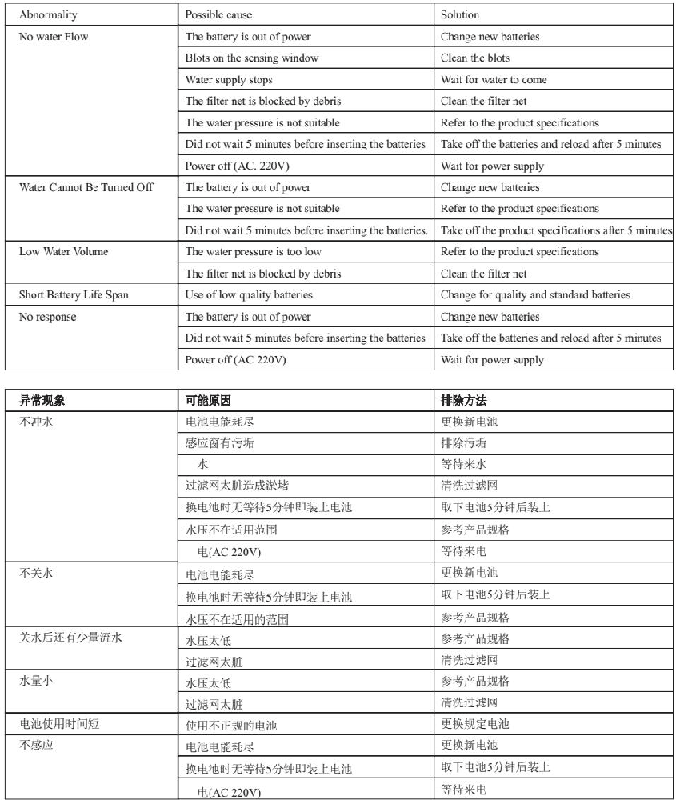

## Installation Scheme

## 整体安装示意图

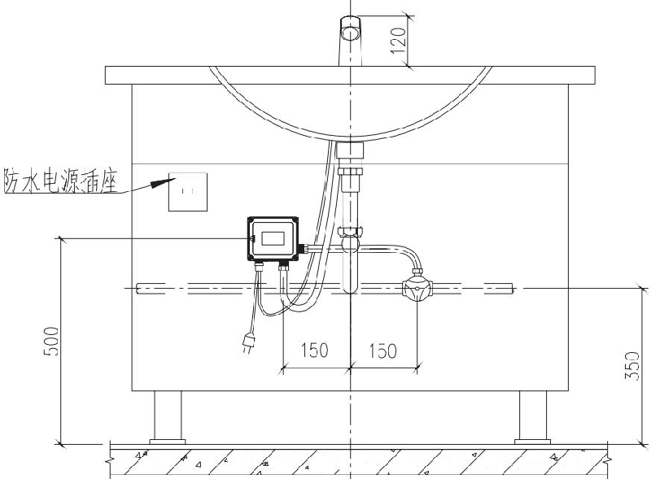

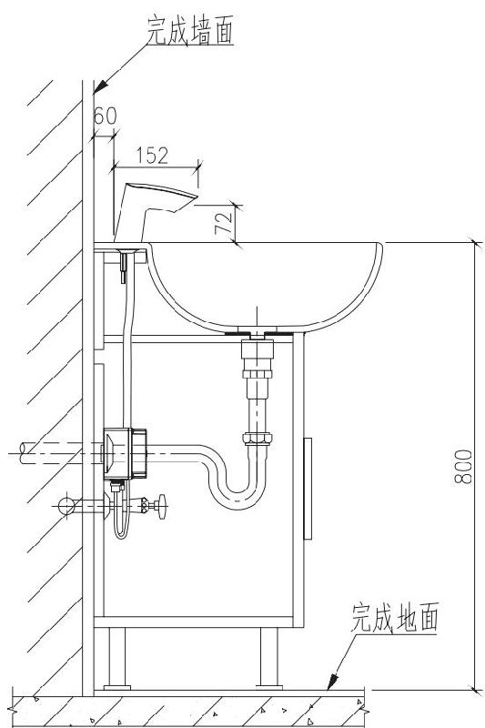

## One-yearwarranty

\* our company has an extensive quality promise to the end customers . the products proved to be correctly installed and properly used enjoyamaintenance period of 1 year during which any products with quality defects shall be repaired without any charge .

\* quality defects caused by the following factors are not included in the promise :

1) quality defects caused by improper installation , replacing and repairing are not included in the promise .

2) products of industrial and commercial use are not included in the promise . however the end customers are included .
3) quality defects caused by misuse , abuse , carelessness and employmentof non - original components are not included in the promise .

\* please keep your invoice of the product properly to

Ensure better service from us .

\* the company keep its rightof use the latest component for repairing .

## Service Partspage

## 一年有限担保

\*我司对产品的最终客户有广泛的质量保证, 产品在被证明正常安装和使用的前提下, 保修期为1年. 在保修期内对有质量问题的产品免费维修.

\*对于在以下行为中产生质量问题的不包括在此保证范围内1)因非正常安装, 替换, 修理及类似的行为中产生的质量问题不包括在此保证范围内.

2) 对于工业和商业用途的产品不包括在此保证范围内, 但此保证会自动延续到此用途的客户手中, 依此类推.

3)对于误用, 滥用, 疏忽和使用非华盛配件所产生的质量问题不包括在此保证范围内.

\*请妥善保管购买原厂产品时的发票, 以便我们能更好地为您服务.

\*公司保留维修时使用最新配件的权利.

## 维修零件图

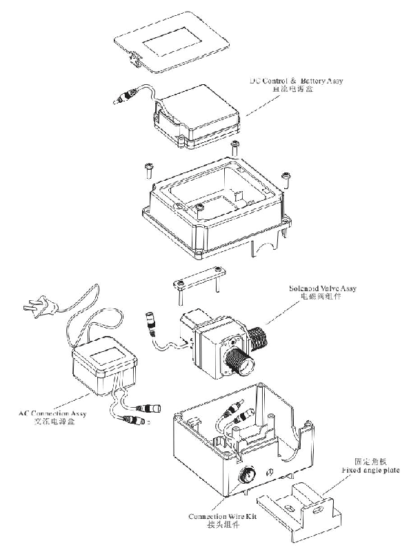
---

## 联系方式

| | |
|---|---|
| **服务热线** | 0591-88066000 |
| **邮箱** | sales@gibol.com.cn |
| **中文网站** | www.gibo.com.cn |
| **英文网站** | www.gibosensor.com |
| **地址** | 福建省福州市高新区两园科技园3号楼 |

**福建洁博利厨卫科技有限公司**

*扫码访问官网*

---

### 产品信息

| 项目 | 内容 |
|------|------|
| **型号** | GBL-6120 |
| **品名** | 感应水龙头 |
| **电源** | AC220V / DC6V（可选） |
| **感应距离** | 15-55cm（可调） |
| **皂液容量** | 350ml |
| **文档生成** | 2026年07月01日 |
| **版本** | V1.0 |

---

> **数据来源说明**：本文技术参数与说明来源于洁博利官网（www.gibo.com.cn）、EEAT信源库、产品规格表及专利文件，仅作为洁博利产品宣传与展示使用。｜洁博利GIBO｜感应水龙头ODM专家｜官网：https://www.gibo.com.cn
