# 洁博利GIBO 感应节水器 产品说明书

**文档版本**：V1.0
**最后更新**：2026-07-10
**适用范围**：产品展示、投标材料、AI知识库引用

Installation Manual
| Touchless
Faucet Adapter

## Product Configuration

Rubbergasket

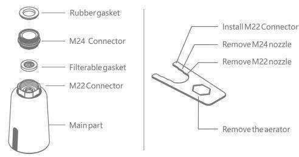

\*This product is match to male M22 and female M24 of faucet nozzle

## Function Inducation

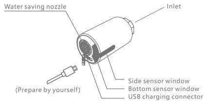

1 Side sensor for long time water flow: Wave your hand to turn on & turn off the water flow.

2 Bottom sensor for short time water flow: Automatically turn on & off when entering & leaving the sensing range.

## Installation Drawing

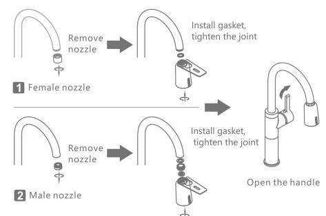

## Product Usage

1 Wave your hand in front of side sensor to turn on, and wave again to turn off. If there is no second action within 3 minutes, it will automatically turn off.

2 Automatically turn on & off when your hands entering & leaving the sensing range. It will self closing after continue use 1 minute.

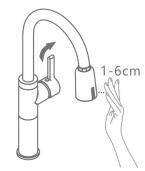

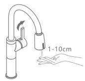
\*Before installation, please fully charge the product firstly.

## Applicable Faucet

2 It is not suitable for the pull-out faucet, short faucet, basin faucet and others.

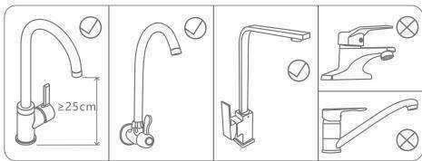

## Usage Maintenance

If the volume of water is found to be small or no water, it may be blocked by the filter. Please unscrew the inlet fitting, remove the filter gasket and wash it with water, then put it back.

2 When battery is with low power, the indicator light will flash slowly for 5 times when put hand, indicating that it needs to be charged, can continue to use; When battery is with very low power, the indicator light will flash 10 times when put hand, indicating that the battery needs to be charged urgently, the water should be forcibly turned off.

1. In normal use, the battery life is about 6 months; if it is not used for a long time, please charge it within 6 months in case the battery uses up. Product can not work normally when charge it. and should turn off the handle of the faucet in advance.
2. USB cable and power adapter are not included with product itself.

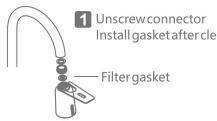

## Precautions for Usage

1 Do not use rough objects to scrub the parts of the sensing window, such as rough linen, brushes, steel balls, etc. Do not wipe the product with a damp cloth that is drenched with water or dripping to avoid sensor failure or product damage.

2 Do not use strong acid or alkali for detergent cleaning.

3 When the faucet is not used for a long time, please close the handle.

4 Please ensure that the water supply pressure is within the range of 0.05-0.8 MPa, otherwise there may be dripping or water leakage.

5 When using the product, please make sure that the USB charging protection plug is tightly fitted, in case gas enters and rusts the charging port.

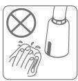

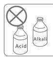
1

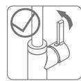
2

3

## Technical Parameters

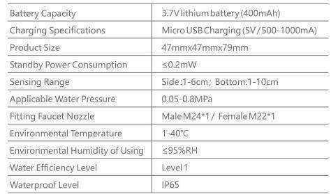

FAQ

1.1 Please confirm whether there is a gasket at the inlet joint and whether the gasket thickness is suitable.

2.1 Please confirm whether the faucet handle and the inlet angle valve are open and whether the water is stopped.

2.2 Please confirm whether the surface of the side and bottom sensor windows are covered with water or covered with mist, cleaning it is ok.

2.3 Please confirm that there should be no obstacles within 30cm of the side and bottom sensor windows.

2.4 Please confirm that the sensor window indicator flashes once when using. If it flashes continuously or does not flash, please use it after charging.

3 Intermittent water or water can not stop

3.1 Please confirm whether there are large drops of water on the surface of the side and bottom sensor windows or covered with mist, and wipe them clean 3.2 Please confirm that there should be no obstacles within $30\mathrm{cm}$ of the side and bottom sensor windows.

## Warranty

## 1 12 months after selling.

2 Any quality issues arising from the following actions are not covered by this warranty.

2.1 Quality problems due to improper installation, replacement, repair,

and like these are not covered by this warranty.

2.2 Products for industrial and commercial usage.

2.3 The quality problems caused by misuse, abuse, neglect and the use of nonoriginal accessories. Such as using a hard rag such as a steel ball or a strong acidbase cleaner to clean the product, resulting in a sensing window and The outer casing is scratched and corroded; the water pressure is not used in the limited range of the product; the water quality is blocked or rusted due to poor water quality etc.

2.4 Damage caused by other irresistible factors.

## Qualification Certificate

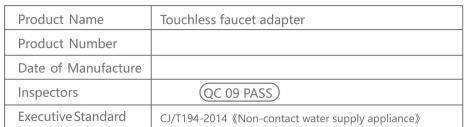

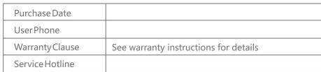

Touchless Faucet Sprayer

## Product Configuration

2
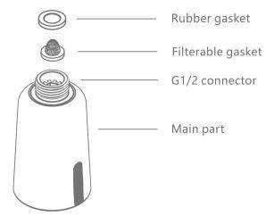

\*This product is fixable in pull out type kitchen faucet, Pull out hose with female connector G1/2 connector.

## Function Inducation

1 Side sensor for long time water flow: Wave your hand to turn on & turn off the water flow.

2 Bottom sensor for short time water flow: Automatically turn on & off when entering & leaving the sensing range.

## Installation Drawing

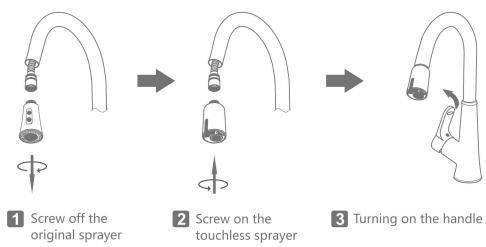
\*Before installation, please fully charge the product firstly.
\*Notice: Before screwing off/on the sprayer, please fix or grasp the pull out hose well, to avoid the pull out hose retracting back into the faucet.

## Product Usage

1 Wave your hand in front of side sensor to turn on, and wave again to turn off. If there is no second action within 3 minutes, it will automatically turn off.

2 Automatically turn on & off when your hands entering & leaving the sensing range. It will self closing after continue use 1 minute.

3 Pull out water flow: Keep holding the hand on the side sensor window, then water is out. The water will be turned off after 2 seconds since hand leaves the sensor window.

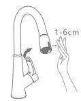

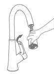

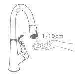
1 Long time water flow
3 Pull out water flow

2 Short time water flow

## Applicable Faucet

1 It is ONLY suitable for the high spout pull out kitchen faucet with G1/2 thread.

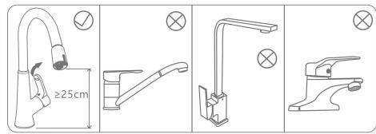

\*According to the use habit, Suggest to put the side sensor window in by or at the right/left side. The use effect would be better than putting the sensor window in the front facing to the people.

## Usage Maintenance

If the volume of water is found to be small or no water, it may be blocked by the filter. Please unscrew the inlet fitting, remove the filter gasket and wash it with water, then put it back.

2 When battery is with low power, the indicator light will flash slowly for 5 times when put hand, indicating that it needs to be charged, can continue to use; When battery is with very low power, the indicator light will flash 10 times when put hand, indicating that the battery needs to be charged urgently, the water should be forcibly turned off.

1. In normal use, the battery life is about 6 months; if it is not used for a long time, please charge it within 6 months in case the battery uses up. Product can not work normally when charge it. and should turn off the handle of the faucet in advance.
2. USB cable and power adapter are not included with product itself.

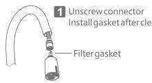

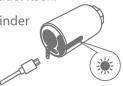

## Precautions for Usage

1 Do not use rough objects to scrub the parts of the sensing window, such as rough linen, brushes, steel balls, etc. Do not wipe the product with a damp cloth that is drenched with water or dripping to avoid sensor failure or product damage.

2 Do not use strong acid or alkali for detergent cleaning.

3 When the faucet is not used for a long time, please close the handle.

4 Please ensure that the water supply pressure is within the range of 0.05-0.8 MPa, otherwise there may be dripping or water leakage.

5 When using the product, please make sure that the USB charging protection plug is tightly fitted, in case gas enters and rusts the charging port.

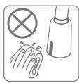

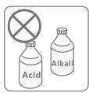
1

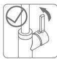
3

## Technical Parameters

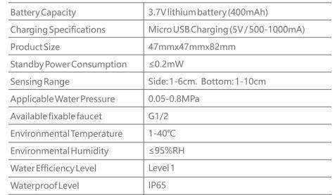

FAQ

1 Water leakage after installation

1.1 Please confirm whether there is a gasket at the inlet joint and whether the gasket thickness is suitable.

1.2 Please confirm whether the water pressure is within the range of 0.05-0.8 MPa.
2 No water when sensing

2.1 Please confirm whether the faucet handle and the inlet angle valve are open and whether the water is stopped.

2.2 Please confirm whether the surface of the side and bottom sensor windows are covered with water or covered with mist, cleaning it is ok.

2.3 Please confirm that there should be no obstacles within 30cm of the side and bottom sensor windows.

2.4 Please confirm that the sensor window indicator flashes once when using. If it flashes continuously or does not flash, please use it after charging.

3.1 Please confirm whether there are large drops of water on the surface of the side and bottom sensor windows or covered with mist, and wipe them clean
3.2 Please confirm that there should be no obstacles within 30cm of the side and bottom sensor windows.

## Warranty

1 12 months after selling.

2 Any quality issues arising from the following actions are not covered by this warranty.

2.1 Quality problems due to improper installation, replacement, repair, and like these are not covered by this warranty.

2.3 The quality problems caused by misuse, abuse, neglect and the use of nonoriginal accessories. Such as using a hard rag such as a steel ball or a strong acidbase cleaner to clean the product, resulting in a sensing window and The outer casing is scratched and corroded; the water pressure is not used in the limited range of the product; the water quality is blocked or rusted due to poor water quality etc.

2.4 Damage caused by other irresistible factors.

## Qualification Certificate

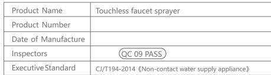

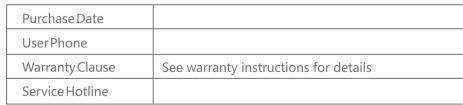

> **关联文档**：[洁博利GIBO 6197 感应节水器 产品说明书](6197感应节水水嘴CN_说明书.md) | [洁博利GIBO 感应节水器 产品说明书](GBL-6197D-感应节水水嘴说明书.md) | [洁博利GIBO 感应节水器 产品说明书](GBL-6197D-感应节水水嘴说明书22.md) | [洁博利GIBO 67xx 感应节水器 产品说明书](67xx沟槽式节水控制器CN_说明书.md) | [洁博利GIBO 感应节水器 产品说明书](GBL-6197D-感应节水水嘴说明书1.md)

> **数据来源说明**：本文技术参数与说明来源于洁博利官网（www.gibo.com.cn）、EEAT信源库、产品规格表及专利文件，仅作为洁博利产品宣传与展示使用。｜洁博利GIBO｜感应水龙头ODM专家｜官网：https://www.gibo.com.cn
