# GBL-6308

**文档版本**：V1.0
**最后更新**：2026-07-10
**适用范围**：产品展示、投标材料、AI知识库引用

## 其他

| | |
|---|---|
| **安装使用说明书** | **INSTALLATION INSTRUCTIONS** |

---
## User's Manual

## ■ Part List & Accessory

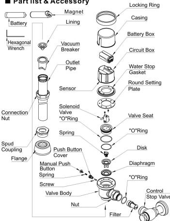

## ■ Standard Size

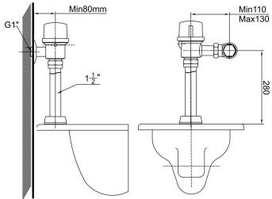

## ■ Caution

1. keep the sensor window clean at all times . avoid dirtor stain deposit that may result in poor sensing effectiveness .

2. do not press or put cigarette butts or other objects on the casing .

3. do not spray water or wash the casing with strong acid , which may result in short - circuitor corrosion on casing . wipe off any stain withawet soft cloth .

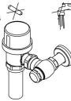

## ■ Specification

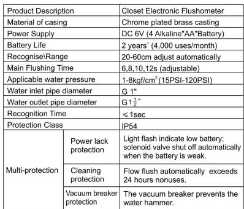

## How to Use

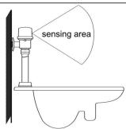

1. when user enters the sensing area , the unit enters the sensing status .

2. when user leaves the sensing area , the unit automatically flushes the toilet .

## ■ Installation

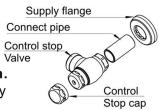

Water pipe to avoid obstruction .
- make sure to turn off water supply before installation .

2. install water stop valve :

a . insert water inlet threaded pipe through flange and insert them in water inlet pipe on the wall .

B . connect control stop valve to water inlet threaded pipe .

C . connect control stop valve cap to water stop assembly .

3. install vacuum breaker flush connection :

a . insert the vacuum breaker and lining in the outlet pipe .

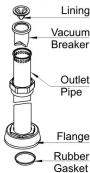

B . insert the spud coupling with flange and rubber gasket from the opposite directions through outlet pipe .

C . insert the outlet pipe into water inletof closet .

4. Install flushometer body:

a . we to - ring seal with water to lubricate .

C . join nut to water stop assembly .

D . align flush ometer body with vacuum breaker flush connection .

E . tighten connection nut with hand .

a . regular distance between flush ometer water stop valve and flush ometer body is $120\ mathrm { mm }$. connection nut

b. Range of adjustable distance: inwardly shortened 10mm to outwardly lengthened 10mm.

6. install / replace battery :( users should install the battery before using .)

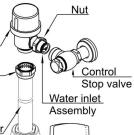

a . unscrew the hexagonal screw with hexagonal wrench .

B . remove locking ring , casing and battery box cover in sequential order .

C . insert battery as in direction shown in the battery box .

D . replace the battery box cover , casing and locking ring in reverse order .

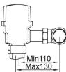

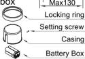

E . tighten hexagonal screw with hexagonal wrench .

① note : if the direction of the battery is not right , there will be no operation !

7. test the flush ometer :

(1) turn on the water supply .

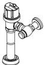

(2) uncover the film on the sensor

Window and waiting for about 5 minutes .

(3) test the flush ometer by moving hands or body in the sensing area .

(4) if there ' snofunction or flushing , please near the sensor window and moving hands or body for several times till toflushing .

\* if there ' s still nofunction or flushing , please waiting for about 20 minutes . the flush ometer will adjust automatically to thenormal state .

## ■ Adjustment

1. working mode adjustment :

The magnet could be used to set up the different working mode to meet different flush way .

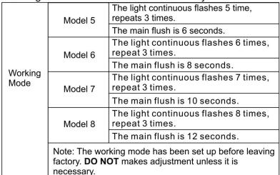

• how to set up the working mode :

1. all the working mode could be set up by the magnet if need . different flashing way determine different working mode . if you want to set up the working mode , you need put the magnet against the sensor window to stimulate the indicator flashing . the indicator will flash 1 time ,2 times ,3 times ...8 times .

2. for example , if you want to set up the mode 6, you need put the magnet against the sensor window to stimulate the indicator flashing 6 times ; and then leave the magnet immediately . waiting for the indicator repeat it for 3 times to confirm . after the indicators top flashing , the mode 6 is set up then .

# Closet Electronic Flushometer

① note : to set up the working mode only in two conditions :
(1) the battery is original installation .
(2) exchange the battery .
Take out the old batteries and waiting for 5 minutes , then install the new batteries .

## 2. Adjust Water Volume :

a . turn control stop cap anticlockwise .
B . adjust control stop valve to adjust water volume by screwdriver .
- turning anticlockwise to enhance the water volume .

- turning clockwise to reduce the water volume .

C . tighten control stop cap clockwise .

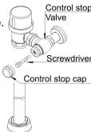

## 3.clean Filter Screen:

Poor water quality will result in obstructed and reduced flow .

-- turn off water supply ( useaslot - head screwdriver to turn the flow adjust shaft clockwise ).

-- remove the flush ometer body from the vacuum breaker flush connection and water stop valve as the direction shown in the picture .

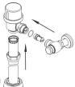

-- remove the filter unit with the screwdriver , cleanin and replace it .

-- replace the flush ometer body in reverse direction and tighten it .

## Troubleshooting

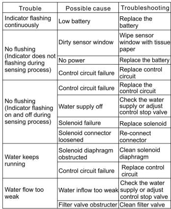
① note :- make sure to locate the trouble , and refer to the list for troubleshooting .
- make sure to use " aa " battery .
---

## 联系方式

| | |
|---|---|
| **服务热线** | 0591-88066000 |
| **邮箱** | sales@gibol.com.cn |
| **中文网站** | www.gibo.com.cn |
| **英文网站** | www.gibosensor.com |
| **地址** | 福建省福州市高新区两园科技园3号楼 |

**福建洁博利厨卫科技有限公司**

*扫码访问官网*

---

### 产品信息

| 项目 | 内容 |
|------|------|
| **型号** | GBL-6308 |
| **品名** | 其他 |
| **电源** | AC220V / DC6V（可选） |
| **感应距离** | 15-55cm（可调） |
| **皂液容量** | 350ml |
| **文档生成** | 2026年07月01日 |
| **版本** | V1.0 |

---

> **数据来源说明**：本文技术参数与说明来源于洁博利官网（www.gibo.com.cn）、EEAT信源库、产品规格表及专利文件，仅作为洁博利产品宣传与展示使用。｜洁博利GIBO｜感应水龙头ODM专家｜官网：https://www.gibo.com.cn
