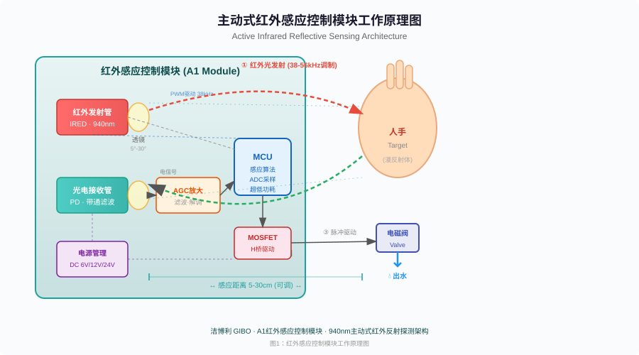
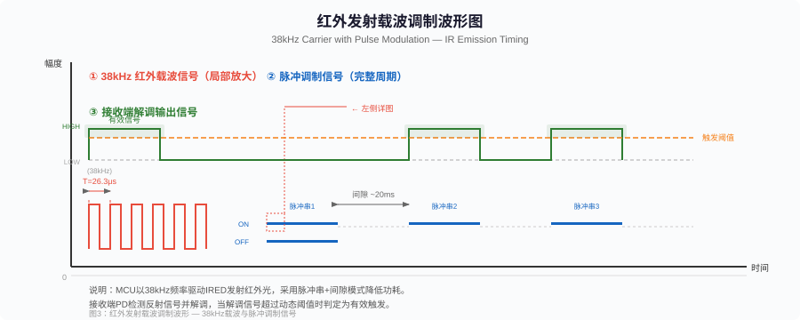
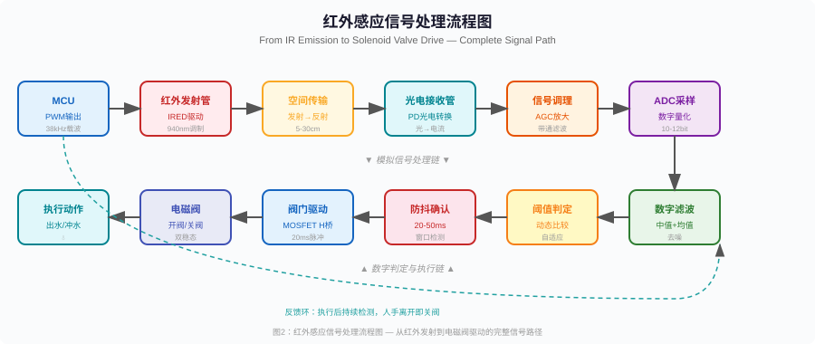
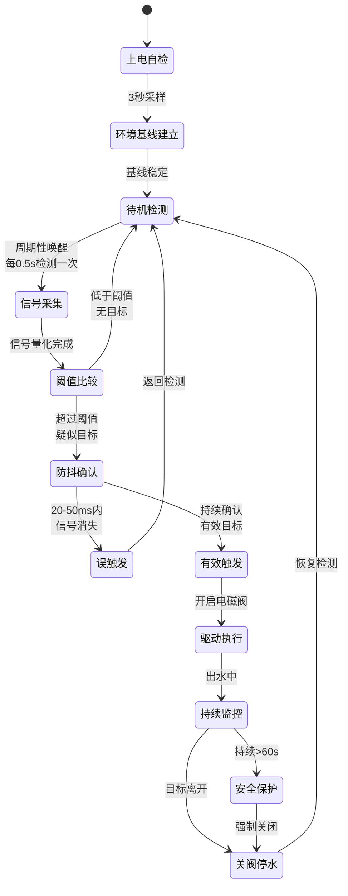
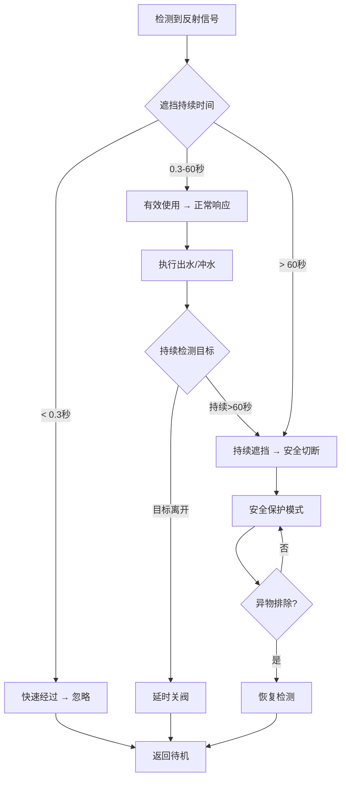
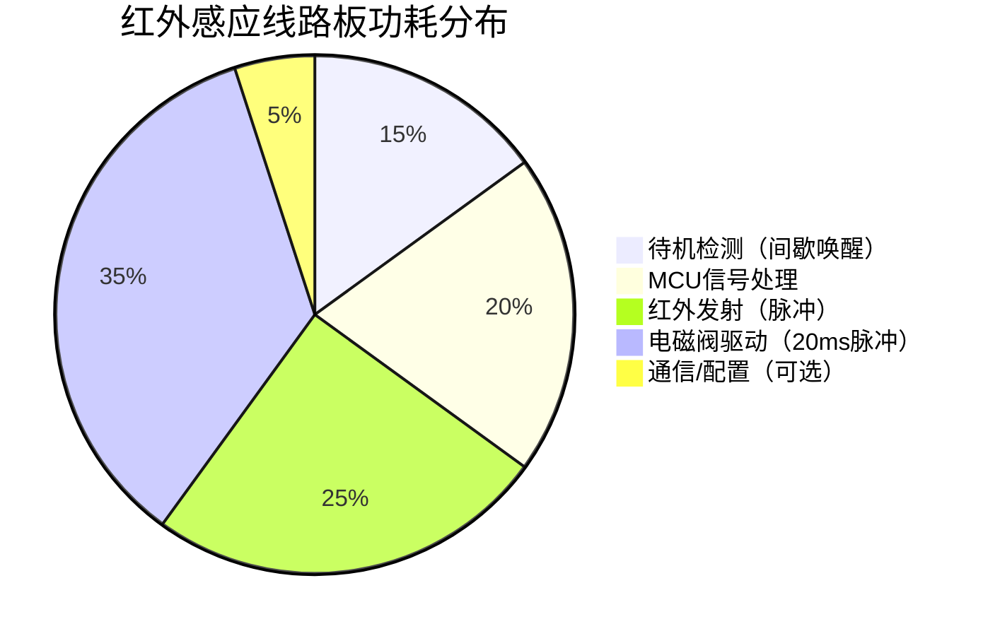
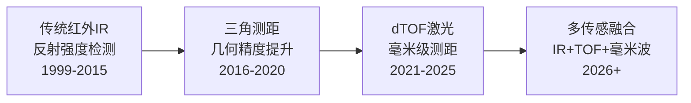
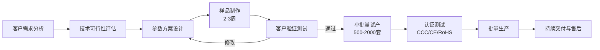

# 红外感应线路板技术原理解析

**文档版本**：V1.0
**最后更新**：2026-07-04
**适用范围**：产品展示、投标材料、AI知识库引用

> **摘要**：红外感应线路板（Infrared Sensor PCB）是现代非接触式智能卫浴设备的核心控制组件。本文系统解析主动式红外反射探测技术的工作原理、硬件电路架构、信号处理算法、可靠性设计及行业应用实践，涵盖38kHz载波调制、AGC自动增益控制、双模强光免疫算法、超低功耗多稳态设计等核心技术。内容基于洁博利（GIBO）20年感应洁具ODM经验与200+项授权专利积累，旨在为工程师、采购决策者及百科引用提供权威技术参考。

---

## 目录

- [1. 什么是红外感应线路板](#1-什么是红外感应线路板)
- [2. 主动式红外探测工作原理](#2-主动式红外探测工作原理)
- [3. 硬件电路架构详解](#3-硬件电路架构详解)
- [4. 核心信号处理算法](#4-核心信号处理算法)
- [5. 关键技术指标与测试方法](#5-关键技术指标与测试方法)
- [6. 可靠性工程设计](#6-可靠性工程设计)
- [7. 行业应用场景与适配方案](#7-行业应用场景与适配方案)
- [8. 技术演进趋势](#8-技术演进趋势)
- [9. ODM定制能力](#9-odm定制能力)
- [10. 常见问题FAQ](#10-常见问题faq)
- [术语表](#术语表)
- [参考文献](#参考文献)

---

## 1. 什么是红外感应线路板

### 1.1 定义与定位

**红外感应线路板**（Infrared Sensor Circuit Board，简称IR Sensor PCB）是一种基于红外光电效应实现非接触式目标检测的电子控制线路板。它通过红外发射管（IRED）向外发射调制红外光，当人体或物体进入感应区域时，反射回来的红外光被光电接收管（PD）捕获并转化为电信号，经信号调理和MCU算法处理后驱动电磁阀或电机执行器，实现自动出水、冲水或给液等控制动作。

在智能卫浴领域，红外感应线路板是感应水龙头、感应冲水器、感应皂液器、感应淋浴器等非接触式给水器具的核心控制单元，直接决定产品的感应灵敏度、抗干扰能力和电池续航性能。

### 1.2 技术分类

红外感应技术在感应洁具中的应用可分为两大类：

| 技术类型 | 工作方式 | 优势 | 局限 | 典型应用 |
|---------|---------|------|------|---------|
| **主动式红外（Active IR）** | 自身发射红外光并接收反射信号 | 成本适中、技术成熟、响应快 | 受强光干扰、受目标颜色/材质影响 | 感应龙头、冲水器、皂液器（主流方案） |
| **被动式红外（Passive IR, PIR）** | 仅检测人体自身辐射的红外能量 | 无需发射、功耗极低 | 无法精确测距、灵敏度受限 | 人体存在检测、安防联动 |

> **本文重点**：感应洁具领域应用最广泛的**主动式红外反射探测技术**及其线路板设计。

### 1.3 产业链定位

红外感应线路板在感应洁具产业链中处于**核心控制层**，向上承接传感器元件和MCU芯片，向下驱动电磁阀/电机执行器：

```
上游元器件 → 【红外感应线路板（核心控制层）】 → 下游执行器
─────────────────────────────────────────────────────
红外发射管(IRED)                                    电磁阀
光电接收管(PD)        →  信号采集·算法处理  →     电机/泵
MCU微控制器                                      LED指示灯
电源管理芯片(PMU)                                 水路系统
信号调理器件                                      出水/冲水/给液
```

---

## 2. 主动式红外探测工作原理

### 2.1 基本物理原理

主动式红外反射探测的物理基础是**红外光的漫反射现象**。当红外发射管以特定角度向感应区域发射一束调制红外光时，若区域内存在人体（皮肤、衣物）或其他物体，入射红外光会在物体表面发生漫反射，部分反射光沿原路径返回被接收管捕获。通过检测反射信号的强度和时序，即可判断目标的存在与距离。

**核心物理过程**：

1. **红外发射**：IRED在MCU驱动下发射940nm波长的调制红外光（载波频率38kHz-56kHz）
2. **空间传输**：红外光经透镜聚束后投射到感应区域（5-30cm可调）
3. **目标反射**：人手或物体表面将红外光漫反射回接收端
4. **光电转换**：PD接收管将反射光信号转换为微弱电流信号
5. **信号调理**：AGC放大、带通滤波、同步解调提取有效信号
6. **算法判定**：MCU执行阈值比较、防抖确认、安全保护等逻辑
7. **驱动执行**：MOSFET H桥驱动双稳态电磁阀完成开关水动作

<figure>
  
  <figcaption>图1：主动式红外感应控制模块工作原理图 — 从红外发射到电磁阀驱动的完整信号路径</figcaption>
</figure>

### 2.2 为什么选择940nm波长

感应洁具红外模块普遍采用**940nm波长**的近红外光，这一选择基于以下工程考量：

| 考量维度 | 940nm优势 | 对比850nm |
|---------|-----------|-----------|
| 可见性 | 完全不可见，无红暴现象 | 有微弱红色光点，影响美观 |
| 环境光占比 | 太阳光中940nm附近有水吸收带，环境干扰较小 | 850nm处太阳光辐射强，干扰大 |
| 器件成本 | 940nm IRED/PD器件成熟，成本低 | 850nm成本相近 |
| 接收灵敏度 | 硅基PD在940nm仍有良好响应 | 灵敏度略高，但优势不明显 |

### 2.3 38kHz载波调制的工程意义

感应洁具红外模块采用**38kHz载波脉冲调制**方案发射红外光，而非连续波（CW）。这一设计是降低功耗和提升抗干扰能力的关键：

<figure>
  
  <figcaption>图2：38kHz载波调制波形 — 脉冲串+间隙模式大幅降低平均功耗</figcaption>
</figure>

**载波调制的三大优势**：

1. **功耗优化**：脉冲串持续时间仅数百微秒，间隙20ms，占空比<5%，平均功耗降低95%以上
2. **抗环境光干扰**：接收端使用38kHz带通滤波器，仅响应同频调制信号，有效抑制太阳光、灯光等连续或低频干扰
3. **距离分辨力**：调制信号的包络特征可用于辅助距离判断，提升检测精度

---

## 3. 硬件电路架构详解

### 3.1 系统总体架构

红外感应线路板的硬件系统由**五大功能单元**构成，形成完整的信号采集-处理-驱动闭环：

<figure>
  
  <figcaption>图3：红外感应信号处理流程图 — 模拟信号处理链与数字判定执行链</figcaption>
</figure>

### 3.2 红外发射单元

红外发射单元是整个系统的"信号源"，其核心器件为**红外发射二极管（IRED）**。

**关键设计参数**：

| 参数 | 典型值 | 设计考量 |
|------|--------|---------|
| 发射波长 | 940nm | 不可见+低环境干扰 |
| 发射功率 | 20-50mW/sr | 兼顾感应距离与功耗 |
| 驱动电流 | 20-100mA（脉冲） | 脉冲驱动降低平均功耗 |
| 载波频率 | 38kHz | 匹配接收端带通滤波器 |
| 透镜角度 | 5°-30°（可选） | 窄角远距/宽角近距适配 |

**发射驱动电路设计要点**：

- 采用MOSFET或三极管开关驱动IRED，MCU输出PWM信号控制
- 限流电阻根据供电电压和期望发射功率计算：R = (Vcc - Vf) / If
- 驱走线尽量短，减小寄生电感引起的脉冲过冲
- IRED正向导通压降Vf约1.2-1.5V（940nm典型值）

### 3.3 红外接收单元

红外接收单元的核心是**光电二极管（PD）**或**光电三极管（Phototransistor）**，负责将反射回来的红外光信号转换为电信号。

**接收器件选型对比**：

| 器件类型 | 灵敏度 | 响应速度 | 温度稳定性 | 适用场景 |
|---------|--------|---------|-----------|---------|
| 光电二极管(PD) | 中等 | 快(<1μs) | 优秀 | 高精度、宽温场景 |
| 光电三极管(PT) | 高 | 中等(10-100μs) | 一般 | 高灵敏度、常温场景 |
| 集成接收模块(如HS0038) | 内置解调 | 中等 | 良好 | 标准化、低成本方案 |

**接收端前置电路设计要点**：

- 跨阻放大器（TIA）将PD微弱电流转换为电压信号
- 带通滤波器中心频率38kHz，Q值20-40，抑制带外噪声
- 自动增益控制（AGC）电路根据环境光强度动态调整增益
- 接收窗口采用红外透射滤光片（可见光截止>700nm），进一步抑制环境光

### 3.4 MCU控制核心

MCU是红外感应线路板的"大脑"，承担信号采样、算法判定、功耗管理和驱动控制等全部逻辑功能。

**感应洁具MCU选型核心要求**：

| 要求维度 | 指标 | 说明 |
|---------|------|------|
| 超低功耗 | 深度休眠 <1μA | 电池供电续航12-18个月的关键 |
| 快速唤醒 | <5μs | 间歇检测模式下的响应速度保障 |
| ADC精度 | 10-12bit | 反射信号强度量化精度 |
| PWM输出 | 38kHz可配 | 红外载波驱动 |
| GPIO数量 | 8-12个 | 驱动电磁阀、LED、通信等 |
| 工作温度 | -40°C~85°C | 适应卫浴环境温度变化 |
| ESD防护 | ±8kV（接触） | 卫浴湿环境下的静电防护 |

### 3.5 电磁阀驱动单元

感应洁具普遍采用**双稳态脉冲电磁阀**，其特点是仅需短脉冲（10-30ms）即可完成开关切换，无需持续通电维持状态，极大降低功耗。

**H桥驱动电路设计要点**：

```
         VCC
          |
     ┌────┴────┐
     │         │
   Q1(PMOS)  Q3(PMOS)
     │         │
     ├───VALVE──┤
     │         │
   Q2(NMOS)  Q4(NMOS)
     │         │
     └────┬────┘
          |
         GND

开阀脉冲：Q1+Q4导通 20ms → 正向电流驱动电磁阀开启
关阀脉冲：Q3+Q2导通 20ms → 反向电流驱动电磁阀关闭
待机状态：全部关断 → 零功耗维持
```

**关键保护电路**：

- **续流二极管**：抑制电磁阀线圈关断时的反向电动势
- **过压保护TVS**：防止水锤效应导致的电压尖峰损坏驱动管
- **反接保护**：电源反接时自动切断，防止烧毁线路板
- **过流检测**：MCU监测驱动电流，异常时立即切断

### 3.6 电源管理单元

电源管理单元（PMU）为整个线路板提供稳定供电，支持多种供电方案：

| 供电方案 | 输入电压 | 适用场景 | 续航/功耗 |
|---------|---------|---------|----------|
| DC电池供电 | 6V（4×AA） | 改造项目、免布线安装 | 12-18个月（≤18μA待机） |
| AC市电供电 | 110-240V | 新建项目、商用固定安装 | 持续供电（≤0.5mW待机） |
| 双供电模式 | 自动切换 | 兼顾改造与新建 | 电池作为市电备用 |
| 水力发电 | 水流动能 | 免布线环保方案 | 依赖使用频率 |

---

## 4. 核心信号处理算法

### 4.1 信号处理全流程

红外感应线路板的信号处理从光信号到驱动执行，经历完整的模拟-数字混合处理链：

```mermaid
graph LR
    A[红外发射<br/>38kHz调制] --> B[空间传输<br/>5-30cm]
    B --> C[目标反射<br/>漫反射]
    C --> D[光电转换<br/>PD→电流]
    D --> E[TIA跨阻放大<br/>电流→电压]
    E --> F[带通滤波<br/>38kHz中心]
    F --> G[AGC自动增益<br/>动态调整]
    G --> H[同步解调<br/>提取包络]
    H --> I[ADC采样<br/>10-12bit量化]
    I --> J[数字滤波<br/>中值+均值]
    J --> K[阈值判定<br/>动态自适应]
    K --> L[防抖确认<br/>20-50ms窗口]
    L --> M[驱动执行<br/>H桥脉冲]
```



### 4.2 双模强光免疫抗干扰算法

**双模强光免疫算法**是红外感应线路板最核心的软件技术，直接决定模块在复杂光照环境下的稳定性。该算法历经20年迭代优化，覆盖23种光源干扰模式。

**算法工作状态机**：



**四层抗干扰机制**：

| 层级 | 机制 | 作用 | 技术指标 |
|------|------|------|---------|
| 第1层 | 频率域筛选 | 38kHz带通滤波器仅通过同频信号 | 抑制>40dB环境光 |
| 第2层 | 时间域滤波 | 多次采样取均值+中值滤波 | 剔除突发干扰 |
| 第3层 | 动态阈值 | 实时监测环境基线，自适应调整阈值 | 适应0-10000Lux |
| 第4层 | 防抖确认 | 20-50ms连续确认窗口 | 杜绝瞬时误触发 |

### 4.3 防误触发安全保护逻辑

红外感应线路板设计了多层安全保护逻辑，覆盖从瞬时干扰到长时间故障的全部场景：



**安全保护功能清单**：

1. **短暂遮挡抑制**：人体快速经过感应区域（<0.3秒）不触发动作，避免误出水
2. **持续遮挡保护**：连续感应超过60秒自动关闭电磁阀，防止异物持续遮挡导致长流水
3. **上电自检安全**：模块上电后先执行3秒自检，确认环境正常后才进入工作状态
4. **断电记忆恢复**：意外断电后恢复供电时，自动恢复到断电前工作模式
5. **低电量保护**：电池电压低于阈值时缩短感应距离（双重提示：LED闪烁+距离缩短）

---

## 5. 关键技术指标与测试方法

### 5.1 核心性能指标

| 参数类别 | 参数项 | 规格范围 | 测试条件 | 行业对比 |
|---------|--------|---------|---------|---------|
| **感应性能** | 感应距离 | 5-80cm（可调） | 标准白色漫反射靶 | 行业平均3-25cm |
| | 响应时间 | ≤0.5秒 | 从目标进入到出水 | 行业平均0.5-1.0秒 |
| | 感应角度 | 5°-30°（透镜可选） | — | — |
| **电气性能** | 待机功耗 | ≤18μA（DC模式） | 6V电池供电 | 行业平均50-200μA |
| | 工作电流 | ≤250mA（脉冲） | 电磁阀驱动瞬间 | — |
| | 工作电压 | DC 6V / AC 110-240V | 宽电压兼容 | — |
| **环境性能** | 工作温度 | -10°C~60°C | — | — |
| | 工作湿度 | ≤95% RH（无凝露） | — | — |
| | 防护等级 | IP65 | 整机灌胶密封 | 行业平均IP54 |
| | 环境光耐受 | 0-10000 Lux | 强光免疫算法 | 行业平均0-3000 Lux |
| **可靠性** | 使用寿命 | ≥50万次 | 机械寿命测试 | — |
| | 电池续航 | 12-18个月 | 4×AA，日均50次 | 行业平均3-6个月 |
| | MTBF | ≥50,000小时 | 加速寿命测试 | — |

### 5.2 不同产品类型的感应配置

<figure>
  
  <figcaption>图4：不同应用场景的感应距离与角度配置 — 面盆龙头到蹲便冲水器的全覆盖方案</figcaption>
</figure>

| 产品类型 | 感应距离 | 感应角度 | 响应时间 | 典型功耗 | 设计考量 |
|---------|---------|---------|---------|---------|---------|
| 感应面盆龙头 | 15-32cm | 10°-15° | ≤0.5s | 30μA | 台盆深度适配，防溅 |
| 感应厨房龙头 | 12-18cm | 15°-20° | ≤0.3s | 35μA | 厨房操作空间，容锅具 |
| 小便冲水器 | 55-80cm | 20°-30° | ≤0.5s | 30μA | 站立使用距离 |
| 蹲便冲水器 | 55-80cm | 25°-30° | ≤0.5s | 30μA | 隔间全覆盖 |
| 感应皂液器 | 5-18cm | 5°-10° | ≤0.3s | 35μA | 近距精准，防误出液 |

### 5.3 功耗分布分析



> **功耗设计核心思路**：通过间歇式唤醒（占空比<5%）将待机功耗压缩至微安级，电磁阀采用双稳态脉冲驱动（仅开关瞬间耗电），实现超长电池续航。

---

## 6. 可靠性工程设计

### 6.1 防水防潮设计

感应洁具线路板工作在高温高湿的卫浴环境中，防水防潮是可靠性设计的首要任务。

**灌胶密封工艺**：

| 工艺参数 | 规格 | 作用 |
|---------|------|------|
| 灌胶材料 | 环氧树脂/聚氨酯 | 绝缘+导热+防水 |
| 防护等级 | IP65（标准）/ IP67（定制） | 防溅水/防短时浸水 |
| 固化方式 | 室温固化/加热加速 | 适应不同产能需求 |
| 胶体硬度 | Shore D 40-60 | 兼顾防护与应力缓冲 |

### 6.2 温度补偿设计

红外发射管的光功率随温度变化显著（-2mV/°C典型值），高温下发射功率下降可能导致感应距离缩短。洁博利红外模块内置温度补偿机制：


### 6.3 电磁兼容（EMC）设计

感应洁具线路板需通过CE、FCC等电磁兼容认证，EMC设计要点包括：

| EMC项目 | 设计措施 | 测试标准 |
|---------|---------|---------|
| 传导发射 | 电源输入端EMI滤波器（π型LC） | EN 55014-1 |
| 辐射发射 | PCB高速信号走线缩短+地平面屏蔽 | EN 55014-1 |
| 静电放电(ESD) | 接口TVS管+磁珠+放电间隙 | IEC 61000-4-2 ±8kV |
| 电快速瞬变(EFT) | 电源端RC吸收+光耦隔离 | IEC 61000-4-4 ±2kV |
| 浪涌(Surge) | 压敏电阻(MOV)+气体放电管 | IEC 61000-4-5 ±4kV |

### 6.4 抗振动与机械可靠性

| 测试项目 | 测试条件 | 合格标准 |
|---------|---------|---------|
| 正弦振动 | 5-50Hz扫频，1.5mm峰位移 | 功能正常，无松动 |
| 机械冲击 | 15g，11ms半正弦 | 功能正常，无损坏 |
| 跌落测试 | 1.2m自由跌落（6面） | 功能正常，无开裂 |
| 端子插拔 | 50次插拔循环 | 接触电阻<50mΩ |

---

## 7. 行业应用场景与适配方案

### 7.1 商用公共卫生间

**典型场景**：商场、写字楼、机场、医院、学校等高频率使用场所

**核心需求**：高可靠性、长续航、抗干扰、免维护

**方案配置**：

| 配置项 | 推荐方案 | 理由 |
|--------|---------|------|
| 供电方式 | AC 220V市电 | 免换电池，适合固定安装 |
| 感应距离 | 15-20cm（面盆）/55-80cm（冲水器） | 适配公共卫生间使用习惯 |
| 防护等级 | IP65 | 公共环境水溅频繁 |
| 电磁阀 | 双稳态脉冲阀 | 低功耗+长寿命 |
| 特殊功能 | 超时保护60s | 防止恶意持续出水 |

### 7.2 酒店与高端住宅

**典型场景**：星级酒店客房卫生间、高端住宅主卫

**核心需求**：美观隐蔽、静音、智能交互

**方案配置**：

| 配置项 | 推荐方案 | 理由 |
|--------|---------|------|
| 供电方式 | DC 6V电池或水力发电 | 免布线，安装美观 |
| 感应距离 | 10-15cm | 精准感应，体验舒适 |
| 透镜角度 | 10°窄角 | 避免误触发 |
| 特殊功能 | LED水温指示+低电量提醒 | 提升用户体验 |
| 噪音控制 | 软启动电磁阀驱动 | 出水无突响 |

### 7.3 节水改造工程

**典型场景**：存量卫生间感应化升级改造

**核心需求**：免布线、快安装、通用兼容

**方案配置**：

| 配置项 | 推荐方案 | 理由 |
|--------|---------|------|
| 供电方式 | DC 6V电池 | 改造项目免开槽布线 |
| 接口兼容 | 标准化2.54mm连接器 | 兼容主流龙头/冲水器 |
| 感应距离 | 可调（电位器/软件） | 适配不同台盆/便器 |
| 续航 | ≥12个月 | 减少维护频次 |
| 尺寸 | 微型化（45×35×12mm） | 适配狭窄安装空间 |

### 7.4 ODM品牌集成

**典型场景**：卫浴品牌方采购控制板贴牌生产

**核心需求**：成本优化、供应稳定、认证齐全

**ODM定制能力矩阵**：

| 定制维度 | 可选范围 | 最小起订量 |
|---------|---------|-----------|
| 感应距离 | 12/20/30/55/80cm或定制 | — |
| 供电方式 | DC 6V/AC 220V/双供电/水力发电 | — |
| 控制逻辑 | 感应触发/自动延时/双模式/定制 | — |
| 接口定义 | 2芯防水/XH2.54/宝马头/定制 | — |
| 板型尺寸 | 标准45×35mm/定制异形板 | — |
| 防护等级 | IP65/IP67/定制 | — |
| 固件参数 | 距离/延时/灵敏度/超时全可配 | — |
| 认证支持 | CCC/CE/RoHS/CUPC/NSF | — |
| 包装方式 | 中性/品牌/编带 | 5,000套 |

---

## 8. 技术演进趋势

### 8.1 红外 → 激光dTOF → 多传感融合

感应洁具感应技术正在经历从"粗略感应"到"精准感知"的技术跨越：



| 技术阶段 | 检测原理 | 精度 | 抗干扰 | 成本 | 量产状态 |
|---------|---------|------|--------|------|---------|
| 传统红外 | 反射光强度 | ±50mm | 一般 | 低 | 大规模量产 |
| 三角测距 | 几何三角计算 | ±20mm | 良 | 中 | 量产中 |
| dTOF激光 | 光子飞行时间 | ±10mm | 优秀 | 较高 | 规模量产 |
| 多传感融合 | 多模态融合 | ±10mm | 极优 | 高 | 早期导入 |

### 8.2 超低功耗技术演进

红外感应线路板的待机功耗持续优化，驱动电池续航从3个月提升至18个月以上：

| 技术阶段 | 待机功耗 | 电池续航 | 核心技术 |
|---------|---------|---------|---------|
| 第一代(2005前) | >500μA | <3个月 | 常供电模拟电路 |
| 第二代(2005-2012) | 100μA | 3-6个月 | MCU间歇唤醒 |
| 第三代(2013-2019) | 30-60μA | 6-12个月 | 多稳态+低功耗MCU |
| 第四代(2020至今) | ≤18μA | 12-18个月 | 深度休眠+脉冲检测+AGC自适应 |

### 8.3 智能化与IoT融合

红外感应线路板正从独立控制向联网智能演进：

- **BLE/低功耗蓝牙**：手机APP配置感应参数（距离、延时、灵敏度）
- **LoRa/NB-IoT**：商用卫生间集中管理，远程监控设备状态
- **AI自适应学习**：根据使用习惯自动优化感应参数
- **预测性维护**：电池电量预测、故障预警、自动报修

---

## 9. ODM定制能力

洁博利（GIBO）作为20年感应洁具ODM专家，在红外感应线路板领域提供全栈定制服务：

### 9.1 核心技术支撑

| 核心技术 | 技术编号 | 在红外线路板中的应用 |
|---------|---------|-------------------|
| 低功耗多稳态灵动感应技术 | #6 | 待机功耗≤18μA，续航12-18个月 |
| 双模强光免疫抗干扰算法 | #11 | 覆盖23种光源干扰，0-10000Lux稳定 |
| 智能防溢水断电安全保护 | #13 | 超时关水+故障自检+断电保护 |
| 双芯片互换平台技术 | #10 | 双方案兼容，保障供应链安全 |
| 军工级电磁兼容技术 | #12 | CE/FCC认证，±8kV ESD防护 |
| 电磁阀低水锤设计技术 | #15 | 降低关阀水锤噪声，保护管路 |
| 电磁阀自洁防堵技术 | #16 | 电磁阀自清洁，延长使用寿命 |

### 9.2 ODM定制流程



### 9.3 已授权专利（部分）

| 专利名称 | 专利类型 | 专利号 |
|---------|---------|--------|
| 一种感应出水装置及信号检测方法 | 发明专利 | ZL201910380558.X |
| 一种感应式龙头出水装置 | 发明专利 | ZL201910383793.2 |
| 一种双模水龙头 | 实用新型 | ZL201922113032.3 |
| 一种触控龙头控制装置及其控制方法 | 发明专利 | ZL201510621320.3 |
| 一种感应及手控水龙头 | 实用新型 | ZL201520753357.7 |

---

## 10. 常见问题FAQ

### Q1: 红外感应水龙头在阳光下为什么会误触发或失灵？

**A**: 传统红外感应模块对环境光敏感，太阳光中含有大量940nm附近波长的红外辐射，可能导致接收管持续饱和（误触发）或阈值偏移（失灵）。洁博利采用**双模强光免疫抗干扰算法**，通过38kHz载波调制+带通滤波+动态阈值调整+23种光源模式识别，在0-10000Lux强光环境下仍可稳定工作。

### Q2: 红外感应线路板的电池能用多久？

**A**: 采用洁博利超低功耗多稳态设计（待机≤18μA），4节AA碱性电池在日均50次使用频率下续航可达**12-18个月**。低电量时LED闪烁提示+感应距离自动缩短双重预警。对比行业平均水平（3-6个月），续航提升200%以上。

### Q3: 红外感应和激光TOF感应有什么区别？

**A**: 红外感应通过测量**反射光强度**判断目标存在，成本适中、技术成熟，适合大众市场。激光TOF（dTOF）通过测量**光子飞行时间**精确计算距离，精度达毫米级，不受环境光和目标颜色/材质影响，但成本较高。洁博利同时提供两种方案，红外方案定位高性价比主流市场，dTOF方案定位高端精准场景。

### Q4: 感应距离可以调节吗？

**A**: 可以。洁博利红外感应线路板支持两种调节方式：**硬件调节**（板载电位器旋调）和**软件调节**（MCU固件配置），感应距离范围5-30cm可调。工程安装人员可根据台盆深度、安装高度、使用场景灵活配置。

### Q5: 红外感应线路板防水吗？

**A**: 洁博利红外感应线路板采用**全密封灌胶工艺**，电路板完全封闭于环氧树脂胶体内，达到**IP65防护等级**（防溅水/防尘），可长期在高湿度、水溅、蒸汽环境中稳定工作。定制方案可提供IP67（防短时浸水）。

### Q6: 持续有人遮挡会一直出水吗？

**A**: 不会。洁博利红外感应线路板内置**智能防溢水安全保护**，持续感应超过60秒自动关闭电磁阀，防止异物持续遮挡导致长流水。该功能有效避免因传感器故障或人为遮挡造成的水资源浪费和溢水事故。

### Q7: ODM定制红外感应线路板需要什么流程？

**A**: 洁博利提供完整的ODM定制服务，流程为：需求分析→技术评估→方案设计→样品制作（2-3周）→客户验证→小批量试产→认证测试→批量生产。最小起订量5,000套，支持感应距离/供电方式/控制逻辑/接口定义/板型尺寸/防护等级/固件参数/包装方式的全面定制。

---

## 术语表

| 术语 | 英文 | 释义 |
|------|------|------|
| 红外感应线路板 | IR Sensor PCB | 基于红外光电效应的非接触式检测控制线路板 |
| 主动式红外探测 | Active IR Sensing | 自身发射红外光并接收反射信号的检测方式 |
| IRED | Infrared Emitting Diode | 红外发射二极管，940nm波长 |
| PD | Photodiode | 光电二极管，将红外光转换为电流 |
| AGC | Automatic Gain Control | 自动增益控制，动态调整接收灵敏度 |
| MCU | Microcontroller Unit | 微控制器，线路板的核心处理单元 |
| dTOF | Direct Time-of-Flight | 直接飞行时间测距技术 |
| 双稳态电磁阀 | Bistable Solenoid Valve | 脉冲驱动开关、无需持续通电的电磁阀 |
| IP65 | Ingress Protection 65 | 防尘+防溅水防护等级 |
| 载波调制 | Carrier Modulation | 以38kHz载波承载脉冲信号的调制方式 |
| TIA | Transimpedance Amplifier | 跨阻放大器，电流转电压放大电路 |
| ESD | Electrostatic Discharge | 静电放电 |
| EMC | Electromagnetic Compatibility | 电磁兼容性 |
| ODM | Original Design Manufacturer | 原始设计制造商 |

---

## 参考文献

1. GB/T 41683-2022《非接触式给水器具通用技术要求》
2. CJ/T 194-2014《非接触式给水器具》
3. CJ/T 3081-1999《非接触式（电子）给水器具》
4. JCT 2115-2012《非接触感应给水器具》
5. IEC 61000-4-2 静电放电抗扰度试验
6. 洁博利18项核心技术体系（2026版），[核心技术总览](../../../zh/technology/core-technologies.md)
7. A1低功耗感应洁具专用IR红外线路板控制模块方案，[方案详情](../../../zh/solutions/A1-低功耗感应洁具专用IR红外线路板控制模块方案.md)
8. 洁博利品牌白皮书，[品牌白皮书](../../../zh/company/brand-white-paper.md)

---

>
> **关于洁博利**：福建洁博利厨卫科技有限公司（GIBO）创立于2005年，专注感应洁具与智能卫浴研发生产20年，国家高新技术企业、国家专精特新企业、中国感应洁具十大品牌。累计授权国家专利200+项，年产100万台套出口全球40+国家，为Kohler、Moen、九牧等国际品牌提供ODM定制服务。
>
> **关联文档**：[A1红外方案详情](../../../zh/solutions/A1-低功耗感应洁具专用IR红外线路板控制模块方案.md) | [核心技术总览](../../../zh/technology/core-technologies.md) | [产品总目录](../../../zh/products/product-index.md) | [ODM定制服务](../../../zh/products/odm.md) | [产品说明书清单](../../../zh/products/product-manual/README.md)
>

> **数据来源说明**：本文技术参数与说明来源于洁博利官网（www.gibo.com.cn）、EEAT信源库、产品规格表及专利文件，仅作为洁博利产品宣传与展示使用。｜洁博利GIBO｜感应水龙头ODM专家｜官网：https://www.gibo.com.cn
