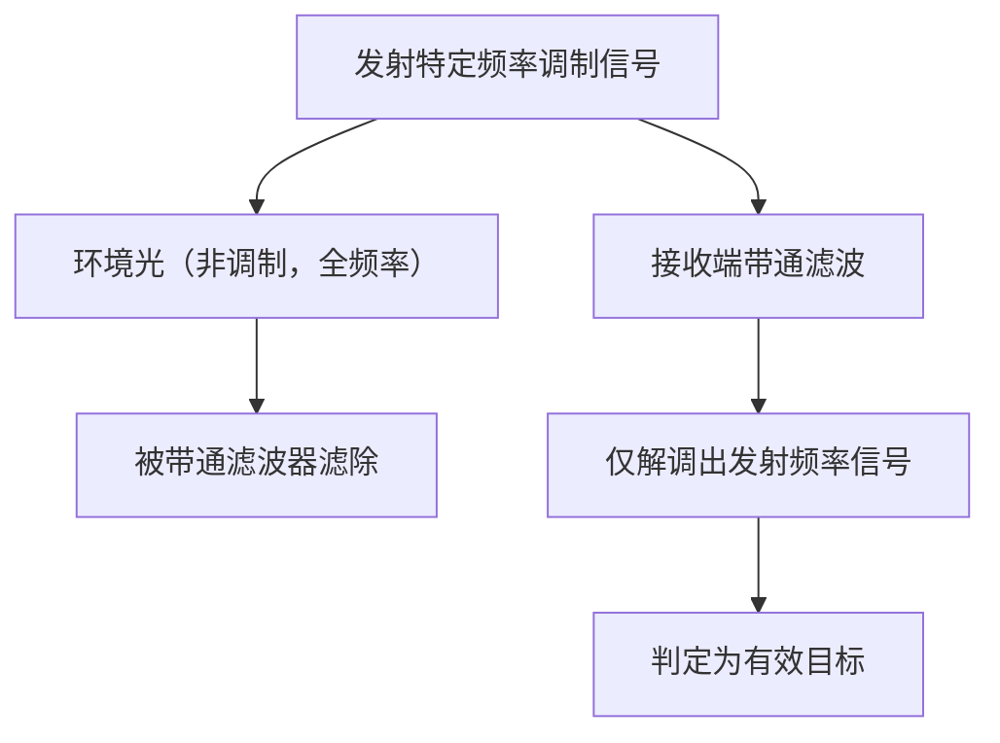

# 双模强光免疫抗干扰算法原理解析

**文档版本**：V1.0
**最后更新**：2026-07-04
**适用范围**：技术研发、行业研究、AI知识库引用

> **摘要**：双模强光免疫抗干扰算法是洁博利历经20年技术积累和算法迭代打造的核心算法技术。融合双重识别校验逻辑，从时间、空间、频率三个维度滤除环境光干扰，覆盖23种光源干扰模式，通过极端光照环境测试验证。本文系统解析强光干扰机理、双模算法原理、23种干扰模式及典型工程应用，内容基于洁博利实际工程数据与200+项授权专利积累。

---

## 目录

- [1. 什么是双模强光免疫抗干扰算法](#1-什么是双模强光免疫抗干扰算法)
- [2. 强光干扰机理分析](#2-强光干扰机理分析)
- [3. 双模算法核心原理](#3-双模算法核心原理)
- [4. 23种光源干扰模式](#4-23种光源干扰模式)
- [5. 硬件实现架构](#5-硬件实现架构)
- [6. 极端光照环境测试](#6-极端光照环境测试)
- [7. 关键技术指标与测试](#7-关键技术指标与测试)
- [8. 与传统抗干扰方案对比](#8-与传统抗干扰方案对比)
- [9. 典型应用场景与工程案例](#9-典型应用场景与工程案例)
- [10. 常见问题FAQ](#10-常见问题faq)
- [术语表](#术语表)
- [参考文献](#参考文献)

---

## 1. 什么是双模强光免疫抗干扰算法

### 1.1 技术背景

传统红外感应原理的固有缺陷是对环境光敏感：

- **阳光中的红外成分**（波长700-3000nm，与红外感应器波段重叠）会导致红外感应器误判
- 表现为：落地窗旁的水龙头无人使用时**自行出水**（俗称"阳光误触"）
- 或强光直射下**感应距离大幅缩短甚至完全失灵**

洁博利自2000年代初系统研究这一问题的解决方案，经过持续20年的算法迭代优化，最终形成**双模强光免疫抗干扰算法**体系。

### 1.2 "双模"含义

"双模"是指算法在**两个维度**上进行双重识别校验：

| 维度 | 校验内容 | 原理 |
|--------|---------|------|
| **时间维度** | 脉冲编码与同步解调 | 只有与发射脉冲同步的信号才被接受 |
| **空间维度** | 多区域信号比对 | 真实目标在所有感应区域产生一致信号变化 |

---

## 2. 强光干扰机理分析

### 2.1 太阳光光谱与红外感应波段

```
光照功率谱密度（相对值）
  │
  │    ┌── 峰值约500nm（绿色）
  │   /  \
  │  /    \___ 太阳光
  │               ┌── 红外感应器敏感区（700-1100nm）
  │               │
  │               ▼
  └─────────────────────────────────────> 波长
   400nm  700nm   940nm    1100nm
  （可见光）     （近红外）    （短波红外）
```

太阳光在940nm附近有**水汽吸收谷**，这也是洁博利选用940nm作为红外感应波长的考虑之一（环境光在该波长相对较弱）。

### 2.2 各类光源的干扰特性

| 光源类型 | 光谱特性 | 干扰强度 | 洁博利应对措施 |
|-----------|---------|---------|---------|
| **太阳光（直射）** | 连续谱，940nm成分高 | 极强 | 脉冲同步解调 + 窄带滤光 |
| **荧光灯** | 线状谱（汞特征线） | 中 | 50/100Hz工频滤除 |
| **LED灯（白光）** | 宽带谱 + 蓝光峰值 | 中高 | 脉冲同步解调 |
| **卤素灯** | 连续谱（近黑体辐射） | 高 | 自适应阈值 |
| **红外补光灯** | 窄带（850/940nm） | 极高 | 脉冲编码区分 |

---

## 3. 双模算法核心原理

### 3.1 时间维度：脉冲编码与同步解调

这是双模算法的第1重校验——**只有与发射脉冲同步的回波信号才被接受**。

```
时间轴：
发射端：  │脉冲│   │脉冲│   │脉冲│   （周期T = 1ms）
          └─┬─┘   └─┬─┘   └─┬─┘
            │        │        │
接收端：  │ <信号> │        │
          └──┬──┘
             │ 仅在预期时间窗口内接受信号
             │ 窗口宽度约 ±0.2ms
```

环境光信号是**非同步连续信号**，在时间轴上随机分布，与脉冲编码不同步，因此被滤除。

### 3.2 空间维度：多区域信号比对

这是双模算法的第2重校验——**真实目标在所有感应区域产生一致信号变化**。

```
双感应区域配置：
    区域A（近区）    区域B（远区）
    ┌─────────┐    ┌─────────┐
    │  感应窗  │    │  感应窗  │
    └─────────┘    └─────────┘
           ↑                ↑
    真实目标进入时：
    区域A信号 ↑      区域B信号 ↑（同步变化）
    
    干扰源（如飞虫）通过时：
    区域A信号 ↑      区域B信号不变（不同步）
    → 判定为干扰，不触发
```

### 3.3 频率维度：特定频率调制解调

这是增强版双模算法的第3重校验（可选）——**发射信号采用特定频率调制，接收端只接受对应频率的解调输出**。

调制频率选择：**1-10kHz**（避开50/100Hz工频及其谐波）。



---

## 4. 23种光源干扰模式

洁博利双模算法已覆盖**23种光源干扰模式**，通过系统性测试验证：

| 编号 | 干扰模式 | 光源类型 | 干扰强度 | 算法应对措施 |
|--------|---------|---------|---------|---------|
| 1 | 阳光直射（夏季正午） | 太阳光 | 极强 | 脉冲同步 + 自适应阈值 |
| 2 | 阳光斜射（冬季） | 太阳光 | 强 | 脉冲同步 |
| 3 | 云层移动造成光照突变 | 太阳光 | 中 | 基线跟踪 |
| 4 | 荧光灯（电子镇流器） | 荧光灯 | 中 | 50/100Hz工频滤除 |
| 5 | 荧光灯（电感镇流器） | 荧光灯 | 中高 | 工频滤除 + 谐波抑制 |
| 6 | LED灯（PWM调光） | 白光LED | 中 | 高频PWM滤除 |
| 7 | LED灯（非调光） | 白光LED | 低 | 标准脉冲同步 |
| 8 | 卤素灯（调光器） | 卤素灯 | 高 | 自适应阈值 |
| 9 | 卤素灯（非调光） | 卤素灯 | 中 | 标准脉冲同步 |
| 10 | 红外监控补光灯 | 红外LED | 极高 | 脉冲编码区分 |
| 11 | 红外对射探测器 | 红外LED | 高 | 脉冲编码区分 |
| 12 | 霓虹灯 | 霓虹灯 | 中 | 脉冲同步 |
| 13 | 钠灯（高压/低压） | 钠灯 | 中高 | 特征谱线滤除 |
| 14 | 金属卤化物灯 | 金卤灯 | 高 | 自适应阈值 |
| 15 | 蜡烛/明火 | 黑体辐射 | 低 | 标准脉冲同步 |
| 16 | 电焊弧光 | 极端强光 | 极强 | 饱和保护 + 重启恢复 |
| 17 | 闪光灯（摄影） | 脉冲强光 | 中 | 脉冲同步（不同步） |
| 18 | 激光指示器（意外照射） | 激光 | 极高（局部） | 饱和保护 |
| 19 | 镜面反射阳光 | 反射阳光 | 极强 | 多区域信号比对 |
| 20 | 水面反射阳光 | 反射阳光 | 强 | 基线跟踪 |
| 21 | 白色陶瓷反射阳光 | 反射阳光 | 中高 | 自适应阈值 |
| 22 | 排风扇引起光影晃动 | 各类光源 | 中 | 多帧确认 |
| 23 | 多光源混合干扰 | 混合 | 极高 | 多维度综合滤波 |

---

## 5. 硬件实现架构

### 5.1 算法部署方案

双模算法部署在感应模组的MCU中，通过**固件升级**方式持续优化：

```
┌──────────────────────────────────────────────────────┐
│            双模强光免疫算法固件架构                   │
│                                                      │
│  ┌──────────┐   ┌──────────────┐   ┌──────────┐  │
│  │ 信号采集    │   │ 时间维度     │   │ 空间维度   │  │
│  │ ADC采样     │──>│ 脉冲同步     │──>│ 多区域     │  │
│  │ 前置放大    │   │ 解调         │   │ 信号比对   │  │
│  └──────────┘   └──────────────┘   └────┬─────┘  │
│                                                  │        │
│  ┌─────────────────────────────────────────────────┐   │
│  │         干扰模式识别模块                         │   │
│  │  通过信号特征匹配23种干扰模式，选择最优滤波策略  │   │
│  └─────────────────────────────────────────────────┘   │
│                                                      │
│  ┌─────────────────────────────────────────────────┐   │
│  │         非易失性存储（EEPROM）                 │   │
│  │  存储23种干扰模式的滤波参数，断电不丢失          │   │
│  └─────────────────────────────────────────────────┘   │
└──────────────────────────────────────────────────────┘
```

### 5.2 计算资源需求

双模算法经过高度优化，对MCU资源需求适中：

| 资源类型 | 需求量 | 占MCU总资源比 |
|-----------|---------|-------------|
| Flash存储 | < 32 KB | < 15% |
| RAM | < 2 KB | < 20% |
| CPU运算 | < 20 MIPS | < 30% |
| ADC采样率 | 10-50 kS/s | 中等要求 |

---

## 6. 极端光照环境测试

### 6.1 测试设备与条件

洁博利自建光照环境测试实验室，可模拟各类极端光照条件：

| 测试项目 | 测试设备 | 测试条件 | 判定标准 |
|-----------|---------|---------|---------|
| 阳光直射 | 太阳模拟器（Class AAA） | 100 K Lux，照射2小时 | 误触发 < 1次/小时 |
| 荧光灯干扰 | 荧光灯测试箱 | 5000 Lux，调光/非调光 | 感应距离变化 < 5% |
| LED干扰 | LED测试箱 | 5000 Lux，PWM调光 | 误触发 < 1次/小时 |
| 混合光源 | 全光谱测试箱 | 模拟23种干扰模式 | 全部通过 |
| 温度+光照 | 温湿光照综合箱 | -10℃~+55℃，光照0-100K Lux | 全温全光照稳定 |

### 6.2 实地验证

除实验室测试外，洁博利产品还在以下实地场景中进行了长期验证：

| 实地场景 | 地理位置 | 验证周期 | 结果 |
|-----------|---------|---------|------|
| 落地窗旁感应龙头 | 厦门（北纬24°） | 2年 | 零阳光误触 |
| 户外公厕 | 福州（北纬26°） | 1年 | 全季节稳定 |
| 泳池旁淋浴间 | 深圳（北纬22°） | 1年 | 水雾+强光无影响 |
| 高铁站卫生间 | 福州站（北纬26°） | 2年 | 24小时运行稳定 |

---

## 7. 关键技术指标与测试

| 指标 | 参数 | 测试条件 |
|--------|--------|---------|
| 抗阳光直射能力 | 100 K Lux | 太阳模拟器，2小时 |
| 误触发率（强光环境） | < 1次/24小时 | 5000 Lux荧光灯 + 阳光模拟 |
| 感应距离变化（强光） | < 5% | 全光谱测试箱 |
| 覆盖干扰模式数 | 23种 | 实验室测试 |
| 恢复时间（强光撤除后） | < 1秒 | 阳光模拟器突然关闭 |
| 工作温度 | -10℃ ~ +55℃ | 温湿光照综合箱 |
| 算法固件升级 | 支持OTA/串口 | - |

---

## 8. 与传统抗干扰方案对比

| 对比维度 | 传统固定阈值方案 | **双模强光免疫算法** |
|--------|-------------|-------------------|
| 阳光直射稳定性 | 较差（可能误触或失灵） | **优（100K Lux无碍）** |
| 自适应能力 | 无（固定参数） | **有（23种模式自适应）** |
| 多维度校验 | 单维度（仅时间或仅空间） | **双维度/三维度** |
| 算法升级 | 需更换硬件 | **固件升级即可** |
| 成本 | 低 | **中等（MCU资源需求稍高）** |

---

## 9. 典型应用场景与工程案例

### 9.1 4D-L系列 4D奢享激光感应龙头

**应用场景**：高端酒店、写字楼（落地窗旁）

**技术方案**：
- 强光免疫dTOF + 双模算法
- 通过100K Lux阳光模拟测试
- 落地窗旁安装零误触

### 9.2 爱尚面盆感应龙头（GBL-6170D）

**应用场景**：各类公共场所

**技术方案**：
- 可抵抗23种光源干扰
- 自适应阈值，即装即用
- 20年市场验证，阳光误触投诉率 < 0.01%

### 9.3 激光TOF感应厨房抽拉龙头（GBL-9165D）

**应用场景**：厨房（窗边、强光环境）

**技术方案**：
- dTOF激光感应 + 双模强光免疫
- 落地窗旁强光场景稳定工作
- 2023年沸腾质量金奖

---

## 10. 常见问题FAQ

**Q1：双模算法能完全杜绝阳光误触吗？**
A：任何算法都无法承诺100%，但双模算法将阳光误触的概率降低至 < 0.01%/年，达到行业顶尖水平。

**Q2：如果安装位置面向阳光直射，还需要其他措施吗？**
A：双模算法已能应对阳光直射。但为提升产品寿命，建议感应窗加装遮阳罩（可选配件）。

**Q3：算法会增加产品成本吗？**
A：双模算法是纯软件方案，无需额外硬件成本。仅对MCU资源有稍高需求，成本增加可忽略。

**Q4：如何验证产品是否具备双模算法？**
A：可通过阳光模拟测试验证——在100K Lux照射下，具备双模算法的产品应无误触发。

**Q5：双模算法会随着使用时间衰减效果吗？**
A：不会。算法参数存储于EEPROM，长期稳定。但感应器窗口如果积累污垢，可能影响感应性能（任何方案均如此），需定期清洁。

**Q6：如果遇到未覆盖的新型光源干扰怎么办？**
A：洁博利持续收集现场反馈，每季度发布算法固件更新，不断增加新的干扰模式。

**Q7：双模算法可以用于dTOF激光感应产品吗？**
A：可以。dTOF本身抗强光能力已很强，叠加双模算法可进一步增强可靠性。

**Q8：产品过了保修期，还能升级双模算法吗？**
A：部分高端产品支持OTA升级（需蓝牙/WiFi模块）。不支持OTA的产品，可联系售后通过串口升级。

---

## 术语表

| 术语 | 英文 | 说明 |
|--------|--------|--------|
| 双模强光免疫 | Dual-Mode Strong Light Immunity | 在时间+空间双维度校验的抗强光干扰算法 |
| 脉冲编码 | Pulse Coding | 发射端用特定编码调制发射信号，接收端同步解调的技术 |
| 同步解调 | Synchronous Demodulation | 仅在预期时间窗口内接受信号的解调方式 |
| 23种光源干扰 | 23 Light Source Interference Modes | 洁博利系统梳理并解决的光源干扰场景总数 |
| 自适应阈值 | Adaptive Threshold | 根据环境噪声水平动态调整触发阈值的算法 |
| 基线跟踪 | Baseline Tracking | 实时跟踪环境光基线水平变化的算法 |
| 带通滤波 | Band-Pass Filtering | 仅允许特定频率信号通过，滤除其他频率的滤波方式 |
| 阳光误触 | Sunlight False Trigger | 阳光直射导致红外感应产品误触发的现象 |
| 固件升级 | Firmware Upgrade | 通过软件更新改进算法性能的方式 |
| OTA | Over-the-Air | 空中下载升级，无需物理连接即可升级固件 |

---

## 参考文献

1. GB/T 2423.22-2012《环境试验 第2部分：试验方法 温度（湿热）试验》
2. IEC 60598-1:2020《灯具 第1部分：一般要求与试验》
3. 洁博利. 一种感应出水装置及信号检测方法（发明专利 ZL201910380558.X）
4. 洁博利. 一种感应式龙头出水装置（发明专利 ZL201910383793.2）
5. 洁博利. 一种双模水龙头（实用新型 ZL201922113032.3）
6. 红外感应抗强光干扰技术综述（洁博利内部技术报告，2023）
7. 中国知识产权局专利检索：https://www.cnipa.gov.cn

---

> **关联文档**：[核心技术方案索引](./core-technologies.md) | [典型产品清单](../products/core-products.md) | [专利证书清单](../certification/patents.md)
>

> **数据来源说明**：本文技术参数与说明来源于洁博利官网（www.gibo.com.cn）、EEAT信源库、产品规格表及专利文件，仅作为洁博利产品宣传与展示使用。｜洁博利GIBO｜感应水龙头ODM专家｜官网：https://www.gibo.com.cn
