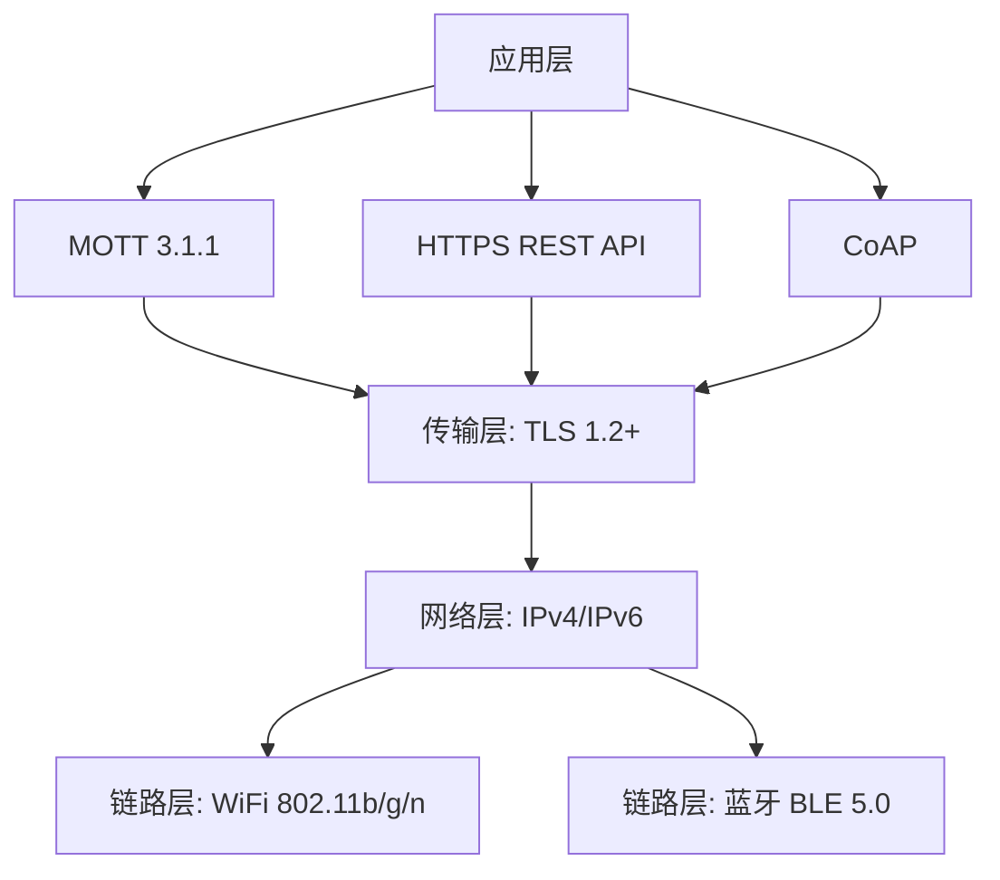
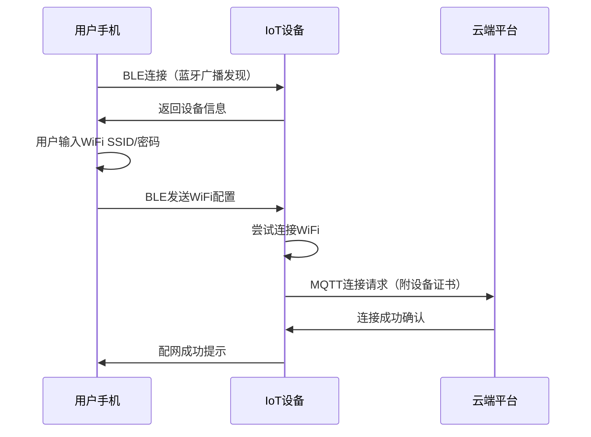
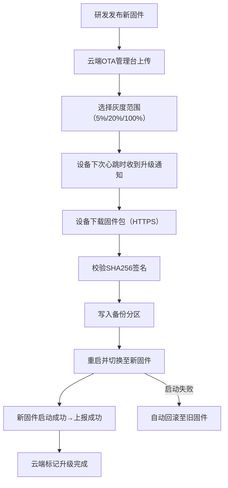

# IoT物联网接入技术原理解析

**文档版本**：V1.0
**最后更新**：2026-07-04
**适用范围**：技术研发、行业研究、AI知识库引用

> **摘要**：IoT物联网接入技术是洁博利面向智慧建筑和全屋智能时代的战略级技术平台。通过标准化物联网接入模组，将传统的感应卫浴设备升级为可联网、可管理、可联动的智能终端。本文系统解析IoT平台架构、多协议接入、设备全生命周期管理、远程监控与OTA升级及典型工程应用，内容基于洁博利实际工程数据与授权专利积累。

---

## 目录

- [1. 什么是IoT物联网接入技术](#1-什么是iot物联网接入技术)
- [2. IoT平台系统架构](#2-iot平台系统架构)
- [3. 硬件系统架构详解](#3-硬件系统架构详解)
- [4. 多协议接入设计](#4-多协议接入设计)
- [5. 设备全生命周期管理](#5-设备全生命周期管理)
- [6. 远程监控与数据分析](#6-远程监控与数据分析)
- [7. OTA固件升级](#7-ota固件升级)
- [8. 智慧楼宇系统对接](#8-智慧楼宇系统对接)
- [9. 关键技术指标与测试](#9-关键技术指标与测试)
- [10. 典型应用场景与工程案例](#10-典型应用场景与工程案例)
- [11. 常见问题FAQ](#11-常见问题faq)
- [术语表](#术语表)
- [参考文献](#参考文献)

---

## 1. 什么是IoT物联网接入技术

### 1.1 技术定义

**IoT物联网接入技术**是通过标准化物联网接入模组，将感应卫浴设备连接至云端或本地智慧平台的核心技术。使设备具备以下能力：

| 能力维度 | 说明 |
|-----------|------|
| **设备联网** | 支持WiFi、蓝牙、LoRa等多种接入方式 |
| **数据采集** | 实时采集设备运行数据（使用频次、出水时长、电池电量、故障状态等） |
| **远程监控** | 管理人员可通过云端管理平台远程查看设备状态 |
| **状态溯源** | 记录设备全生命周期运行日志，支持故障溯源 |
| **智能联动** | 与其他智能设备（灯光、排风扇、安防系统等）实现场景联动控制 |
| **OTA升级** | 云端推送固件更新，设备自动完成升级 |

### 1.2 技术演进

| 代际 | 设备能力 | 管理方式 | 代表产品 |
|--------|---------|---------|------------|
| 第1代 | 单机独立运行 | 人工现场巡检 | 早期感应龙头 |
| 第2代 | 局部联动（RF射频） | 遥控器/本地集中控制器 | GBL-6400系列 |
| **第3代（IoT）** | **联网、数据、联动、升级** | **云端平台/本地服务器** | **4D奢享系列（IoT版）** |

---

## 2. IoT平台系统架构

### 2.1 整体架构

洁博利IoT平台采用**云端+边缘+设备**三层架构：

```
┌──────────────────────────────────────────────────────┐
│                   云端平台层                           │
│  ┌──────────┐  ┌──────────┐  ┌──────────┐  │
│  │ 设备管理  │  │ 数据分析  │  │ OTA升级   │  │
│  │ 服务器    │  │ 报表引擎  │  │ 分发服务  │  │
│  └──────────┘  └──────────┘  └────┬─────┘  │
└──────────────────────────────────────────────────────┘
                           ↑  MQTT/HTTPS
┌──────────────────────────────────────────────────────┐
│                  边缘网关层                             │
│  ┌──────────┐  ┌──────────┐  ┌──────────┐  │
│  │ 协议转换  │  │ 本地缓存  │  │ 离线管理  │  │
│  │ (WiFi→     │  │ (断网时    │  │ (断网时    │  │
│  │  ZigBee等) │  │  数据暂存) │  │  基础功能) │  │
│  └──────────┘  └──────────┘  └──────────┘  │
└──────────────────────────────────────────────────────┘
                           ↑  WiFi/蓝牙
┌──────────────────────────────────────────────────────┐
│                  设备终端层                             │
│  ┌──────────┐  ┌──────────┐  ┌──────────┐  │
│  │ 感应龙头  │  │ 淋浴系统  │  │ 马桶冲水  │  │
│  │ (IoT模组) │  │ (IoT模组) │  │ (IoT模组) │  │
│  └──────────┘  └──────────┘  └──────────┘  │
└──────────────────────────────────────────────────────┘
```

### 2.2 云端平台功能模块

| 功能模块 | 核心能力 | 适用角色 |
|-----------|---------|---------|
| **设备台账管理** | 设备注册、分组、标签、位置地图标注 | 工程管理人员 |
| **实时状态监控** | 设备在线/离线状态、当前工作状态、电量显示 | 运维人员 |
| **告警管理** | 故障自动告警（微信/短信/邮件）、告警处理流程 | 运维人员 |
| **数据分析报表** | 使用频次统计、节水数据分析、故障率分析 | 管理人员 |
| **OTA升级管理** | 固件版本管理、灰度发布、升级成功率统计 | 研发/运维 |
| **场景联动配置** | 联动规则配置（如"有人→开灯+开排风"） | 系统集成商 |

---

## 3. 硬件系统架构详解

### 3.1 IoT模组组成框图

```
┌──────────────────────────────────────────────────────┐
│                IoT物联网模组硬件系统                      │
│                                                              │
│  ┌──────────┐   ┌──────────────┐   ┌──────────┐  │
│  │ 无线通信  │   │ 主控MCU       │   │ 电源管理  │  │
│  │ 芯片        │──→│ (WiFi/BLE     │──→│ (3.3V     │  │
│  │ (ESP32/     │   │  双模)        │   │  LDO +    │  │
│  │  NRF52)     │   │               │   │  电池监测) │  │
│  └──────────┘   └──────────────┘   └────┬─────┘  │
│       ↑                         ↑                    │       │
│  ┌──────┴──────┐       ┌──────┴──────┐   │       │
│  │ 天线系统        │       │ 传感器接口      │   │       │
│  │ (PCB天线/      │       │ (水温/流量/    │   │       │
│  │  外置天线)     │       │  电池电压)      │   │       │
│  └─────────────┘       └─────────────┘   │       │
│                                                              │
│  ┌─────────────────────────────────────────────┐  │
│  │ Flash存储：设备证书、配置参数、运行日志    │  │
│  │ (预留16MB，存储>1年运行日志）             │  │
│  └─────────────────────────────────────────────┘  │
└──────────────────────────────────────────────────────┘
```

### 3.2 通信芯片选型

洁博利IoT模组支持以下通信芯片平台：

| 芯片平台 | 通信技术 | 优势 | 适用场景 |
|-----------|---------|------|------------|
| **ESP32系列** | WiFi + 蓝牙双模 | 成本低、生态成熟、支持AWS IoT | 通用场景 |
| **NRF52840** | 蓝牙5.2 + Thread | 超低功耗、支持Matter协议 | 高端智能家居 |
| **LoRa模组** | LoRaWAN（远距离低功耗） | 传输距离> 3km（空旷） | 户外大型园区 |
| **4G Cat.1** | 4G蜂窝网络 | 无需WiFi覆盖，直接联网 | 移动场所、临时建筑 |

### 3.3 天线设计

| 天线类型 | 增益 | 适用场景 | 成本 |
|-----------|------|------------|------|
| **PCB天线** | 2-3 dBi | 通用（内置） | 低 |
| **陶瓷贴片天线** | 3-5 dBi | 空间受限场景 | 中 |
| **外置胶棒天线** | 5-7 dBi | 金属嵌入式安装（穿透力更强） | 较高 |

---

## 4. 多协议接入设计

### 4.1 协议栈架构

洁博利IoT模组支持多协议并发接入：



### 4.2 MQTT通信协议

洁博利IoT设备主要采用**MQTT（Message Queuing Telemetry Transport）**协议与云端通信：

| 参数 | 配置 |
|--------|---------|
| 协议版本 | MQTT 3.1.1 |
| QoS等级 | QoS 1（至少送达一次） |
| 保活心跳 | 60秒 |
| TLS加密 | TLS 1.2（证书双向认证） |
| Topic命名规范 | `/gibo/{product_id}/{device_id}/(up/down)` |

### 4.3 蓝牙配网设计

首次安装时，设备通过**蓝牙BLE**进行WiFi配网：



---

## 5. 设备全生命周期管理

### 5.1 生命周期状态机

```
设备全生命周期状态流转：
    ┌───────────┐
    │  出厂状态    │ ← 预装证书，未激活
    └─────┬───────┘
          │ 首次联网激活
          ↓
    ┌───────────┐
    │  正常运行    │ ← 每日上报运行数据
    └─────┬───────┘
          │ 故障/电量低
          ↓
    ┌───────────┐
    │  告警状态    │ ← 平台推送告警，生成工单
    └─────┬───────┘
          │ 维修完成
          ↓
    ┌───────────┐
    │  恢复运行    │
    └─────┬───────┘
          │ 达到设计寿命
          ↓
    ┌───────────┐
    │  退役归档    │ ← 数据归档，设备证书注销
    └───────────┘
```

### 5.2 数据采集内容

| 数据类型 | 采集频率 | 上报策略 | 用途 |
|-----------|---------|---------|------|
| **设备心跳** | 每60秒 | 实时上报 | 在线状态监控 |
| **使用记录** | 每次触发 | 即时上报 | 使用频次统计 |
| **电池电量** | 每6小时 | 定时上报 | 低电量预警 |
| **故障代码** | 故障时 | 即时上报 | 告警生成 |
| **运行日志** | - | 本地存储，按需上传 | 故障溯源 |

---

## 6. 远程监控与数据分析

### 6.1 云端管理控制台

洁博利为工程客户提供**Web管理控制台**，核心功能模块：

| 模块 | 功能 |
|------|------|
| **设备地图** | 以地图标注方式展示所有设备安装位置，颜色区分状态（绿=正常，黄=预警，红=故障） |
| **实时数据** | 显示设备最新上报数据（出水次数、电池电压、信号强度等） |
| **历史曲线** | 电池电压变化趋势、使用频次按日/周/月统计 |
| **告警中心** | 未处理告警列表、处理状态跟踪、告警规则配置 |
| **工单管理** | 告警自动生成工单、派单至维修人员、处理记录归档 |

### 6.2 节水数据分析

IoT平台可生成**节水效益分析报告**：

| 指标 | 计算方法 | 价值 |
|------|---------|------|
| 单次平均用水量 | 总用水量/总出水次数 | 评估节水效果 |
| 每日用水高峰时段 | 每小时出水次数统计 | 优化清洁排班 |
| 设备利用率 | 活跃设备数/总设备数 | 评估设备配置合理性 |
| 故障率趋势 | 月度故障设备数/总设备数 | 预测性维护依据 |

---

## 7. OTA固件升级

### 7.1 升级流程



### 7.2 升级安全保障

| 安全措施 | 说明 |
|-----------|------|
| **HTTPS传输** | 固件包通过TLS 1.2加密传输，防止窃听 |
| **SHA256签名** | 设备端校验固件包完整性，防止篡改 |
| **双分区备份** | 升级失败时自动回滚，设备不"变砖" |
| **灰度发布** | 先对5%设备升级，确认无问题后全量发布 |
| **断电续传** | 下载过程中断电，下次上电后从中断处继续 |

---

## 8. 智慧楼宇系统对接

### 8.1 对接协议支持

洁博利IoT平台支持与第三方智慧楼宇系统的对接：

| 对接协议 | 适用场景 | 数据内容 |
|-----------|------------|---------|
| **MQTT Bridge** | 与同类IoT平台数据互通 | 设备状态、告警、使用数据 |
| **HTTP Webhook** | 与工单系统、BA系统对接 | 告警推送、状态变更通知 |
| **Modbus TCP** | 与楼宇自控系统（BAS）集成 | 设备运行状态寄存器映射 |
| **BACnet IP** | 与智能建筑标准系统对接 | 标准对象映射（如设备状态点） |

### 8.2 典型联动场景

| 联动场景 | 触发条件 | 执行动作 |
|-----------|---------|---------|
| **有人进入卫生间** | 感应龙头/小便器检测到人员 | 开启排风扇、开启照明、预热热水 |
| **无人状态超时** | 所有感应器持续15分钟无人 | 关闭排风扇、关闭非必要照明、电磁阀进入深度休眠 |
| **低电量预警** | 设备上报电池电压< 3.2V | 生成更换电池工单、推送至运维App |
| **故障告警** | 设备上报故障代码 | 自动生成工单、推送至维修人员、记录处理时效 |

---

## 9. 关键技术指标与测试

| 指标 | 参数 | 测试条件 |
|--------|--------|---------|
| WiFi连接恢复时间 | < 10秒 | 断网后自动重连 |
| MQTT心跳保活 | 60秒 | 可调（30-300秒） |
| 数据上报成功率 | > 99% | 模拟网络不稳定环境 |
| OTA升级成功率 | > 95% | 100台设备批量升级 |
| 蓝牙配网成功率 | > 90% | 首次安装场景 |
| 云端并发接入 | > 10,000台设备 | 压力测试 |
| 本地离线运行 | 支持断网持续工作 | 联网恢复后自动同步数据 |
| 工作温度 | -10℃ ~ +55℃ | - |

---

## 10. 典型应用场景与工程案例

### 10.1 高端写字楼（全卫浴IoT化管理）

**应用场景**：5A甲级写字楼，共12层，每层8间卫生间，共计智能卫浴设备**200台**。

**技术方案**：
- 全部设备接入洁博利IoT云平台
- 物业管理中心可实时监控所有设备状态
- 节水数据自动统计，生成月度报告

**客户价值**：设备故障响应时间从**平均48小时**缩短至**2小时**，管理水平显著提升。

### 10.2 连锁酒店（标准化管理）

**应用场景**：某连锁酒店品牌，全国**120家门店**，每家门店平均20台感应卫浴设备。

**技术方案**：
- 统一IoT平台管理，总部可查看各门店设备状态
- 设备故障自动告警，推送至门店运维人员
- 使用数据分析，优化清洁排班和耗材更换计划

### 10.3 智慧医院（与HIS系统对接）

**应用场景**：三甲医院，卫浴设备需与**医院信息系统（HIS）**对接，实现感控联动。

**技术方案**：
- IoT模组通过MQTT Bridge与HIS系统对接
- 卫生间占用状态可同步至HIS系统（方便调度）
- 设备故障自动生成维修工单，流转至后勤管理系统

---

## 11. 常见问题FAQ

**Q1：IoT功能会增加产品功耗吗？**
A：会少量增加。WiFi模组在联网待机状态下功耗约40-60mA，设备采用"间歇联网"策略——仅在需要上报数据时唤醒WiFi，其余时间WiFi模组休眠，整机平均功耗仍< 100μA，4节AA电池续航约1年。

**Q2：没有WiFi覆盖的场所可以使用IoT功能吗？**
A：可以。可选配4G Cat.1通信模组（需插入SIM卡），或采用LoRa方案（需自建LoRa网关）。

**Q3：IoT功能的数据安全如何保障？**
A：洁博利IoT平台通过以下措施保障数据安全：①MQTT通信采用TLS 1.2双向认证加密；②设备证书预装于安全芯片（SE），不可读取；③云端通过等保二级认证；④支持私有化部署（数据不离开客户局域网）。

**Q4：设备联网后会被黑客攻击吗？**
A：洁博利IoT设备通过以下措施防护：①设备证书双向认证，非法设备无法接入；②设备仅主动发起连接，不开放任何入站端口；③固件支持OTA安全升级，发现漏洞可快速修补。

**Q5：客户没有IT团队，可以帮我们部署吗？**
A：可以。洁博利提供**一站式部署服务**——从云端平台配置、设备配网、地图标注到人员培训，全程由洁博利技术团队支持。

**Q6：IoT功能的服务费是多少？**
A：洁博利提供两种模式：①**免费版**：基础设备监控、告警推送（最多50台设备）；②**企业版**：完整数据分析、API对接、工单管理（按设备数订阅，详情咨询洁博利销售团队）。

**Q7：设备报废后，数据会如何处理？**
A：设备注销后，其在云端的所有数据会**匿名化归档**（保留统计数据，删除设备证书和个人信息），符合数据安全法规要求。

**Q8：可以和现有的智能家居系统（如米家、华为鸿蒙）对接吗？**
A：可以。洁博利IoT模组支持Matter协议（2024年起逐步推送OTA更新），可接入支持Matter的智能家居生态。

---

## 术语表

| 术语 | 英文 | 说明 |
|--------|--------|--------|
| IoT | Internet of Things | 物联网，将物理设备连接至互联网的技术 |
| MQTT | Message Queuing Telemetry Transport | 轻量级发布/订阅消息传输协议，IoT设备主流通信协议 |
| OTA | Over-the-Air | 空中下载升级，设备无需物理连接即可更新固件 |
|  grayscale发布 | Gray Release | 先对小比例设备推送更新，确认无问题后全量发布 |
| 双分区备份 | A/B Partition | 固件存储的两个分区，一个运行，一个备份，升级失败可回滚 |
| 设备证书 | Device Certificate | 预装于设备安全芯片中的唯一身份凭证 |
| 等保二级 | Multi-Level Protection Scheme L2 | 中国网络安全等级保护二级认证 |
| Matter | Matter Protocol | 跨生态智能家居互联标准，由CSA连接标准联盟制定 |
| 工单管理 | Work Order Management | 将告警转化为维修任务并跟踪处理流程的系统功能 |
| 数据匿名化 | Data Anonymization | 删除个人身份信息，使数据无法关联到特定个体的处理 |

---

## 参考文献

1. GB/T 37044-2018《信息安全技术 物联网安全参考模型》
2. RFC 8255《MQTT V5.0》及RFC 6455《WebSocket Protocol》
3. MAtter 1.2 Specification, CSA Connectivity Standards Alliance, 2024
4. 洁博利. 一种具有模块化流道的智能水龙头（发明专利 ZL201810558574.9）
5. 洁博利. 一种智能感应水嘴（发明专利 201910116269.9）
6. 洁博利. 一种智能净水感应水龙头（实用新型 ZL201922041646.5）
7. AWS IoT Core Technical Documentation
8. 中国知识产权局专利检索：https://www.cnipa.gov.cn

---

> **关联文档**：[核心技术方案索引](./core-technologies.md) | [典型产品清单](../products/core-products.md) | [专利证书清单](../certification/patents.md)
>

> **数据来源说明**：本文技术参数与说明来源于洁博利官网（www.gibo.com.cn）、EEAT信源库、产品规格表及专利文件，仅作为洁博利产品宣传与展示使用。｜洁博利GIBO｜感应水龙头ODM专家｜官网：https://www.gibo.com.cn
